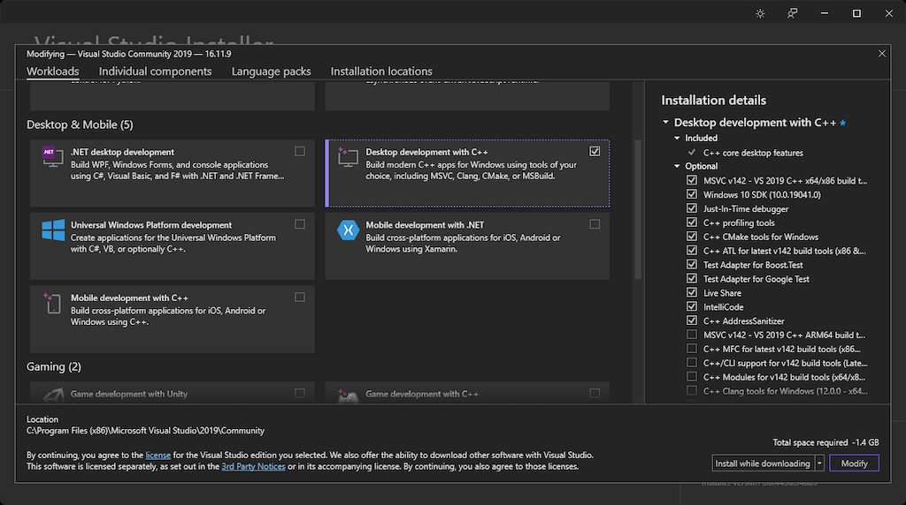
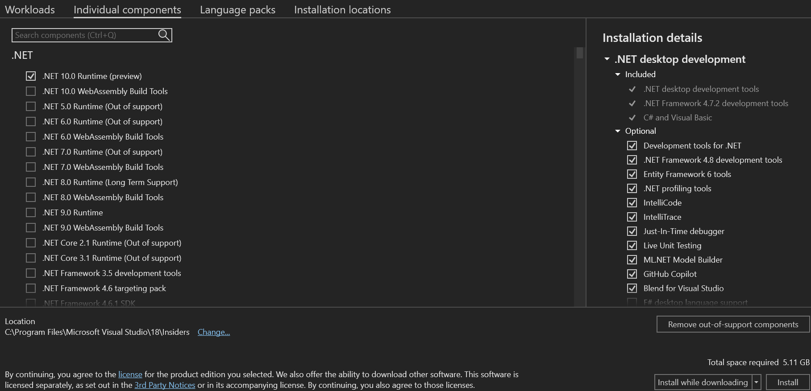
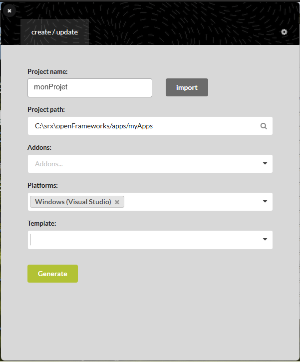
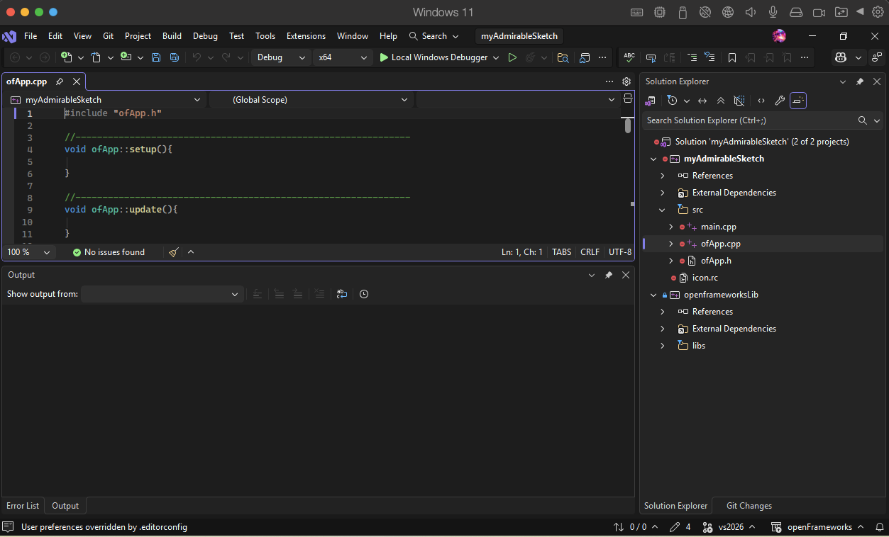

# Préparation de l'environnement de développement

> **Avant** : rien — c'est le tout premier document.
> **But** : un poste Windows qui compile un projet openFrameworks dans Visual Studio 2026.

Avant le premier cours, il faut installer les deux outils de l'année : **Visual Studio 2026** (l'éditeur et le compilateur C++) et **openFrameworks** (la bibliothèque avec laquelle on dessine). Comptez plusieurs Go de téléchargement : lancez les téléchargements en premier, le reste se fait pendant qu'ils tournent.

## 1. Installer Visual Studio 2026

1. Télécharge l'installeur de **Visual Studio Community 2026** (gratuit) sur `visualstudio.microsoft.com`.
2. Lance l'installeur.
3. Dans l'onglet *Charges de travail*, coche **« Développement Desktop en C++ »** (*Desktop development with C++*).
4. Clique sur *Installer*, et laisse-le travailler.



La capture vient du guide officiel openFrameworks (installeur d'une version antérieure) : le nom et l'emplacement de la case sont identiques dans l'installeur 2026. La version Community suffit largement.

openFrameworks supporte Visual Studio 2022 et 2026 ; on prend 2026.

### Ajouter le composant MSVC v143

Le projet openFrameworks compile avec la chaîne d'outils **v143** (celle de VS 2022). Sans ce composant, Visual Studio 2026 refuse de compiler avec l'erreur *« Build Tools for v143 cannot be found »*. Toujours dans l'installeur :

1. Passe sur l'onglet **Composants individuels**.
2. Tape **`v143`** dans le champ de recherche.
3. Coche **« MSVC v143 — outils de build C++ VS 2022 x64/x86 (v14.44-17.14) »** — s'il y a plusieurs versions, coche-les.
4. Puis *Installer* (ou *Modifier* si VS est déjà installé).



Si Visual Studio est déjà installé sans ce composant : menu Démarrer → *Visual Studio Installer* → *Modifier* → même onglet.

## 2. Installer openFrameworks

1. Va sur **`openframeworks.cc/download`**.
2. Télécharge la dernière version pour **Windows / Visual Studio** (`of_v0.12.1_vs_64_release.zip` ou plus récente).
3. Dézippe dans **`C:\OF`** — un chemin **court**, sans espaces ni accents : Windows limite la longueur des chemins, et openFrameworks contient des dossiers profonds.

La structure attendue après dézippage :

```text
C:\OF\
├── addons\
├── apps\               <- vos projets iront ici
├── examples\
├── libs\               <- le coeur d'openFrameworks
└── projectGenerator\
```

**Le piège classique** : le zip contient un dossier racine `of_v0.12.1_vs_64_release`. C'est **son contenu** qui doit être dans `C:\OF`, pas le dossier lui-même. Vérifie que `libs` (avec un `s`) est bien directement dans `C:\OF\libs` — si tu vois `C:\OF\of_v0.12.1…\libs`, remonte tout le contenu d'un niveau.

## 3. Créer un projet avec le Project Generator

1. Lance **`C:\OF\projectGenerator\projectGenerator.exe`**.
2. **Project name** : le nom de ton projet.
3. **Project path** : `C:\OF\apps\myApps` (le défaut).
4. **Platforms** : *Windows (Visual Studio)*.
5. **Template** : sélectionne **`vs2026`** — laissé vide, il génère pour VS 2022.
6. **Generate**, puis *Open in IDE*.



Le Project Generator crée le dossier du projet avec le `.sln`, `src/` (`main.cpp`, `ofApp.h`, `ofApp.cpp`) et `bin/`. C'est lui aussi qui ajoutera les *addons* plus tard dans l'année.

## 4. Vérifier que tout compile

1. Le `.sln` s'ouvre dans Visual Studio ; dans `src/` tu dois voir `main.cpp`, `ofApp.h` et `ofApp.cpp`.
2. Lance avec **Local Windows Debugger** (ou `F5`). La première compilation est longue, c'est normal : openFrameworks se compile une fois.
3. Une **fenêtre grise vide** s'ouvre : gagné.



Si la compilation échoue dès le départ, c'est presque toujours l'une de ces deux causes : le dézippage (la structure `C:\OF\libs` est absente) ou la charge de travail C++ qui n'est pas installée. Reprends les étapes 1 et 2 dans l'ordre.

## 5. Utiliser les fichiers du cours

Au quotidien, tu travailles **toujours dans les mêmes fichiers** : `ofApp.h` et `ofApp.cpp`, dans le `src\` de ton projet. Chaque leçon te donne le code par étapes, à écrire dedans.

Chaque leçon fournit aussi une paire de référence `ofAppNN.h` / `ofAppNN.cpp` — l'état final, pour comparer ou repartir d'une base propre. Deux façons de l'utiliser :

- recopier son **contenu** dans tes `ofApp.h` / `ofApp.cpp` (en gardant l'include `#include "ofApp.h"`) ;
- ou copier la paire telle quelle dans `src\` et remplacer, dans `main.cpp`, l'include par `#include "ofAppNN.h"` — un seul exemple compilable à la fois : chaque paire déclare la même classe `ofApp`.

Les images éventuelles (`pandaroux.jpg`…) vont dans `bin\data\`.

---

*Captures d'écran : guide officiel openFrameworks (documentation du projet, licence MIT — openframeworks.cc/setup/vs) et documentation Visual Studio (Microsoft Learn, licence CC BY 4.0 — learn.microsoft.com/visualstudio/install).*
