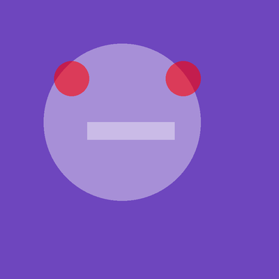
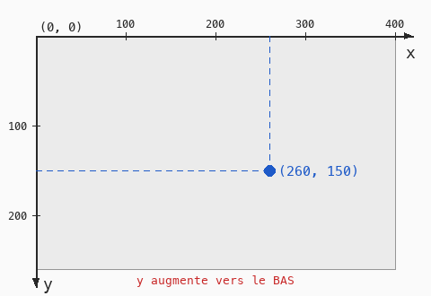

# Cours 00 — Premier contact : une tête qui suit la souris

> **Fichiers** : commence par `ofApp00.h` + `ofApp00.cpp`, la version minimale — la tête seule, sans souris ni fond animé. Puis passe à `ofApp00a.h` + `ofApp00a.cpp`, la version complète que ce document détaille.
> **Pour lancer** : copie la paire dans `src/`, et dans `main.cpp` remplace `#include "ofApp.h"` par `#include "ofApp00a.h"`. Compile, lance.

Aujourd'hui on n'explique presque rien. On lance un programme qui dessine, on change des nombres, on relance, on regarde ce qui bouge. Les explications viendront dans les cours suivants, quand tu auras déjà vu les choses fonctionner.



## 1. L'écran est un quadrillage de pixels

Tout ce que tu vas dessiner se place sur une grille de points minuscules : les **pixels**. Chaque pixel a une adresse faite de deux nombres, `x` et `y`.



Deux choses à retenir, parce qu'elles surprennent tout le monde :

- L'origine `(0, 0)` est le coin **en haut à gauche**, pas au centre.
- `y` augmente **vers le bas**. Un point avec `y = 300` est plus bas qu'un point avec `y = 100`.

La fenêtre fait ici 800 pixels de large sur 800 de haut. C'est la première ligne du programme qui le décide :

```cpp
ofSetWindowShape(800, 800);      // taille de la fenêtre : essaie 400, 400
```

## 2. Lire une ligne de code

Regarde cette ligne, tirée du bloc qui dessine le visage :

```cpp
ofDrawCircle(200 + x, 200 + y, 225);
```

C'est un **appel de fonction** : on demande à l'ordinateur « dessine un cercle ». Anatomie de l'appel :

| Morceau | Rôle |
|---|---|
| `ofDrawCircle` | le nom de la fonction. Toutes les fonctions de dessin commencent par `ofDraw` |
| `( ... )` | entre parenthèses, les **paramètres** : les informations dont la fonction a besoin |
| `200 + x, 200 + y, 225` | trois paramètres séparés par des virgules : position x, position y, rayon |
| `;` | le point-virgule termine l'appel. Sans lui, le programme refuse de compiler |

Tout ce qui suit `//` sur une ligne est un **commentaire** : une note pour les humains, que l'ordinateur ignore. Le code en est plein, lis-les.

## 3. Les couleurs

Avant de dessiner une forme, on choisit sa couleur :

```cpp
ofSetColor(255, 255, 255, 100);
```

Quatre nombres, chacun entre 0 et 255 :

| Position | Signification | 0 | 255 |
|---|---|---|---|
| 1 | rouge | pas de rouge | rouge maximum |
| 2 | vert | pas de vert | vert maximum |
| 3 | bleu | pas de bleu | bleu maximum |
| 4 | opacité | invisible | complètement opaque |

Un écran fabrique toutes ses couleurs en mélangeant de la lumière rouge, verte et bleue. `(255, 255, 255)` est blanc, `(0, 0, 0)` est noir, `(255, 0, 0)` est rouge, `(255, 255, 0)` est jaune. Le quatrième nombre est facultatif : sans lui, la forme est opaque.

La couleur choisie reste active pour toutes les formes qui suivent, jusqu'au prochain `ofSetColor`. C'est pourquoi le visage et la bouche sont dessinés du même blanc, puis on change de couleur pour les deux yeux.

## 4. Expériences

Fais chacune de ces modifications, relance, observe. Ne cherche pas encore à comprendre pourquoi : cherche à prédire ce qui va se passer avant de lancer.

| Change ceci | Tu devrais voir |
|---|---|
| `ofSetWindowShape(800, 800)` en `(400, 400)` | une fenêtre plus petite, le visage dépasse |
| `225` du premier `ofDrawCircle` en `100` | une tête plus petite, la bouche dépasse |
| `ofSetColor(255, 0, 0, 150)` en `(0, 255, 0, 150)` | des yeux verts |
| le `150` de cette même ligne en `255` puis en `30` | des yeux opaques, puis presque invisibles |
| `funnyFace(mouseX, mouseY)` en `funnyFace(100, 100)` | la tête ne suit plus la souris |
| `ofBackground(r, g, b)` en `ofBackground(0)` | un fond noir fixe |
| le `1.5f` du bloc `update` en `10.0f` | le fond change beaucoup plus vite |

`mouseX` et `mouseY` sont deux nombres que le programme met à jour tout seul : la position de la souris dans la fenêtre. Tu peux les utiliser partout où un nombre est attendu.

## 5. Le programme est découpé en blocs

Tu as vu trois blocs qui commencent par `void ofApp::` :

- `setup()` est exécuté **une fois**, au lancement. On y règle la taille de la fenêtre.
- `update()` est exécuté **60 fois par seconde**. C'est là que les nombres changent.
- `draw()` est exécuté **60 fois par seconde**, juste après `update()`. C'est là qu'on dessine.

Il y a un quatrième bloc, `funnyFace(float x, float y)`. C'est une fonction que nous avons fabriquée nous-mêmes : « dessine une tête autour du point (x, y) ». Le bloc `draw()` l'appelle comme n'importe quelle autre fonction. On apprendra à en écrire au cours 07.

Le fichier `.h` qui accompagne le `.cpp` est une table des matières : il liste les blocs et les variables qui existent. Tu n'as pas besoin de le toucher pour l'instant.

## Exercices

1. Ajoute deux oreilles avec `ofDrawCircle`, en haut du visage. Il faudra choisir une couleur avant.
2. Ajoute un nez avec `ofDrawRectangle(x, y, largeur, hauteur)`. Attention : pour un rectangle, `x` et `y` sont le coin haut-gauche, pas le centre.
3. Change la forme des yeux : remplace un `ofDrawCircle` par `ofDrawRectangle`.
4. Fais en sorte que la tête soit décalée par rapport à la souris : `funnyFace(mouseX + 200, mouseY)`.

## Le code complet, pas à pas

Le programme entier, dans l'ordre des fichiers. Les blocs ci-dessous mis bout à bout donnent exactement `ofApp00a.cpp`.

### Le fichier `ofApp00a.h`

La table des matières du programme : les blocs qui existent et les variables partagées entre eux, avec leurs valeurs de départ.

```cpp
#pragma once
#include "ofMain.h"

// 00 - Premier contact : une tête qui suit la souris
// Sketch d'origine : Cours 2024-2025/sketch_01_funny_face
// Objectif : créer quelque chose dès la première séance, par modification du code.
// Aucune notion n'est expliquée ici : on observe, on change des nombres, on relance.
// Les explications viennent dans les fichiers suivants (couleurs animées : 06, fonctions : 07).

class ofApp : public ofBaseApp {
public:
	void setup();
	void update();
	void draw();

	void funnyFace(float x, float y);

	float r = 0;
	float g = 0;
	float b = 0;
};
```

### En tête du fichier `ofApp00a.cpp`

L'inclusion du `.h`, qui rend visibles les variables partagées et les blocs déclarés.

```cpp
#include "ofApp00a.h"
```

### Étape 1 — `setup()`

Exécuté une fois au lancement : la fenêtre, les chargements, les valeurs de départ.

```cpp
void ofApp::setup() {
	ofSetWindowShape(800, 800);      // taille de la fenêtre : essaie 400, 400
}
```

### Étape 2 — `update()`

Exécuté à chaque frame, avant le dessin : tout ce qui change.

```cpp
void ofApp::update() {
	// La couleur du fond change toute seule avec le temps.
	// Essaie de remplacer 1.5f par 0.2f, puis par 10.0f.
	float t = ofGetElapsedTimef();
	r = (cos(t * 1.5f) / 2 + 0.5f) * 255;
	g = (cos(t * 0.75f) / 2 + 0.5f) * 255;
	b = (cos(t * 1.0f) / 2 + 0.5f) * 255;
}
```

### Étape 3 — `funnyFace()`

Une tête dessinée autour du point (x, y).

```cpp
// Une tête dessinée autour du point (x, y).
// Chaque nombre est une position ou une taille : change-les et regarde ce qui bouge.
void ofApp::funnyFace(float x, float y) {
	// Le visage : blanc à moitié transparent (le dernier nombre, 100, est la transparence sur 255)
	ofSetColor(255, 255, 255, 100);
	ofDrawCircle(200 + x, 200 + y, 225);
	// La bouche
	ofDrawRectangle(100 + x, 200 + y, 250, 50);

	// Les yeux : rouge (255, 0, 0) — essaie (0, 255, 0)
	ofSetColor(255, 0, 0, 150);
	ofDrawCircle(55 + x, 75 + y, 50);
	ofDrawCircle(375 + x, 75 + y, 50);

	// À toi : ajoute deux oreilles avec ofDrawCircle, puis un nez avec ofDrawRectangle.
}
```

### Étape 4 — `draw()`

Exécuté à chaque frame, après `update()` : uniquement du dessin.

```cpp
void ofApp::draw() {
	ofBackground(r, g, b);           // remplace par ofBackground(0); pour un fond noir fixe
	funnyFace(mouseX, mouseY);       // remplace mouseX, mouseY par 100, 100 : que se passe-t-il ?
}
```

## Ce qu'il faut retenir

- L'écran est un quadrillage de pixels, origine en haut à gauche, `y` vers le bas.
- Un appel de fonction s'écrit `nom(paramètres);` avec des virgules entre les paramètres et un point-virgule à la fin.
- Une couleur est faite de rouge, vert, bleu, chacun de 0 à 255, plus une opacité facultative.
- `ofSetColor` choisit la couleur des formes qui suivent. `ofDrawCircle(x, y, rayon)` et `ofDrawRectangle(x, y, largeur, hauteur)` dessinent.
- `mouseX` et `mouseY` contiennent la position de la souris.
