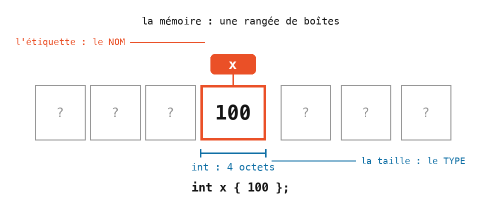
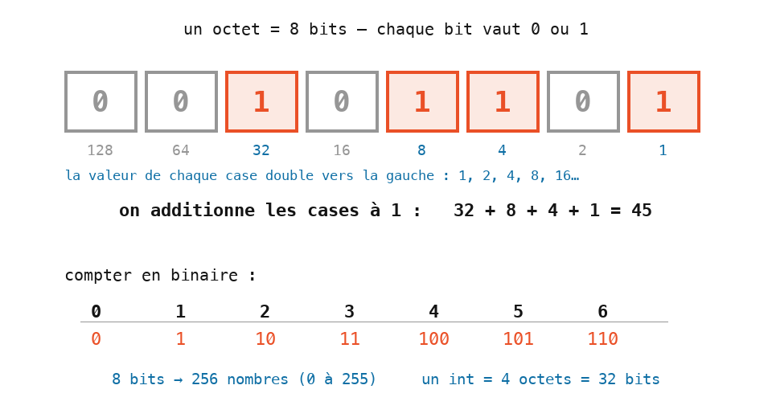

# Cours 00 — Premier contact : une tête qui suit la souris

> **Comment travailler** : tu ne crées aucun fichier — tu modifies `ofApp.h` et `ofApp.cpp`, qui existent déjà dans le `src/` de ton projet. Le cours avance par **petites versions successives** : à chaque étape, tu complètes ton code, tu compiles (`F5`), tu regardes. À chaque étape, ton programme tourne.
> **Les fichiers du cours** : `ofApp00.h`/`.cpp` (l'état après l'étape 5) et `ofApp00a.h`/`.cpp` (l'état final) sont la **référence téléchargeable** — pour comparer, ou repartir d'une base propre si tu es perdu.

Aujourd'hui on va apprendre les bases de la programmation en créant des images. Nous allons utiliser le langage **C++** : il s'agira de modifier les fichiers `ofApp.cpp` et `ofApp.h`. Un concept à la fois, pas à pas — et à la fin de la séance, tu auras une tête qui suit la souris.


## 1. L'écran est un quadrillage de pixels

Tout ce que tu vas dessiner se place sur une grille de points minuscules : les **pixels**. Chaque pixel a une adresse faite de deux nombres, `x` et `y`.


Deux choses à retenir, parce qu'elles surprennent tout le monde :

- L'origine `(0, 0)` est le coin **en haut à gauche**, pas au centre.
- `y` augmente **vers le bas**. Un point avec `y = 300` est plus bas qu'un point avec `y = 100`.

## 2. Étape 1 — une fenêtre

Ouvre `ofApp.h` et remplace tout son contenu par ceci — c'est **l'emballage** du programme, tu le recopies tel quel et on l'expliquera plus tard :

```cpp
#pragma once
#include "ofMain.h"

class ofApp : public ofBaseApp {
public:
	void setup();
	void update();
	void draw();
};
```

Puis ouvre `ofApp.cpp` et remplace tout son contenu par ceci :

```cpp
#include "ofApp.h"

void ofApp::setup() {
	ofSetWindowShape(800, 800);
}

void ofApp::update() {

}

void ofApp::draw() {

}
```

Compile et lance : une fenêtre grise de 800 pixels sur 800. C'est peu — mais c'est **ton** programme.

Regarde la seule vraie ligne du fichier :

```cpp
ofSetWindowShape(800, 800);
```

C'est un **appel de fonction** : on demande à l'ordinateur de faire quelque chose. Son anatomie servira toute l'année :

| Morceau | Rôle |
|---|---|
| `ofSetWindowShape` | le **nom** de la fonction |
| `( ... )` | entre parenthèses, les **paramètres** : les informations dont elle a besoin |
| `800, 800` | ici deux paramètres, séparés par une virgule : largeur, hauteur |
| `;` | le point-virgule termine l'appel. Sans lui, le programme refuse de compiler |

Cette ligne est écrite dans le bloc `setup()`, qui est exécuté **une fois, au lancement** du programme. C'est là qu'on règle ce qui ne change pas.

Une dernière chose : tout ce qui suit `//` sur une ligne est un **commentaire** — une note pour les humains, que l'ordinateur ignore.

> **Essaie** : remplace `800, 800` par `400, 400`, relance. Puis `1200, 300`.

## 3. Étape 2 — dessiner un cercle

Ajoute une ligne dans le bloc `draw()` :

```cpp
void ofApp::draw() {
	ofDrawCircle(400, 400, 100);
}
```

Un cercle blanc au milieu de la fenêtre. `ofDrawCircle` a **trois** paramètres :

| Paramètre | Rôle |
|---|---|
| `400` | la position `x` du **centre** |
| `400` | la position `y` du centre |
| `100` | le **rayon** — la distance du centre au bord, pas le diamètre |

Le dessin s'écrit dans le bloc `draw()` : c'est le bloc du dessin (on verra à la fin de la séance ce qui le distingue vraiment de `setup`).

Il existe d'autres fonctions de dessin. Celle-ci servira bientôt :

```cpp
ofDrawRectangle(300, 550, 200, 80);    // x, y, largeur, hauteur
```

Attention : pour un rectangle, `x` et `y` sont le coin **haut-gauche**, pas le centre.

> **Essaie** : déplace le cercle dans chaque coin de la fenêtre. Colle-le au bord : il dépasse, rien ne plante — ce qui sort de l'écran est simplement invisible.

## 4. Étape 3 — la couleur

Avant de dessiner une forme, on choisit sa couleur :

```cpp
void ofApp::draw() {
	ofSetColor(255, 0, 0);
	ofDrawCircle(400, 400, 100);
}
```

Le cercle est rouge. Trois nombres, chacun entre 0 et 255 :

| Position | Signification | 0 | 255 |
|---|---|---|---|
| 1 | rouge | pas de rouge | rouge maximum |
| 2 | vert | pas de vert | vert maximum |
| 3 | bleu | pas de bleu | bleu maximum |

Un écran fabrique toutes ses couleurs en mélangeant de la lumière rouge, verte et bleue. `(255, 255, 255)` est blanc, `(0, 0, 0)` est noir, `(255, 255, 0)` est jaune.

Un quatrième nombre, facultatif, règle l'**opacité** : `ofSetColor(255, 0, 0, 150)` donne un rouge semi-transparent (255 = opaque, 0 = invisible).

La couleur choisie reste active pour **toutes les formes qui suivent**, jusqu'au prochain `ofSetColor`.

> **Essaie** : un cercle vert. Un cercle jaune. Deux cercles qui se chevauchent, le deuxième semi-transparent.

## 5. Étape 4 — les variables

Écris maintenant ceci dans `draw()` :

```cpp
void ofApp::draw() {
	int x { 0 };
	int y { 0 };

	ofSetColor(255, 255, 255);
	ofDrawCircle(200 + x, 300 + y, 50);
	ofDrawCircle(400 + x, 300 + y, 50);
	ofDrawRectangle(250 + x, 400 + y, 100, 30);
}
```

`int x { 0 };` crée une **variable**. Une variable est une sorte de **boîte dans la mémoire** de l'ordinateur, avec :

- une **étiquette** — le nom de la variable (`x`), qui sert à retrouver la boîte ;
- une **taille** — qui dépend du **type** (`int`) ;
- un contenu — la valeur qu'on y range (`{ 0 }`).



Les accolades `{ 0 }` donnent la valeur de départ — c'est l'écriture d'initialisation recommandée en C++ moderne (elle refuse, par exemple, qu'on glisse 3.7 dans un entier). Partout où un nombre est attendu, on peut écrire un calcul qui utilise des variables : `200 + x`.

> **Le type `int`** — un nombre **entier**, rangé sur **4 octets**. Un **octet**, c'est 8 **bits**, et un bit est la plus petite case possible : il vaut **0 ou 1**. Compter en bits, c'est compter en base 2 : chaque case vaut le double de la précédente (1, 2, 4, 8, 16…), et le nombre est la somme des cases à 1. Avec les 8 bits d'un octet on écrit tous les nombres de 0 à 255 ; avec les 32 bits d'un `int`, tous les entiers d'environ −2 milliards à +2 milliards.



Maintenant change **une seule ligne** : `int x { 100 };`. Relance : les trois formes se sont décalées de 100 pixels **d'un coup**. C'est ça, la force d'une variable — un nombre écrit une fois, utilisé partout.

> **Essaie** : `y { -150 }`. Puis `x { 300 }` et `y { 200 }` en même temps.

## 6. Étape 5 — à toi : dessine une figure

Tu as tout ce qu'il faut : des formes, des couleurs, des variables. **Dessine une figure** — un visage, un robot, un animal, ce que tu veux — avec ces contraintes :

- au moins **quatre formes** (cercles et rectangles) ;
- au moins **deux couleurs** ;
- toutes les positions écrites **par rapport à `x` et `y`** (comme `200 + x`) — pour pouvoir déplacer toute la figure en changeant deux nombres.

Prends dix minutes, du papier si ça aide. Voici la nôtre — une tête :

```cpp
void ofApp::draw() {
	int x { 0 };
	int y { 0 };

	// Le visage
	ofSetColor(255, 255, 255, 255);
	ofDrawCircle(200 + x, 200 + y, 225);
	// La bouche
	ofDrawRectangle(100 + x, 200 + y, 250, 50);

	// Les yeux : rouge (255, 0, 0) — essaie (0, 255, 0)
	ofSetColor(255, 0, 0, 150);
	ofDrawCircle(55 + x, 75 + y, 50);
	ofDrawCircle(375 + x, 75 + y, 50);
}
```

C'est exactement le fichier de référence `ofApp00.cpp` : si tu veux repartir de cette tête, il est téléchargeable.

> **Essaie** — sur notre tête, ou sur ta figure :
>
> 1. Ajoute deux **oreilles** avec `ofDrawCircle`, en haut. Il faudra choisir une couleur avant.
> 2. Ajoute un **nez** avec `ofDrawRectangle` — rappel : `x` et `y` sont son coin haut-gauche.
> 3. Change la **forme des yeux** : remplace un `ofDrawCircle` par un `ofDrawRectangle`.

## 7. Étape 6 — la fonction : dessiner la figure plusieurs fois

Et si on voulait **deux** têtes ? Copier-coller les huit lignes ? Et pour dix têtes ? Non : on range le dessin dans une **fonction à nous**, qu'on pourra appeler autant de fois qu'on veut.

Dans `ofApp.cpp`, déplace le dessin dans un nouveau bloc, et fais-le appeler par `draw()` :

```cpp
void ofApp::funnyFace(int x, int y) {
	// Le visage
	ofSetColor(255, 255, 255, 255);
	ofDrawCircle(200 + x, 200 + y, 225);
	// La bouche
	ofDrawRectangle(100 + x, 200 + y, 250, 50);

	// Les yeux
	ofSetColor(255, 0, 0, 150);
	ofDrawCircle(55 + x, 75 + y, 50);
	ofDrawCircle(375 + x, 75 + y, 50);
}

void ofApp::draw() {
	funnyFace(100, 100);
	funnyFace(400, 400);
}
```

Et dans `ofApp.h`, **annonce** la nouvelle fonction (une ligne, sans le corps) :

```cpp
class ofApp : public ofBaseApp {
public:
	void setup();
	void update();
	void draw();

	void funnyFace(int x, int y);
};
```

Le `.h` est la **table des matières** du programme : il liste les blocs qui existent. Toute nouvelle fonction s'y annonce, sinon le compilateur ne la connaît pas.

Regarde bien : `x` et `y` ne sont plus créées dans le dessin — ce sont les **paramètres** de la fonction. Celui qui appelle fournit les valeurs : `funnyFace(100, 100)` dessine une tête autour de (100, 100), `funnyFace(400, 400)` une autre plus loin. Une fonction, deux têtes, trois lignes dans `draw()`.

Et maintenant, la magie. Remplace le contenu de `draw()` par :

```cpp
void ofApp::draw() {
	funnyFace(mouseX, mouseY);
}
```

La tête **suit la souris**. `mouseX` et `mouseY` sont deux variables que le programme met à jour tout seul : la position de la souris dans la fenêtre. Tu peux les utiliser partout où un nombre est attendu.

> **Essaie** : `funnyFace(mouseX + 200, mouseY)` — la tête suit la souris avec un décalage. Puis dessine une deuxième tête fixe pendant que la première suit la souris.

## 8. Étape 7 — le fond

Un détail cloche : quand la tête bouge, l'ancienne position reste affichée — ça fait des traînées. Il faut **repeindre le fond** à chaque image, en première ligne de `draw()` :

```cpp
void ofApp::draw() {
	ofBackground(30);
	funnyFace(mouseX, mouseY);
}
```

`ofBackground` peint toute la fenêtre. Avec un seul nombre, c'est un gris (0 = noir, 255 = blanc) ; avec trois, une couleur : `ofBackground(200, 60, 60)`.

> **Essaie** : un fond de couleur — `ofBackground(200, 60, 60)`. Puis un fond blanc : que deviennent les yeux semi-transparents ?

Voici l'état final de la séance, les deux fichiers complets — **garde ta `funnyFace` à toi** (tes oreilles, ton nez, ta figure…) :

`ofApp.h` :

```cpp
#pragma once
#include "ofMain.h"

class ofApp : public ofBaseApp {
public:
	void setup();
	void update();
	void draw();

	void funnyFace(int x, int y);
};
```

`ofApp.cpp` :

```cpp
#include "ofApp.h"

void ofApp::setup() {
	ofSetWindowShape(800, 800);
}

void ofApp::update() {

}

void ofApp::funnyFace(int x, int y) {
	// Le visage
	ofSetColor(255, 255, 255, 255);
	ofDrawCircle(200 + x, 200 + y, 225);
	// La bouche
	ofDrawRectangle(100 + x, 200 + y, 250, 50);

	// Les yeux : rouge semi-transparent — essaie (0, 255, 0, 150)
	ofSetColor(255, 0, 0, 150);
	ofDrawCircle(55 + x, 75 + y, 50);
	ofDrawCircle(375 + x, 75 + y, 50);
}

void ofApp::draw() {
	ofBackground(30);
	funnyFace(mouseX, mouseY);
}
```

Le bloc `update()` reste **vide** aujourd'hui : c'est là que les nombres changeront tout seuls, à partir du cours 05. C'est le fichier de référence `ofApp00a.cpp` — une tête qui suit la souris : ta première séance de code est une image qui répond.

## Exercices

1. **Lire avant de lancer** — sur papier ou dans Paint, dessine ce que ce `draw()` (code ci-dessous) va afficher. Puis tape-le et compare :

   ```cpp
   void ofApp::draw() {
   	ofBackground(30);
   	int x { 50 };
   	ofSetColor(255, 255, 0);
   	ofDrawCircle(150 + x, 100, 60);
   	ofSetColor(0, 120, 255);
   	ofDrawRectangle(150 + x, 100, 200, 40);
   }
   ```

   Trois pièges à déjouer : le troisième nombre du cercle, le coin du rectangle, et qui est dessiné devant.

2. **La bouche vivante** — dans `funnyFace`, remplace la largeur de la bouche par `mouseX` : elle s'étire quand la souris va à droite. `mouseX` s'utilise partout où un nombre est attendu — pas seulement dans une position.

3. **Le fond piloté** — `ofBackground(mouseX, 100, 200);` : le fond change avec la souris. Observe : passé une certaine position, il ne change plus. Pourquoi ? (Indice : 255. La vraie réponse au cours 11.)

4. **Ta deuxième fonction** — écris `void decor()` (sans paramètres : un soleil, une maison, des étoiles…), annonce-la dans le `.h`, et appelle-la dans `draw()` **avant** `funnyFace`. Puis essaie de l'appeler après : l'ordre des appels décide de qui est devant.

## 9. Le programme est découpé en blocs

Récapitulons ce que tu as construit, bloc par bloc :

| Bloc | Quand | Rôle |
|---|---|---|
| `setup()` | une fois, au lancement | régler ce qui ne change pas (la fenêtre) |
| `update()` | 60 fois par seconde | encore vide — les nombres y changeront tout seuls (cours 05) |
| `draw()` | 60 fois par seconde, après `update()` | dessiner |
| `funnyFace(x, y)` | quand on l'appelle | notre fonction à nous |

Le fichier `.h` est la table des matières : il liste les blocs et les variables partagées. Cette organisation en `setup` / `update` / `draw` est celle de **tous** les programmes du module.

## Ce qu'il faut retenir

- L'écran est un quadrillage de pixels, origine en haut à gauche, `y` vers le bas.
- Un appel de fonction s'écrit `nom(paramètres);` avec des virgules entre les paramètres et un point-virgule à la fin.
- Une couleur est faite de rouge, vert, bleu, chacun de 0 à 255, plus une opacité facultative. `ofSetColor` choisit la couleur des formes qui suivent.
- Une **variable** est un nombre qui porte un nom, créée avec `int x { 0 };` : écrite une fois, utilisée partout.
- Une **fonction à nous** range un dessin sous un nom ; ses **paramètres** permettent de le placer où on veut — et elle s'annonce dans le `.h`.
- Le programme est découpé en blocs : `setup()` une fois, `update()` puis `draw()` 60 fois par seconde.
- `mouseX` et `mouseY` contiennent la position de la souris.
