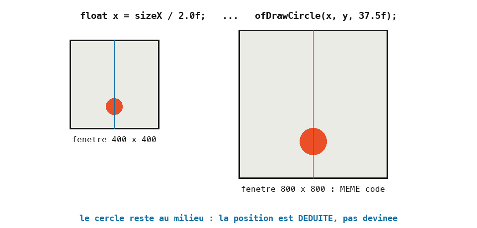
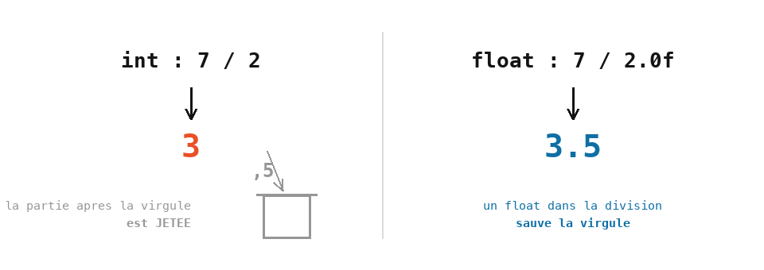

# Cours 01 — Variables et opérations

> **Avant** : cours 00 (repère de l'écran, fonctions de dessin, couleurs).
> **Comment travailler** : toujours dans `ofApp.h` et `ofApp.cpp`, par petites versions successives — à chaque étape, compile (`Ctrl+Shift+B` et `F5` pour lancer) et regarde.

Au cours 00, tu as créé deux variables pour déplacer une figure. Ce cours va plus loin : on détaillera les types de nombres, les calculs — et on découvrira deux pièges célèbres qui reviendront toute l'année.


## 1. Étape 1 — repartir propre

Crée un nouveau projet `02_Variables`.

Remets l'emballage minimal dans `ofApp.h` (celui du début du cours 00 : `setup`, `update`, `draw`, rien d'autre), et dans `ofApp.cpp` :

```cpp
#include "ofApp.h"

void ofApp::setup() {
	ofSetWindowShape(400, 400);
	ofBackground(200);
}

void ofApp::update() {

}

void ofApp::draw() {

}
```

Une fenêtre gris clair de 400 × 400. Deux remarques :

- `ofBackground(200)` avec **un seul nombre** donne un gris : c'est un raccourci pour `(200, 200, 200)`.
- Il est dans `setup()`, pas dans `draw()` comme au cours 00 : le dessin de ce cours **ne bouge pas**, peindre le fond une fois suffit. Dès que quelque chose bougera (cours 05), il redescendra dans `draw()`.

> **Essaie** : `ofBackground(255)`, puis `ofBackground(0)`, puis un fond de couleur à trois nombres.

## 2. Étape 2 — les types : `int` et `float`

Déclare deux variables en tête de `draw()` :

```cpp
void ofApp::draw() {
	int sizeX { 400 };
	int sizeY { 400 };
}
```

Rien de neuf à l'écran — ces deux boîtes attendent l'étape 3. Profites-en pour les regarder de près. Au cours 00, tu as vu qu'une variable est une **boîte en mémoire**, avec une étiquette (le nom) et une taille (le type). En C++, il existe plusieurs types de nombres ; en voici deux dont tu auras besoin cette année :

| Type | Contenu | Exemples |
|---|---|---|
| `int` | un nombre entier | `-3`, `0`, `400` |
| `float` | un nombre à virgule | `37.5f`, `0.25f`, `3.0f` |

Le `f` à la fin d'un nombre à virgule indique « ce nombre est un `float` ». Prends l'habitude de l'écrire : `37.5f`.

Deux écritures pour donner une valeur : les **accolades** `int sizeX { 400 };` pour une valeur de départ (l'écriture recommandée — elle refuse qu'on glisse 3.7 dans un entier), et le `=` que tu croiseras partout, notamment quand la valeur est **calculée**.

### Où vit la variable : une case en mémoire

La mémoire de l'ordinateur est une immense rangée de cases numérotées. Déclarer une variable fait trois choses d'un coup : **réserver** une case, lui donner un **nom**, y ranger une **valeur**.

```
        sizeX           x
  ...+---------+...+---------+...
     |   400   |   |  37.5   |        . = cases qui ne nous appartiennent pas
  ...+---------+...+---------+...
        int          float
```

Le type est la règle de la case : ce qu'elle peut contenir, et comment lire ce qu'il y a dedans — fixé une fois pour toutes. Le nom, lui, n'existe que pour nous : dans le programme compilé, il ne reste que des numéros de case. Lire une variable, c'est ouvrir sa case ; l'affecter, c'est remplacer son contenu.

### Comment la case range le nombre

Un `int` et un `float` occupent chacun 4 octets, mais ne rangent pas le nombre de la même façon.

L'`int` écrit le nombre lui-même en binaire, comme tu l'as vu au cours 00 : 400 s'écrit `110010000`. C'est **exact**, mais borné — sur 4 octets, de −2 147 483 648 à 2 147 483 647.

Le `float` range une **notation scientifique en binaire**, sur le modèle du 3,75 × 10¹ de l'école : un signe, un exposant, des chiffres significatifs. Par exemple 37.5, qui s'écrit `100101,1` en binaire, est rangé comme 1,001011 × 2⁵ :

```
  int   400  :  [ 110010000 ]              le nombre lui-même — exact
  float 37.5 :  [ + ][ 2⁵ ][ 1,001011 ]    signe · exposant · chiffres significatifs
```

### Construire un `float`, pas à pas

Prenons `37.5f` et rangeons-le nous-mêmes, en quatre pas.

**1. La partie entière, en binaire.** 37 = 32 + 4 + 1 : dans les cases du comptage binaire (cours 00), ça s'écrit `100101`.

**2. La partie après la virgule.** Après la virgule, chaque chiffre vaut la **moitié** du précédent : 1/2, 1/4, 1/8… `0,5` est un demi, donc `,1`. Au total : 37,5 = `100101,1`.

**3. Décaler la virgule.** Souviens-toi de la notation scientifique de l'école : 3750 = 3,75 × 10³ — la virgule décalée de trois crans. En binaire, pareil, en base 2 : on décale jusqu'à n'avoir **qu'un seul 1 devant** la virgule.

```
  100101,1  →  1,001011 × 2^5        (5 crans de décalage → exposant 5)
```

**4. Ranger.** Les trois compartiments de la case sont remplis :

```
  [ + ][ 2^5 ][ 1,001011 ]           signe · exposant · chiffres significatifs
```

> **Essaie** — sur papier : construis `5.0`, puis `0.5`, puis `-12.25`, en suivant les quatre pas. (Réponses : `[+][2²][1,01]`, `[+][2⁻¹][1,0]`, `[−][2³][1,10001]` — pour le dernier, 12,25 = 8 + 4 + 1/4 = `1100,01`.)

**Et `0.1` ?** En binaire, 0.1 s'écrit `0,000110011001100…` — le motif `1001` se répète **à l'infini**, comme 1/3 = 0,333… en décimal : un nombre tout simple en base 10 peut être impossible en base 2. Or la case ne garde qu'un nombre limité de chiffres : elle coupe, et `0.1` est stocké **arrondi**. Voilà d'où viennent toutes les surprises des nombres à virgule.

La plage couverte est énorme, mais le nombre de chiffres significatifs est limité (environ 7) : beaucoup de nombres à virgule sont donc stockés **en arrondi** — 0.1 n'est pas exactement 0.1. Pour des pixels, on s'en moque ; mais ne compare jamais deux `float` avec `==`.

## 3. Étape 3 — déduire au lieu de deviner

Complète `draw()` :

```cpp
	float x = sizeX / 2.0f;        // 200 : le milieu de la largeur
	float y = sizeY * 3 / 4.0f;    // 300 : les trois quarts de la hauteur

	ofSetColor(255);
	ofFill();
	ofDrawCircle(x, y, 37.5f);
```

Un cercle blanc, au milieu de la largeur, aux trois quarts de la hauteur. Les quatre opérations s'écrivent `+`, `-`, `*`, `/`, et on peut mélanger variables et nombres. Le point important : `x` et `y` ne sont plus des nombres devinés, ils sont **déduits** de la taille de la fenêtre.



Un piège au passage : le troisième nombre de `ofDrawCircle` est le **rayon**, la distance du centre au bord. Un cercle de 75 pixels de large a un rayon de 37.5. Si tu penses en « taille », divise par deux.


> **Essaie** : passe `ofSetWindowShape` **et** `sizeX`/`sizeY` à 800 — le cercle reste au milieu, sans toucher au calcul. C'est toute la force de « déduire ».

## 4. Étape 4 — le piège de la division entière

Écris ceci, et prédis le rayon avant de lancer :

```cpp
	int moitie = 7 / 2;
	ofDrawCircle(100, 100, moitie * 20);
```

Rayon 60, pas 70 : `7 / 2` vaut **3**. Quand les deux nombres d'une division sont des entiers, le résultat est un entier — C++ **jette la partie après la virgule**. `3 / 4` vaut `0`.



Pour obtenir une vraie division, il suffit qu'un des deux nombres soit un `float` : `7 / 2.0f` vaut `3.5f`. C'est pourquoi l'étape 3 écrit `sizeY * 3 / 4.0f`. Détail qui compte : `sizeY * 3 / 4` donnerait quand même 300, parce que la multiplication est faite d'abord (1200 / 4) — mais `sizeY * (3 / 4)` donnerait **0**.

Ce piège reviendra toute l'année. Quand un calcul donne 0 sans raison, pense à la division entière.

> **Essaie** : remplace `7 / 2` par `7 / 2.0f` (le type de `moitie` devra changer aussi) et compare les deux cercles.

## 5. Étape 5 — modifier une variable : `=` veut dire « reçoit »

Enchaîne dans `draw()` — une rangée de cercles, écrite à la main :

```cpp
	x = 0;
	float step { 75 };
	y = sizeY * 1 / 4.0f;
	ofDrawCircle(x, y, 37.5f);
	x = x + step;
	ofDrawCircle(x, y, 37.5f);
	x = x + step;
	ofDrawCircle(x, y, 37.5f);
	// ... et ainsi de suite, 10 cercles en tout
```

`x = x + step;` n'est pas une équation — mathématiquement elle serait absurde. C'est une **instruction** : « calcule `x + step`, puis range le résultat dans `x` ». Le signe `=` veut dire **« reçoit »**, jamais « est égal à ».

Remarque aussi qu'on n'écrit plus `float` devant `x` : la boîte existe déjà, on remplace juste son contenu. Écrire `float x = ...` une deuxième fois serait une erreur — deux boîtes du même nom.

> **Essaie** : espace les cercles de 50, puis de 25 — combien de lignes as-tu changées ? Puis ajoute `float rayon { 37.5f };` et utilise-la dans **tous** les `ofDrawCircle` : change-la, tout grandit ensemble.

## 6. La limite — et le cours suivant

Compte : dix cercles, vingt lignes, identiques deux par deux. Grâce à `step`, changer l'espacement coûte une ligne — c'est l'avantage des variables. Mais en vouloir **trente** coûterait quarante lignes de plus. Il manque un outil pour dire « répète ça » : c'est la boucle `for`, au cours 02.

## Exercices

1. **Lire avant de lancer** — sur papier ou dans Paint, place les deux cercles avant de lancer :

   ```cpp
   int sizeX { 600 };
   float a = sizeX * (1 / 2.0f);
   float b = sizeX * (1 / 2);
   ofDrawCircle(a, 200, 40);
   ofDrawCircle(b, 200, 40);
   ```

   Où atterrissent-ils, et pourquoi ?

2. **La cible** — des cercles concentriques au centre exact de la fenêtre : tout est déduit de `sizeX`, `sizeY` et d'une variable `rayon` (le suivant fait `rayon - 30`, etc.). Alterne deux couleurs. Redimensionne la fenêtre : la cible doit rester centrée.

3. **Le drapeau** — trois bandes verticales de couleurs, chacune large d'un tiers de la fenêtre, déduites de `sizeX`. Attention à la division.

4. **La rangée réglable** *(plus costaud)* — une rangée de 10 cercles qui traverse **toute** la fenêtre quel que soit `sizeX` : `step` est déduit de `sizeX`, et le rayon est déduit de `step` pour que les cercles se touchent exactement.

## Ce qu'il faut retenir

- Deux types de nombres : `int` (entier, exact) et `float` (à virgule, avec le `f` : `37.5f`).
- Valeur de départ entre accolades : `int sizeX { 400 };` — valeur calculée avec `=` : `float x = sizeX / 2.0f;`.
- **Déduire** une position d'autres valeurs plutôt que la deviner : le dessin résiste aux changements.
- Division entière : `3 / 4` vaut 0 — il faut un `float` dans la division (`4.0f`).
- `ofDrawCircle(x, y, rayon)` : le troisième nombre est le **rayon**, pas le diamètre.
- `x = x + step;` : le `=` veut dire « reçoit ». On ne remet pas le type devant une variable qui existe.
