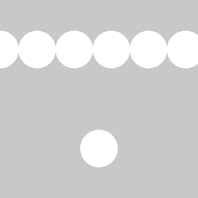
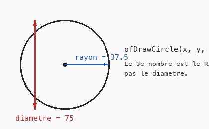

# Cours 01 — Variables et opérations

> **Fichiers** : `ofApp01.h` + `ofApp01.cpp`
> **Avant** : cours 00 (repère de l'écran, fonctions de dessin, couleurs).

Dans le cours 00 tous les nombres étaient écrits en dur dans les appels de dessin. Pour construire un dessin, il faut pouvoir **nommer** des nombres, les calculer à partir d'autres, et les réutiliser. C'est le rôle des variables.



## 1. Une variable : une boîte avec un nom et un type

```cpp
int sizeX = 400;
int sizeY = 400;
```

Chaque ligne crée une variable. Lecture de gauche à droite :

| Morceau | Rôle |
|---|---|
| `int` | le **type** : cette boîte contiendra un nombre entier |
| `sizeX` | le **nom**, choisi par toi. Pas d'espace, pas d'accent, pas de chiffre au début |
| `= 400` | la valeur de départ |

En C++, une variable a toujours un type, fixé une fois pour toutes. Les deux types dont tu as besoin pour l'instant :

| Type | Contenu | Exemples |
|---|---|---|
| `int` | un nombre entier | `-3`, `0`, `400` |
| `float` | un nombre à virgule | `37.5f`, `0.25f`, `3.0f` |

Le `f` à la fin d'un nombre à virgule indique « ce nombre est un `float` ». Prends l'habitude de l'écrire : `37.5f`.

### Où vit la variable : une case en mémoire

La mémoire de l'ordinateur est une immense rangée de cases numérotées. Déclarer une variable fait trois choses d'un coup : **réserver** une case, lui donner un **nom**, y ranger une **valeur**.

```
        sizeX           x
  ...+---------+...+---------+...
     |   400   |   |  37.5   |        . = cases qui ne nous appartiennent pas
  ...+---------+...+---------+...
        int          float
```

Le type est la règle de la case : ce qu'elle peut contenir, et comment lire ce qu'il y a dedans — fixé une fois pour toutes. Le nom, lui, n'existe que pour nous : dans le programme compilé, il ne reste que des numéros de case. Lire une variable, c'est ouvrir sa case ; l'affecter, c'est remplacer son contenu.

### Comment la case range le nombre

Un `int` et un `float` occupent chacun 4 octets, mais ne rangent pas le nombre de la même façon.

L'`int` écrit le nombre lui-même en binaire : 400 s'écrit `110010000`. C'est **exact**, mais borné — sur 4 octets, de −2 147 483 648 à 2 147 483 647.

Le `float` range une **notation scientifique en binaire**, sur le modèle du 3,75 × 10¹ de l'école : un signe, un exposant, des chiffres significatifs. Par exemple 37.5, qui s'écrit `100101,1` en binaire, est rangé comme 1,001011 × 2⁵ :

```
  int   400  :  [ 110010000 ]              le nombre lui-même — exact
  float 37.5 :  [ + ][ 2⁵ ][ 1,001011 ]    signe · exposant · chiffres significatifs
```

La plage couverte est énorme, mais le nombre de chiffres significatifs est limité (environ 7) : beaucoup de nombres à virgule sont donc stockés **en arrondi** — 0.1 n'est pas exactement 0.1. Pour des pixels, on s'en moque ; mais ne compare jamais deux `float` avec `==`. C'est pour distinguer ces deux rangements que C++ exige un type sur chaque variable — et le `f` de `37.5f` dit précisément « range-moi en `float` ».

## 2. Calculer avec des variables

```cpp
float x = sizeX / 2.0f;        // 200 : le milieu de la largeur
float y = sizeY * 3 / 4.0f;    // 300 : les trois quarts de la hauteur
```

Les quatre opérations s'écrivent `+`, `-`, `*`, `/`. On peut mélanger des variables et des nombres. La valeur calculée est rangée dans la nouvelle variable.

Ici `x` et `y` ne sont plus des nombres devinés : ils sont **déduits** de la taille de la fenêtre. Si on passe `sizeX` à 800, le cercle reste au milieu.

### Le piège de la division entière

```cpp
int a = 3 / 4;        // vaut 0, pas 0.75 !
```

Quand les deux nombres d'une division sont des entiers, le résultat est un entier : C++ **jette la partie après la virgule**. `3 / 4` donne `0`, `7 / 2` donne `3`.

Pour obtenir une vraie division, il suffit qu'un des deux nombres soit un `float` : `3 / 4.0f` vaut `0.75f`. C'est pourquoi le code écrit `sizeY * 3 / 4.0f` et pas `sizeY * 3 / 4`. Ici `sizeY * 3 / 4` donnerait quand même 300 parce que la multiplication est faite d'abord (1200 / 4), mais `sizeY * (3 / 4)` donnerait 0.

Ce piège reviendra. Quand un calcul donne 0 sans raison, pense à la division entière.

## 3. Rayon, pas diamètre

```cpp
ofDrawCircle(x, y, 37.5f);
```



Le troisième nombre de `ofDrawCircle` est le **rayon**, la distance du centre au bord. Un cercle de 75 pixels de large a un rayon de 37.5. Si tu penses en « taille », divise par deux.

## 4. Modifier une variable qui existe déjà

```cpp
x = 0;
float step = 75;
ofDrawCircle(x, y, 37.5f);
x = x + step;
ofDrawCircle(x, y, 37.5f);
x = x + step;
```

`x = x + step;` n'est pas une équation. C'est une instruction : « calcule `x + step`, puis range le résultat dans `x` ». Après cette instruction, `x` a augmenté de 75. Le signe `=` veut dire **« reçoit »**, jamais « est égal à ».

Remarque qu'on n'écrit plus `float` devant `x` : la variable existe déjà, on change seulement son contenu. Écrire `float x = ...` une deuxième fois serait une erreur, on créerait deux boîtes du même nom.

## 5. Deux blocs : setup et draw

```cpp
void ofApp::setup() {
	ofSetWindowShape(400, 400);
	ofBackground(200);
}

void ofApp::draw() {
	...
}
```

- `setup()` s'exécute une fois au lancement. On y met la taille de la fenêtre et la couleur du fond.
- `draw()` s'exécute 60 fois par seconde. Comme le dessin ne change pas, il est simplement refait à l'identique à chaque fois. Tu ne vois pas la différence, mais retiens-le : ce sera important dès le cours 03.

`ofBackground(200)` avec un seul nombre donne un gris : c'est un raccourci pour `(200, 200, 200)`.

## 6. Le problème qui prépare le cours suivant

Regarde la fin du code : dix cercles, vingt lignes, toutes identiques deux par deux. Si on veut espacer les cercles de 50 au lieu de 75, il faut changer... une seule ligne, `float step = 75;`. C'est l'avantage des variables. Mais si on veut 30 cercles, il faut écrire 40 lignes de plus. Le cours 02 règle ça avec la boucle `for`.

## Exercices

1. Change `step` pour espacer les cercles de 50. Puis de 25.
2. Ajoute une variable `float rayon = 37.5f;` et utilise-la dans tous les `ofDrawCircle`. Change-la pour voir tous les cercles grandir ensemble.
3. Écris `int moitie = 7 / 2;` et affiche un cercle de rayon `moitie * 20`. Puis remplace `7 / 2` par `7 / 2.0f` et compare.
4. Place un cercle exactement au centre de la fenêtre en utilisant uniquement `sizeX` et `sizeY`.

## Le code complet, pas à pas

Le programme entier, dans l'ordre des fichiers. Les blocs ci-dessous mis bout à bout donnent exactement `ofApp01.cpp`.

### Le fichier `ofApp01.h`

La table des matières du programme : les blocs qui existent et les variables partagées entre eux, avec leurs valeurs de départ.

```cpp
#pragma once
#include "ofMain.h"

// 01 - Variables et opérations
// Sketch d'origine : Cours 1/01_First_operations (Processing Python)
// Notions : variables typées, opérateurs + - * /, appel de fonction de dessin,
//           division entière (piège C++), répétition manuelle -> motive la boucle for (02)

class ofApp : public ofBaseApp {
public:
	void setup();
	void draw();
};
```

### En tête du fichier `ofApp01.cpp`

L'inclusion du `.h`, qui rend visibles les variables partagées et les blocs déclarés.

```cpp
#include "ofApp01.h"
```

### Étape 1 — `setup()`

Exécuté une fois au lancement : la fenêtre, les chargements, les valeurs de départ.

```cpp
// En Processing, size(400, 400) est le premier appel du sketch.
// En openFrameworks, la fenêtre existe déjà : on lui donne sa taille dans setup().
void ofApp::setup() {
	ofSetWindowShape(400, 400);
	ofBackground(200);          // gris clair, comme le fond par défaut de Processing
}
```

### Étape 2 — `draw()`

Exécuté à chaque frame, après `update()` : uniquement du dessin.

```cpp
// Processing dessine ce sketch une seule fois (pas de draw()).
// openFrameworks appelle draw() 60 fois par seconde : un dessin statique
// est simplement redessiné à l'identique à chaque frame.
void ofApp::draw() {
	// Deux variables pour stocker la taille de l'écran.
	// En C++ chaque variable a un type : int pour un entier, float pour un décimal.
	int sizeX = 400;
	int sizeY = 400;

	// Coordonnée horizontale du milieu de l'écran
	float x = sizeX / 2.0f;
	// Coordonnée verticale aux 3/4 de l'écran
	float y = sizeY * 3 / 4.0f;
	// PIÈGE : en C++, 3 / 4 vaut 0 (division entière).
	// sizeY * 3 / 4 vaut 300 car la multiplication est faite d'abord (1200 / 4).
	// Écrire 4.0f force un calcul en décimal.

	ofSetColor(255);            // blanc = fill(255) de Processing
	ofFill();

	// ATTENTION : circle(x, y, 75) en Processing prend un DIAMÈTRE.
	// ofDrawCircle(x, y, r) prend un RAYON. 75 de diamètre = 37.5 de rayon.
	ofDrawCircle(x, y, 37.5f);

	// Dessiner 10 cercles de gauche à droite, au premier quart de l'écran.
	// Version "à la main", sans boucle : on répète le même code 10 fois.
	x = 0;
	float step = 75;
	y = sizeY * 1 / 4.0f;
	ofDrawCircle(x, y, 37.5f);
	x = x + step;
	ofDrawCircle(x, y, 37.5f);
	x = x + step;
	ofDrawCircle(x, y, 37.5f);
	x = x + step;
	ofDrawCircle(x, y, 37.5f);
	x = x + step;
	ofDrawCircle(x, y, 37.5f);
	x = x + step;
	ofDrawCircle(x, y, 37.5f);
	x = x + step;
	ofDrawCircle(x, y, 37.5f);
	x = x + step;
	ofDrawCircle(x, y, 37.5f);
	x = x + step;
	ofDrawCircle(x, y, 37.5f);
	x = x + step;
	ofDrawCircle(x, y, 37.5f);

	// Exercice : reprendre le code ci-dessus pour espacer les cercles de 50.
	// Constat : 20 lignes pour 10 cercles. La boucle for (fichier 02) règle ça.
}
```

## Ce qu'il faut retenir

- Une variable a un type (`int` entier, `float` à virgule), un nom et une valeur : `float x = 200;`.
- `=` veut dire « reçoit ». `x = x + 75;` augmente `x` de 75.
- Entier divisé par entier donne un entier : `3 / 4` vaut 0. Écris `4.0f` pour une vraie division.
- `ofDrawCircle(x, y, rayon)` : le troisième nombre est le rayon.
- `setup()` s'exécute une fois, `draw()` 60 fois par seconde.
