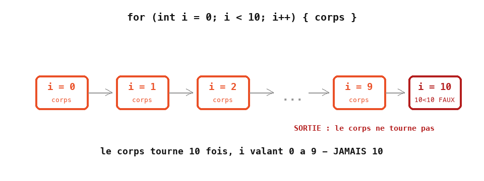

# Cours 02 — La boucle `for`

> **Avant** : cours 01 (variables, `x = x + step`).
> **Comment travailler** : toujours dans `ofApp.h` et `ofApp.cpp`, par versions successives. `ofApp02.h` / `ofApp02.cpp` : la référence téléchargeable de l'état final.

Le cours 01 finissait sur vingt lignes pour dix cercles. La boucle `for` dit à l'ordinateur : « répète ce bloc dix fois ». Et comme on peut changer des variables à chaque tour, les dix cercles pourront tous être **différents**.


## 1. Étape 1 — la rangée du cours 01, en quatre lignes

Garde le `setup()` du cours 01 (fenêtre 400 × 400, fond gris). Dans `draw()`, remplace les vingt lignes de la rangée par :

```cpp
void ofApp::draw() {
	float x = 0;
	for (int i = 0; i < 10; i++) {
		ofDrawCircle(x, 100, 37.5f);
		x = x + 75;
	}
}
```

La même rangée de dix cercles — le fichier a fondu. Anatomie de la ligne `for`, trois morceaux séparés par des points-virgules :

| Morceau | Nom | Quand | Rôle |
|---|---|---|---|
| `int i = 0` | initialisation | une fois, au début | crée le compteur `i` à 0 |
| `i < 10` | condition | avant chaque tour | tant que c'est vrai, on continue |
| `i++` | incrément | à la fin de chaque tour | ajoute 1 à `i` (raccourci de `i = i + 1`) |

Le bloc entre accolades est le **corps** de la boucle. Déroulé : `i` vaut 0, on exécute le corps, `i` passe à 1, on vérifie `1 < 10`, on exécute… `i` passe à 10, `10 < 10` est faux, on sort. Le corps a tourné dix fois, avec `i` valant 0, 1, 2, … 9. **Jamais 10.**



Deux détails : le compteur `i` n'existe que dans la boucle (après l'accolade fermante, il a disparu) ; et dans un `for`, l'initialisation s'écrit avec `=` — c'est la syntaxe universelle de cette ligne, tu la verras partout ainsi.

> **Essaie** : `i < 20` — puis change le `75` pour que les vingt cercles tiennent dans la fenêtre. Combien de lignes modifiées, contre combien au cours 01 ?

## 2. Étape 2 — accumuler à chaque tour

Maintenant le vrai programme du cours — remplace `draw()` :

```cpp
void ofApp::draw() {
	float x { 0 };
	float y { 0 };
	float taille { 10 };
	int   b { 0 };

	for (int i = 0; i < 10; i++) {
		ofDrawCircle(x, y, taille / 2);

		x = x + 40;
		y = y + 40;
		taille = taille + 20;
		b = b + 25;
	}
}
```

Une diagonale de cercles qui grossissent. (`b` accumule sans servir encore : il attend l'étape 3.) Quatre variables sont créées **avant** la boucle et modifiées **à la fin de chaque tour** : elles gardent leur valeur d'un tour à l'autre, c'est ce qui fait avancer et grossir les cercles.

| tour | `i` | `x` | `y` | `taille` | `b` |
|---|---|---|---|---|---|
| 1 | 0 | 0 | 0 | 10 | 0 |
| 2 | 1 | 40 | 40 | 30 | 25 |
| 3 | 2 | 80 | 80 | 50 | 50 |
| … | | | | | |
| 10 | 9 | 360 | 360 | 190 | 225 |

Si ces variables étaient créées à l'intérieur du corps, elles repartiraient de zéro à chaque tour : dix cercles au même endroit. **Où tu déclares une variable décide de sa durée de vie.**

Il existe une autre façon d'obtenir le même dessin, sans accumuler : tout calculer depuis `i` — `ofDrawCircle(i * 40, i * 40, (10 + i * 20) / 2)`. Les deux styles sont valables : accumuler est plus lisible avec beaucoup de variables, calculer depuis `i` est plus sûr quand on veut sauter des tours.

> **Essaie** : fais partir les cercles d'en haut à droite vers en bas à gauche (`x` commence à 400 et diminue). Puis réécris la boucle **sans variables accumulées** : tout depuis `i`.

## 3. Étape 3 — remplissage et contour : deux passes

Un cercle peut être **plein** ou n'avoir qu'un **contour**. openFrameworks a un interrupteur pour ça — complète le corps de la boucle :

```cpp
		// 1) le remplissage : bleu qui augmente, un peu transparent
		ofFill();
		ofSetColor(255, 0, b, 180);
		ofDrawCircle(x, y, taille / 2);

		// 2) le contour : orange
		ofNoFill();
		ofSetColor(255, 150, 0);
		ofDrawCircle(x, y, taille / 2);
```

`ofFill()` : les formes qui suivent sont pleines. `ofNoFill()` : seulement le trait. Pour avoir les deux, on dessine **deux fois le même cercle**, une fois dans chaque mode.

Regarde la couleur du remplissage : `(255, 0, b, 180)`. Le bleu est la variable `b`, qui grimpe de 25 par tour — premier cercle rouge pur, dernier presque violet. Une couleur est faite de nombres, et **un nombre peut être une variable**.

> **Essaie** : fais varier le vert au lieu du bleu. Puis les deux à la fois — un qui monte, un qui descend.

## 4. Pourquoi le dernier cercle sort de l'écran

Au dixième tour, `x` vaut 360 et `taille` 190 : le cercle va jusqu'à 455, la fenêtre s'arrête à 400. Rien ne plante — ce qui dépasse n'est simplement pas visible. C'est fréquent et sans danger pour le dessin. Ça le sera moins quand on lira des pixels dans une image, au cours 10.

## Exercices

1. **Lire avant de lancer** — sur papier ou dans Paint, place les cercles avant de lancer :

   ```cpp
   for (int i = 0; i < 5; i++) {
   	ofDrawCircle(50 + i * 80, 200, 10 + i * 10);
   }
   ```

   Combien de cercles, où, et de quelle taille ?

2. **La piste** — des rectangles régulièrement espacés qui traversent **toute** la fenêtre, quel que soit `sizeX` : l'espacement est déduit (cours 01), la répétition est une boucle (cours 02).

3. **La cible, en boucle** — reprends la cible du cours 01 : des cercles concentriques au centre, en une seule boucle. Le rayon descend à chaque tour, et une composante de couleur glisse (comme `b`).

4. **Deux boucles, deux styles** *(plus costaud)* — dans le même `draw()` : une rangée horizontale écrite en style *accumulé*, puis une diagonale écrite en style *tout depuis `i`*, sans aucune variable accumulée.

## Ce qu'il faut retenir

- `for (int i = 0; i < n; i++) { ... }` exécute le bloc `n` fois, `i` allant de 0 à `n − 1` — jamais `n`.
- Une variable créée **avant** la boucle garde sa valeur de tour en tour ; créée **dedans**, elle repart de zéro. Où l'on déclare décide de la durée de vie.
- `i++` ajoute 1 à `i`.
- `ofFill()` / `ofNoFill()` : formes pleines ou en contour — pour les deux, dessiner deux fois.
- Toute valeur numérique, y compris une composante de couleur, peut être une variable qui change.
