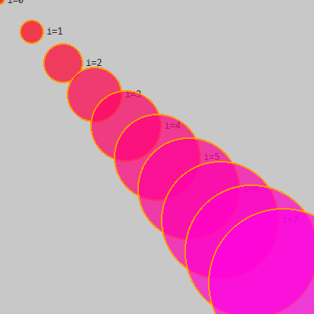

# Cours 02 — La boucle `for`

> **Fichiers** : `ofApp02.h` + `ofApp02.cpp`
> **Avant** : cours 01 (variables, `x = x + step`).

Le cours 01 finissait par vingt lignes pour dix cercles. La boucle `for` dit à l'ordinateur : « répète ce bloc dix fois ». Et comme on peut changer des variables à chaque tour, les dix cercles peuvent tous être différents.



## 1. Anatomie de la boucle

```cpp
for (int i = 0; i < 10; i++) {
	// ce bloc est exécuté 10 fois
}
```

Entre les parenthèses, trois morceaux séparés par des points-virgules :

| Morceau | Nom | Quand | Rôle |
|---|---|---|---|
| `int i = 0` | initialisation | une fois, au début | crée le compteur `i` à 0 |
| `i < 10` | condition | avant chaque tour | tant que c'est vrai, on continue |
| `i++` | incrément | à la fin de chaque tour | ajoute 1 à `i` (raccourci de `i = i + 1`) |

Le bloc entre accolades `{ }` est le **corps** de la boucle. Déroulé : `i` vaut 0, on exécute le corps, `i` passe à 1, on vérifie `1 < 10`, on exécute, ... `i` passe à 10, `10 < 10` est faux, on sort. Le corps a tourné 10 fois, avec `i` valant 0, 1, 2, ... 9. **Jamais 10.**

Le compteur `i` n'existe que dans la boucle. Après l'accolade fermante, il a disparu.

## 2. Accumuler à chaque tour

```cpp
float x = 0;
float y = 0;
float taille = 10;
int   b = 0;

for (int i = 0; i < 10; i++) {
	ofDrawCircle(x, y, taille / 2);

	x = x + 40;
	y = y + 40;
	taille = taille + 20;
	b = b + 25;
}
```

Quatre variables sont créées **avant** la boucle, et modifiées **à la fin de chaque tour**. Elles gardent leur valeur d'un tour à l'autre : c'est ce qui fait bouger et grossir les cercles.

| tour | `i` | `x` | `y` | `taille` | `b` |
|---|---|---|---|---|---|
| 1 | 0 | 0 | 0 | 10 | 0 |
| 2 | 1 | 40 | 40 | 30 | 25 |
| 3 | 2 | 80 | 80 | 50 | 50 |
| ... | | | | | |
| 10 | 9 | 360 | 360 | 190 | 225 |

Si les variables étaient créées à l'intérieur du corps, elles repartiraient de zéro à chaque tour et les dix cercles seraient au même endroit. Où tu déclares une variable décide de sa durée de vie.

Il y avait une autre façon d'obtenir le même résultat, sans accumuler : calculer directement à partir de `i`, par exemple `ofDrawCircle(i * 40, i * 40, (10 + i * 20) / 2)`. Les deux styles sont valables. Accumuler est plus lisible quand il y a beaucoup de variables, calculer depuis `i` est plus sûr quand on veut sauter un tour.

## 3. Remplissage et contour : deux passes

Un cercle peut être **plein** ou n'avoir qu'un **contour**. openFrameworks a un interrupteur pour ça :

```cpp
// 1) le remplissage : bleu qui augmente, un peu transparent
ofFill();
ofSetColor(255, 0, b, 180);
ofDrawCircle(x, y, taille / 2);

// 2) le contour : orange
ofNoFill();
ofSetColor(255, 150, 0);
ofDrawCircle(x, y, taille / 2);
```

`ofFill()` : les formes qui suivent sont pleines. `ofNoFill()` : seulement le trait. Pour avoir les deux, on dessine deux fois le même cercle, une fois dans chaque mode. La position et la taille sont identiques, seules la couleur et le mode changent.

Remarque la couleur du remplissage : `(255, 0, b, 180)`. Le bleu est la variable `b`, qui grimpe de 25 par tour. Le premier cercle est rouge pur, le dernier presque violet. Une couleur est faite de nombres, et un nombre peut être une variable.

## 4. Pourquoi le dernier cercle sort de l'écran

Au dixième tour, `x` vaut 360 et `taille` 190. Le centre est à 360, le rayon est 95 : le cercle va jusqu'à 455, la fenêtre s'arrête à 400. Rien ne plante : ce qui dépasse n'est simplement pas visible. C'est fréquent et sans danger pour le dessin. Ça le sera moins quand on lira des pixels dans une image, au cours 10.

## Exercices

1. Change `i < 10` en `i < 20`. Puis change `40` en `20` pour que les vingt cercles tiennent dans la fenêtre.
2. Fais partir les cercles d'en haut à droite vers en bas à gauche : `x` commence à 400 et diminue.
3. Fais varier le vert au lieu du bleu. Puis les deux à la fois, un qui monte et un qui descend.
4. Écris la boucle sans variables accumulées : tout calculé depuis `i`.

## Le code complet, pas à pas

Le programme entier, dans l'ordre des fichiers. Les blocs ci-dessous mis bout à bout donnent exactement `ofApp02.cpp`.

### Le fichier `ofApp02.h`

La table des matières du programme : les blocs qui existent et les variables partagées entre eux, avec leurs valeurs de départ.

```cpp
#pragma once
#include "ofMain.h"

// 02 - Boucle for
// Sketch d'origine : Cours 1/02_For_loop_circle
// Notions : boucle for, compteur, accumulation (position, taille, couleur),
//           couleur RGBA, fill + stroke (dessiné en deux passes en openFrameworks)

class ofApp : public ofBaseApp {
public:
	void setup();
	void draw();
};
```

### En tête du fichier `ofApp02.cpp`

L'inclusion du `.h`, qui rend visibles les variables partagées et les blocs déclarés.

```cpp
#include "ofApp02.h"
```

### Étape 1 — `setup()`

Exécuté une fois au lancement : la fenêtre, les chargements, les valeurs de départ.

```cpp
void ofApp::setup() {
	ofSetWindowShape(400, 400);
	ofBackground(200);
}
```

### Étape 2 — `draw()`

Exécuté à chaque frame, après `update()` : uniquement du dessin.

```cpp
void ofApp::draw() {
	float x = 0;
	float y = 0;
	float taille = 10;      // diamètre, comme dans le sketch Processing
	int   b = 0;

	// Syntaxe C++ de la boucle : for (initialisation; condition; incrément)
	// Équivalent de : for i in range(0, 10):
	for (int i = 0; i < 10; i++) {

		// Processing dessine remplissage + contour en un seul appel circle().
		// openFrameworks n'a pas de "stroke" séparé : on dessine deux fois.

		// 1) le remplissage — fill(255, 0, b, 180)
		ofFill();
		ofSetColor(255, 0, b, 180);
		ofDrawCircle(x, y, taille / 2);

		// 2) le contour — stroke(255, 150, 0)
		ofNoFill();
		ofSetColor(255, 150, 0);
		ofDrawCircle(x, y, taille / 2);

		x = x + 40;
		y = y + 40;
		taille = taille + 20;
		b = b + 25;
	}
	// fin boucle for

	// Note : ofSetCircleResolution(64) dans setup() lisse les grands cercles.
}
```

## Ce qu'il faut retenir

- `for (int i = 0; i < n; i++) { ... }` exécute le bloc `n` fois, `i` allant de 0 à `n - 1`.
- Une variable créée avant la boucle garde sa valeur de tour en tour. Créée dedans, elle repart de zéro.
- `i++` ajoute 1 à `i`.
- `ofFill()` / `ofNoFill()` : formes pleines ou en contour. Pour les deux, dessiner deux fois.
- Toute valeur numérique, y compris une composante de couleur, peut être une variable qui change.
