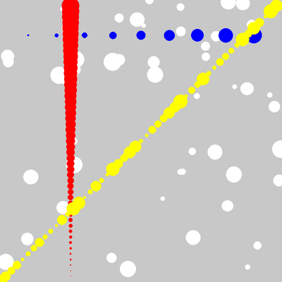

# Cours 03 — Aléatoire et boucle à pas

> **Fichiers** : `ofApp03.h` + `ofApp03.cpp`
> **Avant** : cours 02 (boucle `for`).

Un dessin fait uniquement de règles est souvent trop régulier. Le hasard casse la régularité. Mais le hasard dans un programme qui redessine 60 fois par seconde réserve une surprise.



## 1. Tirer un nombre au hasard

```cpp
float x = ofRandom(0, 800);
float taille = ofRandom(10, 50);
```

`ofRandom(a, b)` renvoie un nombre à virgule tiré au hasard entre `a` et `b`. Chaque appel donne un nouveau nombre. Le résultat est un `float` : on le range dans une variable `float`.

Cinquante cercles au hasard :

```cpp
for (int i = 0; i < 50; i++) {
	float x = ofRandom(0, 800);
	float y = ofRandom(0, 800);
	float taille = ofRandom(10, 50);
	ofDrawCircle(x, y, taille / 2);
}
```

Ici les variables sont créées **dans** la boucle, exprès : on veut trois nouveaux tirages à chaque tour, pas une accumulation.

## 2. La surprise : tout scintille

Lance ce code sans la ligne `ofSeedRandom(42);` et tu verras les cercles sauter partout, 60 fois par seconde. Normal : `draw()` est exécuté à chaque frame, et chaque exécution tire cinquante nouvelles positions.

Un programme qui dessine en continu ne fait pas la différence entre « un dessin fixe » et « un dessin refait à l'identique ». Dès qu'il y a du hasard, il faut décider ce qu'on veut : soit fixer le hasard, soit le stocker.

### Fixer le hasard : la graine

```cpp
ofSeedRandom(42);
```

L'ordinateur ne sait pas vraiment tirer au hasard. Il calcule une suite de nombres qui **a l'air** aléatoire, à partir d'un nombre de départ appelé la **graine**. Même graine, même suite. En remettant la graine à 42 au début de chaque `draw()`, les cinquante tirages redonnent exactement les mêmes valeurs : le dessin est stable.

Change 42 en 43 : un autre dessin, tout aussi stable. La graine est comme un numéro de dessin.

C'est la solution rapide. La solution propre, tirer une fois dans `setup()` et stocker les valeurs dans une liste, arrive au cours 04.

## 3. Une boucle qui avance par 5

```cpp
for (int i = 0; i < 50; i += 5) {
	ofDrawCircle(i * 16, 100, i / 2.0f);
}
```

Le troisième morceau de la boucle n'est pas obligé d'être `i++`. `i += 5` est le raccourci de `i = i + 5` : le compteur vaut 0, 5, 10, ... 45. Dix tours au lieu de cinquante.

Note le `i / 2.0f` : le rayon. `i` est un entier ; `i / 2` serait une division entière (cours 01) et perdrait la moitié des valeurs. `2.0f` force le calcul à virgule.

## 4. Lire un dessin comme une formule

Les trois autres boucles suivent le même modèle : la position dépend de `i`, la taille aussi.

```cpp
// Colonne rouge, de bas en haut, du plus grand au plus petit
for (int i = 0; i < 50; i++) {
	ofDrawCircle(200, 800 - i * 16, i / 2.0f);
}
```

`x` est fixe à 200 : une colonne. `y` vaut `800 - i * 16` : on part du bas et on remonte de 16 en 16. Le rayon `i / 2.0f` grandit avec `i`, donc les cercles du haut sont les plus gros. Avant de lancer, essaie de deviner à quoi ressemblera la diagonale jaune à partir de son code :

```cpp
for (int i = 0; i < 50; i++) {
	float taille = ofRandom(5, 40);
	ofDrawCircle(i * 16, 800 - i * 16, taille / 2);
}
```

Prendre l'habitude de prédire le dessin depuis la formule, et la formule depuis le dessin voulu, c'est l'essentiel de ce que ce cours t'apprend.

## Exercices

1. Remplace `ofSeedRandom(42)` par `ofSeedRandom(mouseX)`. Que se passe-t-il quand la souris bouge ? Pourquoi ?
2. Donne à chaque cercle blanc une couleur aléatoire : trois `ofRandom(0, 255)` dans un `ofSetColor` à l'intérieur de la boucle.
3. Écris une boucle qui dessine des cercles de 10 en 10 pixels sur toute la largeur, avec un rayon qui fait des allers-retours : `i % 100` peut aider (le reste de la division de `i` par 100).
4. Supprime `ofSeedRandom` et déplace tout le dessin dans `setup()`. Que vois-tu ? Pourquoi ce n'est pas encore la bonne solution ?

## Autonomie

Un exercice à faire seul, sans aide, avec ce que tu connais des cours 01 à 03 : variables, boucles `for`, accumulation, couleurs.

Dessine **quatre lignes de dix cercles** qui forment un carré. Le long de chaque ligne, la taille et la couleur changent progressivement d'un cercle au suivant :

| Ligne | Départ | Arrivée |
|---|---|---|
| haut, de gauche à droite | petits cercles noirs | gros cercles rouges |
| droite, de haut en bas | gros cercles rouges | petits cercles magenta |
| bas, de droite à gauche | petits cercles magenta | gros cercles blancs |
| gauche, de bas en haut | gros cercles blancs | petits cercles noirs |

Le dernier cercle d'une ligne a la même taille et la même couleur que le premier de la suivante : le tour est continu, et il se referme sur le noir de départ.

Ce qu'on attend :

- quatre boucles `for` à la suite, une par côté, dix tours chacune ;
- une taille et une couleur qui **s'accumulent** dans la boucle, comme au cours 02 ;
- le sens de parcours change à chaque côté : la position augmente sur deux côtés, diminue sur les deux autres ;
- des couleurs qui évoluent canal par canal. Rappel : noir `(0, 0, 0)`, rouge `(255, 0, 0)`, magenta `(255, 0, 255)`, blanc `(255, 255, 255)`. D'un coin au suivant, un seul canal change, sauf sur le dernier côté où les trois descendent ensemble.

Avant d'écrire la deuxième boucle, fais marcher la première parfaitement. Avant d'écrire une ligne de code, décide sur papier de combien la taille et la couleur doivent changer à chaque tour pour arriver juste à la bonne valeur au dixième cercle.

## Le code complet, pas à pas

Le programme entier, dans l'ordre des fichiers. Les blocs ci-dessous mis bout à bout donnent exactement `ofApp03.cpp`.

### Le fichier `ofApp03.h`

La table des matières du programme : les blocs qui existent et les variables partagées entre eux, avec leurs valeurs de départ.

```cpp
#pragma once
#include "ofMain.h"

// 03 - Aléatoire et boucle à pas
// Sketch d'origine : Cours 2022-2023/rendu02_5
// Notions : ofRandom, boucle for avec pas (range(0, 50, 5)), graine aléatoire,
//           différence "dessin unique" (Processing) / "dessin à chaque frame" (OF)

class ofApp : public ofBaseApp {
public:
	void setup();
	void draw();
};
```

### En tête du fichier `ofApp03.cpp`

L'inclusion du `.h`, qui rend visibles les variables partagées et les blocs déclarés.

```cpp
#include "ofApp03.h"
```

### Étape 1 — `setup()`

Exécuté une fois au lancement : la fenêtre, les chargements, les valeurs de départ.

```cpp
void ofApp::setup() {
	ofSetWindowShape(800, 800);
	ofBackground(200);
}
```

### Étape 2 — `draw()`

Exécuté à chaque frame, après `update()` : uniquement du dessin.

```cpp
void ofApp::draw() {
	// En Processing ce sketch n'a pas de draw() : il est exécuté UNE fois,
	// donc les cercles aléatoires restent en place.
	// En openFrameworks draw() tourne 60 fois par seconde : sans précaution,
	// les cercles changeraient de place à chaque frame (scintillement).
	//
	// Solution simple ici : réinitialiser la graine aléatoire à chaque frame.
	// Même graine => même suite de nombres => même dessin.
	// (Solution propre, vue au fichier 04 : générer une fois dans setup(),
	//  stocker dans un std::vector, dessiner dans draw().)
	ofSeedRandom(42);

	ofFill();
	ofSetColor(255);

	// 50 cercles aléatoires
	for (int i = 0; i < 50; i++) {
		float x = ofRandom(0, 800);
		float y = ofRandom(0, 800);
		float taille = ofRandom(10, 50);
		ofDrawCircle(x, y, taille / 2);
	}

	// Ligne de cercles de gauche à droite, du plus petit au plus grand.
	// range(0, 50, 5) en Python => i += 5 en C++
	ofSetColor(0, 0, 255);
	for (int i = 0; i < 50; i += 5) {
		ofDrawCircle(i * 16, 100, i / 2.0f);
	}

	// Colonne de cercles rouges de haut en bas, du plus grand au plus petit
	ofSetColor(255, 0, 0);
	for (int i = 0; i < 50; i++) {
		ofDrawCircle(200, 800 - i * 16, i / 2.0f);
	}

	// Diagonale bas-gauche -> haut-droite, tailles aléatoires entre 5 et 40
	ofSetColor(255, 255, 0);
	for (int i = 0; i < 50; i++) {
		float taille = ofRandom(5, 40);
		ofDrawCircle(i * 16, 800 - i * 16, taille / 2);
	}
}
```

## Ce qu'il faut retenir

- `ofRandom(a, b)` : un `float` au hasard entre `a` et `b`, différent à chaque appel.
- `draw()` tourne 60 fois par seconde : un hasard non fixé scintille.
- `ofSeedRandom(n)` fixe la graine ; même graine, même suite de nombres, même dessin.
- `i += 5` fait avancer le compteur de 5 en 5.
- Un dessin régulier se lit comme une formule en fonction de `i`.
