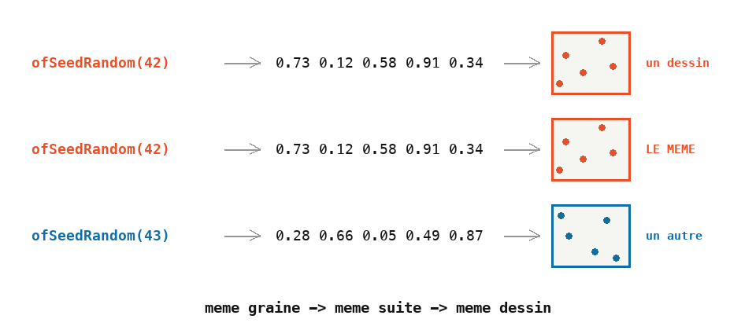

# Cours 03 — Aléatoire et boucle à pas

> **Avant** : cours 02 (boucle `for`).
> **Comment travailler** : toujours dans `ofApp.h` et `ofApp.cpp`, par versions successives. `ofApp03.h` / `ofApp03.cpp` : la référence téléchargeable de l'état final.

Un dessin fait uniquement de règles est souvent trop régulier. Le hasard casse la régularité — mais le hasard, dans un programme qui redessine 60 fois par seconde, réserve une surprise. Ce cours commence d'ailleurs par un bug volontaire.


## 1. Étape 1 — cinquante cercles au hasard (et un bug)

Fenêtre 800 × 800 dans `setup()`, fond gris — et dans `draw()` :

```cpp
void ofApp::draw() {
	ofFill();
	ofSetColor(255);

	for (int i = 0; i < 50; i++) {
		float x = ofRandom(0, 800);
		float y = ofRandom(0, 800);
		float taille = ofRandom(10, 50);
		ofDrawCircle(x, y, taille / 2);
	}
}
```

`ofRandom(a, b)` renvoie un nombre à virgule tiré au hasard entre `a` et `b` — chaque appel donne un nouveau nombre, et le résultat est un `float`. Ici les variables sont créées **dans** la boucle, exprès : on veut trois nouveaux tirages à chaque tour, pas une accumulation (cours 02).

Lance. Les cercles **sautent partout**, 60 fois par seconde. Ce n'est pas un accident : c'est la leçon.

> **Essaie** : donne à chaque cercle une couleur aléatoire — trois `ofRandom(0, 255)` dans un `ofSetColor`, à l'intérieur de la boucle. Le scintillement devient un feu d'artifice.

## 2. Étape 2 — comprendre, puis fixer : la graine

Pourquoi ça scintille ? `draw()` est exécuté à chaque frame, et chaque exécution tire cinquante **nouvelles** positions. Un programme qui dessine en continu ne fait pas la différence entre « un dessin fixe » et « un dessin refait à l'identique » : dès qu'il y a du hasard, il faut décider — le **fixer**, ou le **stocker**.

La solution d'aujourd'hui, une ligne en tête de `draw()` :

```cpp
	ofSeedRandom(42);
```

L'ordinateur ne sait pas vraiment tirer au hasard : il calcule une suite de nombres qui **a l'air** aléatoire, à partir d'un nombre de départ, la **graine**. Même graine, même suite. En remettant la graine à 42 au début de chaque `draw()`, les cinquante tirages redonnent exactement les mêmes valeurs : le dessin est stable.

Change 42 en 43 : un autre dessin, tout aussi stable. La graine est un **numéro de dessin**.



C'est la solution rapide. La solution propre — tirer une fois dans `setup()` et **stocker** dans une liste — arrive au cours 04.

> **Essaie** : `ofSeedRandom(mouseX)` — que se passe-t-il quand la souris bouge, et pourquoi ? Puis : supprime la graine et déplace tout le dessin dans `setup()`. Que vois-tu ? Pourquoi ce n'est pas encore la bonne solution ?

## 3. Étape 3 — la boucle à pas

Ajoute une rangée bleue :

```cpp
	ofSetColor(0, 0, 255);
	for (int i = 0; i < 50; i += 5) {
		ofDrawCircle(i * 16, 100, i / 2.0f);
	}
```

Le troisième morceau du `for` n'est pas obligé d'être `i++` : `i += 5` est le raccourci de `i = i + 5`. Le compteur vaut 0, 5, 10, … 45 — dix tours au lieu de cinquante.

Note le `i / 2.0f` : `i` est un entier, `i / 2` serait une division entière (cours 01) et perdrait la moitié des valeurs. Le `2.0f` force le calcul à virgule.

> **Essaie** : un pas de 2, puis de 10 — prédis le nombre de cercles avant de lancer.

## 4. Étape 4 — lire un dessin comme une formule

Deux dernières boucles. La colonne rouge :

```cpp
	ofSetColor(255, 0, 0);
	for (int i = 0; i < 50; i++) {
		ofDrawCircle(200, 800 - i * 16, i / 2.0f);
	}
```

`x` est fixe à 200 : une colonne. `y` vaut `800 - i * 16` : on part du bas et on remonte de 16 en 16. Le rayon `i / 2.0f` grandit avec `i` : les cercles du haut sont les plus gros.

Avant de taper la diagonale jaune, **devine son dessin** à partir de son code :

```cpp
	ofSetColor(255, 255, 0);
	for (int i = 0; i < 50; i++) {
		float taille = ofRandom(5, 40);
		ofDrawCircle(i * 16, 800 - i * 16, taille / 2);
	}
```

Prédire le dessin depuis la formule, et trouver la formule depuis le dessin voulu : c'est l'essentiel de ce que ce cours t'apprend.

> **Essaie** : écris la formule d'une ligne horizontale collée en bas de la fenêtre, dont les cercles grossissent vers la **gauche**.

## Exercices

1. **Lire avant de lancer** — sur papier ou dans Paint, dessine ce que produisent ces deux boucles, puis vérifie :

   ```cpp
   for (int i = 0; i < 40; i += 4) {
   	ofDrawCircle(400, i * 20, 5 + i);
   }
   for (int i = 0; i < 10; i++) {
   	ofDrawCircle(i * 80, i * 40, 10);
   }
   ```

2. **La constellation** — fond noir, une centaine de petites étoiles blanches au hasard, plus une dizaine de grosses (deux boucles, deux plages de tailles). Choisis ta graine préférée : c'est **ton** ciel, il doit rester immobile.

3. **L'herbe** — une centaine de rectangles verts fins et verticaux, alignés sur le bas de la fenêtre, de hauteurs aléatoires. Piège : pour que le bas soit aligné, le `y` du rectangle se **déduit** de sa hauteur.

4. **Le désordre croissant** *(plus costaud)* — une rangée de cercles de gauche à droite, dont la position verticale s'éparpille de plus en plus. Sages à gauche, chaotiques à droite — la règle et le hasard dans la même formule.

## Autonomie

Un exercice à faire seul, sans aide, avec ce que tu connais des cours 01 à 03 : variables, boucles `for`, accumulation, couleurs.

Dessine **quatre lignes de dix cercles** qui forment un carré. Le long de chaque ligne, la taille et la couleur changent progressivement d'un cercle au suivant :

| Ligne | Départ | Arrivée |
|---|---|---|
| haut, de gauche à droite | petits cercles noirs | gros cercles rouges |
| droite, de haut en bas | gros cercles rouges | petits cercles magenta |
| bas, de droite à gauche | petits cercles magenta | gros cercles blancs |
| gauche, de bas en haut | gros cercles blancs | petits cercles noirs |

Le dernier cercle d'une ligne a la même taille et la même couleur que le premier de la suivante : le tour est continu, et il se referme sur le noir de départ.

Ce qu'on attend :

- quatre boucles `for` à la suite, une par côté, dix tours chacune ;
- une taille et une couleur qui **s'accumulent** dans la boucle, comme au cours 02 ;
- le sens de parcours change à chaque côté : la position augmente sur deux côtés, diminue sur les deux autres ;
- des couleurs qui évoluent canal par canal. Rappel : noir `(0, 0, 0)`, rouge `(255, 0, 0)`, magenta `(255, 0, 255)`, blanc `(255, 255, 255)`. D'un coin au suivant, un seul canal change, sauf sur le dernier côté où les trois descendent ensemble.

Avant d'écrire la deuxième boucle, fais marcher la première parfaitement. Avant d'écrire une ligne de code, décide sur papier de combien la taille et la couleur doivent changer à chaque tour pour arriver juste à la bonne valeur au dixième cercle.

## Ce qu'il faut retenir

- `ofRandom(a, b)` : un `float` au hasard entre `a` et `b`, nouveau à chaque appel.
- `draw()` tourne 60 fois par seconde : du hasard non maîtrisé y scintille. Fixer avec `ofSeedRandom(graine)`, ou stocker (cours 04).
- Même graine → même suite → même dessin. La graine est un numéro de dessin.
- Le pas du `for` est libre : `i += 5`.
- Savoir lire une formule (`800 - i * 16`) comme un dessin, et l'inverse.
