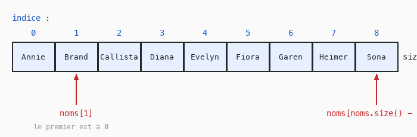

# Cours 04 — Listes : `std::vector`

> **Fichiers** : `ofApp04.h` + `ofApp04.cpp`
> **Avant** : cours 02 (boucle `for`), cours 03 (le hasard qui scintille).

Une variable contient **un** nombre. Pour cinquante positions de cercles, il faudrait cinquante variables. Une liste en contient autant qu'on veut, sous un seul nom, et la boucle `for` sait la parcourir.

Ce cours affiche du texte plutôt que des formes : une liste de prénoms et une liste de chiffres, dans la console et dans la fenêtre.

## 1. Déclarer une liste

```cpp
std::vector<std::string> noms;
std::vector<int> chiffres;
```

`std::vector` est le type « liste » du C++. Entre les chevrons `< >`, le type des éléments : une liste de textes (`std::string`), une liste d'entiers (`int`). Une liste ne mélange pas les types : c'est le prix de la sécurité en C++.

Ces deux lignes sont dans le fichier `.h`, pas dans le `.cpp`. Une variable déclarée dans le `.h` est **partagée** : elle est visible dans `setup()`, dans `update()` et dans `draw()`, et elle garde sa valeur pendant toute la vie du programme. Une variable déclarée à l'intérieur d'un bloc n'existe que dans ce bloc. Ici on remplit les listes dans `setup()` et on les lit dans `draw()`, donc elles doivent être partagées.

Une liste fraîchement déclarée est vide.

## 2. Ajouter, lire, compter

```cpp
noms.push_back("Annie");
noms.push_back("Brand");
noms.push_back("Callista");
```

`noms.push_back(...)` ajoute un élément **à la fin** de la liste. Remarque la syntaxe avec le point : `variable.action(...)`. Certains types du C++ embarquent leurs propres actions, et on les appelle en accrochant le nom de l'action à la variable avec un point. Tu vas revoir cette écriture très souvent.



```cpp
std::cout << noms[1] << std::endl;                 // Brand
std::cout << noms[0] << std::endl;                 // Annie
std::cout << noms[noms.size() - 1] << std::endl;   // Sona
```

- `noms[i]` lit l'élément numéro `i`. **Le premier est le numéro 0.** Le deuxième est le 1.
- `noms.size()` donne le nombre d'éléments. Le dernier est donc à `noms.size() - 1`.
- Lire `noms[9]` dans une liste de 9 éléments est une erreur grave : C++ ne vérifie pas, et le programme lit n'importe quoi en mémoire, ou plante. Tu es responsable de rester entre 0 et `size() - 1`.

## 3. Parcourir une liste avec `for`

```cpp
for (int i = 0; i < chiffres.size(); i++) {
	std::cout << chiffres[i] << " ";
}
```

La boucle du cours 02, avec `size()` comme limite : `i` va de 0 au dernier indice, exactement ce qu'il faut. Ce motif, « pour chaque élément de la liste », est le plus fréquent de tout le C++ que tu écriras cette année.

Remplir une liste avec une boucle marche pareil :

```cpp
for (int i = 0; i < 10; i++) {
	chiffres.push_back(i);
}
```

## 4. Le texte : `std::string`

```cpp
std::string nom = "Gaetan";
std::cout << "Hello " + nom << std::endl;
```

`std::string` est le type « texte ». Un texte s'écrit entre guillemets doubles. Le `+` entre deux textes les colle bout à bout.

Pour coller un nombre à un texte, il faut d'abord transformer le nombre en texte avec `ofToString` :

```cpp
std::string ligne = "Chiffres : ";
for (int i = 0; i < chiffres.size(); i++) {
	ligne = ligne + ofToString(chiffres[i]) + " ";
}
```

À chaque tour la phrase s'allonge. C'est l'accumulation du cours 02, appliquée à du texte.

## 5. Afficher : console et fenêtre

Deux destinations :

```cpp
std::cout << x << std::endl;               // dans la console
ofDrawBitmapString(ligne, 20, 260);        // dans la fenêtre, à la position (20, 260)
```

`std::cout` envoie ce qui suit vers la console. Les `<<` s'enchaînent, `std::endl` termine la ligne. La console est un outil de travail : quand un dessin ne fait pas ce que tu veux, affiche tes variables pour voir ce qu'elles contiennent vraiment.

`ofDrawBitmapString(texte, x, y)` écrit dans la fenêtre avec la couleur courante. La position est celle du **bas** de la première lettre. Il ne gère pas les accents : écris sans.

## 6. Retour sur le cours 03

Le hasard scintillait parce qu'on retirait des nombres à chaque `draw()`. Avec une liste, la solution propre : dans `setup()`, tirer cinquante positions et les `push_back` dans deux listes partagées ; dans `draw()`, parcourir les listes et dessiner. Le tirage a lieu une fois, le dessin autant de fois qu'on veut. C'est le premier exercice ci-dessous.

## Exercices

1. Reprends le cours 03 : deux listes `std::vector<float> xs, ys` déclarées dans le `.h`, remplies dans `setup()` avec `ofRandom`, dessinées dans `draw()`. Plus besoin de `ofSeedRandom`.
2. Ajoute une troisième liste pour les rayons.
3. Affiche un prénom sur deux : la boucle du cours 03 avec `i += 2`, ou `noms[i * 2]`.
4. Construis une seule `std::string` contenant tous les prénoms séparés par des virgules et affiche-la dans la fenêtre.
5. **Exercice « listes »** : crée une liste des entiers de 1 à 20, affiche la somme de tous ses éléments, puis la liste des éléments pairs seulement.

## Le code complet, pas à pas

Le programme entier, dans l'ordre des fichiers. Les blocs ci-dessous mis bout à bout donnent exactement `ofApp04.cpp`.

### Le fichier `ofApp04.h`

La table des matières du programme : les blocs qui existent et les variables partagées entre eux, avec leurs valeurs de départ.

```cpp
#pragma once
#include "ofMain.h"

// 04 - Listes : std::vector
// Sketches d'origine : Cours 2/04_First_lists + Cours 2024-2025/sketch_01a_list (fusionnés)
// Notions : std::vector, push_back, indexation [i], size(), boucle sur une liste,
//           std::string et concaténation, affichage console (std::cout) et à l'écran
// Sert de support aux exercices "Listes" (voir INDEX.md)

class ofApp : public ofBaseApp {
public:
	void setup();
	void draw();

	// En Python les listes étaient des variables globales.
	// En C++ on les déclare comme membres de la classe : accessibles
	// dans setup() ET dans draw(), sans mot-clé "global".
	std::vector<std::string> noms;
	std::vector<int> chiffres;
};
```

### En tête du fichier `ofApp04.cpp`

L'inclusion du `.h`, qui rend visibles les variables partagées et les blocs déclarés.

```cpp
#include "ofApp04.h"
#include <iostream>
```

### Étape 1 — `setup()`

Exécuté une fois au lancement : la fenêtre, les chargements, les valeurs de départ.

```cpp
void ofApp::setup() {
	ofSetWindowShape(400, 400);
	ofBackground(30);

	// ---- Variables simples et affichage console ----
	// print(x) en Python => std::cout << x << std::endl; en C++
	// La console est visible en configuration Debug dans Visual Studio.
	// (ofLogNotice() << x; est l'équivalent openFrameworks, même destination.)
	int x = 50;
	float pi = 3.14159f;
	std::string nom = "Gaetan";

	std::cout << x << std::endl;
	std::cout << pi << std::endl;
	std::cout << nom << std::endl;

	for (int i = 0; i < 10; i++) {
		x = x + i * 10;
		std::cout << x << std::endl;
	}

	std::cout << x + pi << std::endl;
	std::cout << "Hello " + nom << std::endl;   // concaténation de std::string

	// ---- Liste de chaînes ----
	// noms = [] en Python => déjà vide à la création en C++ (déclaré dans le .h)
	// noms.append("Annie") => noms.push_back("Annie")
	noms.push_back("Annie");
	noms.push_back("Brand");
	noms.push_back("Callista");
	noms.push_back("Diana");
	noms.push_back("Evelyn");
	noms.push_back("Fiora");
	noms.push_back("Garen");
	noms.push_back("Heimer");
	noms.push_back("Sona");

	// Accès par indice : le premier élément est à l'indice 0
	std::cout << "Deuxieme element : " << noms[1] << std::endl;
	std::cout << "Cinquieme element : " << noms[4] << std::endl;
	std::cout << "Premier element : " << noms[0] << std::endl;

	// Dernier élément : taille - 1 (len(noms) - 1 en Python)
	std::cout << "Dernier element : " << noms[noms.size() - 1] << std::endl;

	// ---- Liste de nombres construite par une boucle ----
	// Créer une liste contenant tous les chiffres entre 0 et 9 inclus
	int compteur = 0;
	for (int i = 0; i < 10; i++) {
		chiffres.push_back(compteur);
		compteur = compteur + 1;
	}

	// Afficher toute la liste. Python : print(chiffres)
	// C++ ne sait pas afficher un vector directement : on boucle.
	for (int i = 0; i < chiffres.size(); i++) {
		std::cout << chiffres[i] << " ";
	}
	std::cout << std::endl;

	// Afficher un élément sur deux : indices 0, 2, 4, 6, 8
	for (int i = 0; i < 5; i++) {
		std::cout << noms[i * 2] << std::endl;
	}

	// Variante moderne de la boucle, à montrer une fois les indices maîtrisés :
	// for (const std::string& n : noms) { std::cout << n << std::endl; }
}
```

### Étape 2 — `draw()`

Exécuté à chaque frame, après `update()` : uniquement du dessin.

```cpp
void ofApp::draw() {
	// Le même contenu affiché dans la fenêtre : ofDrawBitmapString(texte, x, y)
	ofSetColor(255);
	for (int i = 0; i < noms.size(); i++) {
		ofDrawBitmapString(ofToString(i) + " : " + noms[i], 20, 30 + i * 20);
	}

	// Construire une phrase dans une variable texte avant de l'afficher
	std::string ligne = "Chiffres : ";
	for (int i = 0; i < chiffres.size(); i++) {
		ligne = ligne + ofToString(chiffres[i]) + " ";
	}
	ofDrawBitmapString(ligne, 20, 260);
}
```

## Ce qu'il faut retenir

- `std::vector<T> liste;` : une liste vide d'éléments de type `T`.
- `liste.push_back(v)` ajoute à la fin, `liste[i]` lit l'élément `i`, `liste.size()` compte. Le premier indice est 0, le dernier `size() - 1`.
- `for (int i = 0; i < liste.size(); i++)` parcourt toute la liste.
- Une variable déclarée dans le `.h` est partagée entre `setup()`, `update()` et `draw()` et survit d'une frame à l'autre.
- `std::string` pour le texte, `+` pour coller, `ofToString(n)` pour transformer un nombre en texte.
- `std::cout << ... << std::endl;` dans la console, `ofDrawBitmapString(texte, x, y)` dans la fenêtre.
