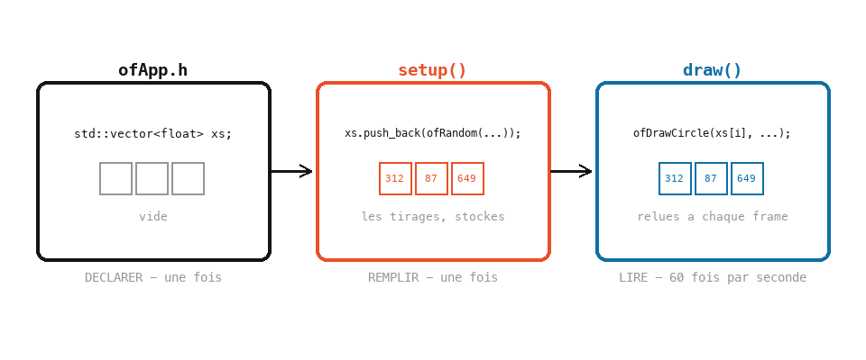

# Cours 04 — Listes : `std::vector`

> **Avant** : cours 02 (boucle `for`), cours 03 (le hasard qui scintille).
> **Comment travailler** : toujours dans `ofApp.h` et `ofApp.cpp`, par versions successives. `ofApp04.h` / `ofApp04.cpp` : la référence téléchargeable des étapes 1 à 5 (l'étape 6 est ta version).

Une variable contient **un** nombre. Pour cinquante positions de cercles, il faudrait cinquante variables. Une liste en contient autant qu'on veut, sous un seul nom — et la boucle `for` sait la parcourir. À la fin de ce cours, le scintillement du cours 03 aura sa vraie solution.

Ce cours affiche surtout du texte : des prénoms et des chiffres, dans la **console** et dans la fenêtre.

## 1. Étape 1 — déclarer des listes partagées

Dans `ofApp.h`, ajoute deux lignes dans la classe :

```cpp
class ofApp : public ofBaseApp {
public:
	void setup();
	void update();
	void draw();

	std::vector<std::string> noms;
	std::vector<int> chiffres;
};
```

`std::vector` est le type « liste » du C++. Entre les chevrons `< >`, le **type des éléments** : une liste de textes (`std::string`), une liste d'entiers (`int`). Une liste ne mélange pas les types — c'est le prix de la sécurité en C++. Une liste fraîchement déclarée est **vide**.

Pourquoi dans le `.h` ? Une variable déclarée là est **partagée** : visible dans `setup()`, `update()` et `draw()`, et vivante pendant toute la vie du programme. On va remplir les listes dans `setup()` et les lire dans `draw()` — elles doivent survivre entre les deux. C'est la suite directe de « où tu déclares décide de la durée de vie » (cours 02).

> **Essaie** : rien à lancer encore — mais déclare une troisième liste `std::vector<float> rayons;`, elle servira en exercice.

## 2. Étape 2 — la console, et le type texte

Dans `ofApp.cpp` (fenêtre 400 × 400, fond sombre) :

```cpp
void ofApp::setup() {
	ofSetWindowShape(400, 400);
	ofBackground(30);

	int x { 50 };
	float pi { 3.14159f };
	std::string nom = "Gaetan";

	std::cout << x << std::endl;
	std::cout << "Hello " + nom << std::endl;
}
```

Lance : la fenêtre est vide, mais regarde la **console** (visible en configuration Debug dans Visual Studio) : `50`, puis `Hello Gaetan`.

- `std::cout << ... << std::endl;` envoie vers la console ; les `<<` s'enchaînent, `endl` termine la ligne.
- `std::string` est le type **texte** ; un texte s'écrit entre guillemets doubles, et `+` colle deux textes bout à bout.
- La console est un **outil de travail** : quand un dessin ne fait pas ce que tu veux, affiche tes variables pour voir ce qu'elles contiennent vraiment. Tu t'en serviras toute l'année.

> **Essaie** : affiche `pi`, puis `x + pi`, puis une phrase qui les mélange.

## 3. Étape 3 — remplir et lire : `push_back` et les indices

Toujours dans `setup()` :

```cpp
	noms.push_back("Annie");
	noms.push_back("Brand");
	noms.push_back("Callista");
	// ... ajoute-en jusqu'à 9

	std::cout << noms[1] << std::endl;                 // Brand
	std::cout << noms[0] << std::endl;                 // Annie
	std::cout << noms[noms.size() - 1] << std::endl;   // le dernier
```

`noms.push_back(...)` ajoute un élément **à la fin**. Remarque la syntaxe avec le point : `variable.action(...)` — certains types embarquent leurs propres actions, tu reverras cette écriture partout.


- `noms[i]` lit l'élément numéro `i`. **Le premier est le numéro 0.** Le deuxième est le 1.
- `noms.size()` donne le nombre d'éléments — le dernier est donc à `noms.size() - 1`.
- Lire `noms[9]` dans une liste de 9 éléments est une erreur **grave** : C++ ne vérifie pas, le programme lit n'importe quoi en mémoire, ou plante. Rester entre 0 et `size() - 1` est ta responsabilité.

> **Essaie** : affiche le troisième prénom, puis l'avant-dernier (déduis son indice de `size()`).

## 4. Étape 4 — parcourir : LE motif qui combine les listes et for

```cpp
	for (int i = 0; i < 10; i++) {
		chiffres.push_back(i);          // remplir avec une boucle
	}

	for (int i = 0; i < chiffres.size(); i++) {
		std::cout << chiffres[i] << " ";   // parcourir
	}
	std::cout << std::endl;
```

La boucle du cours 02, avec `size()` comme limite : `i` va de 0 au dernier indice, exactement ce qu'il faut. Ce motif — « **pour chaque élément de la liste** » — est le plus fréquent de tout le C++ que tu écriras cette année. Remplir marche pareil : un `push_back` par tour.

> **Essaie** : affiche un prénom sur deux (deux façons : `i += 2`, ou `noms[i * 2]` — laquelle risque de sortir de la liste ?). Puis calcule la **somme** des chiffres dans une variable accumulée, et affiche-la.

## 5. Étape 5 — écrire dans la fenêtre

La console, c'est pour toi ; la fenêtre, c'est pour le public. Dans `draw()` :

```cpp
void ofApp::draw() {
	ofSetColor(255);
	for (int i = 0; i < noms.size(); i++) {
		ofDrawBitmapString(ofToString(i) + " : " + noms[i], 20, 30 + i * 20);
	}

	std::string ligne = "Chiffres : ";
	for (int i = 0; i < chiffres.size(); i++) {
		ligne = ligne + ofToString(chiffres[i]) + " ";
	}
	ofDrawBitmapString(ligne, 20, 260);
}
```

- `ofDrawBitmapString(texte, x, y)` écrit dans la fenêtre avec la couleur courante — la position est celle du **bas** de la première lettre, et il ne gère pas les accents.
- Pour coller un **nombre** à un texte, on le transforme d'abord avec `ofToString(nombre)`.
- La phrase `ligne` qui s'allonge à chaque tour : c'est l'**accumulation** du cours 02, appliquée à du texte.

> **Essaie** : espace les prénoms de 30 pixels au lieu de 20, et décale toute la colonne à droite — combien de nombres as-tu changés ?

## 6. Étape 6 — le retour sur le cours 03

Le scintillement, version résolue. Déclare deux listes `xs` et `ys` dans le `.h`, puis :

```cpp
void ofApp::setup() {
	ofSetWindowShape(800, 800);
	ofBackground(200);

	for (int i = 0; i < 50; i++) {
		xs.push_back(ofRandom(0, 800));     // on tire UNE fois...
		ys.push_back(ofRandom(0, 800));
	}
}

void ofApp::draw() {
	ofSetColor(255);
	for (int i = 0; i < xs.size(); i++) {
		ofDrawCircle(xs[i], ys[i], 10);     // ...et on dessine autant qu'on veut
	}
}
```

Le tirage a lieu **une fois**, dans `setup()` ; le dessin relit les mêmes valeurs à chaque frame. Plus de graine, plus de scintillement : le hasard est **stocké**. C'est le geste le plus important du cours — déclarer dans le `.h`, remplir dans `setup()`, lire dans `draw()`.



Note : `xs[i]` et `ys[i]` forment ensemble la position numéro `i`. Deux listes qui marchent par paires, il faudra toujours les modifier ensemble — le cours 07 en reparlera.

> **Essaie** : ajoute la liste `rayons` (déclarée à l'étape 1) : chaque cercle garde sa taille aléatoire d'une frame à l'autre.

## Exercices

1. **Lire avant de lancer** — qu'affiche la console ? Réponds avant de taper :

   ```cpp
   std::vector<int> v;
   for (int i = 0; i < 5; i++) {
   	v.push_back(i * i);
   }
   std::cout << v[2] << " " << v[v.size() - 1] << std::endl;
   ```

2. **La constellation, propre** — reprends la constellation du cours 03 (petites et grosses étoiles) avec des listes : tout est tiré dans `setup()`, plus aucune graine. Le ciel est immobile *par construction*.

3. **Le générique** — une liste avec les prénoms de ta rangée, affichés en colonne numérotée dans la fenêtre. Ajoute un prénom au milieu du code : la numérotation et la mise en page doivent suivre toutes seules (aucun autre changement).

4. **La moyenne** *(plus costaud)* — remplis une liste avec dix nombres aléatoires entre 0 et 100, affiche-les, puis calcule et affiche leur moyenne. Piège : `somme / chiffres.size()` cache une division entière (cours 01) — obtiens une vraie moyenne à virgule.

## Ce qu'il faut retenir

- `std::vector<type>` : une liste d'éléments d'un même type, vide à la création, déclarée dans le `.h` quand elle doit être partagée.
- `liste.push_back(x)` ajoute à la fin ; `liste[i]` lit (le premier est le 0) ; `liste.size()` compte ; le dernier est à `size() - 1` — au-delà, danger.
- « Pour chaque élément » : `for (int i = 0; i < liste.size(); i++)` — LE motif de l'année.
- `std::cout << ... << std::endl;` : la console, ton outil d'enquête. `ofDrawBitmapString` : la fenêtre. `ofToString` : un nombre → un texte.
- Le hasard stable : tirer dans `setup()`, stocker dans des listes, dessiner dans `draw()`.
