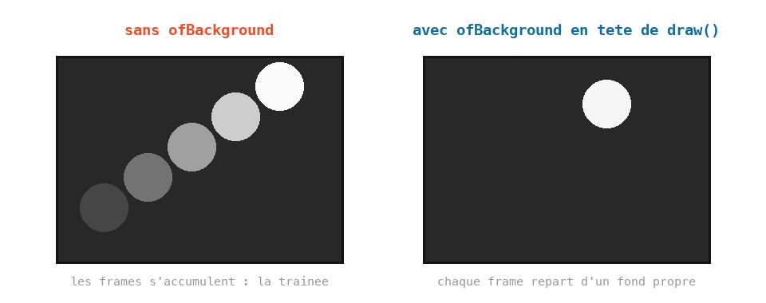

# Cours 05 — Le cycle setup / update / draw et la souris

> **Avant** : cours 04 (variables partagées dans le `.h`).
> **Comment travailler** : toujours dans `ofApp.h` et `ofApp.cpp`, par versions successives. `ofApp05.h` / `ofApp05.cpp` : la référence téléchargeable de l'état final.

Un cercle qui suit la souris. Le programme est minuscule — mais il met en place l'organisation qu'on gardera jusqu'à la fin de l'année : ce qui **change** va dans `update()`, ce qui **se dessine** va dans `draw()`.


## 1. Étape 1 — le programme entier

Il tient en quelques lignes. Dans `ofApp.h`, deux variables partagées :

```cpp
class ofApp : public ofBaseApp {
public:
	void setup();
	void update();
	void draw();

	float x { 0 };
	float y { 0 };
};
```

Dans `ofApp.cpp` :

```cpp
#include "ofApp.h"

void ofApp::setup() {
	ofSetWindowShape(400, 400);
}

void ofApp::update() {
	x = mouseX;
	y = mouseY;
}

void ofApp::draw() {
	ofBackground(255, 0, 0);
	ofSetColor(255);
	ofFill();
	ofDrawCircle(x, y, 50);
}
```

Un cercle blanc suit la souris sur fond rouge. Le cœur du cours est la répartition des rôles :


- `setup()` tourne **une fois**. Réglages.
- `update()` tourne **60 fois par seconde**. On y **calcule** : positions, vitesses, couleurs. Aucun ordre de dessin.
- `draw()` tourne juste après, 60 fois par seconde. On y **dessine**, à partir des variables calculées. On n'y modifie rien.

Rien ne t'empêche de tout mettre dans `draw()` — ça marcherait. Mais séparer rend le code lisible : quand un dessin est faux, tu sais si l'erreur est dans le **calcul** ou dans l'**affichage**. Toute la suite du cours respecte cette règle.

> **Essaie** : un décalage — `x = mouseX + 100;`. Le cercle suit la souris, cent pixels plus à droite.

## 2. Étape 2 — des variables qui traversent les frames

Regarde le trajet de `x` : **écrite** dans `update()`, **lue** dans `draw()`. Deux blocs différents — elle doit donc être partagée, déclarée dans le `.h` comme les listes du cours 04. Et elle est **persistante** : sa valeur reste d'une frame à la suivante. Ici on l'écrase à chaque frame, mais dès le cours 06, cette persistance permettra d'avancer *petit à petit* — c'est elle qui rend le mouvement possible.

`mouseX` et `mouseY` sont deux variables partagées fournies par openFrameworks, mises à jour toutes seules avant chaque `update()`.

> **Essaie** : le cercle ne suit que l'horizontale (`y` fixé à 200). Puis ajoute une variable partagée `float rayon` calculée dans `update()` : `rayon = mouseX / 4.0f;` — le cercle grossit vers la droite.

## 3. Étape 3 — effacer avant de redessiner

Fais l'expérience : **enlève** la ligne `ofBackground(255, 0, 0);` et bouge la souris. Les cercles s'accumulent en traînée — chaque frame dessine par-dessus les précédentes.

`ofBackground` peint toute la fenêtre : placé au **début** de `draw()`, il efface la frame précédente et on repart d'un fond propre. La traînée est parfois ce qu'on veut (le cours 18 s'en servira pour peindre), mais c'est un choix, pas un accident.



Au cours 01, `ofBackground` était dans `setup()` — ça marchait parce que rien ne bougeait. **Dès que quelque chose bouge, il va dans `draw()`.**

> **Essaie** : remets `ofBackground`, mais à la **fin** de `draw()`. Tout disparaît — pourquoi ? (L'ordre des lignes DANS `draw()` compte : on a peint le fond par-dessus le cercle.)

## 4. Relire le cours 00 avec les bons mots

Tu peux maintenant relire `ofApp00a.cpp` et tout nommer :

- `funnyFace` est une fonction à nous, annoncée dans le `.h`, avec deux paramètres.
- `draw()` efface avec `ofBackground(30)` puis dessine la tête à `(mouseX, mouseY)`.
- `update()` y était resté **vide** — tu sais maintenant à quoi il sert : c'est là que les nombres changent, et dès le cours 06 il fera bouger les choses tout seul.

## Exercices

1. **Lire avant de lancer** — décris ce que fait ce programme avant de le taper :

   ```cpp
   void ofApp::update() {
   	x = mouseX;
   	y = 300;
   }

   void ofApp::draw() {
   	ofBackground(30);
   	ofDrawCircle(x, y, mouseY / 4.0f);
   }
   ```

   Sur quelle trajectoire le cercle se déplace-t-il ? Qu'est-ce qui le fait grossir ?

2. **L'opposé** — le cercle va à l'inverse de la souris : souris à droite, cercle à gauche (et pareil verticalement). Indice : `ofGetWidth()` et `ofGetHeight()` donnent la taille de la fenêtre.

3. **Le kaléidoscope** — quatre cercles à la fois : la souris, son symétrique horizontal, son symétrique vertical, et le symétrique des deux. Bouge la souris : les quatre dansent ensemble.

4. **Le pinceau** *(plus costaud)* — enlève `ofBackground`, et fais de la traînée un outil : le cercle suit la souris, et son rayon vaut `mouseY / 10.0f` — plus la souris est basse, plus le trait est épais. Tu viens d'écrire ton premier logiciel de dessin.

## Ce qu'il faut retenir

- Le cycle : `setup()` une fois, puis `update()` (calculer) et `draw()` (dessiner), 60 fois par seconde.
- La règle d'organisation : les calculs dans `update()`, le dessin dans `draw()` — pour savoir où chercher les erreurs.
- Une variable du `.h` est partagée entre les blocs **et** persistante d'une frame à l'autre.
- `mouseX`, `mouseY` : la position de la souris, mise à jour toute seule.
- `ofBackground` en début de `draw()` efface la frame précédente. L'enlever = traînée, un choix à faire exprès.
