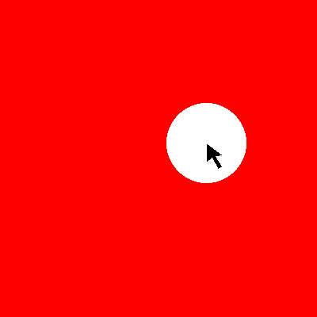
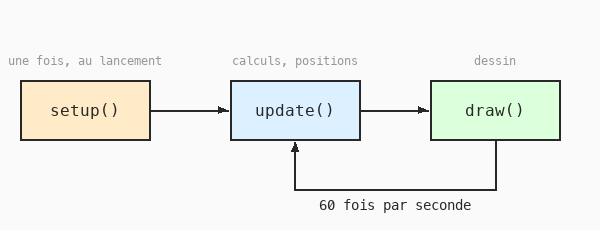

# Cours 05 — Le cycle setup / update / draw et la souris

> **Fichiers** : `ofApp05.h` + `ofApp05.cpp`
> **Avant** : cours 04 (variables partagées dans le `.h`).

Un cercle qui suit la souris. Le programme est minuscule, mais il met en place l'organisation qu'on gardera jusqu'à la fin : ce qui **change** va dans `update()`, ce qui **se dessine** va dans `draw()`.



## 1. Trois blocs, un cycle



```cpp
void ofApp::setup() {
	ofSetWindowShape(400, 400);
}

void ofApp::update() {
	x = mouseX;
	y = mouseY;
}

void ofApp::draw() {
	ofBackground(255, 0, 0);
	ofSetColor(255);
	ofFill();
	ofDrawCircle(x, y, 50);
}
```

- `setup()` tourne une fois. Réglages.
- `update()` tourne 60 fois par seconde. On y **calcule** : positions, vitesses, couleurs. Aucun ordre de dessin.
- `draw()` tourne juste après, 60 fois par seconde. On y **dessine**, à partir des variables calculées. On n'y modifie rien.

Rien ne t'empêche de tout mettre dans `draw()`, ça marcherait. Mais séparer les deux rend le code lisible : quand un dessin est faux, on sait si l'erreur est dans le calcul ou dans l'affichage. Toute la suite du cours respecte cette règle.

## 2. Des variables qui traversent les frames

```cpp
// dans ofApp05.h
float x = 0;
float y = 0;
```

`x` et `y` sont écrites dans `update()` et lues dans `draw()`. Deux blocs différents, donc elles doivent être partagées : déclarées dans le `.h`, comme les listes du cours 04. Elles sont aussi **persistantes** : leur valeur reste d'une frame à la suivante. C'est ce qui permettra au cours 06 de faire avancer une forme petit à petit.

`mouseX` et `mouseY` sont deux variables partagées fournies par openFrameworks, mises à jour toutes seules avant chaque `update()`.

## 3. Effacer avant de redessiner

```cpp
ofBackground(255, 0, 0);
```

`ofBackground` peint toute la fenêtre. Placé au début de `draw()`, il **efface** le dessin de la frame précédente. Enlève cette ligne et bouge la souris : les cercles s'accumulent et laissent une traînée. C'est parfois ce qu'on veut (on s'en servira au cours 18), mais la plupart du temps on repart d'un fond propre à chaque frame.

Au cours 01, `ofBackground` était dans `setup()`. Ça marchait parce que le dessin ne changeait jamais. Dès que quelque chose bouge, il doit être dans `draw()`.

## 4. Relire le cours 00 avec les bons mots

Tu peux maintenant relire `ofApp00a.cpp` et tout nommer :

- `funnyFace` est une fonction à nous, annoncée dans le `.h`, avec deux paramètres.
- `draw()` efface avec `ofBackground(30)` puis dessine la tête à `(mouseX, mouseY)`.
- `update()` y était resté **vide** — tu sais maintenant à quoi il sert : c'est là que les nombres changent, et dès le cours 06 il fera bouger les choses tout seul.

## Exercices

1. Fais suivre la souris par le cercle avec un décalage : `x = mouseX + 100;`.
2. Fais en sorte que le cercle ne suive que l'horizontale : `y` fixe à 200.
3. Retire `ofBackground` de `draw()` et observe. Puis remets-le et place-le à la **fin** de `draw()` : que vois-tu, et pourquoi ?
4. Le cercle doit se déplacer à l'opposé de la souris : quand la souris va à droite, il va à gauche. Indice : `ofGetWidth()` donne la largeur de la fenêtre.
5. Ajoute une variable partagée `float rayon` qui vaut `mouseX / 4.0f` : le cercle grossit quand la souris va à droite.

## Le code complet, pas à pas

Le programme entier, dans l'ordre des fichiers. Les blocs ci-dessous mis bout à bout donnent exactement `ofApp05.cpp`.

### Le fichier `ofApp05.h`

La table des matières du programme : les blocs qui existent et les variables partagées entre eux, avec leurs valeurs de départ.

```cpp
#pragma once
#include "ofMain.h"

// 05 - setup / draw et souris
// Sketch d'origine : Cours 1/03_Circle_follows_mouse
// Notions : cycle setup() / update() / draw(), position de la souris (mouseX, mouseY),
//           variables membres persistantes entre deux frames

class ofApp : public ofBaseApp {
public:
	void setup();
	void update();
	void draw();

	// Python : x = 0 / y = 0 en global, puis "global x, y" dans draw()
	// C++    : membres de la classe, visibles partout dans ofApp
	float x = 0;
	float y = 0;
};
```

### En tête du fichier `ofApp05.cpp`

L'inclusion du `.h`, qui rend visibles les variables partagées et les blocs déclarés.

```cpp
#include "ofApp05.h"
```

### Étape 1 — `setup()`

Exécuté une fois au lancement : la fenêtre, les chargements, les valeurs de départ.

```cpp
void ofApp::setup() {
	ofSetWindowShape(400, 400);
}
```

### Étape 2 — `update()`

Exécuté à chaque frame, avant le dessin : tout ce qui change.

```cpp
// Nouveau par rapport à Processing : la LOGIQUE va dans update(),
// le DESSIN va dans draw(). update() est appelée juste avant draw(), à chaque frame.
void ofApp::update() {
	// mouseX et mouseY sont des membres hérités de ofBaseApp,
	// mis à jour automatiquement par openFrameworks.
	x = mouseX;
	y = mouseY;
}
```

### Étape 3 — `draw()`

Exécuté à chaque frame, après `update()` : uniquement du dessin.

```cpp
void ofApp::draw() {
	// background(255, 0, 0) en Processing : efface l'écran à chaque frame.
	// Sans cet appel, les cercles des frames précédentes resteraient visibles.
	ofBackground(255, 0, 0);

	ofSetColor(255);
	ofFill();
	ofDrawCircle(x, y, 50);     // circle(x, y, 100) => rayon 50
}
```

## Ce qu'il faut retenir

- `setup()` une fois, puis `update()` et `draw()` en boucle 60 fois par seconde.
- `update()` calcule, `draw()` dessine. Pas de dessin dans `update()`, pas de calcul dans `draw()`.
- Une variable qui doit survivre d'une frame à l'autre, ou passer d'un bloc à l'autre, se déclare dans le `.h`.
- `ofBackground` en début de `draw()` efface la frame précédente.
- `mouseX`, `mouseY` : la souris. `ofGetWidth()`, `ofGetHeight()` : la taille de la fenêtre.
