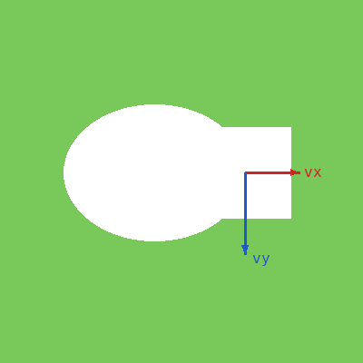
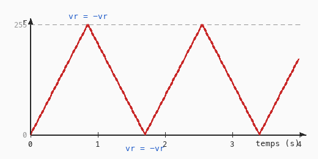

# Cours 06 — Animation : vitesse, rebond, conditions

> **Fichiers** : `ofApp06.h` + `ofApp06.cpp`
> **Avant** : cours 05 (update / draw, variables persistantes).

Deux formes qui traversent l'écran et rebondissent sur les bords, sur un fond dont la couleur change en continu. Trois idées nouvelles : une **vitesse**, le **temps** qui passe entre deux frames, et la **condition** `if` qui permet de réagir.



## 1. Bouger, c'est ajouter une vitesse à une position

```cpp
// dans le .h
float decalageX = 0;
float decalageY = 0;
float vx = 60;      // pixels par seconde
float vy = 120;
```

```cpp
// dans update()
float dt = ofGetLastFrameTime();
decalageX = decalageX + vx * dt;
decalageY = decalageY + vy * dt;
```

À chaque frame, la position augmente d'un peu. Comme `decalageX` est persistante (cours 05), les petits pas s'additionnent : la forme avance. Une vitesse positive va vers la droite ou vers le bas, une vitesse négative dans l'autre sens.

## 2. Le delta time

`ofGetLastFrameTime()` renvoie la durée de la frame précédente, en secondes : environ 0.0167 à 60 frames par seconde. On l'appelle `dt`, delta time, « petit intervalle de temps ».

Pourquoi multiplier la vitesse par `dt` au lieu d'écrire `decalageX = decalageX + 1` ? Parce que le nombre de frames par seconde n'est pas garanti. Sur une machine lente qui affiche 30 frames par seconde, `+ 1` par frame avance deux fois moins vite que sur une machine à 60. Avec `vx * dt`, la forme parcourt `vx` pixels par seconde quelle que soit la machine : si les frames sont deux fois plus rares, `dt` est deux fois plus grand, et chaque pas deux fois plus long.

Règle pour toute la suite : **une vitesse s'exprime en unités par seconde et se multiplie par `dt`**.

## 3. La condition `if` : le rebond

```cpp
if (decalageX > 250) vx = -vx;
if (decalageX < 0)   vx = -vx;
```

`if (condition) ordre;` : l'ordre n'est exécuté que si la condition est vraie. Ici : « si on a dépassé 250 vers la droite, inverse la vitesse horizontale ». `-vx` est l'opposé de `vx` : 60 devient -60, la forme repart vers la gauche. Quand elle repasse sous 0, l'autre `if` la renvoie vers la droite.

Les comparaisons : `<`, `>`, `<=`, `>=`, `==` (égal, avec **deux** signes), `!=` (différent). Attention à `==` : un seul `=` est l'affectation du cours 01, et `if (x = 5)` compile mais ne fait pas ce que tu crois.

Si plusieurs ordres dépendent de la condition, on les met entre accolades :

```cpp
if (decalageX > 250) {
	vx = -vx;
	decalageX = 250;
}
```

## 4. Une couleur qui fait des allers-retours



```cpp
r = r + vr * dt;
if (r >= 255) vr = -vr;
if (r <= 0)   vr = -vr;
```

Exactement le rebond, appliqué à une composante de couleur : `r` monte à la vitesse `vr`, rebondit à 255, redescend, rebondit à 0. Avec trois vitesses différentes pour `r`, `g` et `b`, le fond passe par des couleurs qui ne se répètent pas de sitôt.

Un nombre qui bouge dans le temps peut piloter **n'importe quoi** : une position, une taille, une couleur, une transparence. C'est la même mécanique.

## 5. Rectangle et ellipse

```cpp
ofDrawRectangle(decalageX + 100, decalageY + 100, 100, 100);
ofDrawEllipse(decalageX + 50, decalageY + 150, 200, 150);
```

- `ofDrawRectangle(x, y, largeur, hauteur)` : `(x, y)` est le coin **haut-gauche**.
- `ofDrawEllipse(x, y, largeur, hauteur)` : `(x, y)` est le **centre**, et on donne les deux diamètres.

Les deux formes sont dessinées par rapport au même décalage, donc elles bougent ensemble.

## Exercices

1. Double `vx`. Puis mets `vy` à 0. Puis donne des vitesses négatives au départ.
2. Fais rebondir sur les vrais bords de la fenêtre au lieu de 250 et 180. Il faudra tenir compte de la taille des formes.
3. Ajoute un cercle qui traverse l'écran de gauche à droite et **réapparaît à gauche** quand il sort, au lieu de rebondir. Un seul `if` suffit.
4. Fais grossir et rétrécir le rectangle : une variable `taille` qui fait des allers-retours entre 50 et 150.
5. Remplace le fond en allers-retours par la formule du cours 00 : `r = (cos(t * 1.5f) / 2 + 0.5f) * 255` avec `float t = ofGetElapsedTimef();` (le temps écoulé depuis le lancement, en secondes). `cos` oscille entre -1 et 1 ; `/ 2 + 0.5` le ramène entre 0 et 1 ; `* 255` entre 0 et 255. Le résultat est plus doux qu'une ligne droite. On y reviendra au cours 13.

## Le code complet, pas à pas

Le programme entier, dans l'ordre des fichiers. Les blocs ci-dessous mis bout à bout donnent exactement `ofApp06.cpp`.

### Le fichier `ofApp06.h`

La table des matières du programme : les blocs qui existent et les variables partagées entre eux, avec leurs valeurs de départ.

```cpp
#pragma once
#include "ofMain.h"

// 06 - Animation, vitesse, rebond, conditions
// Sketch d'origine : Cours 2022-2023/rendu01_pde
// Notions : vitesse et déplacement, if / rebond sur les bords, delta time,
//           animation de couleur, séparation update() / draw()

class ofApp : public ofBaseApp {
public:
	void setup();
	void update();
	void draw();

	// Position (décalage appliqué aux formes) et vitesse
	float decalageX = 0;
	float decalageY = 0;
	// Vitesses en PIXELS PAR SECONDE.
	// Le sketch Processing avançait de 1 et 2 pixels PAR FRAME (=> 60 et 120 px/s à 60 fps).
	float vx = 60;
	float vy = 120;

	// Couleur de fond et vitesses de variation (unités par seconde)
	float r = 0, g = 0, b = 0;
	float vr = 300, vg = 240, vb = 180;   // 5, 4, 3 par frame x 60
};
```

### En tête du fichier `ofApp06.cpp`

L'inclusion du `.h`, qui rend visibles les variables partagées et les blocs déclarés.

```cpp
#include "ofApp06.h"
```

### Étape 1 — `setup()`

Exécuté une fois au lancement : la fenêtre, les chargements, les valeurs de départ.

```cpp
void ofApp::setup() {
	ofSetWindowShape(400, 400);
}
```

### Étape 2 — `update()`

Exécuté à chaque frame, avant le dessin : tout ce qui change.

```cpp
void ofApp::update() {
	// Delta time : durée de la frame précédente, en secondes (~0.0167 à 60 fps).
	// Multiplier une vitesse par dt rend l'animation indépendante du framerate :
	// même vitesse visible sur une machine à 30 fps et sur une à 144 fps.
	float dt = ofGetLastFrameTime();

	// ---- Déplacement ----
	decalageX = decalageX + vx * dt;
	decalageY = decalageY + vy * dt;

	// ---- Rebonds : on inverse la vitesse quand on dépasse une limite ----
	if (decalageY > 180) vy = -vy;
	if (decalageY < -80) vy = -vy;
	if (decalageX > 250) vx = -vx;
	if (decalageX < 0)   vx = -vx;

	// ---- Couleur qui fait des allers-retours entre 0 et 255 ----
	r = r + vr * dt;
	if (r >= 255) vr = -vr;
	if (r <= 0)   vr = -vr;

	g = g + vg * dt;
	if (g >= 255) vg = -vg;
	if (g <= 0)   vg = -vg;

	b = b + vb * dt;
	if (b >= 255) vb = -vb;
	if (b <= 0)   vb = -vb;
}
```

### Étape 3 — `draw()`

Exécuté à chaque frame, après `update()` : uniquement du dessin.

```cpp
void ofApp::draw() {
	ofBackground(r, g, b);

	ofSetColor(255);
	ofFill();
	// rect(x, y, w, h) : coin haut-gauche, comme ofDrawRectangle par défaut
	ofDrawRectangle(decalageX + 100, decalageY + 100, 100, 100);
	// ellipse(x, y, w, h) : centrée, comme ofDrawEllipse
	ofDrawEllipse(decalageX + 50, decalageY + 150, 200, 150);
}
```

## Ce qu'il faut retenir

- Bouger = `position = position + vitesse * dt`, avec `dt = ofGetLastFrameTime()`.
- Les vitesses s'expriment en unités par seconde.
- `if (condition) ordre;` ou `if (condition) { ordres }`. Comparaisons `<`, `>`, `<=`, `>=`, `==`, `!=`.
- Rebondir = inverser la vitesse : `v = -v`.
- La même mécanique anime une position, une taille ou une couleur.
- `ofDrawRectangle` part du coin haut-gauche, `ofDrawEllipse` et `ofDrawCircle` du centre.
