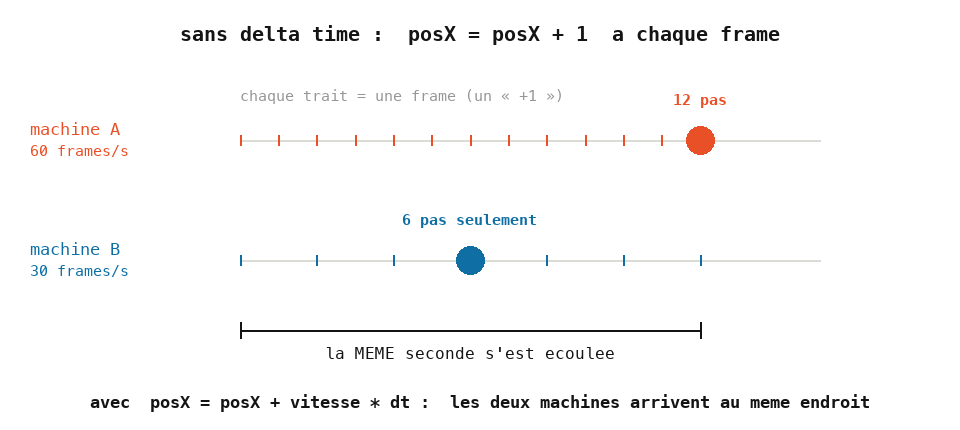
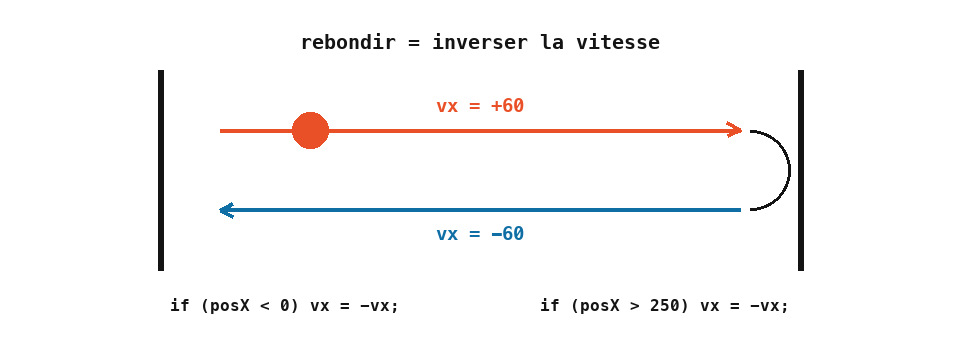

# Cours 06 — Animation : vitesse, rebond, conditions

> **Avant** : cours 05 (update / draw, variables persistantes).
> **Comment travailler** : toujours dans `ofApp.h` et `ofApp.cpp`, par versions successives. `ofApp06.h` / `ofApp06.cpp` : la référence téléchargeable de l'état final.

Deux formes qui traversent l'écran et rebondissent sur les bords, sur un fond dont la couleur change en continu. Trois idées nouvelles, une par étape : une **vitesse**, le **temps** entre deux frames, et la **condition** `if` qui permet de réagir.


## 1. Étape 1 — une forme qui avance

Dans `ofApp.h`, une position et une vitesse partagées :

```cpp
	float posX { 0 };
	float posY { 0 };
	float vx { 60 };      // pixels par seconde
	float vy { 120 };
```

Dans `ofApp.cpp` (fenêtre 400 × 400) :

```cpp
void ofApp::update() {
	float dt = ofGetLastFrameTime();
	posX = posX + vx * dt;
	posY = posY + vy * dt;
}

void ofApp::draw() {
	ofBackground(30);
	ofSetColor(255);
	ofFill();
	ofDrawRectangle(posX + 100, posY + 100, 100, 100);
	ofDrawEllipse(posX + 50, posY + 150, 200, 150);
}
```

Les deux formes glissent vers le bas à droite… puis sortent de l'écran. On règle ça à l'étape 3 — d'abord, comprends ce qui bouge.

**Bouger, c'est ajouter une vitesse à une position, à chaque frame.** Comme `posX` est persistante (cours 05), les petits pas s'additionnent. Vitesse positive : droite ou bas ; négative : l'inverse. Et les deux formes se dessinent par rapport à la **même** position `(posX, posY)`, donc elles bougent ensemble — le geste de `funnyFace` au cours 00.

Au passage, la deuxième forme est nouvelle : `ofDrawEllipse(x, y, largeur, hauteur)` — `(x, y)` est le **centre** et on donne les deux diamètres, alors que le rectangle part du coin haut-gauche.

> **Essaie** : double `vx`. Puis mets `vy` à 0. Puis des vitesses **négatives** au départ.

## 2. Étape 2 — le delta time

Reviens sur cette ligne :

```cpp
	float dt = ofGetLastFrameTime();
```

`ofGetLastFrameTime()` renvoie la **durée de la frame précédente**, en secondes — environ 0.0167 à 60 frames par seconde. On l'appelle `dt`, *delta time*, « petit intervalle de temps ».

Pourquoi multiplier la vitesse par `dt` au lieu d'écrire `posX = posX + 1` ? Parce que le nombre de frames par seconde n'est **pas garanti**. Sur une machine qui n'affiche que 30 frames par seconde, `+ 1` par frame avancerait deux fois moins vite. Avec `vx * dt`, la forme parcourt `vx` pixels par seconde quelle que soit la machine : si les frames sont deux fois plus rares, `dt` est deux fois plus grand, et chaque pas deux fois plus long.



Règle pour toute la suite : **une vitesse s'exprime en unités par seconde et se multiplie par `dt`.**

> **Essaie** : affiche `dt` dans la console (cours 04) et regarde les valeurs défiler. Sont-elles parfaitement régulières ?

## 3. Étape 3 — la condition `if` : le rebond

Complète `update()` :

```cpp
	if (posY > 180) vy = -vy;
	if (posY < -80) vy = -vy;
	if (posX > 250) vx = -vx;
	if (posX < 0)   vx = -vx;
```

Les formes rebondissent. `if (condition) instruction;` : l'instruction n'est exécutée que si la condition est vraie. Ici : « si on a dépassé 250 vers la droite, inverse la vitesse » — `-vx` fait de 60 un −60, la forme repart vers la gauche ; l'autre `if` la renverra.



Les comparaisons : `<`, `>`, `<=`, `>=`, `==` (égal, avec **deux** signes), `!=` (différent). Attention : un seul `=` est l'affectation du cours 01, et `if (x = 5)` **compile** mais ne fait pas ce que tu crois.

Plusieurs instructions sous une condition ? Des accolades :

```cpp
	if (posX > 250) {
		vx = -vx;
		posX = 250;
	}
```

> **Essaie** : fais rebondir sur les **vrais bords** de la fenêtre (il faudra tenir compte de la taille des formes). Puis ajoute un cercle qui traverse l'écran et **réapparaît à gauche** au lieu de rebondir — un seul `if` suffit.

## 4. Étape 4 — une couleur qui fait des allers-retours

Dans le `.h` :

```cpp
	float r { 0 }, g { 0 }, b { 0 };
	float vr { 300 }, vg { 240 }, vb { 180 };
```

Dans `update()`, puis remplace le fond de `draw()` par `ofBackground(r, g, b);` :

```cpp
	r = r + vr * dt;
	if (r >= 255) vr = -vr;
	if (r <= 0)   vr = -vr;
	// ... idem pour g avec vg, et b avec vb
```


C'est **exactement le rebond**, appliqué à une composante de couleur : `r` monte à la vitesse `vr`, rebondit sur 255, redescend, rebondit sur 0. Trois vitesses différentes pour `r`, `g`, `b` : le fond passe par des couleurs qui ne se répètent pas de sitôt.

La leçon dépasse la couleur : **un nombre qui bouge dans le temps peut piloter n'importe quoi** — position, taille, couleur, transparence. Même mécanique partout.

> **Essaie** : fais grossir et rétrécir le rectangle — une variable `taille` qui fait des allers-retours entre 50 et 150.

## Exercices

1. **Lire avant de lancer** — avec `posX { 0 }` et `vx { -100 }`, et ces deux conditions :

   ```cpp
   if (posX > 300) vx = -vx;
   if (posX < 100) vx = -vx;
   ```

   Dans quel sens la forme part-elle ? Que se passe-t-il au tout début ? Entre quelles bornes finit-elle par osciller ?

2. **L'écran de veille** — un carré qui rebondit sur les quatre vrais bords de la fenêtre, et qui change de couleur **à chaque rebond** (une couleur aléatoire tirée dans le `if` — cours 03). Le mythe du logo DVD, à toi.

3. **La course** — deux cercles partent du bord gauche à des vitesses différentes ; quand l'un sort à droite, il réapparaît à gauche. Regarde-les se doubler : au bout de combien de temps se retrouvent-ils alignés ?

4. **Le fond apaisé** *(plus costaud)* — remplace les allers-retours du fond par une formule plus douce : `r = (cos(t * 1.5f) / 2 + 0.5f) * 255;` avec `float t = ofGetElapsedTimef();` (le temps écoulé depuis le lancement, en secondes). `cos` oscille entre −1 et 1 ; `/ 2 + 0.5` le ramène entre 0 et 1 ; `* 255` entre 0 et 255. Compare avec les dents de scie — on expliquera tout au cours 13.

## Ce qu'il faut retenir

- Bouger = position persistante + vitesse × `dt`, à chaque frame dans `update()`.
- `dt` (`ofGetLastFrameTime()`) rend la vitesse indépendante de la machine : **unités par seconde**, toujours.
- `if (condition) instruction;` — comparaisons `<`, `>`, `<=`, `>=`, `==` (deux signes !), `!=` ; accolades pour plusieurs instructions.
- Rebondir = inverser la vitesse : `vx = -vx;`.
- Un nombre animé pilote n'importe quoi : position, taille, couleur, transparence.
- `ofDrawEllipse(x, y, largeur, hauteur)` : centre + diamètres ; le rectangle, lui, part du coin haut-gauche.
