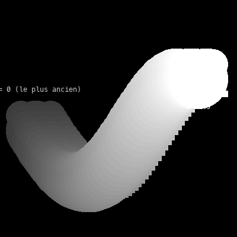

# Cours 07 — Traînée : mémoriser les positions précédentes

> **Avant** : cours 04 (`std::vector`), cours 05 (update / draw).
> **Comment travailler** : toujours dans `ofApp.h` et `ofApp.cpp`, par versions successives. `ofApp07.h` / `ofApp07.cpp` : la référence téléchargeable de l'état final.

Un ours suit la souris, et les cinquante positions précédentes restent affichées derrière lui. Deux outils nouveaux : écrire **nos propres fonctions**, et utiliser une liste comme **mémoire** des dernières frames.


## 1. Étape 1 — `bear()` : ta propre fonction

Depuis le cours 00 on utilise des fonctions fournies, comme `ofDrawCircle` — et on a lu `funnyFace`, une fonction fabriquée. Cette fois, tu écris la tienne. Un ours, c'est six cercles et un rectangle ; plutôt que de recopier ces sept lignes à chaque fois, on les range dans une **fonction** :

```cpp
// Un ours dessiné autour du point (x, y)
void ofApp::bear(float x, float y) {
	ofDrawCircle(x - 25, y - 25, 25);
	ofDrawCircle(x + 25, y - 25, 25);
	ofDrawCircle(x, y, 50);
	ofDrawCircle(x, y, 10);
	ofDrawCircle(x - 30, y - 20, 10);
	ofDrawCircle(x + 30, y - 20, 10);
	ofDrawRectangle(x, y + 20, 50, 10);
}

void ofApp::draw() {
	ofBackground(0);
	ofSetColor(255);
	ofFill();
	bear(mouseX, mouseY);
}
```

Et dans le `.h`, **annonce** la fonction — une ligne, sans le corps, sinon le compilateur ne connaît pas `bear` quand il lit `draw()` :

```cpp
	void bear(float x, float y);
```

Un ours suit la souris. Anatomie de la définition :

| Morceau | Rôle |
|---|---|
| `void` | la fonction ne renvoie rien, elle fait juste quelque chose |
| `ofApp::bear` | son nom (le `ofApp::` devant est obligatoire dans ce projet, comme pour `setup` et `draw`) |
| `float x, float y` | ses **paramètres** : deux nombres que celui qui appelle doit fournir |
| `{ ... }` | son corps : ce qu'elle fait |

Toutes les positions à l'intérieur sont écrites **par rapport à `(x, y)`** : `x - 25`, `y + 20`. C'est ce qui rend l'ours déplaçable — `bear(100, 100)` en dessine un autour de (100, 100). Exactement ce que faisait `funnyFace` au cours 00.

> **Essaie** : écris ta propre fonction `void etoile(float x, float y)` (ou n'importe quelle figure) et remplace l'ours.

## 2. Étape 2 — les paramètres sont des copies

Quand on appelle `bear(mouseX, mouseY)`, la fonction ne reçoit pas les variables de l'appelant : elle reçoit des **copies**. Ses cases `x` et `y` (cours 01) naissent à l'appel, reçoivent les valeurs copiées, et meurent à l'accolade fermante :

```
  chez l'appelant             dans bear
  +----------+    copie     +----------+
  |  mouseX  |  -------->   |    x     |     nait a l'appel,
  |   412    |              |   412    |     meurt a la fin
  +----------+              +----------+
```

Conséquence : modifier `x` à l'intérieur de `bear` ne change **pas** `mouseX` — une fonction ne peut pas abîmer les variables de son appelant, et chaque appel repart de cases neuves. C'est le **passage par valeur**. Quand une fonction devra *fabriquer* une valeur pour son appelant, elle la **renverra** avec `return` : tu le verras au cours 11 avec `filtre()`.

> **Essaie** : ajoute `x = 0;` en première ligne de `bear` — l'ours se fige à gauche, mais la souris (et `mouseX`) continue de vivre sa vie. La copie protège l'appelant.

## 3. Étape 3 — une liste comme mémoire : la file

Dans le `.h`, la position et deux listes partagées :

```cpp
	float x { 0 };
	float y { 0 };
	std::vector<float> xCoords;
	std::vector<float> yCoords;
```

Dans `update()` :

```cpp
void ofApp::update() {
	xCoords.push_back(x);                    // 1. mémoriser la position courante
	yCoords.push_back(y);

	if (xCoords.size() >= 50) {              // 2. borner la mémoire :
		xCoords.erase(xCoords.begin());      //    retirer la plus ancienne
		yCoords.erase(yCoords.begin());
	}

	x = mouseX;                              // 3. mettre à jour
	y = mouseY;
}
```

À l'écran, rien de neuf — la mémoire se remplit en coulisses. Affiche `xCoords.size()` dans la console (cours 04) : elle monte jusqu'à 50 et s'y stabilise.

À chaque frame : on **ajoute** la position courante à la fin, si la liste dépasse 50 on **retire le premier** élément (`erase(begin())` : « supprime l'élément d'indice 0 », les autres se décalent), puis on met à jour la position. L'ordre compte : mémoriser **avant** de mettre à jour, sinon la position courante serait en double.

Une liste où l'on ajoute à la fin et retire au début s'appelle une **file**. Bornée à 50, elle contient toujours les 50 dernières positions — ni plus, ni moins.

Dernier point : deux listes **parallèles**. `xCoords[i]` et `yCoords[i]` forment ensemble la position numéro `i` — il faut toujours les modifier ensemble.

> **Essaie** : change 50 en 10, puis en 200 (tu verras l'effet à l'étape 4). Puis, *plus fin* : ne mémorise qu'une frame sur deux — indice : une variable partagée `int compteur` et `%` (le reste de la division : `compteur % 2` vaut 0 une frame sur deux).

## 4. Étape 4 — dessiner toute la mémoire



Dans `draw()` :

```cpp
	for (int i = 0; i < xCoords.size(); i++) {
		bear(xCoords[i], yCoords[i]);
	}
	bear(x, y);
```

La boucle du cours 04 : un ours par position mémorisée. L'indice 0 est le plus **ancien**, `size() - 1` le plus récent. Puis l'ours courant, par-dessus.

Cinquante ours blancs identiques se fondent en une masse — c'est **exprès** : le cours 08 fera varier couleur, transparence et taille selon `i`, et la profondeur apparaîtra.

> **Essaie** : `ofSetColor(i * 5);` dans la boucle — un gris qui s'éclaircit vers les positions récentes. Premier aperçu du cours 08.

## Pour aller plus loin : une `struct`

Deux listes parallèles fonctionnent, mais c'est fragile : rien n'empêche d'oublier un `push_back` sur l'une des deux. C++ permet de **regrouper** plusieurs variables sous un seul nom avec une `struct` :

```cpp
struct Position {
	float x;
	float y;
};
```

Une `struct` est un type fabriqué par toi, et on accède à ses morceaux avec un point : `p.x`, `p.y` — la même syntaxe que `noms.size()` au cours 04.

### La `struct` en mémoire

En mémoire, les membres d'une `struct` vivent dans des **cases collées** (cours 01) : une `Position` occupe une case double, 2 × 4 octets. Et un `std::vector<Position>` aligne ces paires **bout à bout** — un seul ruban `x y x y x y…`, là où les deux listes parallèles faisaient deux rubans à garder synchronisés :

```
  Position p :          +-----+-----+
                        |  x  |  y  |       deux float colles : une case double
                        +-----+-----+

  vector<Position> :    +-----+-----++-----+-----++-----+-----+
                        |  x  |  y  ||  x  |  y  ||  x  |  y  | ...
                        +-----+-----++-----+-----++-----+-----+
                            [0]          [1]          [2]
```

`positions[i]` est la paire numéro `i` ; `positions[i].x` en ouvre le premier compartiment.

### La file, réécrite avec la `struct`

```cpp
// ofApp07.h :  struct Position { float x; float y; };
//              std::vector<Position> positions;     // UNE liste remplace les deux

void ofApp::update() {
	Position p;                              // une case double...
	p.x = x;  p.y = y;
	positions.push_back(p);                  // ...mémorisée d'un seul geste

	if (positions.size() >= 50) {
		positions.erase(positions.begin());  // un seul erase aussi
	}
	x = mouseX;  y = mouseY;
}

void ofApp::draw() {
	ofBackground(0);
	ofFill();
	ofSetColor(255);
	for (int i = 0; i < positions.size(); i++) {
		bear(positions[i].x, positions[i].y);
	}
	bear(x, y);
}
```

Un seul `push_back`, un seul `erase` : la file ne peut plus se désynchroniser. À l'écran, rien ne change — on a réécrit pour *nous*, plus sûr et plus lisible. Ce geste a un nom, **remanier** (*refactoring*), et tu le referas toute ta vie.

openFrameworks fournit `glm::vec2`, qui est exactement cette struct avec des opérations en plus : on pourrait remplacer `Position` par `glm::vec2` sans rien changer d'autre. Tu verras au cours 10 que les couleurs fonctionnent pareil : `c.r`, `c.g`, `c.b`.

## Exercices

1. **Lire avant de lancer** — la file est bornée à 5, et `draw()` contient :

   ```cpp
   for (int i = 0; i < xCoords.size(); i++) {
   	ofDrawCircle(xCoords[i], yCoords[i], 5 + i * 5);
   }
   ```

   Le plus gros cercle est-il sous la souris, ou en queue de traînée ? Réponds, puis vérifie.

2. **Le serpent réglable** — la longueur de la file dépend de la souris : on retire des éléments tant que `size()` dépasse `mouseX / 10`. Souris à gauche : serpent court ; à droite : long. Attention, il faudra peut-être retirer **plusieurs** éléments dans la même frame.

3. **Les deux traînées** — une deuxième file qui mémorise le point **opposé** à la souris (cours 05, exercice 2). Deux traînées miroir qui dansent ensemble.

4. **La constellation filante** *(plus costaud)* — combine 03, 04 et 07 : cinquante étoiles fixes (listes remplies dans `setup()`), plus une traînée qui suit la souris. Deux mémoires de natures différentes dans le même programme : l'une remplie une fois, l'autre entretenue à chaque frame.

## Autonomie

À partir de la traînée de ce cours, fabrique une **traînée évoluée** : chaque élément de la file doit avoir son propre aspect, qui dépend de sa place dans la file et du moment. Le cours 08 est le corrigé : ne l'ouvre qu'une fois ta version terminée.

Ce que tu as en main :

- **l'indice `i`** de la boucle de dessin, de 0 (le plus ancien) à la taille de la file moins 1 (le plus récent). Tout ce qui doit changer le long de la traînée se calcule à partir de lui ;
- **le temps** `ofGetElapsedTimef()`, en secondes, pour ce qui doit changer au fil du temps. Avec `cos`, il oscille (cours 06, exercice 5) ;
- **une fonction de dessin** à toi, comme `bear`, à laquelle tu ajoutes des paramètres : au minimum la position, l'indice et le temps.

Les paramètres sur lesquels jouer, à combiner comme tu veux :

| Paramètre | Idées |
|---|---|
| longueur de la file | 10, 25, 100 : la traînée est courte et nerveuse ou longue et fluide |
| taille selon `i` | plus petite à l'arrière et plus grosse à l'avant, ou l'inverse, ou qui ondule le long de la traînée |
| taille selon le temps | qui pulse ; plus fort à l'arrière qu'à l'avant |
| transparence selon `i` | le quatrième nombre de `ofSetColor` : de transparent à opaque le long de la traînée |
| remplissage et contour | deux passes (cours 02), avec des transparences opposées : l'un s'efface quand l'autre apparaît |
| couleur de base | animée par le temps, comme le fond du cours 06 (exercice 5) |
| couleur selon `i` | éclaircie ou assombrie vers l'avant, un canal qui monte le long de la traînée |
| forme | cercle, carré, l'ours, ou une alternance selon la parité de `i` |

Les contraintes :

- la logique reste dans `update()`, le dessin dans `draw()`, la forme dans une fonction ;
- tes nombres doivent rester dans leurs bornes : une taille ne devient pas négative, une composante de couleur reste entre 0 et 255. Avant d'écrire une formule, note la valeur qu'elle donne pour `i = 0` et pour le dernier `i` ;
- change **une seule chose à la fois**, lance, regarde, puis passe à la suivante.

## Ce qu'il faut retenir

- Définir une fonction : `void ofApp::nom(float a, float b) { ... }` — et **l'annoncer** dans le `.h`.
- Les paramètres sont des **copies** : la fonction ne peut pas abîmer les variables de l'appelant (passage par valeur).
- Une **file** : `push_back` à la fin + `erase(begin())` au début, bornée par un `if` sur `size()`.
- Mémoriser avant de mettre à jour — l'ordre des instructions dans `update()` compte.
- Deux listes parallèles = une donnée par indice ; à modifier toujours ensemble (la `struct` les fusionne).
