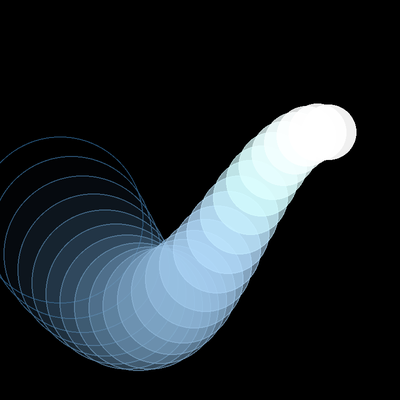

# Cours 08 — Traînée évoluée : couleur, transparence, taille

> **Fichiers** : `ofApp08.h` + `ofApp08.cpp`
> **Avant** : cours 07 (fonctions, file de positions), cours 06 (temps).

Ce cours est le **corrigé de l'Autonomie du cours 07**. C'est une solution possible, pas la seule : si la tienne fait autre chose et que les contraintes sont respectées, elle est aussi valable.

La traînée du cours 07, mais chaque élément a sa propre taille, sa propre transparence et sa propre teinte, calculées à partir de son **indice** dans la file et du **temps**. Rien de nouveau dans les outils : c'est un cours sur ce qu'on peut faire quand on combine ceux qu'on a.



## 1. Une fonction à sept paramètres

```cpp
void ofApp::forme(float x, float y, int i, float t, float r, float g, float b);
```

La fonction de dessin reçoit tout ce dont elle a besoin : la position, l'indice `i` de l'élément dans la file (0 = le plus ancien, 24 = le plus récent), le temps `t`, et une couleur de base. Dans `draw()` :

```cpp
for (int i = 0; i < prevX.size(); i++) {
	forme(prevX[i], prevY[i], i, t, r, g, b);
}
```

Le point important : **la fonction ne décide pas de son aspect toute seule, elle le déduit de `i` et de `t`**. Le même code dessine 25 cercles tous différents.

## 2. Un nombre qui dépend de l'indice

```cpp
float offset = i * 10;
```

`i` va de 0 à 24, donc `offset` va de 0 à 240. C'est la variable-clé du cours : tout ce qui doit changer le long de la traînée est calculé à partir d'elle.

```cpp
ofFill();
ofSetColor(r + offset, g + offset, b + offset, offset);
ofDrawCircle(x, y, tailleFinale / 2);

ofNoFill();
ofSetColor(r + offset, g + offset, b + offset, 255 - offset);
ofDrawCircle(x, y, tailleFinale / 2);
```

- Le remplissage a pour transparence `offset` : l'élément le plus ancien (`i = 0`) est invisible, le plus récent presque opaque.
- Le contour a pour transparence `255 - offset` : l'inverse. Les anciens n'ont qu'un contour, les récents un remplissage plein.
- La couleur est éclaircie de `offset` : les récents tirent vers le blanc.

Deux passes fill / contour, comme au cours 02, avec des transparences croisées : c'est ça qui donne l'effet de profondeur.

Une remarque pour plus tard : `r + offset` peut dépasser 255. Ici le sketch compte sur openFrameworks pour arrondir, mais ce n'est pas garanti. Au cours 11 on apprendra à **borner** proprement un nombre avec `ofClamp`.

## 3. Un nombre qui dépend du temps

```cpp
// dans update()
t = ofGetElapsedTimef();
r = (cos(t * 1.2f) / 2 + 0.5f) * 255;
g = (cos(t * 1.0f) / 2 + 0.5f) * 255;
b = (cos(t * 0.86f) / 2 + 0.5f) * 255;
```

`ofGetElapsedTimef()` : le temps écoulé depuis le lancement, en secondes. C'est l'autre façon d'animer, à côté de la vitesse du cours 06 : au lieu d'ajouter un pas à chaque frame, on **calcule directement** une valeur à partir du temps.

`cos(t)` oscille entre -1 et 1 quand `t` avance. `/ 2 + 0.5f` le ramène entre 0 et 1, `* 255` entre 0 et 255. Le nombre qui multiplie `t` est la vitesse d'oscillation : trois vitesses différentes pour r, g, b, et la couleur se promène sans jamais se répéter.

## 4. Combiner indice et temps

```cpp
float taille = (cos(i / 5.0f) + 5) * 20;
float variation = (cos(t * 1.2f) + 5) * 100;
float tailleFinale = taille + variation * (25 - i) / 50.0f;
```

- `taille` dépend de `i` : elle ondule le long de la traînée.
- `variation` dépend de `t` : elle pulse dans le temps.
- `(25 - i) / 50.0f` vaut 0.5 pour le plus ancien et presque 0 pour le plus récent : la pulsation est plus forte à l'arrière de la traînée.

Trois lignes, et chaque cercle a une taille qui dépend à la fois de sa place et du moment. Il n'y a pas de recette : on assemble des morceaux qui varient entre des bornes connues, et on regarde. Le `5.0f` et le `50.0f` sont là pour éviter la division entière (cours 01).

## 5. Ce que ce cours prépare

On a fabriqué une couleur avec trois cosinus. Ça marche, mais on ne contrôle rien : on ne sait pas quelle teinte vient ensuite, et la couleur passe par des gris. Le cours 09 donne un outil bien plus direct pour ça : décrire une couleur par sa **teinte**.

## Exercices

Les pistes proposées avec le sketch d'origine :

1. Améliore couleurs et contours de la traînée et du premier cercle.
2. Joue avec la transparence : que donne `offset / 2` à la place de `offset` ?
3. Joue avec les tailles : remplace `(25 - i)` par `i`.
4. Remplace le cercle par une fonction qui dessine une forme plus complexe (l'ours du cours 07, avec un paramètre de taille).
5. Utilise une condition pour varier les formes : un cercle pour `i` pair, un carré pour `i` impair (`i % 2 == 0`).

## Le code complet, pas à pas

Le programme entier, dans l'ordre des fichiers. Les blocs ci-dessous mis bout à bout donnent exactement `ofApp08.cpp`.

### Le fichier `ofApp08.h`

La table des matières du programme : les blocs qui existent et les variables partagées entre eux, avec leurs valeurs de départ.

```cpp
#pragma once
#include "ofMain.h"

// 08 - Traînée évoluée : couleur, transparence, taille
// Sketch d'origine : Cours 2024-2025/sketch_02_trail
// Notions : paramètres multiples, dégradé de transparence selon l'indice,
//           taille dépendant du temps et de l'indice, réutilisation de 07
// Variante écartée : sketch_02a_blqck_trail (identique, fond blanc et soustraction des couleurs)

class ofApp : public ofBaseApp {
public:
	void setup();
	void update();
	void draw();

	void forme(float x, float y, int i, float t, float r, float g, float b);

	std::vector<float> prevX;
	std::vector<float> prevY;
	float r = 0, g = 0, b = 0;
	float t = 0;
};
```

### En tête du fichier `ofApp08.cpp`

L'inclusion du `.h`, qui rend visibles les variables partagées et les blocs déclarés.

```cpp
#include "ofApp08.h"
```

### Étape 1 — `forme()`

i : indice dans la traînée (0 = le plus ancien). t : temps en secondes.

```cpp
// i : indice dans la traînée (0 = le plus ancien). t : temps en secondes.
void ofApp::forme(float x, float y, int i, float t, float r, float g, float b) {
	float offset = i * 10;

	// Taille de base qui ondule selon l'indice, plus une variation temporelle
	// plus forte pour les éléments anciens ((25 - i) / 25).
	float taille = (cos(i / 5.0f) + 5) * 20;
	float variation = (cos(t * 1.2f) + 5) * 100;
	float tailleFinale = taille + variation * (25 - i) / 50.0f;

	// Remplissage : couleur éclaircie et alpha croissant avec i
	ofFill();
	ofSetColor(r + offset, g + offset, b + offset, offset);
	ofDrawCircle(x, y, tailleFinale / 2);

	// Contour : alpha décroissant avec i
	ofNoFill();
	ofSetColor(r + offset, g + offset, b + offset, 255 - offset);
	ofDrawCircle(x, y, tailleFinale / 2);
}
```

### Étape 2 — `setup()`

Exécuté une fois au lancement : la fenêtre, les chargements, les valeurs de départ.

```cpp
void ofApp::setup() {
	ofSetWindowShape(800, 800);
	ofSetCircleResolution(64);
}
```

### Étape 3 — `update()`

Exécuté à chaque frame, avant le dessin : tout ce qui change.

```cpp
void ofApp::update() {
	t = ofGetElapsedTimef();
	// Le sketch Processing utilisait t en frames : cos(t / 50.0).
	// À 60 fps, t/50 frames == temps * 1.2 secondes.
	r = (cos(t * 1.2f) / 2 + 0.5f) * 255;
	g = (cos(t * 1.0f) / 2 + 0.5f) * 255;
	b = (cos(t * 0.86f) / 2 + 0.5f) * 255;

	prevX.push_back(mouseX);
	prevY.push_back(mouseY);
	if (prevX.size() > 25) {
		prevX.erase(prevX.begin());
		prevY.erase(prevY.begin());
	}
}
```

### Étape 4 — `draw()`

Exécuté à chaque frame, après `update()` : uniquement du dessin.

```cpp
void ofApp::draw() {
	ofBackground(0);

	for (int i = 0; i < prevX.size(); i++) {
		forme(prevX[i], prevY[i], i, t, r, g, b);
	}

	// Pistes d'amélioration proposées aux étudiants dans le sketch d'origine :
	// - améliorer couleurs et contours de la traînée et du premier cercle
	// - utiliser la transparence
	// - jouer avec les tailles
	// - remplacer le cercle par une fonction dessinant une forme plus complexe
	// - utiliser des conditions pour faire varier les formes
}
```

## Ce qu'il faut retenir

- Un élément d'une file est caractérisé par son indice `i`. Tout ce qui doit varier le long de la traînée se calcule depuis `i`.
- `ofGetElapsedTimef()` donne le temps en secondes ; `cos(t * vitesse)` oscille entre -1 et 1.
- `(cos(...) / 2 + 0.5f) * 255` : le motif pour ramener une oscillation entre 0 et 255.
- Transparences croisées (`offset` et `255 - offset`) sur deux passes donnent la profondeur.
- Une fonction de dessin qui reçoit `i` et `t` en paramètres dessine autant de variantes qu'on veut.
