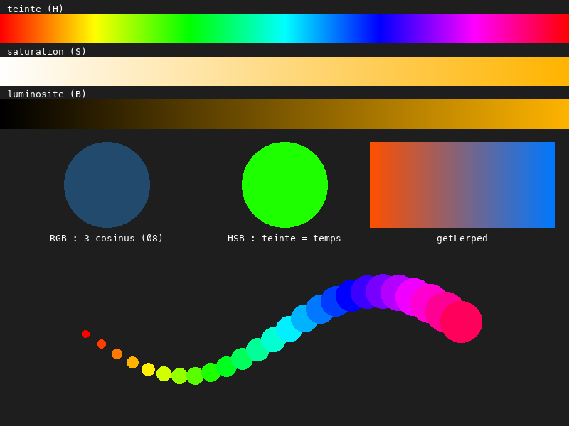
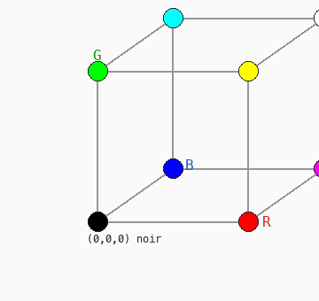
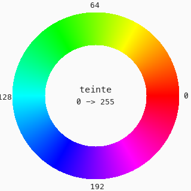

# Cours 09 — Couleur : RGB, HSB, dégradés

> **Fichiers** : `ofApp09.h` + `ofApp09.cpp`
> **Avant** : cours 08 (couleur animée par cosinus, traînée).

Depuis le cours 00, une couleur est trois nombres : rouge, vert, bleu. C'est ainsi que l'écran travaille, mais pas ainsi que nous **pensons** la couleur. Ce cours introduit une deuxième manière de la décrire, la teinte, et un type pour la manipuler comme une valeur : `ofColor`.



## 1. RGB : un cube



Une couleur RGB, c'est un point dans un cube : trois axes, rouge, vert, bleu, chacun de 0 à 255. Le noir est à l'origine, le blanc au sommet opposé, les couleurs pures sur les arêtes. Pratique pour l'écran, pénible pour l'humain : « la même couleur mais un peu plus claire » ou « la couleur suivante dans l'arc-en-ciel » ne se calculent pas simplement dans ce cube. C'est pour ça que le cours 08 bricolait trois cosinus.

## 2. HSB : une roue



HSB décrit une couleur comme on la nomme :

| Axe | Nom | 0 | 255 |
|---|---|---|---|
| H | **teinte** (hue) | rouge, puis en tournant : jaune, vert, cyan, bleu, magenta | et retour au rouge |
| S | **saturation** | gris | couleur pure |
| B | **luminosité** (brightness) | noir | couleur pleine |

La teinte est une **position sur une roue** : après 255 on revient à 0. « La couleur suivante dans l'arc-en-ciel » devient « teinte + 1 ». « Plus clair » devient « luminosité + 1 ».

Attention : en openFrameworks les trois axes vont de **0 à 255**, comme r, g, b. Dans d'autres logiciels la teinte est en degrés de 0 à 360. Ici, non.

## 3. `ofColor` : la couleur comme valeur

```cpp
ofColor depart(255, 80, 0);
ofSetColor(depart);
```

`ofColor` est un type qui contient une couleur entière. C'est une `struct` (cours 07) : elle regroupe quatre variables, `r`, `g`, `b`, `a`, accessibles avec un point : `depart.r` vaut 255. On peut la ranger dans une variable, la passer à `ofSetColor`, la transformer.

Pour fabriquer une couleur à partir de HSB :

```cpp
ofSetColor(ofColor::fromHsb(teinte, 255, 255));
```

`ofColor::fromHsb(h, s, b)` construit une `ofColor`. Le `::` se lit « de la famille `ofColor` » : c'est un outil rangé avec le type. Dans l'autre sens, `c.getHue()`, `c.getSaturation()` et `c.getBrightness()` lisent les trois axes HSB d'une couleur existante.

## 4. Trois bandes pour voir les axes

```cpp
for (int x = 0; x < largeur; x++) {
	float p = x / largeur * 255;      // 0 à gauche, 255 à droite
	ofSetColor(ofColor::fromHsb(p, 255, 255));
	ofDrawLine(x, 20, x, 60);
	ofSetColor(ofColor::fromHsb(teinteChoisie, p, 255));
	ofDrawLine(x, 80, x, 120);
	ofSetColor(ofColor::fromHsb(teinteChoisie, 255, p));
	ofDrawLine(x, 140, x, 180);
}
```

Une ligne verticale par pixel de large, et à chaque pixel on fait varier **un seul** des trois axes. La première bande parcourt toute la roue. Les deux autres montrent la saturation et la luminosité pour la teinte choisie par la souris. `ofDrawLine(x1, y1, x2, y2)` trace un trait entre deux points.

## 5. Animer une teinte

```cpp
float teinte = fmod(t * 40, 255);
ofSetColor(ofColor::fromHsb(teinte, 255, 255));
```

`t * 40` grandit sans fin. `fmod(a, b)` est le reste de la division de `a` par `b` pour des nombres à virgule : le résultat repart à 0 chaque fois qu'il atteint 255. La teinte fait le tour de la roue en un peu plus de six secondes, et le cercle passe par toutes les couleurs pures, dans l'ordre, sans jamais griser. Compare avec le cercle RGB à côté, piloté par les trois cosinus du cours 08.

## 6. Teinte selon l'indice

```cpp
for (int i = 0; i < prevX.size(); i++) {
	ofSetColor(ofColor::fromHsb(i * 10, 255, 255));
	ofDrawCircle(prevX[i], prevY[i], 5 + i);
}
```

La traînée du cours 08, en une ligne de couleur : la teinte est `i * 10`, la traînée est un arc-en-ciel. C'est le motif « nombre qui dépend de l'indice » du cours 08, avec le bon outil.

## 7. Dégradé : l'interpolation

```cpp
ofColor depart(255, 80, 0);
ofColor arrivee(0, 120, 255);
ofSetColor(depart.getLerped(arrivee, p));     // p entre 0 et 1
```

`getLerped` (linear interpolation) calcule la couleur qui se trouve à la proportion `p` entre les deux : `p = 0` donne `depart`, `p = 1` donne `arrivee`, `p = 0.5` le milieu. Dans le cube RGB, c'est une ligne droite entre deux points. Ce mot, interpoler, reviendra pour des positions, des tailles, tout ce qu'on veut faire passer doucement d'une valeur à une autre.

## Exercices

1. Reprends le rendu du cours 08 et remplace les trois cosinus par une teinte qui avance.
2. Fais tourner la teinte de la traînée avec le temps : `i * 10 + t * 40`. Il faudra `fmod`.
3. Compare le dégradé `getLerped` avec un dégradé fait en interpolant la teinte : `fromHsb(hDepart + (hArrivee - hDepart) * p, 255, 255)`. Lequel passe par le gris ?
4. Colore les cercles du cours 03 avec une teinte aléatoire, saturation et luminosité fixes. Compare avec trois `ofRandom` sur r, g, b : lequel donne des couleurs qui « vont ensemble » ?

## Le code complet, pas à pas

Le programme entier, dans l'ordre des fichiers. Les blocs ci-dessous mis bout à bout donnent exactement `ofApp09.cpp`.

### Le fichier `ofApp09.h`

La table des matières du programme : les blocs qui existent et les variables partagées entre eux, avec leurs valeurs de départ.

```cpp
#pragma once
#include "ofMain.h"

// 09 - Couleur : RGB, HSB, dégradés
// Nouveau : pas de sketch Processing d'origine
// Notions : ofColor comme valeur manipulable, espace RGB (un cube à trois axes) et espace HSB
//           (teinte / saturation / luminosité), ofColor::fromHsb, teinte selon le temps et
//           selon l'indice (relit la traînée de 08), interpolation entre deux couleurs (getLerped)

class ofApp : public ofBaseApp {
public:
	void setup();
	void update();
	void draw();

	std::vector<float> prevX;
	std::vector<float> prevY;
	float t = 0;
};
```

### En tête du fichier `ofApp09.cpp`

L'inclusion du `.h`, qui rend visibles les variables partagées et les blocs déclarés.

```cpp
#include "ofApp09.h"
```

### Étape 1 — `setup()`

Exécuté une fois au lancement : la fenêtre, les chargements, les valeurs de départ.

```cpp
void ofApp::setup() {
	ofSetWindowShape(800, 600);
	ofSetCircleResolution(64);
}
```

### Étape 2 — `update()`

Exécuté à chaque frame, avant le dessin : tout ce qui change.

```cpp
void ofApp::update() {
	t = ofGetElapsedTimef();

	// Même traînée qu'en 07 / 08 : 25 dernières positions de la souris
	prevX.push_back(mouseX);
	prevY.push_back(mouseY);
	if (prevX.size() > 25) {
		prevX.erase(prevX.begin());
		prevY.erase(prevY.begin());
	}
}
```

### Étape 3 — `draw()`

Exécuté à chaque frame, après `update()` : uniquement du dessin.

```cpp
void ofApp::draw() {
	ofBackground(30);
	float largeur = ofGetWidth();

	// ---- 1. Les trois axes de HSB, une bande par axe ----
	// Jusqu'ici une couleur = trois quantités de lumière (rouge, vert, bleu) : c'est l'espace RGB,
	// un cube dont les trois axes vont de 0 à 255. Pratique pour l'écran, pénible pour l'humain :
	// "la même couleur, un peu plus claire" ne se calcule pas facilement en RGB.
	// HSB décrit la couleur comme on la nomme : une teinte (position sur la roue des couleurs),
	// une saturation (du gris à la couleur pure) et une luminosité (du noir à la couleur pure).
	// ATTENTION : en openFrameworks les trois vont de 0 à 255, la teinte n'est pas en degrés.
	// ofColor::fromHsb(h, s, b) construit la couleur ; on lui passe le résultat à ofSetColor.
	float teinteChoisie = mouseX / largeur * 255;   // la souris choisit la teinte des bandes 2 et 3

	for (int x = 0; x < largeur; x++) {
		float p = x / largeur * 255;                   // 0 à gauche, 255 à droite

		// Teinte : on fait le tour de la roue, saturation et luminosité au maximum
		ofSetColor(ofColor::fromHsb(p, 255, 255));
		ofDrawLine(x, 20, x, 60);

		// Saturation : du gris (0) à la couleur pure (255), teinte fixée par la souris
		ofSetColor(ofColor::fromHsb(teinteChoisie, p, 255));
		ofDrawLine(x, 70, x, 110);

		// Luminosité : du noir (0) à la couleur pure (255)
		ofSetColor(ofColor::fromHsb(teinteChoisie, 255, p));
		ofDrawLine(x, 120, x, 160);
	}
	ofSetColor(255);
	ofDrawBitmapString("teinte (H)", 10, 15);
	ofDrawBitmapString("saturation (S)", 10, 68);
	ofDrawBitmapString("luminosite (B)", 10, 118);

	// ---- 2. Animer une couleur : la méthode de 08 contre HSB ----
	// En 08, trois cosinus déphasés sur r, g, b : ça bouge, mais on ne contrôle rien
	// (la couleur passe par des gris, des teintes sales, on ne sait pas laquelle vient après).
	float r = (cos(t * 1.2f) / 2 + 0.5f) * 255;
	float g = (cos(t * 1.0f) / 2 + 0.5f) * 255;
	float b = (cos(t * 0.86f) / 2 + 0.5f) * 255;
	ofSetColor(r, g, b);
	ofDrawCircle(150, 260, 60);

	// En HSB : la teinte avance avec le temps, saturation et luminosité restent pleines.
	// fmod est le modulo des float : la teinte repasse à 0 après 255 et fait le tour de la roue.
	float teinte = fmod(t * 40, 255);
	ofSetColor(ofColor::fromHsb(teinte, 255, 255));
	ofDrawCircle(400, 260, 60);

	// ---- 3. Dégradé entre deux couleurs : interpolation ----
	// depart.getLerped(arrivee, p) : p = 0 donne depart, p = 1 donne arrivee, 0.5 le milieu.
	// Chaque canal est interpolé séparément : c'est une droite dans le cube RGB.
	ofColor depart(255, 80, 0);
	ofColor arrivee(0, 120, 255);
	for (int x = 520; x < 780; x++) {
		float p = (x - 520) / 260.0f;
		ofSetColor(depart.getLerped(arrivee, p));
		ofDrawLine(x, 200, x, 320);
	}

	// ---- 4. Teinte selon l'indice : la traînée de 08 avec une seule ligne de couleur ----
	// 25 éléments x 10 = 250 : la traînée parcourt presque toute la roue
	for (int i = 0; i < prevX.size(); i++) {
		ofSetColor(ofColor::fromHsb(i * 10, 255, 255));
		ofDrawCircle(prevX[i], prevY[i], 5 + i);
	}

	// À retenir pour la suite (lecture d'une couleur existante, utilisé en 11) :
	//   c.getHue(), c.getSaturation(), c.getBrightness()   : lire les trois axes HSB d'un ofColor
	//   c.setHue(h)                                        : changer la teinte sans toucher au reste
	//   c.r, c.g, c.b                                      : les trois axes RGB (déjà vus en 06)
	// Comme une couleur est un point dans un cube, la distance entre deux couleurs se calcule
	// comme la distance entre deux points : Pythagore en 3D. On s'en servira en 12.

	// Exercices :
	// - reprendre le rendu de 08 et remplacer les trois cosinus par une teinte qui avance
	// - faire tourner la teinte de la traînée avec le temps (i * 10 + t * 40)
	// - dégradé entre deux couleurs en passant par HSB (interpoler la teinte) : comparer avec getLerped
}
```

## Ce qu'il faut retenir

- RGB est un cube (trois quantités de lumière), HSB une roue (teinte) plus deux réglages (saturation, luminosité). Les six nombres vont de 0 à 255.
- `ofColor` range une couleur dans une variable ; `c.r`, `c.g`, `c.b` sont ses composantes.
- `ofColor::fromHsb(h, s, b)` fabrique une couleur depuis HSB ; `c.getHue()` etc. lisent HSB depuis une couleur.
- `fmod(a, b)` : le reste de la division pour les `float`, pour faire boucler une valeur.
- `a.getLerped(b, p)` : la couleur à la proportion `p` entre `a` et `b`.
- Une couleur est un point à trois coordonnées : la distance entre deux couleurs se calcule comme entre deux points. On s'en servira au cours 12.
