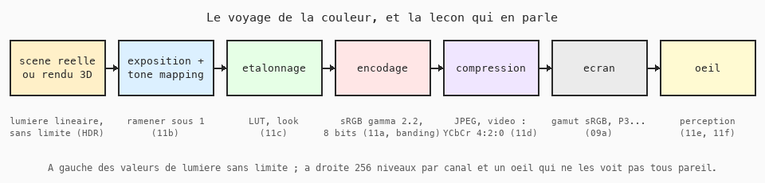
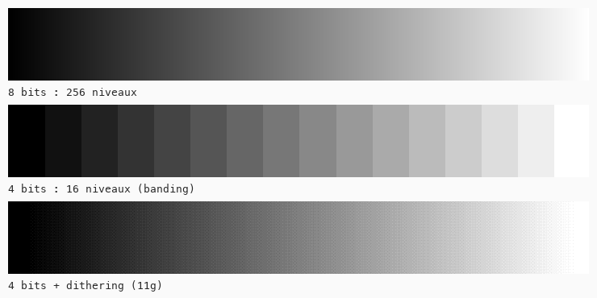
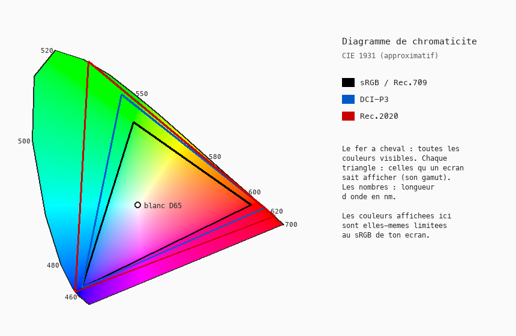

# Cours 09a — La couleur dans le jeu vidéo et le cinéma

> **Leçon sans code.** À lire après le cours 09, avant d'attaquer les images.
> Elle présente le trajet que suit une couleur, de la scène à ton œil, et annonce les sept leçons 11a à 11g qui en démontent chaque étape avec du code.

Le cours 09 a donné deux façons de décrire une couleur, RGB et HSB, toutes deux en nombres de 0 à 255. C'est suffisant pour dessiner. Ce n'est pas suffisant pour comprendre pourquoi une image paraît trop sombre une fois floutée, pourquoi le ciel d'un jeu montre des bandes, pourquoi un rouge n'est pas le même sur un téléphone et sur un moniteur, ou ce que veut dire le réglage « ACES » d'un moteur de jeu. Toutes ces questions tiennent au fait que **les 256 valeurs ne sont ni de la lumière, ni de la perception** : elles sont un codage entre les deux.

## 1. À gauche : de la lumière sans limite

Une scène réelle, ou une scène 3D calculée par un moteur, contient des quantités de lumière. Elles s'additionnent, se multiplient, et n'ont pas de plafond : le soleil est des milliers de fois plus lumineux qu'un mur à l'ombre. On parle de **HDR**, high dynamic range, grande étendue de luminosité. Dans cet espace, les calculs sont simples et justes : deux fois plus de lumière, c'est une multiplication par deux.

Mais un écran ne peut afficher que de 0 (noir) à 1 (son blanc maximum). Il faut donc **ramener** tout ce qui dépasse. Couper brutalement donne des taches blanches sans détail. Le **tone mapping** est la courbe qui écrase les hautes lumières en douceur, comme une pellicule photo. La courbe ACES qu'on trouve dans Unreal et Unity est l'une d'elles. C'est la leçon **11b**.

## 2. Au milieu : le codage

Une fois la lumière ramenée entre 0 et 1, on la stocke sur 8 bits, 256 valeurs par canal. Si ces 256 valeurs étaient réparties régulièrement en lumière, on gâcherait des niveaux dans les clairs, où l'œil ne distingue rien, et on en manquerait dans les sombres, où il distingue tout. On les répartit donc selon une courbe, dite **gamma** ou **sRGB**, qui donne plus de niveaux aux sombres. Conséquence : la valeur 128 ne représente pas la moitié de la lumière, mais environ 22 %.

Tant qu'on ne fait qu'afficher, on ne s'en aperçoit pas. Dès qu'on **calcule** sur ces valeurs, moyenne, flou, dégradé, transparence, le résultat est faux : trop sombre. La solution est de revenir en lumière linéaire pour calculer, puis de réencoder. C'est la leçon **11a**, la plus importante de la série, et la raison du réglage « Linear / Gamma » de tous les moteurs.

Avant l'encodage, on ajuste souvent le rendu par un **étalonnage** : contraste, ambiance chaude ou froide, look cinéma. L'outil universel pour ça est la **LUT**, une table qui dit pour chaque valeur d'entrée quelle valeur de sortie produire. Leçon **11c**.

### Profondeur de bits et banding

256 niveaux par canal, c'est juste assez pour qu'un dégradé paraisse continu, à condition qu'il soit bien réparti. Réduisez à 16 niveaux et des **bandes** apparaissent : c'est le banding, visible dans les ciels de certains jeux ou sur une vidéo trop compressée. Le HDR des téléviseurs modernes travaille sur 10 bits, 1 024 niveaux, précisément pour éviter ça sur une étendue de luminosité plus grande. Et il existe une astuce vieille comme l'imprimerie pour tromper l'œil avec peu de niveaux : le **dithering**, qui alterne deux valeurs voisines en une trame fine. Leçon **11g**.

## 3. La compression

Une image ou une vidéo est presque toujours compressée, et la compression connaît une faiblesse de l'œil : nous voyons la **luminance** finement, la **couleur** grossièrement. JPEG et toutes les vidéos séparent donc l'image en une luminance Y et deux canaux de couleur Cb et Cr, et réduisent la résolution des deux derniers de moitié ou plus. C'est le « 4:2:0 » des fiches techniques. Ça marche remarquablement bien, sauf sur un texte rouge sur fond bleu, qui bave. Leçon **11d**.

## 4. À droite : l'écran

Le fer à cheval du diagramme ci-dessus contient toutes les couleurs que l'œil humain peut voir. Un écran, lui, fabrique ses couleurs en mélangeant trois lumières, rouge, verte et bleue, et ne peut afficher que ce qui est **à l'intérieur du triangle** formé par ces trois lumières. Ce triangle est son **gamut**.

| Gamut | Où | Remarque |
|---|---|---|
| sRGB, identique à Rec.709 de la télévision HD | la plupart des moniteurs, le web, ce cours | le plus petit ; c'est ce que « RGB 0-255 » désigne implicitement |
| DCI-P3 | cinéma numérique, iPhone, Mac récents | un tiers plus grand, surtout dans les rouges et verts |
| Rec.2020 | télévision UHD et HDR | très grand ; aucun écran grand public ne le couvre entièrement |

Un même triplet `(255, 0, 0)` désigne le rouge **le plus saturé que l'écran sait faire**. Sur un écran P3, ce rouge est plus vif que sur un écran sRGB. Si une image faite pour l'un est affichée sur l'autre sans conversion, ses couleurs changent. C'est le travail de la **gestion de couleur** du système : savoir dans quel gamut une image a été créée pour l'afficher fidèlement. Quand elle n'est pas faite, ou mal, on voit des images délavées ou criardes d'un appareil à l'autre.

Note honnête : les couleurs de ce diagramme sont elles-mêmes affichées en sRGB, donc fausses hors du petit triangle. Aucun écran ne peut montrer le fer à cheval en entier.

## 5. Tout à droite : l'œil

Le dernier maillon n'est pas une machine. L'œil ne perçoit ni la lumière ni les valeurs sRGB de façon régulière. Un jaune et un bleu de même « luminosité » HSB n'ont pas du tout la même clarté perçue. Des espaces de couleur ont été construits pour que **la distance entre deux couleurs corresponde à ce que l'on perçoit** : Lab, et sa version moderne OKLab, adoptée par le CSS. Ils changent la façon de faire un dégradé ou une palette. Leçon **11e**.

Enfin, tous les yeux ne sont pas identiques. Environ 8 % des hommes ont une vision des couleurs déficiente, la plupart confondant rouges et verts. Un jeu dont une information n'est portée que par la couleur est injouable pour eux. Simuler leur vision se fait avec une matrice de neuf nombres, et la règle de conception qui en découle tient en une phrase. Leçon **11f**.

## Les sept leçons

| Leçon | Sujet | Ce qu'on code |
|---|---|---|
| 11a | Gamma et espace linéaire | dégradés, mélange, exposition juste |
| 11b | HDR et tone mapping | exposition, courbes clamp, Reinhard, ACES |
| 11c | LUT et étalonnage | tables de 256 valeurs, looks cinéma |
| 11d | YCbCr et compression | séparation luminance / couleur, sous-échantillonnage |
| 11e | Espaces perceptuels | OKLab, dégradés propres, palettes à clarté constante |
| 11f | Daltonisme | matrices de simulation, test d'interface |
| 11g | Palette et dithering | réduction à une palette, Bayer, Floyd-Steinberg |

Toutes utilisent la machine du cours 11 : une double boucle, une image source, une image résultat, et une formule par pixel. Elles peuvent se suivre dans l'ordre ou se piocher séparément, à l'exception de 11a qui est nécessaire à 11b, 11e et 11f.

## Ce qu'il faut retenir

- Les valeurs 0-255 ne sont ni de la lumière (elles suivent une courbe gamma) ni de la perception (l'œil n'est pas régulier non plus). Ce sont un codage.
- Calculer sur de la lumière linéaire, afficher en sRGB. Les moteurs de jeu travaillent ainsi.
- HDR : de la lumière sans plafond ; tone mapping : la courbe qui la ramène sous le blanc de l'écran.
- 8 bits suffisent tout juste ; trop peu de niveaux donne du banding, le dithering le masque.
- La compression sacrifie la résolution de la couleur, pas celle de la luminance.
- Un écran n'affiche que les couleurs de son gamut ; sRGB est le plus courant et le plus petit.
