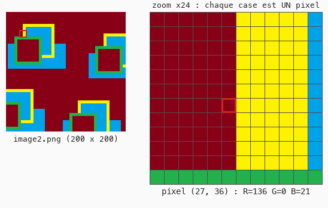

# Cours 10 — Image et pixel

> **Avant** : cours 09 (`ofColor`).
> **Comment travailler** : toujours dans `ofApp.h` et `ofApp.cpp`, par versions successives. `ofApp10.h` / `ofApp10.cpp` : la référence téléchargeable de l'état final. L'image `image2.png` (téléchargeable aussi) va dans le dossier `bin/data` de ton projet.

Jusqu'ici, tout venait de nos appels de dessin. On charge maintenant une image, on l'affiche — et surtout on **lit** la couleur d'un pixel. C'est la porte d'entrée de toute la suite du module.



## 1. Une image est un tableau de pixels

Une image chargée est une **grille** : `largeur × hauteur` cases, une couleur par case. Même repère que l'écran : `(0, 0)` en haut à gauche, `y` vers le bas. Un « bord », un « objet » dans l'image, ça n'existe pas pour l'ordinateur : juste des cases de couleurs différentes. `image2.png` fait 200 × 200 : 40 000 pixels, de `(0, 0)` à `(199, 199)`.

## 2. Étape 1 — charger, vérifier, afficher

Dans `ofApp.h` :

```cpp
	ofImage img;
```

Dans `ofApp.cpp` :

```cpp
void ofApp::setup() {
	ofSetWindowShape(200, 200);

	bool ok = img.load("image2.png");
	if (!ok) {
		ofLogError() << "image2.png introuvable dans bin/data";
	}
}

void ofApp::draw() {
	ofSetColor(255);
	img.draw(0, 0);
}
```

L'image s'affiche. Trois choses à savoir :

- Les images vont dans **`bin/data`**, jamais à côté du `.cpp` : le chemin de `load` est relatif à ce dossier.
- `bool` est un type qui ne vaut que `true` ou `false` ; le `!` se lit « non ». **Toujours vérifier** le chargement : une image introuvable ne provoque aucune erreur visible, juste une fenêtre vide — et on cherche longtemps. (`ofLogError()` s'utilise comme `std::cout`, mais marque le message comme erreur dans la console.)
- Le `ofSetColor(255)` avant `img.draw` n'est pas décoratif : sans lui, l'image est **teintée** par la dernière couleur utilisée.

> **Essaie** : charge `pandaroux.jpg` à la place, et adapte la fenêtre à l'image : `ofSetWindowShape(img.getWidth(), img.getHeight());` **après** le chargement.

## 3. Étape 2 — lire un pixel, et le montrer

Complète `draw()` :

```cpp
	int px = ofClamp(mouseX, 0, img.getWidth() - 1);
	int py = ofClamp(mouseY, 0, img.getHeight() - 1);
	ofColor c = img.getColor(px, py);

	std::string texte = "R=" + ofToString(c.r) + " G=" + ofToString(c.g)
	                  + " B=" + ofToString(c.b);
	ofSetColor(255, 200, 0);
	ofDrawBitmapString(texte, 10, 10);

	ofSetColor(c);
	ofDrawRectangle(mouseX + 10, mouseY + 10, 20, 20);
```

Promène la souris : les valeurs RGB du pixel défilent, et un petit carré prend sa couleur.

- `img.getColor(x, y)` renvoie la couleur du pixel `(x, y)` — une `ofColor` (cours 09), qu'on range dans une variable.
- `ofClamp(v, min, max)` **borne** une valeur : la souris peut sortir de l'image, la coordonnée lue, non. C'est le problème d'indice du cours 04, en deux dimensions — dernier pixel : `largeur - 1`.
- Tu lis l'image **comme un tableau de nombres**. Toute la suite du module tient dans cette phrase.

> **Essaie** : affiche aussi la **luminosité** du pixel : `(c.r + c.g + c.b) / 3` — attention à la division entière si tu veux une virgule. Puis fais dépendre la **taille** du carré de cette luminosité.

## 4. Lire l'image, pas l'écran

Un point de vocabulaire important : `getColor` lit **l'image chargée**, pas ce qui est affiché. Le carré jaune dessiné par-dessus est invisible pour elle. L'image est une **source de données stable** — on peut dessiner ce qu'on veut à l'écran sans jamais l'abîmer. (Le cours 12 exploitera précisément cette stabilité.)

## Exercices

1. **La pipette complète** — en plus du RGB, affiche la **teinte** du pixel (`c.getHue()`), et dessine un second carré de sa couleur « pure » : `ofColor::fromHsb(c.getHue(), 255, 255)`. Compare les deux carrés sur les zones sombres de l'image.

2. **Le duo teinté** — affiche l'image deux fois côte à côte (fenêtre deux fois plus large), la deuxième teintée en rouge par `ofSetColor(255, 100, 100)` avant son `draw`.

3. **La jauge** — un rectangle horizontal en haut de la fenêtre, dont la **largeur** vaut la luminosité du pixel sous la souris (0 à 255 pixels). L'image devient un instrument de mesure.

4. **Le scanner** *(plus costaud)* — une boucle `for` sur `x` : pour chaque colonne, lis le pixel `(x, mouseY)` et trace un trait vertical de sa couleur sur toute la hauteur (`ofDrawLine(x, 0, x, 200)`). Monte et descends la souris : tu « scannes » l'image ligne par ligne. C'est déjà, presque, la boucle du cours 11.

## Ce qu'il faut retenir

- Une image = une grille de pixels, même repère que l'écran ; les fichiers vont dans `bin/data`.
- `bool ok = img.load(...)` — **toujours vérifier**, avec `if (!ok)`.
- `img.getColor(x, y)` → une `ofColor` ; rester dans `[0, largeur - 1]` grâce à `ofClamp(v, min, max)`.
- `ofSetColor(255)` avant d'afficher une image, sinon elle est teintée.
- On lit l'**image**, pas l'écran : dessiner par-dessus ne change pas les données.
