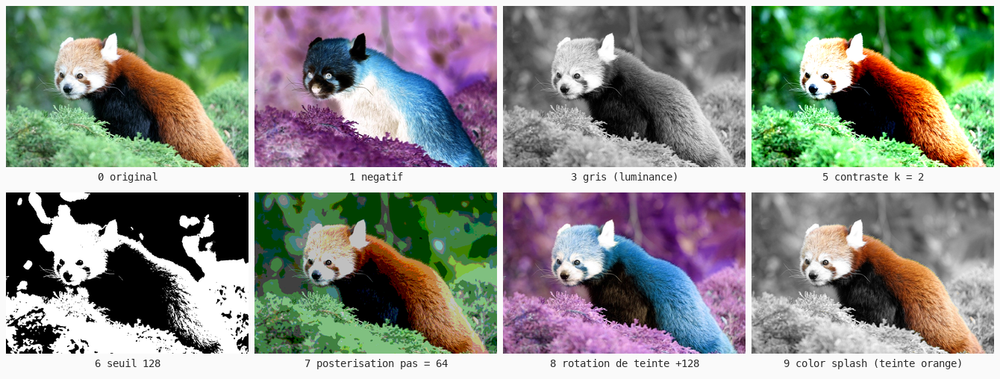
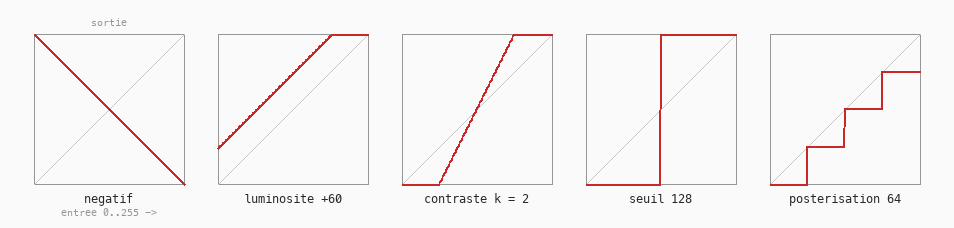

# Cours 11 — Filtres : transformer chaque pixel

> **Avant** : cours 10 (lire un pixel), cours 09 (HSB).
> **Comment travailler** : toujours dans `ofApp.h` et `ofApp.cpp`, par versions successives. `ofApp11.h` / `ofApp11.cpp` : la référence téléchargeable de l'état final. `pandaroux.jpg` va dans `bin/data`.

Un filtre, c'est une règle : « pour chaque pixel, remplace sa couleur par f(couleur) ». Dix règles différentes, **une même machine** qui les applique. Touches 0 à 9 pour choisir l'effet, souris pour son paramètre. C'est le cours le plus important du module : sa double boucle reviendra dans tous les suivants.



## 1. Étape 1 — deux images, jamais une

Dans `ofApp.h` :

```cpp
	ofImage source;
	ofImage resultat;
	int   effet { 0 };
	float parametre { 0.5f };
```

Dans `setup()` :

```cpp
	ofSetWindowShape(774, 516);
	if (!source.load("pandaroux.jpg")) {
		ofLogError() << "pandaroux.jpg introuvable dans bin/data";
	}
	resultat.allocate(source.getWidth(), source.getHeight(), OF_IMAGE_COLOR);
```

On lit dans la **source**, on écrira dans le **résultat** — on ne modifie jamais la source. Sinon, changer d'effet partirait d'une image déjà transformée, et deux négatifs ne redonneraient pas l'original. `allocate` réserve une image vide de la bonne taille, en couleur.

> **Essaie** : affiche `source.getWidth()` et `getHeight()` dans la console — combien de pixels au total ?

## 2. Étape 2 — la machine : une boucle dans une boucle

Le cœur du cours. Dans `update()`, puis `resultat.draw(0, 0);` dans `draw()` (avec `ofSetColor(255)` avant) :

```cpp
void ofApp::update() {
	parametre = mouseX / (float)ofGetWidth();      // 0 à gauche, 1 à droite

	for (int y = 0; y < source.getHeight(); y++) {      // chaque ligne...
		for (int x = 0; x < source.getWidth(); x++) {   // ...chaque colonne
			ofColor c = source.getColor(x, y);
			resultat.setColor(x, y, filtre(c, parametre));
		}
	}
	resultat.update();     // envoyer les nouveaux pixels à la carte graphique
}
```

Et pour que ça compile, donne à la machine une recette **provisoire** — le filtre qui ne fait rien :

```cpp
// dans le .h :  ofColor filtre(ofColor c, float p);
ofColor ofApp::filtre(ofColor c, float p) {
	return c;
}
```

L'image s'affiche, identique — mais chaque pixel est **passé dans ta fonction**. Ce qui est nouveau :

- Une boucle **dans** une boucle : pour chaque ligne `y`, on parcourt chaque colonne `x`. Le corps tourne `largeur × hauteur` fois — 774 × 516 = 399 384 fois **par frame**. C'est LE motif de tout le reste du module.
- `resultat.setColor(x, y, ...)` écrit un pixel en mémoire ; `resultat.update()` envoie la nouvelle image à la carte graphique — sans lui, `draw()` affiche l'ancienne version.
- `mouseX / (float)ofGetWidth()` : le `(float)` **convertit** la largeur en nombre à virgule, pour éviter la division entière du cours 01.

> **Essaie** : dans `filtre`, remplace `return c;` par `return ofColor(255, 0, 0);` — l'image entière devient rouge. La preuve que la machine visite bien **chaque** pixel.

## 3. Étape 3 — l'octet, la petite case qui reboucle

Avant d'écrire de vraies recettes, un détour indispensable par la mémoire (cours 01).

```cpp
float r = c.r;
float g = c.g;
float b = c.b;
```

Les composantes d'une `ofColor` sont des `unsigned char` : la plus petite case de la mémoire, **un seul octet** (8 bits, donc 2⁸ = 256 valeurs, de 0 à 255 — `unsigned` : sans signe). La grande case du cours 01 (`float`, 4 octets) serait un luxe : l'écran ne connaît que 256 niveaux par canal, et une `ofColor` tient ainsi en trois octets collés — la `struct` du cours 07 :

```
  ofColor c :   +-----+-----+-----+
                | r   | g   | b   |      trois octets colles : c.r, c.g, c.b
                | 250 | 80  | 32  |
                +-----+-----+-----+
```

Mais la petite case déborde vite : au-delà de 255, le compteur **reboucle**, comme un compteur kilométrique qui repasse à zéro.

```
  ... 253  254  255 -> 0  1  2 ...        250 + 10 = 4, pas 260 !
```

Un filtre « luminosité + 60 » sur un pixel clair donnerait donc des taches noires.

La règle : on **copie dans des `float`**, on calcule, puis on borne avec `ofClamp(valeur, 0, 255)` avant de reconstruire la couleur :

```cpp
float k = (p - 0.5f) * 256;
return ofColor(ofClamp(r + k, 0, 255), ofClamp(g + k, 0, 255), ofClamp(b + k, 0, 255));
```

> **Essaie** : vérifie le rebouclage dans la console — `unsigned char uc = 250; uc = uc + 10; std::cout << (int)uc << std::endl;` (le `(int)` force l'affichage en nombre plutôt qu'en caractère).

## 4. Étape 4 — les premières recettes : `switch` et `return`

Remplace le corps de `filtre()` :

```cpp
ofColor ofApp::filtre(ofColor c, float p) {
	float r = c.r;                       // copier en float AVANT de calculer
	float g = c.g;
	float b = c.b;
	float luminance = 0.299f * r + 0.587f * g + 0.114f * b;

	switch (effet) {

	case 1:                              // négatif : chaque canal retourné
		return ofColor(255 - r, 255 - g, 255 - b);

	case 2: {                            // gris : les trois canaux égaux
		float gris = (r + g + b) / 3;
		return ofColor(gris, gris, gris);
	}

	case 3:                              // un seul nombre = un gris
		return ofColor(luminance);

	default:
		return c;                        // 0 : image d'origine
	}
}
```

Trois nouveautés de langage :

- La fonction commence par `ofColor`, pas `void` : elle **renvoie** une valeur. `return` donne le résultat et termine la fonction — un pixel entre, un pixel sort. C'est la définition même d'un filtre. (Et souviens-toi du cours 07 : `c` est une **copie**, la source est intouchable.)
- `switch (variable)` compare la variable à chaque `case` et saute au bon — un `if` à plusieurs branches, plus lisible que dix `if`. `default` est la branche « aucun des cas ». Un `case` qui déclare une variable prend des accolades.
- Deux gris différents : la **moyenne**, et la **luminance** — l'œil est plus sensible au vert, un vert pur paraît plus clair qu'un bleu pur. Les coefficients 0.299 / 0.587 / 0.114 viennent de là.

> **Essaie** : ajoute un `case` à toi — l'échange de canaux `return ofColor(g, b, r);`, puis un canal isolé `return ofColor(r, 0, 0);`.

## 5. Étape 5 — le clavier

Pour choisir l'effet en direct, un nouveau bloc, à annoncer dans le `.h` (`void keyPressed(int key);`) :

```cpp
void ofApp::keyPressed(int key) {
	if (key >= '0' && key <= '9') {
		effet = key - '0';
	}
}
```

`keyPressed` est appelé automatiquement à chaque touche pressée — comme `update` et `draw`, c'est openFrameworks qui l'appelle. `key` est le **code** du caractère : `'0'` vaut 48, `'1'` 49… d'où la soustraction `key - '0'` qui transforme le code en chiffre. Le `&&` se lit « et » : les deux conditions doivent être vraies.

> **Essaie** : affiche l'effet courant dans la fenêtre avec `ofDrawBitmapString`, pour savoir où tu en es.

## 6. Étape 6 — les formules paramétrées

Les recettes suivantes utilisent `p`, le paramètre piloté par la souris (0 à 1) :

```cpp
	case 4: {                            // luminosité : tout monte ou descend
		float k = (p - 0.5f) * 256;
		return ofColor(ofClamp(r + k, 0, 255), ofClamp(g + k, 0, 255),
		               ofClamp(b + k, 0, 255));
	}
	case 5: {                            // contraste : écarter du gris moyen
		float k = p * 3;
		return ofColor(ofClamp((r - 128) * k + 128, 0, 255),
		               ofClamp((g - 128) * k + 128, 0, 255),
		               ofClamp((b - 128) * k + 128, 0, 255));
	}
	case 6:                              // seuil : noir ou blanc, rien entre
		if (luminance < p * 255) return ofColor(0);
		else                     return ofColor(255);

	case 7: {                            // postérisation : arrondir à un multiple
		float pas = 8 + p * 120;
		return ofColor(floor(r / pas) * pas, floor(g / pas) * pas, floor(b / pas) * pas);
	}
```



Chaque filtre est une petite formule ; les courbes ci-dessus montrent, pour chaque valeur d'entrée, la valeur de sortie :

| Effet | Formule | Ce qui se passe |
|---|---|---|
| Luminosité | `c + k` | tout monte ou descend d'un même cran |
| Contraste | `(c - 128) * k + 128` | on écarte (`k > 1`) ou rapproche (`k < 1`) du gris moyen |
| Seuil | noir si `luminance < s`, blanc sinon | deux valeurs, rien entre |
| Postérisation | `floor(c / pas) * pas` | arrondi à un multiple : moins de niveaux, des aplats |

La postérisation utilise la **division entière** du cours 01 — cette fois volontairement. Et partout, la règle de l'étape 3 : calcul en `float`, `ofClamp`, reconstruction.

> **Essaie** : invente ta courbe — par exemple le négatif du rouge seul : `return ofColor(255 - r, g, b);`. Décris son effet avant de lancer.

## 7. Étape 7 — les filtres qui passent par HSB

```cpp
	case 8: {   // rotation de teinte : tout se décale sur la roue
		float teinte = fmod(c.getHue() + p * 255, 255);
		return ofColor::fromHsb(teinte, c.getSaturation(), c.getBrightness());
	}
	case 9: {   // color splash : couleur gardée autour d'une teinte cible
		float cible = p * 255;
		float ecart = fabs(c.getHue() - cible);
		if (ecart > 127) ecart = 255 - ecart;   // la roue est circulaire !
		if (ecart < 20) return c;
		return ofColor(luminance);
	}
```

- La **rotation de teinte** : lire la teinte, l'augmenter, boucler avec `fmod`, reconstruire. Une ligne en HSB — pratiquement impossible à écrire en RGB. C'est pour ce genre de filtre qu'on a fait le cours 09.
- Le **color splash** : la couleur n'est gardée qu'autour d'une teinte cible, tout le reste passe en gris. `fabs` est la valeur absolue des `float`, et le `if (ecart > 127)` gère la roue circulaire — les teintes 250 et 5 sont voisines.

> **Essaie** : affiche la teinte seule en niveaux de gris — `return ofColor(c.getHue());`. Puis la saturation, puis la luminosité. Tu **vois** les trois axes du cours 09 sur une vraie photo.

## Exercices

1. **Lire avant de lancer** — que fait le filtre `return ofColor(ofClamp((r - 128) * 8 + 128, 0, 255), ...)` (même formule sur les trois canaux) ? Décris l'image obtenue, puis vérifie avec le contraste poussé à fond.

2. **Le sépia** — chaque canal de **sortie** mélange les trois canaux d'**entrée** : `r' = 0.393 r + 0.769 g + 0.189 b`, `g' = 0.349 r + 0.686 g + 0.168 b`, `b' = 0.272 r + 0.534 g + 0.131 b`. Ajoute-le comme effet. (Retiens sa forme — neuf coefficients — elle a un nom qu'on découvrira dans le bloc couleur avancée : une matrice.)

3. **Le gamma** — `255 * pow(r / 255.0f, k)` sur chaque canal, avec `k` allant de 0.3 à 3 selon la souris. Compare avec la luminosité (case 4) : lequel des deux préserve les noirs ?

4. **Le chromakey** *(plus costaud)* — charge une deuxième image de même taille ; si la teinte du pixel est proche du vert, renvoie le pixel de l'autre image à la place. Le fond vert du cinéma, en une dizaine de lignes.

## Ce qu'il faut retenir

- Deux images : lire la **source**, écrire le **résultat** — jamais l'inverse, jamais une seule.
- La machine : double boucle `for (y) for (x)` sur tous les pixels + `setColor` + `resultat.update()`. Elle revient dans **tous** les cours suivants.
- Les composantes d'`ofColor` sont des **octets** (0-255, reboucle au-delà) : copier en `float`, calculer, `ofClamp`, reconstruire.
- Une fonction peut **renvoyer** une valeur : type de retour à la place de `void`, `return` pour livrer le résultat.
- `switch` / `case` / `default` : un aiguillage lisible ; `keyPressed(int key)` : le clavier, avec `key - '0'`.
- Les filtres HSB (rotation de teinte, color splash) : la récompense du cours 09.
