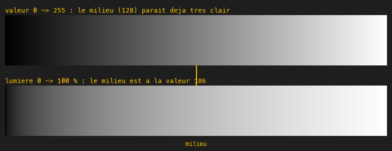
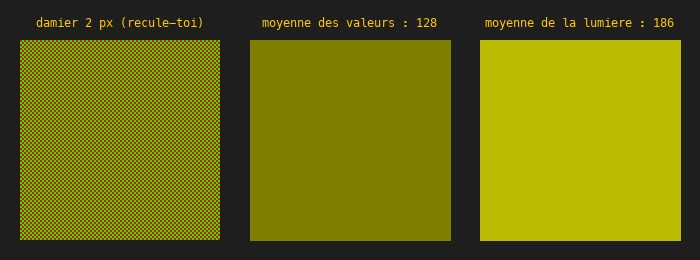
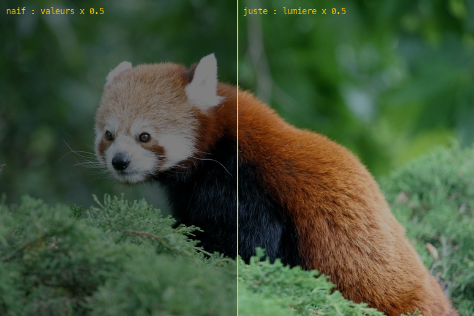

# Cours 11a — Gamma et espace linéaire

> **Fichiers** : `ofApp11a.h` + `ofApp11a.cpp`, image `data/pandaroux.jpg`
> **Avant** : cours 11 (filtre par pixel), cours 09a (le voyage de la couleur).

Le sujet le plus important de la série sur la couleur, et le plus souvent ignoré : **les nombres de 0 à 255 ne mesurent pas la lumière**. Tant qu'on affiche, aucune importance. Dès qu'on calcule, tout devient faux. Trois vues, touches 1 à 3.

## 1. La valeur 128 n'est pas la moitié de la lumière



Le dégradé du haut augmente la **valeur** régulièrement, de 0 à 255. Le milieu, 128, paraît déjà assez clair : il est bien plus proche du blanc que du noir à l'œil. Le dégradé du bas augmente la **lumière** régulièrement, et son milieu paraît à mi-chemin. Pour l'obtenir, il a fallu écrire la valeur 186 au milieu.

La relation entre les deux est approximativement une puissance 2.2 :

```cpp
float ofApp::versLineaire(float c) {        // valeur 0-255 -> lumière 0-1
	return pow(c / 255.0f, 2.2f);
}
float ofApp::versSRGB(float l) {            // lumière 0-1 -> valeur 0-255
	return 255.0f * pow(ofClamp(l, 0, 1), 1.0f / 2.2f);
}
```

`pow(a, b)` est « a puissance b ». Avec 128 : `pow(0.5, 2.2)` vaut 0.22. La valeur 128 code 22 % de la lumière du blanc. Avec 186 : `pow(0.73, 2.2)` vaut 0.50.

Pourquoi ce codage tordu ? Parce que l'œil distingue finement les sombres et grossièrement les clairs. En donnant plus de valeurs aux sombres, les 256 niveaux sont dépensés là où on les voit. C'est la courbe **sRGB**, souvent appelée « gamma 2.2 ». La vraie courbe est en deux morceaux et un peu différente ; 2.2 suffit pour comprendre et pour presque tous les effets.

## 2. Le mélange qui devient trop sombre



Le damier a des cases de 2 pixels, rouge pur et vert pur. Recule-toi : l'œil moyenne les **lumières** et voit un jaune assez vif.

- Moyenne des valeurs : `(255 + 0) / 2 = 128` sur le rouge, pareil sur le vert. Résultat `(128, 128, 0)`, un olive sombre. C'est ce que fait un flou, un dégradé ou une transparence calculés naïvement.
- Moyenne des lumières : `(1 + 0) / 2 = 0.5` de lumière, qui se code 186. Résultat `(186, 186, 0)`, le jaune que voit l'œil.

Tout calcul qui mélange des couleurs souffre du même problème : le flou boîte du cours 17 assombrit les contours, `getLerped` du cours 09 passe par un milieu terne, une transparence à 50 % n'est pas à moitié. Les moteurs de jeu ont un réglage « Linear » précisément pour faire ces calculs en lumière. Et une texture porte une case « sRGB » qui dit si ses valeurs sont codées ou linéaires : la cocher à tort est une erreur classique qui rend un matériau délavé.

## 3. Le bon ordre : décoder, calculer, réencoder



```cpp
float r = tableLineaire[c.r] * facteur;     // 1. décoder, 2. calculer sur la lumière
sortie = ofColor(versSRGB(r), ...);         // 3. réencoder pour l'écran
```

Diviser la lumière par deux, c'est fermer l'objectif d'un cran en photo. À gauche, le calcul naïf `valeur × 0.5` donne une image beaucoup trop sombre : on a divisé par deux des valeurs déjà compressées, donc divisé la lumière par plus de quatre. À droite, le calcul juste. Déplace la souris : le facteur va de ×0.25 à ×4, et la différence entre les deux moitiés change de sens quand on éclaircit.

## 4. Une table pour éviter `pow`

```cpp
for (int c = 0; c < 256; c++) {
	tableLineaire.push_back(versLineaire(c));
}
// puis, pour chaque pixel :
float r = tableLineaire[c.r];
```

`pow` est un calcul lent. Mais il n'y a que 256 valeurs d'entrée possibles pour un canal. On calcule les 256 résultats une fois dans `setup()`, dans une liste, et on **lit la liste** au lieu de recalculer. L'indice de la liste est la valeur d'entrée : `tableLineaire[128]` contient `versLineaire(128)`. C'est une **table de correspondance**, l'idée que le cours 11c généralise.

Le retour vers sRGB, lui, part d'un `float` quelconque et non d'une des 256 valeurs, donc il garde `pow`. Pour ne pas ralentir, l'image n'est recalculée que quand la souris a bougé : on mémorise le dernier facteur et on compare.

## Exercices

1. Remplace l'approximation 2.2 par la vraie courbe sRGB : `lineaire = s <= 0.04045 ? s / 12.92 : pow((s + 0.055) / 1.055, 2.4)`, où `s` est la valeur entre 0 et 1. Compare : la différence est-elle visible ?
2. Refais le flou boîte du cours 17 en linéaire. Compare sur les moustaches blanches du panda : lequel les assombrit ?
3. Le dégradé entre deux couleurs du cours 09, calculé en linéaire : décoder A et B, interpoler, réencoder. Lequel est le plus lumineux au milieu ?
4. Affiche côte à côte un gris `(128, 128, 128)` et un damier noir-blanc de 1 pixel. Sont-ils pareils de loin ? Quel gris uni ressemble au damier ?

## Le code complet, pas à pas

Le programme entier, dans l'ordre des fichiers. Les blocs ci-dessous mis bout à bout donnent exactement `ofApp11a.cpp`.

### Le fichier `ofApp11a.h`

La table des matières du programme : les blocs qui existent et les variables partagées entre eux, avec leurs valeurs de départ.

```cpp
#pragma once
#include "ofMain.h"

// 11a - Gamma et espace linéaire
// Nouveau : pas de sketch Processing d'origine
// Notions : les valeurs 0-255 d'une image ne sont pas proportionnelles à la quantité de lumière
//           (courbe sRGB, "gamma 2.2") ; passer en linéaire pour calculer, revenir en sRGB pour
//           afficher ; table précalculée (256 entrées) pour éviter pow() sur chaque pixel ;
//           recalcul seulement quand le paramètre change
// Ressource : bin/data/pandaroux.jpg (774 x 516)

class ofApp : public ofBaseApp {
public:
	void setup();
	void update();
	void draw();
	void keyPressed(int key);

	float versLineaire(float c);   // 0-255 sRGB  -> 0-1 lumière
	float versSRGB(float l);       // 0-1 lumière -> 0-255 sRGB
	void  calculerImage();

	ofImage source;
	ofImage resultat;
	std::vector<float> tableLineaire;   // tableLineaire[c] = versLineaire(c), précalculé

	int   vue = 1;                 // 1 dégradés, 2 mélange, 3 image
	float facteur = 0.5f;          // multiplicateur de lumière piloté par la souris (vue 3)
	float dernierFacteur = -1;
};
```

### En tête du fichier `ofApp11a.cpp`

L'inclusion du `.h`, qui rend visibles les variables partagées et les blocs déclarés.

```cpp
#include "ofApp11a.h"
```

### Étape 1 — `versLineaire()`

Une valeur sRGB c (0-255) ne mesure pas une quantité de lumière : 128 n'est pas la moitié de 255.

```cpp
// Une valeur sRGB c (0-255) ne mesure pas une quantité de lumière : 128 n'est pas la moitié de 255
// en lumière, mais environ 22 %. La relation est approximativement lumiere = (c / 255) ^ 2.2.
// (La vraie courbe sRGB est en deux morceaux, linéaire près de 0 puis puissance 2.4 ;
//  l'approximation 2.2 suffit largement pour comprendre et pour la plupart des effets.)
float ofApp::versLineaire(float c) {
	return pow(c / 255.0f, 2.2f);
}
```

### Étape 2 — `versSRGB()`

Fonction `versSRGB()`.

```cpp
float ofApp::versSRGB(float l) {
	l = ofClamp(l, 0, 1);
	return 255.0f * pow(l, 1.0f / 2.2f);
}
```

### Étape 3 — `setup()`

Exécuté une fois au lancement : la fenêtre, les chargements, les valeurs de départ.

```cpp
void ofApp::setup() {
	ofSetWindowShape(774, 516);
	if (!source.load("pandaroux.jpg")) {
		ofLogError() << "pandaroux.jpg introuvable dans bin/data";
	}
	resultat.allocate(source.getWidth(), source.getHeight(), OF_IMAGE_COLOR);

	// pow() est lent. Il n'y a que 256 valeurs d'entrée possibles : on calcule une fois
	// les 256 résultats dans une table, et on lit la table au lieu de recalculer.
	for (int c = 0; c < 256; c++) {
		tableLineaire.push_back(versLineaire(c));
	}
}
```

### Étape 4 — `calculerImage()`

Vue 3 : diviser (ou multiplier) la lumière. À gauche le calcul naïf sur les valeurs sRGB.

```cpp
// Vue 3 : diviser (ou multiplier) la lumière. À gauche le calcul naïf sur les valeurs sRGB,
// à droite le calcul juste : sRGB -> linéaire, multiplier, linéaire -> sRGB.
void ofApp::calculerImage() {
	int w = source.getWidth();
	int h = source.getHeight();
	for (int y = 0; y < h; y++) {
		for (int x = 0; x < w; x++) {
			ofColor c = source.getColor(x, y);
			ofColor sortie;
			if (x < w / 2) {
				// Naïf : on multiplie directement les valeurs 0-255
				sortie = ofColor(ofClamp(c.r * facteur, 0, 255), ofClamp(c.g * facteur, 0, 255), ofClamp(c.b * facteur, 0, 255));
			} else {
				// Juste : on multiplie la LUMIÈRE
				float r = tableLineaire[c.r] * facteur;
				float g = tableLineaire[c.g] * facteur;
				float b = tableLineaire[c.b] * facteur;
				sortie = ofColor(versSRGB(r), versSRGB(g), versSRGB(b));
			}
			resultat.setColor(x, y, sortie);
		}
	}
	resultat.update();
}
```

### Étape 5 — `update()`

Exécuté à chaque frame, avant le dessin : tout ce qui change.

```cpp
void ofApp::update() {
	// 0.25 à 4 : la souris au milieu donne 1 (image inchangée)
	facteur = pow(2.0f, (mouseX / (float)ofGetWidth()) * 4 - 2);
	if (vue == 3 && facteur != dernierFacteur) {
		calculerImage();
		dernierFacteur = facteur;
	}
}
```

### Étape 6 — `draw()`

Exécuté à chaque frame, après `update()` : uniquement du dessin.

```cpp
void ofApp::draw() {
	ofBackground(30);
	float w = ofGetWidth();
	ofSetColor(255, 200, 0);

	if (vue == 1) {
		// ---- Dégradés : les valeurs contre la lumière ----
		for (int x = 0; x < w; x++) {
			float p = x / w;                           // 0 à 1
			// Haut : la VALEUR augmente régulièrement. Le milieu (128) paraît déjà très clair.
			ofSetColor(p * 255);
			ofDrawLine(x, 60, x, 180);
			// Bas : la LUMIÈRE augmente régulièrement, donc la valeur suit la courbe inverse.
			// Le milieu paraît à peu près à mi-chemin entre noir et blanc.
			ofSetColor(versSRGB(p));
			ofDrawLine(x, 220, x, 340);
		}
		ofSetColor(255, 200, 0);
		ofDrawBitmapString("valeur 0 -> 255 (ce que l'on ecrit dans ofSetColor)", 10, 50);
		ofDrawBitmapString("lumiere 0 -> 100 % (ce que l'oeil recoit)", 10, 210);
		ofDrawLine(w / 2, 180, w / 2, 220);
		ofDrawBitmapString("milieu : valeur 128 = 22 % de lumiere   |   50 % de lumiere = valeur 186", 10, 380);
	}

	if (vue == 2) {
		// ---- Mélange : damier rouge / vert vu de loin, contre les deux calculs ----
		// Le damier a des cases de 2 px : l'oeil moyenne la LUMIÈRE des deux couleurs.
		for (int y = 100; y < 300; y += 2) {
			for (int x = 60; x < 260; x += 2) {
				bool pair = ((x / 2) + (y / 2)) % 2 == 0;
				if (pair) ofSetColor(255, 0, 0); else ofSetColor(0, 255, 0);
				ofDrawRectangle(x, y, 2, 2);
			}
		}
		// Moyenne naïve : (255 + 0) / 2 = 128 sur chaque canal
		ofSetColor(128, 128, 0);
		ofDrawRectangle(290, 100, 200, 200);
		// Moyenne en lumière : 0.5 de lumière = valeur 186
		float v = versSRGB(0.5f);
		ofSetColor(v, v, 0);
		ofDrawRectangle(520, 100, 200, 200);

		ofSetColor(255, 200, 0);
		ofDrawBitmapString("damier 2 px (recule-toi)", 60, 90);
		ofDrawBitmapString("moyenne des valeurs : 128", 290, 90);
		ofDrawBitmapString("moyenne de la lumiere : 186", 520, 90);
		ofDrawBitmapString("Un flou, un degrade, une transparence : tout melange de couleurs a ce probleme.", 60, 340);
		ofDrawBitmapString("Les moteurs de jeu calculent en lineaire pour que le milieu ressemble au damier.", 60, 360);
	}

	if (vue == 3) {
		ofSetColor(255);
		resultat.draw(0, 0);
		ofSetColor(255, 200, 0);
		ofDrawLine(w / 2, 0, w / 2, ofGetHeight());
		ofDrawBitmapString("naif : valeurs x " + ofToString(facteur, 2), 10, 20);
		ofDrawBitmapString("juste : lumiere x " + ofToString(facteur, 2), w / 2 + 10, 20);
		ofDrawBitmapString("souris : facteur (x0.25 a gauche, x4 a droite, x1 au milieu)", 10, ofGetHeight() - 10);
	}

	ofSetColor(255, 200, 0);
	ofDrawBitmapString("Touches 1 degrades, 2 melange, 3 image", 10, ofGetHeight() - 30);
}
```

### Étape 7 — `keyPressed()`

Appelé automatiquement à chaque touche pressée.

```cpp
void ofApp::keyPressed(int key) {
	if (key >= '1' && key <= '3') {
		vue = key - '0';
		dernierFacteur = -1;   // force le recalcul de la vue 3
	}
}
```

### En fin de fichier

Les notes et pistes laissées en commentaire dans le code.

```cpp
// Exercices :
// - remplacer l'approximation 2.2 par la vraie courbe sRGB :
//     lineaire = s <= 0.04045 ? s / 12.92 : pow((s + 0.055) / 1.055, 2.4)
// - refaire le flou boîte du cours 17 en linéaire et comparer sur des zones très contrastées
// - un dégradé entre deux couleurs (cours 09, getLerped) calculé en linéaire : plus lumineux au milieu
```

## Ce qu'il faut retenir

- Une valeur sRGB `c` code une lumière d'environ `(c / 255) ^ 2.2`. 128 code 22 %, 186 code 50 %.
- Tout mélange de couleurs (flou, dégradé, transparence, redimensionnement) doit se faire en lumière linéaire, sinon il est trop sombre.
- Décoder, calculer, réencoder. Les moteurs de jeu appellent ça « espace de couleur linéaire ».
- `pow(a, b)` est la puissance. Une table de 256 entrées remplace 400 000 appels.
- Recalculer seulement quand le paramètre a changé.
