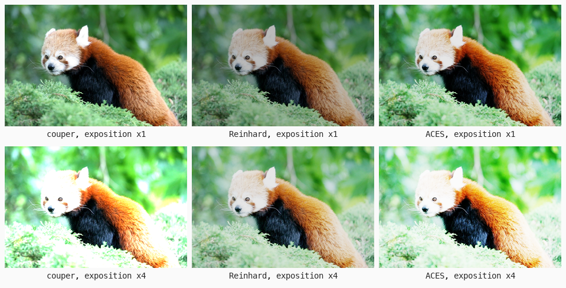
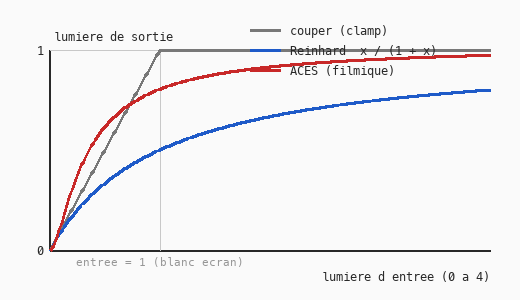

# Cours 11b — HDR, exposition et tone mapping

> **Fichiers** : `ofApp11b.h` + `ofApp11b.cpp`, image `data/pandaroux.jpg`
> **Avant** : cours 11a (lumière linéaire).

Dans un moteur de jeu, la lumière d'une scène n'a pas de plafond. L'écran, lui, s'arrête à 1. Ce cours fabrique de la lumière « trop forte » en poussant l'exposition, puis compare trois façons de la ramener sous 1. La troisième est la courbe ACES qu'on trouve dans Unreal et Unity.



## 1. HDR : de la lumière sans plafond

Une fois décodée en linéaire (cours 11a), une image a des lumières entre 0 et 1. Une **scène** réelle ou rendue en 3D en a bien au-delà : le ciel est à 10, une lampe à 100, le soleil à des milliers. C'est le **HDR**, high dynamic range. Les moteurs calculent l'éclairage dans cet espace, en `float`, sans se soucier des limites. Le problème arrive à la fin : afficher.

Ici on n'a pas de vraie image HDR, alors on triche : on **multiplie la lumière** par un facteur, l'exposition.

```cpp
float stops = (mouseX / (float)ofGetWidth()) * 6 - 2;    // -2 à +4
exposition = pow(2.0f, stops);
```

L'exposition se compte en **stops**, comme en photo : chaque stop double la lumière. La souris va de -2 stops (×0.25) à +4 stops (×16). À +2, la moitié de l'image dépasse déjà 1.

## 2. Trois façons de ramener sous 1



La fonction `toneMap` reçoit une lumière quelconque et renvoie une lumière entre 0 et 1. Trois versions, choisies par `switch` :

```cpp
float ofApp::toneMap(float x) {
	switch (methode) {
	case 2:  return x / (1.0f + x);                                    // Reinhard
	case 3:  return ofClamp((x * (2.51f * x + 0.03f)) / (x * (2.43f * x + 0.59f) + 0.14f), 0, 1);  // ACES
	default: return ofClamp(x, 0, 1);                                  // couper
	}
}
```

| Méthode | Ce qu'elle fait | Ce qu'on voit |
|---|---|---|
| Couper | tout ce qui dépasse 1 devient 1 | les zones claires deviennent des taches blanches plates, sans détail : « brûlées » |
| Reinhard | `x / (1 + x)` : tend vers 1 sans jamais l'atteindre | rien ne brûle, mais tout est un peu grisâtre, les blancs ne sont jamais blancs |
| ACES | courbe en S : ombres légèrement écrasées, tons moyens contrastés, hautes lumières compressées en douceur | l'aspect « pellicule » : contrasté et sans zones brûlées |

Sur la courbe, regarde ce qui se passe à droite de la ligne « entrée = 1 ». Couper est plat. Reinhard monte lentement. ACES monte puis s'aplatit près de 1. Et regarde à gauche : Reinhard assombrit déjà les tons moyens (une entrée de 1 sort à 0.5), ACES les garde contrastés.

Le mot **ACES** désigne en réalité tout un système de gestion de couleur pour le cinéma, avec ses propres espaces et ses conversions pour chaque caméra et chaque écran. Ce que les moteurs de jeu appellent « ACES » est seulement sa courbe finale, ici dans une approximation à cinq nombres de Krzysztof Narkowicz, celle que tout le monde copie.

## 3. Le pipeline complet

```cpp
float r = toneMap(tableLineaire[c.r] * exposition);
resultat.setColor(x, y, ofColor(versSRGB(r), versSRGB(g), versSRGB(b)));
```

Quatre étapes par canal : décoder, exposer, tone mapper, réencoder. C'est, à peu de choses près, la fin du pipeline de rendu d'un jeu moderne : la scène est calculée en HDR linéaire, puis un « post-process » applique exposition et tone mapping, puis le résultat est encodé pour l'écran. Le réglage « exposition automatique » d'un jeu ne fait que choisir le facteur selon la luminosité moyenne de l'image.

## 4. Tracer une courbe

```cpp
for (int i = 0; i < gw - 1; i++) {
	float x0 = i / (float)gw * 4, x1 = (i + 1) / (float)gw * 4;
	ofDrawLine(gx + i, gy + gh - toneMap(x0) * gh, gx + i + 1, gy + gh - toneMap(x1) * gh);
}
```

Pour dessiner une fonction, on la relie par de petits segments : pour chaque pixel horizontal, on calcule l'entrée correspondante, on appelle la fonction, on convertit la sortie en hauteur. Le `gy + gh - ...` retourne l'axe, puisque `y` pointe vers le bas (cours 00). Même recette pour n'importe quelle formule qu'on veut voir.

## Exercices

1. Reinhard « étendu » : `x * (1 + x / (Lb * Lb)) / (1 + x)`, où `Lb` est la lumière qui doit devenir exactement blanche. Essaie `Lb = 4`. Les blancs redeviennent blancs.
2. Applique le tone mapping à la **luminance** seulement, puis multiplie r, g, b par le rapport `nouvelle / ancienne`. Les couleurs saturées ne virent plus au blanc en surexposition. Compare avec la version par canal.
3. Exposition automatique : calcule la lumière moyenne de l'image dans `setup()`, et choisis l'exposition pour que cette moyenne tombe à 0.18 (le « gris moyen » des photographes).
4. Une vraie image HDR : `ofFloatImage img; img.load("scene.hdr");` donne directement des valeurs au-dessus de 1. Il en existe des gratuites sur les sites de textures.

## Le code complet, pas à pas

Le programme entier, dans l'ordre des fichiers. Les blocs ci-dessous mis bout à bout donnent exactement `ofApp11b.cpp`.

### Le fichier `ofApp11b.h`

La table des matières du programme : les blocs qui existent et les variables partagées entre eux, avec leurs valeurs de départ.

```cpp
#pragma once
#include "ofMain.h"

// 11b - HDR, exposition et tone mapping (Reinhard, ACES)
// Nouveau : pas de sketch Processing d'origine
// Notions : une scène réelle a des lumières bien au-dessus de 1 (HDR), l'écran s'arrête à 1 ;
//           l'exposition multiplie la lumière ; le tone mapping est la courbe qui ramène tout
//           sous 1 en écrasant les hautes lumières au lieu de les couper ; tracer une courbe
//           avec ofDrawLine ; f(x) sous forme de fonction qui renvoie un float
// Ressource : bin/data/pandaroux.jpg (774 x 516)

class ofApp : public ofBaseApp {
public:
	void setup();
	void update();
	void draw();
	void keyPressed(int key);

	float versLineaire(float c);
	float versSRGB(float l);
	float toneMap(float x);       // lumière HDR (0 à l'infini) -> lumière écran (0-1)
	void  calculerImage();

	ofImage source;
	ofImage resultat;
	std::vector<float> tableLineaire;

	int   methode = 1;            // 1 couper, 2 Reinhard, 3 ACES
	float exposition = 1;
	float derniereExposition = -1;
	int   derniereMethode = -1;
	std::vector<std::string> noms = { "", "couper (clamp)", "Reinhard", "ACES (courbe filmique)" };
};
```

### En tête du fichier `ofApp11b.cpp`

L'inclusion du `.h`, qui rend visibles les variables partagées et les blocs déclarés.

```cpp
#include "ofApp11b.h"
```

### Étape 1 — `versLineaire()`

Fonction `versLineaire()`.

```cpp
float ofApp::versLineaire(float c) { return pow(c / 255.0f, 2.2f); }
```

### Étape 2 — `versSRGB()`

Fonction `versSRGB()`.

```cpp
float ofApp::versSRGB(float l)     { return 255.0f * pow(ofClamp(l, 0, 1), 1.0f / 2.2f); }
```

### Étape 3 — `toneMap()`

x est une quantité de lumière qui peut dépasser 1 (le blanc de l'écran).

```cpp
// x est une quantité de lumière qui peut dépasser 1 (le blanc de l'écran).
// Chaque méthode décide quoi faire de ce qui dépasse.
float ofApp::toneMap(float x) {
	switch (methode) {
	case 2:
		// Reinhard : x / (1 + x). Ne dépasse jamais 1, mais y tend doucement.
		// 0.5 -> 0.33, 1 -> 0.5, 4 -> 0.8, 100 -> 0.99. Tout s'aplatit un peu, rien ne brûle.
		return x / (1.0f + x);
	case 3: {
		// ACES : la courbe "filmique" utilisée par Unreal et Unity (approximation de Narkowicz).
		// Comme une pellicule : les ombres sont un peu écrasées, les tons moyens contrastés,
		// les hautes lumières compressées en douceur.
		float a = 2.51f, b = 0.03f, c = 2.43f, d = 0.59f, e = 0.14f;
		return ofClamp((x * (a * x + b)) / (x * (c * x + d) + e), 0, 1);
	}
	default:
		// Couper : tout ce qui dépasse 1 devient 1. Les zones claires deviennent des taches blanches.
		return ofClamp(x, 0, 1);
	}
}
```

### Étape 4 — `setup()`

Exécuté une fois au lancement : la fenêtre, les chargements, les valeurs de départ.

```cpp
void ofApp::setup() {
	ofSetWindowShape(774, 516);
	if (!source.load("pandaroux.jpg")) {
		ofLogError() << "pandaroux.jpg introuvable dans bin/data";
	}
	resultat.allocate(source.getWidth(), source.getHeight(), OF_IMAGE_COLOR);
	for (int c = 0; c < 256; c++) tableLineaire.push_back(versLineaire(c));
}
```

### Étape 5 — `calculerImage()`

Fonction `calculerImage()`.

```cpp
void ofApp::calculerImage() {
	int w = source.getWidth();
	int h = source.getHeight();
	for (int y = 0; y < h; y++) {
		for (int x = 0; x < w; x++) {
			ofColor c = source.getColor(x, y);
			// 1. sRGB -> lumière   2. exposition   3. tone mapping   4. lumière -> sRGB
			float r = toneMap(tableLineaire[c.r] * exposition);
			float g = toneMap(tableLineaire[c.g] * exposition);
			float b = toneMap(tableLineaire[c.b] * exposition);
			resultat.setColor(x, y, ofColor(versSRGB(r), versSRGB(g), versSRGB(b)));
		}
	}
	resultat.update();
}
```

### Étape 6 — `update()`

Exécuté à chaque frame, avant le dessin : tout ce qui change.

```cpp
void ofApp::update() {
	// Exposition de x0.25 à x16, en "stops" : chaque stop double la lumière (comme en photo)
	float stops = (mouseX / (float)ofGetWidth()) * 6 - 2;    // -2 à +4
	exposition = pow(2.0f, stops);
	if (exposition != derniereExposition || methode != derniereMethode) {
		calculerImage();
		derniereExposition = exposition;
		derniereMethode = methode;
	}
}
```

### Étape 7 — `draw()`

Exécuté à chaque frame, après `update()` : uniquement du dessin.

```cpp
void ofApp::draw() {
	ofSetColor(255);
	resultat.draw(0, 0);

	// ---- La courbe : lumière d'entrée (0 à 4) en x, lumière de sortie (0 à 1) en y ----
	int gx = 570, gy = 20, gw = 190, gh = 120;
	ofSetColor(0, 0, 0, 160);
	ofFill();
	ofDrawRectangle(gx - 6, gy - 6, gw + 12, gh + 30);
	ofSetColor(120);
	ofDrawRectangle(gx, gy, gw, 1); ofDrawRectangle(gx, gy + gh, gw, 1);
	ofDrawRectangle(gx + gw / 4, gy, 1, gh);            // entrée = 1 : le blanc de l'écran
	ofSetColor(255, 200, 0);
	for (int i = 0; i < gw - 1; i++) {
		float x0 = i / (float)gw * 4, x1 = (i + 1) / (float)gw * 4;
		ofDrawLine(gx + i, gy + gh - toneMap(x0) * gh, gx + i + 1, gy + gh - toneMap(x1) * gh);
	}
	ofDrawBitmapString("entree 0..4   sortie 0..1", gx, gy + gh + 16);

	ofDrawBitmapString("Methode " + ofToString(methode) + " : " + noms[methode], 10, 20);
	ofDrawBitmapString("exposition x" + ofToString(exposition, 2) + "  (souris : -2 a +4 stops)", 10, 40);
	ofDrawBitmapString("Touches 1 couper, 2 Reinhard, 3 ACES", 10, ofGetHeight() - 10);
}
```

### Étape 8 — `keyPressed()`

Appelé automatiquement à chaque touche pressée.

```cpp
void ofApp::keyPressed(int key) {
	if (key >= '1' && key <= '3') methode = key - '0';
}
```

### En fin de fichier

Les notes et pistes laissées en commentaire dans le code.

```cpp
// Exercices :
// - une quatrième méthode : Reinhard "étendu" x * (1 + x / (Lb * Lb)) / (1 + x), où Lb est la lumière
//   qui doit devenir exactement blanche (essaie Lb = 4)
// - appliquer le tone mapping sur la luminance seulement et garder les rapports r/g/b : les couleurs
//   saturées ne virent plus au blanc
// - une vraie image HDR : ofFloatImage img; img.load("x.exr" ou ".hdr") donne des valeurs > 1 directement
```

## Ce qu'il faut retenir

- Lumière HDR : sans plafond ; écran : 0 à 1. Le tone mapping est la fonction qui ramène l'une dans l'autre.
- Exposition : multiplier la lumière, en stops (chaque stop double).
- Couper brûle, Reinhard grise, une courbe filmique comme ACES garde le contraste et compresse les hautes lumières.
- Pipeline : décoder, exposer, tone mapper, réencoder. C'est le post-process d'un moteur.
- Une fonction se dessine en la reliant par segments, un par pixel.
