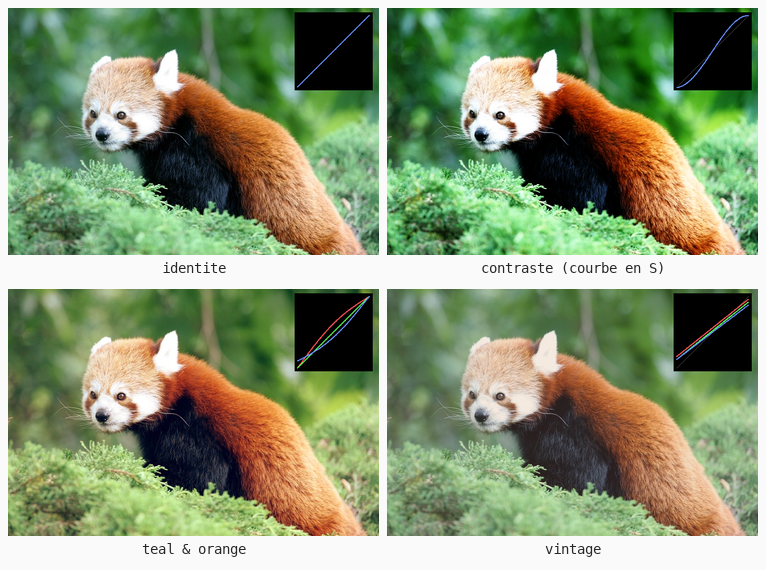
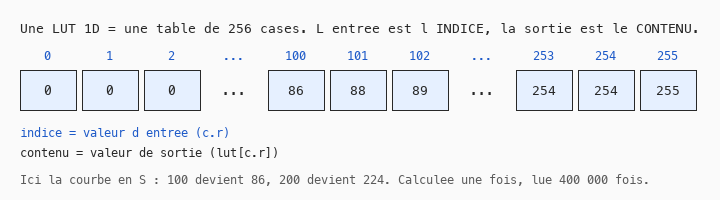

# Cours 11c — LUT et étalonnage

> **Fichiers** : `ofApp11c.h` + `ofApp11c.cpp`, image `data/pandaroux.jpg`
> **Avant** : cours 11 (courbes de transfert), cours 11a (table précalculée).

Au cours 11, chaque filtre était une formule appliquée 400 000 fois. Au cours 11a, on a précalculé 256 résultats dans une liste. Ce cours généralise : **toute** transformation d'un canal tient dans une table de 256 valeurs, la LUT. C'est l'outil de l'étalonnage au cinéma et du color grading dans les jeux.



## 1. Une table de correspondance



```cpp
std::vector<int> lutR, lutG, lutB;    // 256 entrées chacune
```

LUT signifie look-up table, table de correspondance. Pour un canal, c'est une liste de 256 entiers : dans la case numéro `i`, la valeur que doit devenir un pixel dont le canal vaut `i`. Appliquer la LUT, c'est **lire** la case :

```cpp
resultat.setColor(x, y, ofColor(lutR[c.r], lutG[c.g], lutB[c.b]));
```

Plus aucun calcul par pixel : trois lectures de liste. La valeur du pixel sert d'**indice**. C'est la même idée que `tableLineaire[c.r]` du cours 11a, avec trois tables et n'importe quelle formule dedans.

## 2. Construire la table

```cpp
for (int i = 0; i < 256; i++) {
	float t = i / 255.0f;              // l'entrée, entre 0 et 1
	float r = t, g = t, b = t;         // identité par défaut
	switch (look) { ... }              // le look modifie r, g, b
	lutR[i] = ofClamp((t + (r - t) * force) * 255, 0, 255);
	...
}
```

Une boucle de 256 tours, pas 400 000. Pour chaque entrée possible, on calcule la sortie et on la range. Les courbes de transfert du cours 11 étaient exactement ça : le négatif est `1 - t`, le seuil est `t < s ? 0 : 1`, la postérisation un escalier. Ils sont tous des LUT, et le négatif est le look numéro 4 pour le prouver.

La différence avec le cours 11 n'est pas ce qu'on calcule, mais **quand** : une fois pour toutes les valeurs possibles, au lieu d'une fois par pixel. Quand il y a moins d'entrées possibles que de pixels, la table gagne toujours.

## 3. Trois courbes différentes : l'étalonnage

Tant que les trois tables sont identiques, on règle le contraste ou la luminosité. Dès qu'elles diffèrent, on **colore** : c'est l'étalonnage, ou color grading.

| Look | Rouge | Vert | Bleu | Effet |
|---|---|---|---|---|
| contraste | courbe en S | idem | idem | les extrêmes sont écrasés, le milieu étiré |
| teal & orange | bosse au milieu : plus de rouge dans les tons moyens et clairs | inchangé | creux au milieu, relevé dans les sombres | peaux orangées, ombres bleu-vert : le look des films d'action |
| vintage | relevé de 12 % en bas, plafonné à 92 %, léger plus | idem sans le plus | pente un peu plus faible | noirs qui ne sont plus noirs, voile chaud |

La courbe en S est la « smoothstep », `t * t * (3 - 2 * t)` : elle vaut 0 en 0, 1 en 1, et sa pente est nulle aux deux bouts, ce qui écrase doucement les extrêmes. On la retrouve partout en animation.

Les trois courbes s'affichent en haut à droite de la fenêtre, tracées comme au cours 11b. Le look, c'est la forme de ces trois courbes. Un étalonneur de cinéma passe sa journée à les déplacer.

## 4. La force du grading

```cpp
lutR[i] = ofClamp((t + (r - t) * force) * 255, 0, 255);
```

Plutôt qu'appliquer un look à fond ou pas du tout, on **interpole** entre l'identité `t` et le look `r` : c'est `getLerped` du cours 09, appliqué à une valeur. `force = 0` donne l'image d'origine, `force = 1` le look complet, `force = 0.5` la moitié. La souris règle ça. Tous les logiciels d'étalonnage ont ce curseur d'intensité, et il est fait exactement comme ça.

## 5. Ce qu'une LUT 1D ne peut pas faire

Trois tables indépendantes ne peuvent pas **désaturer** : rendre gris demande de mélanger les canaux entre eux, et `lutR` ne connaît que le rouge. Le sépia du cours 11 et le daltonisme du cours 11f sont des matrices, pas des LUT 1D. Le cinéma utilise pour ça des **LUT 3D**, des grilles de 17 × 17 × 17 ou 33 × 33 × 33 couleurs, où chaque triplet (r, g, b) d'entrée pointe vers une couleur de sortie complète. C'est le format `.cube` que les logiciels s'échangent, et c'est ce qu'un moteur de jeu charge quand on lui donne une LUT de color grading.

## Exercices

1. Charge une LUT depuis une image : une bande de 256 × 1 pixels, `lutR[i] = bande.getColor(i, 0).r`. Fabrique la bande dans un logiciel de retouche : applique tes réglages à un dégradé de 256 pixels et exporte-le. Tes réglages sont maintenant dans ton programme.
2. Le seuil, la postérisation et le gamma du cours 11, en LUT.
3. Un look « nuit » : tout tire vers le bleu, les rouges sont écrasés.
4. Deux looks et une touche pour passer de l'un à l'autre en fondu : interpoler les deux tables avec un `float` qui avance avec le temps (cours 06).

## Le code complet, pas à pas

Le programme entier, dans l'ordre des fichiers. Les blocs ci-dessous mis bout à bout donnent exactement `ofApp11c.cpp`.

### Le fichier `ofApp11c.h`

La table des matières du programme : les blocs qui existent et les variables partagées entre eux, avec leurs valeurs de départ.

```cpp
#pragma once
#include "ofMain.h"

// 11c - LUT et étalonnage
// Nouveau : pas de sketch Processing d'origine
// Notions : une LUT (look-up table) 1D = une table de 256 valeurs par canal ; toute courbe de
//           transfert du cours 11 en est une ; précalculer la table une fois, l'appliquer par
//           simple lecture lut[c] ; étalonnage (color grading) = trois courbes différentes ;
//           force du grading = interpolation entre identité et LUT
// Ressource : bin/data/pandaroux.jpg (774 x 516)

class ofApp : public ofBaseApp {
public:
	void setup();
	void update();
	void draw();
	void keyPressed(int key);

	void construireLut();
	void appliquerLut();
	float courbeS(float t);      // 0-1 -> 0-1, en S

	ofImage source;
	ofImage resultat;
	std::vector<int> lutR, lutG, lutB;    // 256 entrées chacune

	int   look = 0;
	float force = 1;
	float derniereForce = -1;
	int   dernierLook = -1;
	std::vector<std::string> noms = { "identite", "contraste (courbe en S)", "teal & orange", "vintage (noirs releves)", "negatif" };
};
```

### En tête du fichier `ofApp11c.cpp`

L'inclusion du `.h`, qui rend visibles les variables partagées et les blocs déclarés.

```cpp
#include "ofApp11c.h"
```

### Étape 1 — `setup()`

Exécuté une fois au lancement : la fenêtre, les chargements, les valeurs de départ.

```cpp
void ofApp::setup() {
	ofSetWindowShape(774, 516);
	if (!source.load("pandaroux.jpg")) {
		ofLogError() << "pandaroux.jpg introuvable dans bin/data";
	}
	resultat.allocate(source.getWidth(), source.getHeight(), OF_IMAGE_COLOR);
	lutR = std::vector<int>(256, 0);
	lutG = std::vector<int>(256, 0);
	lutB = std::vector<int>(256, 0);
}
```

### Étape 2 — `courbeS()`

Courbe en S : écrase un peu les extrêmes, étire le milieu. t * t * (3 - 2 t) est la.

```cpp
// Courbe en S : écrase un peu les extrêmes, étire le milieu. t * t * (3 - 2 t) est la
// "smoothstep" : vaut 0 en 0, 1 en 1, pente nulle aux deux bouts.
float ofApp::courbeS(float t) {
	return t * t * (3 - 2 * t);
}
```

### Étape 3 — `construireLut()`

Construire les trois tables. Pour chaque valeur d'entrée i (0-255), on calcule la sortie.

```cpp
// Construire les trois tables. Pour chaque valeur d'entrée i (0-255), on calcule la sortie.
// C'est le "filtre" du cours 11, mais calculé UNE fois pour les 256 valeurs possibles
// au lieu de 400 000 fois par image.
void ofApp::construireLut() {
	for (int i = 0; i < 256; i++) {
		float t = i / 255.0f;          // 0-1
		float r = t, g = t, b = t;     // identité par défaut

		switch (look) {
		case 1: // Contraste : la même courbe en S sur les trois canaux
			r = g = b = courbeS(t);
			break;
		case 2: // Teal & orange, le look du cinéma d'action : les hautes lumières tirent vers
			// l'orange (rouge monte, bleu descend), les ombres vers le bleu-vert (bleu monte, rouge descend)
			r = ofClamp(t + 0.12f * sin(t * PI), 0, 1);               // bosse au milieu : plus de rouge
			g = t;
			b = ofClamp(t - 0.12f * sin(t * PI) + 0.10f * (1 - t), 0, 1); // moins de bleu en clair, plus en sombre
			break;
		case 3: // Vintage : les noirs ne descendent pas sous 12 %, les blancs pas au-dessus de 92 %,
			// et un léger voile chaud
			r = 0.12f + t * 0.80f + 0.04f;
			g = 0.12f + t * 0.80f;
			b = 0.12f + t * 0.76f;
			break;
		case 4: // Négatif : la preuve que les filtres du cours 11 sont des LUT
			r = g = b = 1 - t;
			break;
		}

		// Force : on interpole entre l'identité (t) et le look (r). force = 0.5 => grading à moitié.
		lutR[i] = ofClamp((t + (r - t) * force) * 255, 0, 255);
		lutG[i] = ofClamp((t + (g - t) * force) * 255, 0, 255);
		lutB[i] = ofClamp((t + (b - t) * force) * 255, 0, 255);
	}
}
```

### Étape 4 — `appliquerLut()`

Appliquer : plus aucun calcul par pixel, trois lectures de table.

```cpp
// Appliquer : plus aucun calcul par pixel, trois lectures de table
void ofApp::appliquerLut() {
	int w = source.getWidth();
	int h = source.getHeight();
	for (int y = 0; y < h; y++) {
		for (int x = 0; x < w; x++) {
			ofColor c = source.getColor(x, y);
			resultat.setColor(x, y, ofColor(lutR[c.r], lutG[c.g], lutB[c.b]));
		}
	}
	resultat.update();
}
```

### Étape 5 — `update()`

Exécuté à chaque frame, avant le dessin : tout ce qui change.

```cpp
void ofApp::update() {
	force = mouseX / (float)ofGetWidth();
	if (force != derniereForce || look != dernierLook) {
		construireLut();
		appliquerLut();
		derniereForce = force;
		dernierLook = look;
	}
}
```

### Étape 6 — `draw()`

Exécuté à chaque frame, après `update()` : uniquement du dessin.

```cpp
void ofApp::draw() {
	ofSetColor(255);
	resultat.draw(0, 0);

	// ---- Les trois courbes : entrée en x, sortie en y ----
	int gx = 600, gy = 20, gs = 150;
	ofSetColor(0, 0, 0, 160);
	ofDrawRectangle(gx - 6, gy - 6, gs + 12, gs + 12);
	ofSetColor(90);
	ofDrawLine(gx, gy + gs, gx + gs, gy);          // la diagonale = identité
	for (int i = 0; i < 255; i++) {
		float x0 = gx + i * gs / 255.0f, x1 = gx + (i + 1) * gs / 255.0f;
		ofSetColor(255, 80, 80);  ofDrawLine(x0, gy + gs - lutR[i] * gs / 255.0f, x1, gy + gs - lutR[i + 1] * gs / 255.0f);
		ofSetColor(80, 255, 80);  ofDrawLine(x0, gy + gs - lutG[i] * gs / 255.0f, x1, gy + gs - lutG[i + 1] * gs / 255.0f);
		ofSetColor(100, 140, 255); ofDrawLine(x0, gy + gs - lutB[i] * gs / 255.0f, x1, gy + gs - lutB[i + 1] * gs / 255.0f);
	}

	ofSetColor(255, 200, 0);
	ofDrawBitmapString("Look " + ofToString(look) + " : " + noms[look] + "   force " + ofToString(force, 2), 10, 20);
	ofDrawBitmapString("Touches 0 a 4 : look.  Souris : force du grading.", 10, ofGetHeight() - 10);
}
```

### Étape 7 — `keyPressed()`

Appelé automatiquement à chaque touche pressée.

```cpp
void ofApp::keyPressed(int key) {
	if (key >= '0' && key <= '4') look = key - '0';
}
```

### En fin de fichier

Les notes et pistes laissées en commentaire dans le code.

```cpp
// Exercices :
// - charger une LUT depuis une image : une bande de 256 x 1 pixels, lutR[i] = bande.getColor(i, 0).r
// - créer sa LUT dans un logiciel de retouche : appliquer ses réglages à un dégradé 256 x 1 et l'exporter
// - le seuil, la postérisation et le gamma du cours 11 : tous en LUT
// - LUT 3D (le vrai format .cube du cinéma) : une grille 17 x 17 x 17 de couleurs, chaque (r, g, b)
//   pointe vers la case la plus proche. Une LUT 1D par canal ne peut pas désaturer ; une 3D si.
```

## Ce qu'il faut retenir

- Une LUT 1D est une liste de 256 valeurs par canal ; la valeur du pixel sert d'indice : `lut[c.r]`.
- Elle se construit en 256 tours, pas 400 000. Tous les filtres par canal du cours 11 en sont.
- Étalonnage : trois courbes différentes. Contraste : la même courbe trois fois.
- Force d'un effet : interpoler entre l'identité et l'effet.
- Une LUT 1D ne mélange pas les canaux ; pour ça il faut une matrice ou une LUT 3D.
