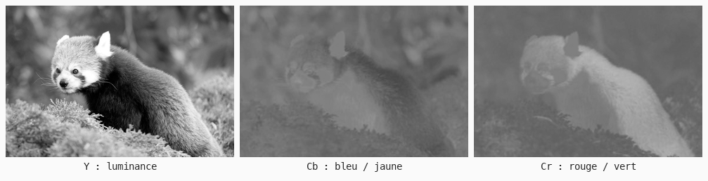
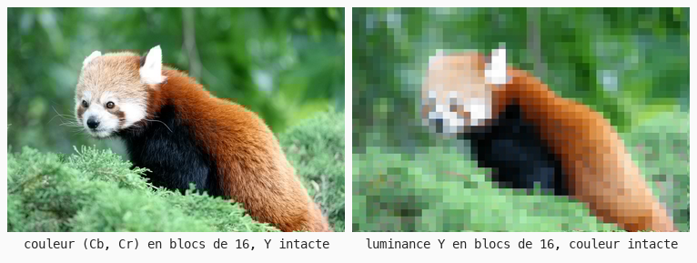

# Cours 11d — YCbCr : luminance, chrominance et compression

> **Fichiers** : `ofApp11d.h` + `ofApp11d.cpp`, image `data/pandaroux.jpg`
> **Avant** : cours 11 (luminance), cours 17 (indice `y * w + x`).

La formule de luminance du cours 11, `0.299 r + 0.587 g + 0.114 b`, n'est pas tombée du ciel : c'est celle de la télévision. Ce cours sépare une image en une **luminance** et deux canaux de **couleur**, puis montre pourquoi JPEG et toutes les vidéos réduisent la résolution des seconds sans que personne ne s'en aperçoive.



## 1. Trois nombres, autrement

```cpp
Y[i]  =        0.299f    * c.r + 0.587f    * c.g + 0.114f    * c.b;
Cb[i] = 128 -  0.168736f * c.r - 0.331264f * c.g + 0.5f      * c.b;
Cr[i] = 128 +  0.5f      * c.r - 0.418688f * c.g - 0.081312f * c.b;
```

Une couleur RGB peut se réécrire en trois autres nombres sans perdre d'information :

- **Y**, la luminance : le gris de l'image, ce qu'un téléviseur noir et blanc affichait.
- **Cb** : à quel point la couleur tire vers le bleu plutôt que vers le jaune. Centré sur 128, qui veut dire « ni l'un ni l'autre ».
- **Cr** : à quel point elle tire vers le rouge plutôt que vers le vert. Centré sur 128 aussi.

C'est un changement d'espace, comme HSB au cours 09, mais **linéaire** : chaque nouveau nombre est un mélange pondéré des trois anciens, et la fonction `recomposer` fait exactement le chemin inverse. Une image en gris a Cb et Cr à 128 partout.

Regarde les trois canaux : Y contient tous les détails. Cb et Cr sont flous, doux, presque sans contours. Ce n'est pas un hasard.

## 2. Trois images dans trois listes

```cpp
std::vector<float> Y, Cb, Cr;
Y = std::vector<float>(w * h, 0);
int i = y * w + x;
```

Les canaux ne sont pas des `ofImage` : ce sont trois listes de `float`, une valeur par pixel, parce qu'on veut des nombres à virgule et qu'on ne les affiche pas directement. L'indice du pixel `(x, y)` est `y * w + x`, le calcul du cours 17 : les lignes sont rangées bout à bout. La décomposition est faite une fois dans `setup()`, les vues ne font que relire et recomposer.

## 3. L'œil ne voit pas la couleur finement



```cpp
case 4: c = recomposer(Y[i], moyenneBloc(Cb, x, y, tailleBloc), moyenneBloc(Cr, x, y, tailleBloc));
case 5: c = recomposer(moyenneBloc(Y, x, y, tailleBloc), Cb[i], Cr[i]);
```

`moyenneBloc` remplace la valeur d'un canal par la moyenne du bloc `n × n` qui contient le pixel : la résolution du canal est divisée par `n`. Le coin du bloc est trouvé par division entière, `x / n * n`, comme la pixelisation du cours 14.

- Vue 4 : la **couleur** en blocs de 16, la luminance intacte. L'image est presque inchangée. Il faut chercher pour trouver les blocs, sur les frontières entre l'orange et le vert.
- Vue 5 : la **luminance** en blocs de 16, la couleur intacte. L'image est détruite.

Même quantité d'information jetée dans les deux cas. L'œil a beaucoup de récepteurs pour la lumière et peu pour la couleur, et il reconstruit les formes à partir de la luminance seule. La couleur n'est qu'un vernis par-dessus.

## 4. Ce que fait la compression

JPEG, MPEG, H.264, tout ce qui compresse une image ou une vidéo commence par convertir en YCbCr, puis **réduit la résolution de Cb et Cr**, en général de moitié dans chaque direction : un seul échantillon de couleur pour quatre pixels. C'est le **4:2:0** des fiches techniques des caméras et des consoles. Le 4:4:4 garde toute la couleur et coûte deux fois plus ; le 4:2:2 est un compromis pour le montage. La vue 4 avec des blocs de 2 montre ce que fait le 4:2:0 : rien de visible.

Sauf dans un cas : une frontière nette entre deux couleurs de **même luminance**, un texte rouge sur fond bleu par exemple. La luminance ne porte pas le contour, la couleur le porte, et la couleur est floue. Le texte bave. C'est pour ça que les sous-titres sont blancs sur noir, et que le texte d'une interface de jeu ne doit jamais compter sur la couleur seule pour être net à travers une capture vidéo.

## Exercices

1. Affiche Cb et Cr en couleur plutôt qu'en gris : `recomposer(128, Cb[i], 128)` et `recomposer(128, 128, Cr[i])`. On voit vers quoi tire chaque zone.
2. Dessine du texte rouge `(255, 0, 0)` sur fond bleu `(0, 0, 255)` dans une image, enregistre-la en JPEG qualité 30, ouvre-la et zoome. Puis refais-le en blanc sur noir. Explique la différence avec la vue 4.
3. Flou boîte (cours 17) sur Cb et Cr seulement, puis sur Y seulement. Le premier est un vrai outil : il enlève le bruit coloré des photos prises de nuit sans les rendre floues.
4. Un chromakey propre : au lieu de sélectionner le vert par sa teinte HSB, sélectionne les pixels dont `(Cb, Cr)` est proche de celui d'un vert de référence, avec la distance du cours 12 en deux dimensions. La luminance n'entre pas dans la sélection : les ombres sur le fond vert ne posent plus problème.

## Le code complet, pas à pas

Le programme entier, dans l'ordre des fichiers. Les blocs ci-dessous mis bout à bout donnent exactement `ofApp11d.cpp`.

### Le fichier `ofApp11d.h`

La table des matières du programme : les blocs qui existent et les variables partagées entre eux, avec leurs valeurs de départ.

```cpp
#pragma once
#include "ofMain.h"

// 11d - YCbCr : luminance, chrominance et compression
// Nouveau : pas de sketch Processing d'origine
// Notions : séparer une image en luminance (Y) et deux canaux de couleur (Cb, Cr) ; l'oeil voit
//           la luminance finement et la couleur grossièrement ; JPEG et la vidéo réduisent la
//           résolution de Cb et Cr (sous-échantillonnage 4:2:0) ; trois vector<float> comme
//           images intermédiaires, indice y * w + x ; moyenne par blocs
// Ressource : bin/data/pandaroux.jpg (774 x 516)

class ofApp : public ofBaseApp {
public:
	void setup();
	void update();
	void draw();
	void keyPressed(int key);

	void  decomposer();                       // source -> Y, Cb, Cr
	ofColor recomposer(float y, float cb, float cr);
	float moyenneBloc(std::vector<float>& canal, int x, int y, int n);
	void  calculerVue();

	ofImage source;
	ofImage resultat;
	int w = 0, h = 0;
	std::vector<float> Y, Cb, Cr;             // trois "images" de w * h valeurs

	int   vue = 1;
	int   tailleBloc = 2;
	int   dernierBloc = -1, derniereVue = -1;
	std::vector<std::string> noms = { "", "Y seule (luminance)", "Cb seul", "Cr seul", "couleur en blocs (Y intacte)", "luminance en blocs (couleur intacte)" };
};
```

### En tête du fichier `ofApp11d.cpp`

L'inclusion du `.h`, qui rend visibles les variables partagées et les blocs déclarés.

```cpp
#include "ofApp11d.h"
```

### Étape 1 — `setup()`

Exécuté une fois au lancement : la fenêtre, les chargements, les valeurs de départ.

```cpp
void ofApp::setup() {
	ofSetWindowShape(774, 516);
	if (!source.load("pandaroux.jpg")) {
		ofLogError() << "pandaroux.jpg introuvable dans bin/data";
	}
	w = source.getWidth();
	h = source.getHeight();
	resultat.allocate(w, h, OF_IMAGE_COLOR);
	decomposer();
}
```

### Étape 2 — `decomposer()`

RGB -> YCbCr (formules de la norme JPEG).

```cpp
// RGB -> YCbCr (formules de la norme JPEG).
// Y  : la luminance, exactement le gris "luminance" du cours 11.
// Cb : à quel point la couleur tire vers le bleu (plutôt que le jaune), centré sur 128.
// Cr : à quel point elle tire vers le rouge (plutôt que le vert), centré sur 128.
void ofApp::decomposer() {
	Y  = std::vector<float>(w * h, 0);
	Cb = std::vector<float>(w * h, 0);
	Cr = std::vector<float>(w * h, 0);
	for (int y = 0; y < h; y++) {
		for (int x = 0; x < w; x++) {
			ofColor c = source.getColor(x, y);
			int i = y * w + x;                    // deux coordonnées -> un indice (cours 17)
			Y[i]  =        0.299f    * c.r + 0.587f    * c.g + 0.114f    * c.b;
			Cb[i] = 128 -  0.168736f * c.r - 0.331264f * c.g + 0.5f      * c.b;
			Cr[i] = 128 +  0.5f      * c.r - 0.418688f * c.g - 0.081312f * c.b;
		}
	}
}
```

### Étape 3 — `recomposer()`

YCbCr -> RGB, l'inverse exact.

```cpp
// YCbCr -> RGB, l'inverse exact
ofColor ofApp::recomposer(float y, float cb, float cr) {
	float r = y + 1.402f * (cr - 128);
	float g = y - 0.344136f * (cb - 128) - 0.714136f * (cr - 128);
	float b = y + 1.772f * (cb - 128);
	return ofColor(ofClamp(r, 0, 255), ofClamp(g, 0, 255), ofClamp(b, 0, 255));
}
```

### Étape 4 — `moyenneBloc()`

Valeur moyenne d'un canal sur le bloc n x n qui contient (x, y).

```cpp
// Valeur moyenne d'un canal sur le bloc n x n qui contient (x, y).
// Tous les pixels d'un même bloc reçoivent la même valeur : la résolution du canal est divisée par n.
float ofApp::moyenneBloc(std::vector<float>& canal, int x, int y, int n) {
	int x0 = x / n * n;                          // coin du bloc : division entière (cours 14)
	int y0 = y / n * n;
	float somme = 0;
	int compte = 0;
	for (int yy = y0; yy < y0 + n && yy < h; yy++) {
		for (int xx = x0; xx < x0 + n && xx < w; xx++) {
			somme += canal[yy * w + xx];
			compte++;
		}
	}
	return somme / compte;
}
```

### Étape 5 — `calculerVue()`

Fonction `calculerVue()`.

```cpp
void ofApp::calculerVue() {
	for (int y = 0; y < h; y++) {
		for (int x = 0; x < w; x++) {
			int i = y * w + x;
			ofColor c;
			switch (vue) {
			case 1: c = ofColor(Y[i]); break;                           // la luminance seule : l'image en gris
			case 2: c = ofColor(Cb[i]); break;                          // Cb seul, en gris : peu de détails
			case 3: c = ofColor(Cr[i]); break;
			case 4: // la couleur en blocs, la luminance intacte : c'est ce que fait JPEG (blocs de 2)
				c = recomposer(Y[i], moyenneBloc(Cb, x, y, tailleBloc), moyenneBloc(Cr, x, y, tailleBloc));
				break;
			case 5: // l'inverse, pour comparer : la luminance en blocs, la couleur intacte
				c = recomposer(moyenneBloc(Y, x, y, tailleBloc), Cb[i], Cr[i]);
				break;
			default: c = recomposer(Y[i], Cb[i], Cr[i]);                // aller-retour : image d'origine
			}
			resultat.setColor(x, y, c);
		}
	}
	resultat.update();
}
```

### Étape 6 — `update()`

Exécuté à chaque frame, avant le dessin : tout ce qui change.

```cpp
void ofApp::update() {
	tailleBloc = 2 + (mouseX / (float)ofGetWidth()) * 30;      // 2 à 32
	if (vue != derniereVue || (vue >= 4 && tailleBloc != dernierBloc)) {
		calculerVue();
		derniereVue = vue;
		dernierBloc = tailleBloc;
	}
}
```

### Étape 7 — `draw()`

Exécuté à chaque frame, après `update()` : uniquement du dessin.

```cpp
void ofApp::draw() {
	ofSetColor(255);
	resultat.draw(0, 0);
	ofSetColor(255, 200, 0);
	std::string titre = (vue == 0) ? "aller-retour RGB -> YCbCr -> RGB" : noms[vue];
	ofDrawBitmapString("Vue " + ofToString(vue) + " : " + titre, 10, 20);
	if (vue >= 4) ofDrawBitmapString("blocs de " + ofToString(tailleBloc) + " px (souris)", 10, 40);
	ofDrawBitmapString("Touches 0 a 5", 10, ofGetHeight() - 10);
}
```

### Étape 8 — `keyPressed()`

Appelé automatiquement à chaque touche pressée.

```cpp
void ofApp::keyPressed(int key) {
	if (key >= '0' && key <= '5') vue = key - '0';
}
```

### En fin de fichier

Les notes et pistes laissées en commentaire dans le code.

```cpp
// Exercices :
// - afficher Cb et Cr en couleur plutôt qu'en gris : recomposer(128, Cb[i], 128) et recomposer(128, 128, Cr[i])
// - écrire du texte rouge sur fond bleu dans une image, l'enregistrer en JPEG qualité basse, l'ouvrir :
//   les bords bavent. Explique pourquoi avec la vue 4.
// - flou (cours 17) sur Cb et Cr seulement, puis sur Y seulement : lequel abîme l'image ?
// - "chroma key" propre : sélectionner le vert dans le plan (Cb, Cr) plutôt que par teinte HSB
```

## Ce qu'il faut retenir

- YCbCr : luminance Y, couleur en deux axes Cb (bleu-jaune) et Cr (rouge-vert) centrés sur 128. Conversion linéaire, aller-retour exact.
- L'œil voit la luminance finement et la couleur grossièrement. Toute l'information de forme est dans Y.
- La compression réduit la résolution de Cb et Cr : c'est le 4:2:0. Invisible, sauf sur des frontières de couleur sans contraste de luminance.
- Trois `vector<float>` de `w * h` valeurs, indice `y * w + x`, pour manipuler des canaux sans les afficher.
