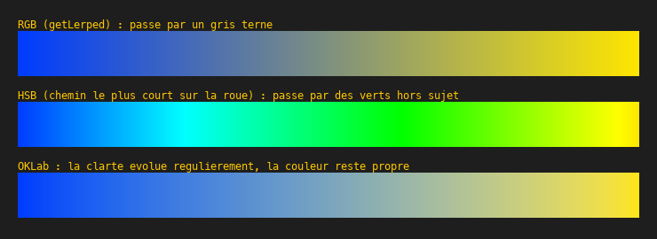
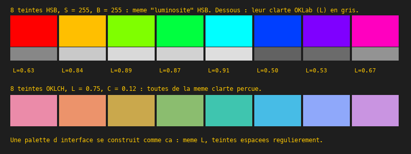

# Cours 11e — Espaces perceptuels : OKLab

> **Fichiers** : `ofApp11e.h` + `ofApp11e.cpp` (pas d'image, uniquement du dessin)
> **Avant** : cours 09 (HSB, dégradés), cours 11a (lumière linéaire), cours 16 (polaire).

Le cours 09 a présenté HSB comme la façon « humaine » de décrire une couleur. Ce cours montre sa limite : un jaune et un bleu de même luminosité HSB ne sont pas du tout aussi clairs l'un que l'autre, et un dégradé HSB passe par des couleurs qui n'ont rien à y faire. **OKLab** est un espace construit pour que les nombres suivent la perception. Il est entré dans le CSS en 2023.

## 1. Le problème



Trois dégradés entre le même bleu et le même jaune :

- **RGB** (`getLerped`, cours 09) : ligne droite dans le cube. Le milieu est un gris terne, parce que les deux couleurs sont presque opposées dans le cube et que leur moyenne tombe au centre.
- **HSB** : on interpole la teinte par le chemin le plus court sur la roue. Le dégradé traverse des verts et des cyans qui n'ont rien à voir avec un passage du bleu au jaune, et sa clarté fait des bonds.
- **OKLab** : la clarté évolue régulièrement, la couleur passe par un gris bleuté discret. C'est ce qu'un peintre ferait.

## 2. Ce qu'est OKLab

```cpp
struct Lab {
	float L;   // clarté 0-1
	float a;   // vert (-) / rouge (+)
	float b;   // bleu (-) / jaune (+)
};
```

Trois nombres, rangés dans une `struct` à nous (cours 07). **L** est la clarté perçue, de 0 (noir) à 1 (blanc). **a** et **b** sont deux axes de couleur, l'un du vert au rouge, l'autre du bleu au jaune, exactement comme Cb et Cr du cours 11d mais gradués selon la perception. Le gris est à `a = 0, b = 0`.

La propriété qui compte : **la distance entre deux couleurs dans OKLab correspond à la différence perçue**. Deux couleurs à égale distance d'une troisième paraissent aussi différentes l'une que l'autre. Ni RGB ni HSB n'ont cette propriété, et c'est ce qui rend leurs dégradés irréguliers.

## 3. La conversion

```cpp
Lab ofApp::versLab(ofColor c) {
	float r = versLineaire(c.r), g = versLineaire(c.g), bl = versLineaire(c.b);
	float l = 0.4122214708f * r + 0.5363325363f * g + 0.0514459929f * bl;
	float m = ...;  float s = ...;
	l = cbrt(l); m = cbrt(m); s = cbrt(s);
	Lab out;
	out.L = 0.2104542553f * l + 0.7936177850f * m - 0.0040720468f * s;
	...
	return out;
}
```

Trois étapes, chacune avec une raison :

1. **sRGB vers lumière linéaire** (cours 11a). Toute la suite parle de lumière.
2. **Un mélange linéaire vers trois réponses l, m, s.** Ce sont, à peu près, les réponses des trois types de cônes de la rétine, sensibles aux longues, moyennes et courtes longueurs d'onde. On simule l'œil.
3. **Racine cubique**, `cbrt`. L'œil répond de façon compressée : dix fois plus de lumière ne paraît pas dix fois plus clair. Puis un dernier mélange vers L, a, b.

Les nombres à dix décimales sont ceux publiés par Björn Ottosson en 2020. Personne ne les retient ; on les copie. La fonction `versRGB` fait les mêmes étapes à l'envers : mélange inverse, cube, mélange inverse, réencodage sRGB.

Le dégradé OKLab est alors trivial : convertir A et B, interpoler L, a et b séparément (trois `getLerped` sur des `float`), reconvertir. La ligne droite est dans le bon espace.

## 4. La luminosité HSB n'est pas la clarté



Huit couleurs à saturation et luminosité HSB maximales. Sous chacune, sa clarté L affichée en gris. Le jaune est à `L = 0.97`, presque blanc ; le bleu à `L = 0.45`, un ton moyen. HSB appelle ça la même « luminosité ». C'est pour ça qu'un texte jaune sur blanc est illisible et un texte bleu sur blanc très lisible, et qu'un graphique dont les séries sont des teintes HSB « équilibrées » a toujours une série qui crie et une autre qui s'efface.

## 5. OKLCH : la version polaire

```cpp
ofColor ofApp::depuisLCH(float L, float C, float h) {
	Lab lab;
	lab.L = L;
	lab.a = C * cos(h);
	lab.b = C * sin(h);
	return versRGB(lab);
}
```

Comme HSB est une lecture polaire de RGB, **OKLCH** est la lecture polaire d'OKLab : le point `(a, b)` est décrit par sa distance au gris, le **chroma C**, et son angle, la **teinte h**. La conversion est celle du cours 16, polaire vers cartésien.

Avec ça, la deuxième rangée de carrés : huit teintes espacées régulièrement sur le cercle, toutes avec `L = 0.75` et `C = 0.12`. Elles paraissent **toutes de la même clarté**. C'est comme ça qu'on construit une palette d'interface ou de graphique où aucune couleur ne domine, et c'est impossible en HSB. Le chroma est borné : à `L` donné, toutes les teintes n'acceptent pas le même `C` maximal avant de sortir de ce que l'écran peut afficher, d'où le `ofClamp` dans `versSRGB`.

## Exercices

1. La rotation de teinte du cours 11, en OKLCH : convertir chaque pixel, ajouter à `h`, revenir. Compare avec la version HSB : les clartés ne bougent plus.
2. Trie une liste de couleurs par clarté L, puis par teinte h. Affiche les deux rangées.
3. « Texte noir ou blanc sur ce fond ? » : si `L > 0.6`, noir, sinon blanc. Teste sur les huit couleurs HSB de la première rangée.
4. Reprends la réduction à cinq couleurs du cours 12 avec la distance dans OKLab au lieu de RGB. Les verts du feuillage et l'orange du pelage sont mieux répartis.

## Le code complet, pas à pas

Le programme entier, dans l'ordre des fichiers. Les blocs ci-dessous mis bout à bout donnent exactement `ofApp11e.cpp`.

### Le fichier `ofApp11e.h`

La table des matières du programme : les blocs qui existent et les variables partagées entre eux, avec leurs valeurs de départ.

```cpp
#pragma once
#include "ofMain.h"

// 11e - Espaces perceptuels : OKLab et OKLCH
// Nouveau : pas de sketch Processing d'origine
// Notions : HSB n'est pas uniforme (un jaune et un bleu de même "B" n'ont pas la même clarté) ;
//           OKLab est un espace où les distances correspondent à ce que l'oeil perçoit ;
//           L, a, b puis version polaire L, C, h (clarté, chroma, teinte) ; dégradés propres ;
//           palettes à clarté constante ; struct à trois float pour transporter une couleur
// Pas d'image : uniquement du dessin.

// Une couleur OKLab : trois nombres. On fabrique notre propre struct (cours 07).
struct Lab {
	float L;   // clarté 0-1
	float a;   // vert (-) / rouge (+)
	float b;   // bleu (-) / jaune (+)
};

class ofApp : public ofBaseApp {
public:
	void setup();
	void draw();
	void keyPressed(int key);

	float versLineaire(float c);
	float versSRGB(float l);
	Lab     versLab(ofColor c);
	ofColor versRGB(Lab lab);
	ofColor depuisLCH(float L, float C, float h);      // h en radians

	void bande(float y, int mode);      // dessine un dégradé de A vers B : 0 RGB, 1 HSB, 2 OKLab

	int paire = 1;
	ofColor A, B;
};
```

### En tête du fichier `ofApp11e.cpp`

L'inclusion du `.h`, qui rend visibles les variables partagées et les blocs déclarés.

```cpp
#include "ofApp11e.h"
```

### Étape 1 — `versLineaire()`

Fonction `versLineaire()`.

```cpp
float ofApp::versLineaire(float c) { return pow(c / 255.0f, 2.2f); }
```

### Étape 2 — `versSRGB()`

Fonction `versSRGB()`.

```cpp
float ofApp::versSRGB(float l)     { return 255.0f * pow(ofClamp(l, 0, 1), 1.0f / 2.2f); }
```

### Étape 3 — `versLab()`

sRGB -> OKLab (Björn Ottosson, 2020). Trois étapes.

```cpp
// sRGB -> OKLab (Björn Ottosson, 2020). Trois étapes :
// 1. sRGB -> lumière linéaire (cours 11a)
// 2. mélange linéaire vers trois réponses "l, m, s" proches des trois types de cônes de l'oeil
// 3. racine cubique (l'oeil répond de façon compressée) puis mélange vers L, a, b
Lab ofApp::versLab(ofColor c) {
	float r = versLineaire(c.r), g = versLineaire(c.g), bl = versLineaire(c.b);
	float l = 0.4122214708f * r + 0.5363325363f * g + 0.0514459929f * bl;
	float m = 0.2119034982f * r + 0.6806995451f * g + 0.1073969566f * bl;
	float s = 0.0883024619f * r + 0.2817188376f * g + 0.6299787005f * bl;
	l = cbrt(l); m = cbrt(m); s = cbrt(s);
	Lab out;
	out.L = 0.2104542553f * l + 0.7936177850f * m - 0.0040720468f * s;
	out.a = 1.9779984951f * l - 2.4285922050f * m + 0.4505937099f * s;
	out.b = 0.0259040371f * l + 0.7827717662f * m - 0.8086757660f * s;
	return out;
}
```

### Étape 4 — `versRGB()`

OKLab -> sRGB : les mêmes étapes à l'envers.

```cpp
// OKLab -> sRGB : les mêmes étapes à l'envers
ofColor ofApp::versRGB(Lab lab) {
	float l = lab.L + 0.3963377774f * lab.a + 0.2158037573f * lab.b;
	float m = lab.L - 0.1055613458f * lab.a - 0.0638541728f * lab.b;
	float s = lab.L - 0.0894841775f * lab.a - 1.2914855480f * lab.b;
	l = l * l * l; m = m * m * m; s = s * s * s;
	float r  =  4.0767416621f * l - 3.3077115913f * m + 0.2309699292f * s;
	float g  = -1.2684380046f * l + 2.6097574011f * m - 0.3413193965f * s;
	float bl = -0.0041960863f * l - 0.7034186147f * m + 1.7076147010f * s;
	return ofColor(versSRGB(r), versSRGB(g), versSRGB(bl));
}
```

### Étape 5 — `depuisLCH()`

Version polaire de OKLab, comme HSB est la version polaire de RGB : L clarté, C chroma.

```cpp
// Version polaire de OKLab, comme HSB est la version polaire de RGB : L clarté, C chroma
// (distance au gris : 0 gris, 0.3 très saturé), h teinte en radians (cours 13 et 16).
ofColor ofApp::depuisLCH(float L, float C, float h) {
	Lab lab;
	lab.L = L;
	lab.a = C * cos(h);
	lab.b = C * sin(h);
	return versRGB(lab);
}
```

### Étape 6 — `setup()`

Exécuté une fois au lancement : la fenêtre, les chargements, les valeurs de départ.

```cpp
void ofApp::setup() {
	ofSetWindowShape(800, 620);
	keyPressed('1');
}
```

### Étape 7 — `bande()`

Fonction `bande()`.

```cpp
void ofApp::bande(float y, int mode) {
	float w = ofGetWidth() - 40;
	for (int x = 0; x < w; x++) {
		float p = x / w;
		ofColor c;
		if (mode == 0) {
			// RGB : une ligne droite dans le cube (cours 09). Passe souvent par un gris terne.
			c = A.getLerped(B, p);
		} else if (mode == 1) {
			// HSB : on interpole la teinte par le chemin le plus court sur la roue, plus S et B
			float h1 = A.getHue(), h2 = B.getHue();
			float d = h2 - h1;
			if (d > 127.5f) d -= 255;
			if (d < -127.5f) d += 255;
			float h = fmod(h1 + d * p + 255, 255);
			c = ofColor::fromHsb(h, A.getSaturation() + (B.getSaturation() - A.getSaturation()) * p,
			                        A.getBrightness() + (B.getBrightness() - A.getBrightness()) * p);
		} else {
			// OKLab : ligne droite dans un espace perceptuel. La clarté évolue régulièrement.
			Lab la = versLab(A), lb = versLab(B);
			Lab m;
			m.L = la.L + (lb.L - la.L) * p;
			m.a = la.a + (lb.a - la.a) * p;
			m.b = la.b + (lb.b - la.b) * p;
			c = versRGB(m);
		}
		ofSetColor(c);
		ofDrawLine(20 + x, y, 20 + x, y + 50);
	}
}
```

### Étape 8 — `draw()`

Exécuté à chaque frame, après `update()` : uniquement du dessin.

```cpp
void ofApp::draw() {
	ofBackground(30);
	ofSetColor(255, 200, 0);
	ofDrawBitmapString("Degrade entre deux couleurs (touches 1 a 4 pour changer la paire)", 20, 20);
	ofDrawBitmapString("RGB (getLerped)", 20, 45);   bande(50, 0);
	ofSetColor(255, 200, 0);
	ofDrawBitmapString("HSB (teinte par le chemin le plus court)", 20, 120);  bande(125, 1);
	ofSetColor(255, 200, 0);
	ofDrawBitmapString("OKLab", 20, 195);  bande(200, 2);

	// ---- Même "luminosité" HSB, clartés très différentes ----
	ofSetColor(255, 200, 0);
	ofDrawBitmapString("8 teintes HSB avec S = 255 et B = 255 (meme 'luminosite' HSB). Dessous : leur clarte OKLab en gris.", 20, 290);
	for (int i = 0; i < 8; i++) {
		ofColor c = ofColor::fromHsb(i * 255 / 8.0f, 255, 255);
		ofSetColor(c);
		ofDrawRectangle(20 + i * 95, 300, 90, 60);
		float L = versLab(c).L;
		ofSetColor(versSRGB(L * L * L));          // L^3 ~ lumière : on l'affiche comme un gris
		ofDrawRectangle(20 + i * 95, 362, 90, 25);
		ofSetColor(255, 200, 0);
		ofDrawBitmapString("L=" + ofToString(L, 2), 25 + i * 95, 405);
	}

	// ---- Palette à clarté constante en OKLCH : ce que HSB ne sait pas faire ----
	ofDrawBitmapString("8 teintes OKLCH avec L = 0.75 et C = 0.12 : toutes de la meme clarte percue", 20, 450);
	for (int i = 0; i < 8; i++) {
		ofSetColor(depuisLCH(0.75f, 0.12f, i * TWO_PI / 8));
		ofDrawRectangle(20 + i * 95, 460, 90, 60);
	}
	ofSetColor(255, 200, 0);
	ofDrawBitmapString("C'est ainsi qu'on fabrique une palette d'interface ou de graphique lisible :", 20, 550);
	ofDrawBitmapString("meme L pour que rien ne 'crie', et des teintes espacees regulierement.", 20, 570);
}
```

### Étape 9 — `keyPressed()`

Appelé automatiquement à chaque touche pressée.

```cpp
void ofApp::keyPressed(int key) {
	if (key == '1') { A = ofColor(0, 60, 255);    B = ofColor(255, 230, 0);  paire = 1; }   // bleu -> jaune
	if (key == '2') { A = ofColor(255, 0, 0);     B = ofColor(0, 200, 0);    paire = 2; }   // rouge -> vert
	if (key == '3') { A = ofColor(20, 20, 120);   B = ofColor(255, 255, 255); paire = 3; }  // bleu nuit -> blanc
	if (key == '4') { A = ofColor(255, 0, 255);   B = ofColor(0, 255, 255);  paire = 4; }   // magenta -> cyan
}
```

### En fin de fichier

Les notes et pistes laissées en commentaire dans le code.

```cpp
// Exercices :
// - la rotation de teinte du cours 11 en OKLCH : convertir chaque pixel, ajouter à h, revenir. Comparer avec HSB.
// - trier une liste de couleurs par clarté L, puis par teinte h
// - "quelle couleur de texte, noir ou blanc, sur ce fond ?" : L > 0.6 => noir, sinon blanc
// - distance entre deux couleurs = distance dans OKLab (cours 12) : refaire la réduction à 5 couleurs avec cette distance
```

## Ce qu'il faut retenir

- Dans OKLab, la distance entre deux couleurs correspond à la différence perçue. Ni RGB ni HSB n'ont cette propriété.
- L clarté, a vert-rouge, b bleu-jaune. Conversion : linéaire, mélange vers l, m, s, racine cubique, mélange.
- La luminosité HSB n'est pas la clarté : jaune `L = 0.97`, bleu `L = 0.45` à B égal.
- OKLCH est la version polaire : `a = C cos(h)`, `b = C sin(h)`. Palette équilibrée = même L, même C, teintes espacées.
- Une `struct` à trois `float` transporte une couleur dans un autre espace.
