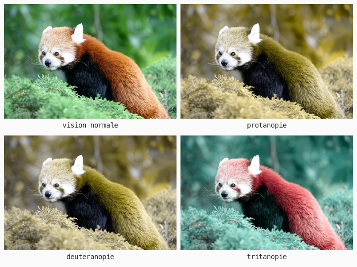
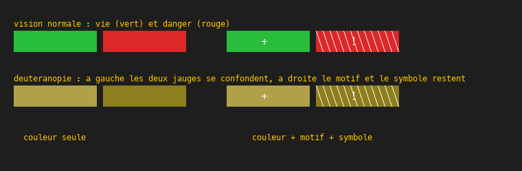

# Cours 11f — Daltonisme et accessibilité

> **Fichiers** : `ofApp11f.h` + `ofApp11f.cpp`, image `data/pandaroux.jpg`
> **Avant** : cours 11 (sépia, mélange des canaux), cours 11a (lumière linéaire).

Environ un homme sur douze et une femme sur deux cents ne voient pas les couleurs comme la majorité. Un jeu où « vert = allié, rouge = ennemi » est injouable pour eux si rien d'autre ne distingue les deux. Ce cours simule leur vision avec neuf nombres, et en tire une règle de conception.



## 1. Trois types de cônes, trois déficiences

La rétine a trois types de cônes, sensibles aux longues, moyennes et courtes longueurs d'onde, grossièrement rouge, vert et bleu. Quand un type manque ou répond mal :

| Déficience | Cône touché | Fréquence | Ce qui se confond |
|---|---|---|---|
| protanopie | rouge | environ 1 % des hommes | rouge et vert ; les rouges paraissent sombres |
| deutéranopie | vert | environ 6 % des hommes, la plus courante | rouge et vert |
| tritanopie | bleu | très rare | bleu et vert, jaune et rose |

Les formes complètes, avec un type de cône absent, sont rares. Les formes partielles, où le cône répond mal, sont bien plus fréquentes : c'est la « sévérité » que règle la souris.

## 2. Une matrice 3 × 3

```cpp
float r2 = matrice[0] * r + matrice[1] * g + matrice[2] * b;
float g2 = matrice[3] * r + matrice[4] * g + matrice[5] * b;
float b2 = matrice[6] * r + matrice[7] * g + matrice[8] * b;
```

Chaque canal de sortie est un **mélange pondéré des trois canaux d'entrée**. Neuf poids, rangés ligne par ligne dans une liste, indice `ligne * 3 + colonne` (cours 17). Le sépia du cours 11 avait exactement cette forme, et la vision normale est la matrice identité : `1 0 0 / 0 1 0 / 0 0 1`, chaque canal ne dépend que de lui-même.

Les matrices de simulation viennent d'une étude de 2009 (Machado, Oliveira et Fernandes). Elles projettent chaque couleur sur ce qu'un œil sans le cône concerné peut encore distinguer : deux couleurs qu'il confond donnent la même sortie. Elles s'appliquent à la **lumière linéaire** (cours 11a), pas aux valeurs sRGB, puisqu'elles décrivent une réponse physique de l'œil.

```cpp
for (int i = 0; i < 9; i++) {
	matrice[i] = identite[i] + (cible[i] - identite[i]) * severite;
}
```

La sévérité interpole case par case entre l'identité et la matrice complète : l'interpolation du cours 09, appliquée à neuf nombres. À mi-course, on voit à peu près ce que voit un daltonien partiel.

## 3. Le test qui compte : l'interface



Le panda est joli mais le vrai enjeu est en bas de la fenêtre. Deux jauges, vie en vert et danger en rouge :

- À gauche, l'information n'est portée **que par la couleur**. En deutéranopie, les deux jauges sont du même brun. Le joueur ne sait pas laquelle est laquelle.
- À droite, la jauge de danger porte aussi des **hachures** et un **symbole**. En deutéranopie, la couleur a disparu mais l'information est intacte.

La règle tient en une phrase : **ne jamais coder une information par la couleur seule**. Toujours la doubler d'une forme, d'un motif, d'un texte, d'une position ou d'une différence de clarté. Un daltonien voit très bien les différences de clarté (cours 11e) : deux couleurs qui diffèrent aussi en L restent distinguables même quand leurs teintes se confondent.

Les « modes daltoniens » des jeux font deux choses : ils remplacent les palettes qui posent problème, et parfois ils **daltonisent** l'image entière, en renforçant les différences que le type visé ne voit pas, ce qui est le premier exercice ci-dessous.

## 4. Pourquoi tester avec un simulateur

Un concepteur qui voit normalement ne peut pas deviner ce qui se confond. Le simulateur est le seul moyen de vérifier, et il faut le faire tôt, quand la palette est encore modifiable. Photoshop, Unity et Unreal en ont un intégré, ainsi que les navigateurs. Celui de ce cours tient en trente lignes, et il peut s'appliquer à n'importe quelle capture d'écran de ton jeu.

## Exercices

1. Daltoniser pour la deutéranopie : calcule la simulation, mesure l'erreur `r - r2` que le daltonien ne voit pas, et ajoute une partie de cette erreur au canal bleu, qu'il voit. Compare l'image daltonisée passée dans le simulateur avec l'image d'origine passée dans le simulateur : les rouges et les verts sont-ils redevenus distinguables ?
2. Le sépia du cours 11 est une matrice : ajoute-le comme type 4.
3. Prends la palette d'un jeu que tu aimes, ou la tienne. Affiche ses couleurs en pavés et passe-les dans les trois simulations. Marque les paires qui se confondent, et corrige-les avec une différence de clarté L (cours 11e).
4. Applique la matrice directement aux valeurs sRGB, sans passer par le linéaire. La différence est petite ; trouve une zone de l'image où elle se voit.

## Le code complet, pas à pas

Le programme entier, dans l'ordre des fichiers. Les blocs ci-dessous mis bout à bout donnent exactement `ofApp11f.cpp`.

### Le fichier `ofApp11f.h`

La table des matières du programme : les blocs qui existent et les variables partagées entre eux, avec leurs valeurs de départ.

```cpp
#pragma once
#include "ofMain.h"

// 11f - Daltonisme et accessibilité
// Nouveau : pas de sketch Processing d'origine
// Notions : simuler la vision d'un daltonien avec une matrice 3 x 3 appliquée à chaque pixel
//           (chaque canal de sortie est un mélange des trois canaux d'entrée, comme le sépia) ;
//           les trois types (protanopie, deutéranopie, tritanopie) ; sévérité par interpolation
//           avec l'identité ; règle d'accessibilité : ne jamais coder une information par la
//           couleur seule ; std::vector<float> de 9 valeurs comme matrice, indice ligne * 3 + colonne
// Ressource : bin/data/pandaroux.jpg (774 x 516)

class ofApp : public ofBaseApp {
public:
	void setup();
	void update();
	void draw();
	void keyPressed(int key);

	float   versLineaire(float c);
	float   versSRGB(float l);
	ofColor simuler(ofColor c);
	void    calculerImage();
	void    dessinerTest(float x, float y);

	ofImage source;
	ofImage resultat;
	std::vector<float> matrice;      // 9 valeurs, ligne par ligne
	std::vector<float> tableLineaire;

	int   type = 0;                  // 0 normal, 1 protanopie, 2 deutéranopie, 3 tritanopie
	float severite = 1;
	int   dernierType = -1;
	float derniereSeverite = -1;
	std::vector<std::string> noms = { "vision normale", "protanopie (pas de cones rouges)", "deuteranopie (pas de cones verts)", "tritanopie (pas de cones bleus)" };
	std::vector<std::string> frequence = { "", "~1 % des hommes", "~6 % des hommes (la plus courante)", "tres rare" };
};
```

### En tête du fichier `ofApp11f.cpp`

L'inclusion du `.h`, qui rend visibles les variables partagées et les blocs déclarés.

```cpp
#include "ofApp11f.h"
```

### Étape 1 — `versLineaire()`

Fonction `versLineaire()`.

```cpp
float ofApp::versLineaire(float c) { return pow(c / 255.0f, 2.2f); }
```

### Étape 2 — `versSRGB()`

Fonction `versSRGB()`.

```cpp
float ofApp::versSRGB(float l)     { return 255.0f * pow(ofClamp(l, 0, 1), 1.0f / 2.2f); }
```

### Étape 3 — `setup()`

Exécuté une fois au lancement : la fenêtre, les chargements, les valeurs de départ.

```cpp
void ofApp::setup() {
	ofSetWindowShape(774, 516);
	if (!source.load("pandaroux.jpg")) {
		ofLogError() << "pandaroux.jpg introuvable dans bin/data";
	}
	resultat.allocate(source.getWidth(), source.getHeight(), OF_IMAGE_COLOR);
	for (int c = 0; c < 256; c++) tableLineaire.push_back(versLineaire(c));
	matrice = std::vector<float>(9, 0);
}
```

### Étape 4 — `simuler()`

Une matrice 3 x 3 : chaque canal de sortie est un mélange pondéré des trois canaux d'entrée.

```cpp
// Une matrice 3 x 3 : chaque canal de sortie est un mélange pondéré des trois canaux d'entrée.
//   r' = m0 * r + m1 * g + m2 * b
//   g' = m3 * r + m4 * g + m5 * b
//   b' = m6 * r + m7 * g + m8 * b
// L'identité (vision normale) est 1 0 0 / 0 1 0 / 0 0 1. Les matrices ci-dessous (Machado et al., 2009)
// projettent les couleurs sur ce que perçoit un oeil auquel il manque un type de cône.
// Elles s'appliquent à la lumière linéaire (cours 11a), pas aux valeurs sRGB.
ofColor ofApp::simuler(ofColor c) {
	float r = tableLineaire[c.r], g = tableLineaire[c.g], b = tableLineaire[c.b];
	float r2 = matrice[0] * r + matrice[1] * g + matrice[2] * b;
	float g2 = matrice[3] * r + matrice[4] * g + matrice[5] * b;
	float b2 = matrice[6] * r + matrice[7] * g + matrice[8] * b;
	return ofColor(versSRGB(r2), versSRGB(g2), versSRGB(b2));
}
```

### Étape 5 — `calculerImage()`

Fonction `calculerImage()`.

```cpp
void ofApp::calculerImage() {
	std::vector<float> cible;
	switch (type) {
	case 1: cible = { 0.152286f,  1.052583f, -0.204868f,   0.114503f, 0.786281f, 0.099216f,  -0.003882f, -0.048116f, 1.051998f }; break;
	case 2: cible = { 0.367322f,  0.860646f, -0.227968f,   0.280085f, 0.672501f, 0.047413f,  -0.011820f,  0.042940f, 0.968881f }; break;
	case 3: cible = { 1.255528f, -0.076749f, -0.178779f,  -0.078411f, 0.930809f, 0.147602f,   0.004733f,  0.691367f, 0.303900f }; break;
	default: cible = { 1, 0, 0,  0, 1, 0,  0, 0, 1 };
	}
	// Sévérité : on interpole entre l'identité et la matrice cible, case par case.
	// (Une vraie déficience partielle, plus fréquente que l'absence totale, ressemble à ça.)
	std::vector<float> identite = { 1, 0, 0,  0, 1, 0,  0, 0, 1 };
	for (int i = 0; i < 9; i++) {
		matrice[i] = identite[i] + (cible[i] - identite[i]) * severite;
	}

	int w = source.getWidth();
	int h = source.getHeight();
	for (int y = 0; y < h; y++) {
		for (int x = 0; x < w; x++) {
			resultat.setColor(x, y, simuler(source.getColor(x, y)));
		}
	}
	resultat.update();
}
```

### Étape 6 — `update()`

Exécuté à chaque frame, avant le dessin : tout ce qui change.

```cpp
void ofApp::update() {
	severite = mouseX / (float)ofGetWidth();
	if (type != dernierType || severite != derniereSeverite) {
		calculerImage();
		dernierType = type;
		derniereSeverite = severite;
	}
}
```

### Étape 7 — `dessinerTest()`

Un bout d'interface de jeu : deux jauges. À gauche, l'information n'est portée QUE par la couleur.

```cpp
// Un bout d'interface de jeu : deux jauges. À gauche, l'information n'est portée QUE par la couleur.
// À droite, elle est aussi portée par un motif et un symbole : lisible quelle que soit la vision.
void ofApp::dessinerTest(float x, float y) {
	ofColor vie(40, 190, 60), danger(220, 40, 40);
	ofFill();
	ofSetColor(simuler(vie));    ofDrawRectangle(x, y, 120, 30);
	ofSetColor(simuler(danger)); ofDrawRectangle(x + 130, y, 120, 30);

	ofSetColor(simuler(vie));    ofDrawRectangle(x + 300, y, 120, 30);
	ofSetColor(simuler(danger)); ofDrawRectangle(x + 430, y, 120, 30);
	ofSetColor(simuler(ofColor(255)));
	for (int i = 0; i < 120; i += 10) ofDrawLine(x + 430 + i, y, x + 430 + i + 10, y + 30);   // hachures sur le danger
	ofDrawBitmapString("+", x + 355, y + 20);
	ofDrawBitmapString("!", x + 485, y + 20);

	ofSetColor(255, 200, 0);
	ofDrawBitmapString("couleur seule", x, y + 45);
	ofDrawBitmapString("couleur + motif + symbole", x + 300, y + 45);
}
```

### Étape 8 — `draw()`

Exécuté à chaque frame, après `update()` : uniquement du dessin.

```cpp
void ofApp::draw() {
	ofSetColor(255);
	resultat.draw(0, 0);

	ofSetColor(0, 0, 0, 170);
	ofDrawRectangle(0, ofGetHeight() - 110, ofGetWidth(), 110);
	dessinerTest(20, ofGetHeight() - 95);

	ofSetColor(255, 200, 0);
	ofDrawBitmapString("Type " + ofToString(type) + " : " + noms[type] + "  " + frequence[type], 10, 20);
	ofDrawBitmapString("severite " + ofToString(severite, 2) + " (souris)     touches 0 a 3", 10, 40);
}
```

### Étape 9 — `keyPressed()`

Appelé automatiquement à chaque touche pressée.

```cpp
void ofApp::keyPressed(int key) {
	if (key >= '0' && key <= '3') type = key - '0';
}
```

### En fin de fichier

Les notes et pistes laissées en commentaire dans le code.

```cpp
// Exercices :
// - "daltoniser" : renforcer les différences que le type choisi ne voit pas, par exemple ajouter à b
//   une partie de (r - r') pour un deutéranope. C'est ce que font les modes daltoniens des jeux.
// - le sépia du cours 11 est une matrice : l'écrire dans ce programme comme type 4
// - vérifier une palette : afficher tes couleurs d'interface dans la vue deutéranopie ; deux couleurs
//   qui se confondent doivent différer aussi par la clarté (cours 11e) ou par un motif
// - la même matrice appliquée sans passer par le linéaire : comparer, la différence est petite mais réelle
```

## Ce qu'il faut retenir

- Trois types de cônes ; la déficience la plus courante, la deutéranopie, confond rouges et verts et touche environ 6 % des hommes.
- Une matrice 3 × 3 mélange les canaux ; la simulation est une matrice appliquée en lumière linéaire, l'identité est la vision normale, la sévérité interpole entre les deux.
- Ne jamais coder une information par la couleur seule. Doubler par un motif, un symbole, un texte ou une différence de clarté.
- Tester tôt, avec un simulateur, tant que la palette peut changer.
