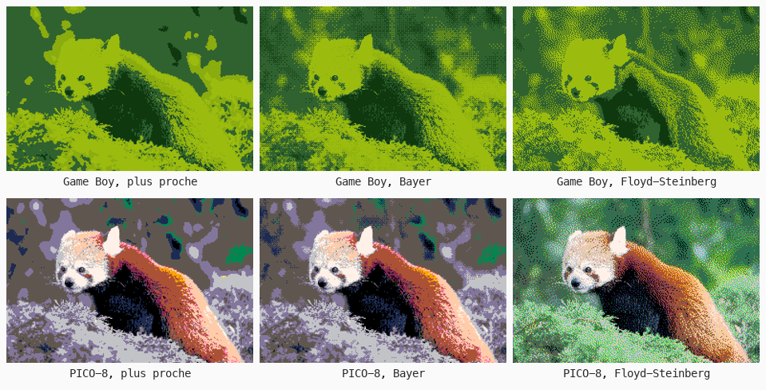
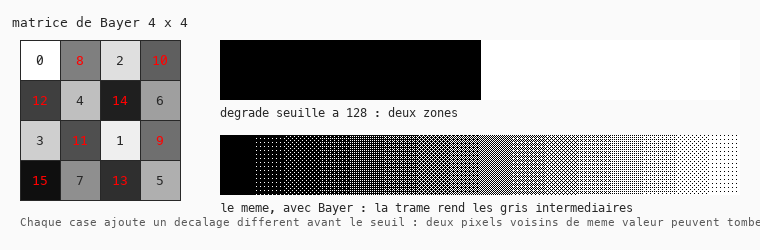

# Cours 11g — Palette indexée et dithering

> **Fichiers** : `ofApp11g.h` + `ofApp11g.cpp`, image `data/pandaroux.jpg`
> **Avant** : cours 12 (distance entre couleurs), cours 14 (gros pixels), cours 11 (postérisation).

Les vieilles machines n'avaient pas 16 millions de couleurs : quatre sur Game Boy, seize sur les consoles 8 bits, 256 sur les PC. Pour afficher une photo, il fallait choisir pour chaque pixel la couleur **la plus proche** dans la palette, et tromper l'œil pour les nuances manquantes. Ces techniques sont revenues à la mode avec le pixel art, et elles expliquent le dithering du cours 09a.



## 1. La couleur la plus proche

```cpp
ofColor ofApp::plusProche(float r, float g, float b) {
	float meilleure = 1e9;
	ofColor gagnante = palette[0];
	for (int i = 0; i < palette.size(); i++) {
		float dr = r - palette[i].r, dg = g - palette[i].g, db = b - palette[i].b;
		float d = dr * dr + dg * dg + db * db;
		if (d < meilleure) { meilleure = d; gagnante = palette[i]; }
	}
	return gagnante;
}
```

La palette est une liste d'`ofColor`. Pour chaque couleur de la palette, on calcule la distance dans le cube RGB (cours 09 et 12), et on garde la plus petite. Deux détails : `1e9` est la notation de un milliard, une valeur de départ que n'importe quelle vraie distance battra ; et on compare les distances **au carré**, sans `sqrt`, parce que si `d1² < d2²` alors `d1 < d2`, et que la racine coûte cher pour rien.

C'est la postérisation du cours 11, mais vers des couleurs choisies au lieu de multiples de 32. Résultat : des aplats. Le dégradé du pelage devient trois zones nettes.

## 2. Travailler sur des gros pixels

```cpp
int gw = w / n, gh = h / n;
ofColor c = source.getColor(i * n + n / 2, j * n + n / 2);
```

Pour le rendu rétro et pour aller vite, on travaille sur une grille de cases de `n × n` pixels : on lit le pixel au centre de chaque case, on décide sa couleur, on remplit la case. C'est la pixelisation du cours 14. Les trois listes `R`, `G`, `B` de `float` gardent une copie de l'image réduite, indice `j * gw + i` (cours 17), parce que la troisième méthode va **modifier** ces valeurs en cours de route.

## 3. Dithering ordonné : la matrice de Bayer



```cpp
int bayer[16] = { 0, 8, 2, 10,  12, 4, 14, 6,  3, 11, 1, 9,  15, 7, 13, 5 };
float d = (bayer[(j % 4) * 4 + (i % 4)] / 16.0f - 0.5f) * ecart;
r += d; g += d; b += d;
```

Avant de chercher la couleur la plus proche, on **décale** la couleur d'une valeur qui dépend de la position dans une grille 4 × 4. Les seize valeurs sont réparties dans un ordre précis, ni régulier ni aléatoire, pour que les voisines soient toujours très différentes. Deux pixels côte à côte de même couleur d'origine reçoivent des décalages différents et peuvent tomber sur deux couleurs différentes de la palette. Vu de loin, l'œil mélange les deux : une nuance intermédiaire apparaît, faite d'une trame régulière.

`ecart` est la distance entre deux couleurs de la palette, `255 / palette.size()` : le décalage doit être assez grand pour faire basculer un pixel vers la couleur voisine, pas plus. Le `%` du cours 13 fait boucler la grille.

C'est le dithering des jeux Game Boy et des impressions de journaux, reconnaissable à sa trame en damier. Il est rapide et stable dans le temps : si l'image bouge, la trame ne grouille pas.

## 4. Diffusion d'erreur : Floyd-Steinberg

```cpp
ofColor q = plusProche(r, g, b);
float er = r - q.r, eg = g - q.g, eb = b - q.b;
R[k + 1]      += er * 7 / 16;    // le pixel de droite
R[k + gw - 1] += er * 3 / 16;    // en bas à gauche
R[k + gw]     += er * 5 / 16;    // en bas
R[k + gw + 1] += er * 1 / 16;    // en bas à droite
```

Autre idée : quand on remplace une couleur par la plus proche de la palette, on commet une **erreur**, la différence entre les deux. Au lieu de la perdre, on la **répartit sur les voisins pas encore traités**, à droite et sur la ligne du dessous, avec des poids qui font 16/16 en tout. Si un pixel a été rendu un peu trop sombre, ses voisins seront poussés vers le clair, et l'un d'eux basculera. Localement, la couleur moyenne est respectée.

C'est pour ça que les listes `R`, `G`, `B` sont des `float` modifiables : la boucle lit une valeur qui a déjà été corrigée par ses voisins de gauche et du dessus. L'ordre de parcours, ligne par ligne de gauche à droite, n'est plus un détail : il fait partie de l'algorithme. Les `if` évitent d'écrire hors de la grille (cours 04).

Le résultat est plus fin que Bayer, sans trame visible, plus proche d'une photo. Son défaut : sur une image animée, la trame change à chaque frame et grouille. C'est le dithering des GIF et des vieux logiciels de dessin.

## 5. La palette compte autant que l'algorithme

Passe de Game Boy à PICO-8 avec la touche `p`. Seize couleurs bien choisies, couvrant les clartés du noir au blanc et quelques teintes chaudes et froides, rendent une photo reconnaissable. Quatre verts, non. Choisir une palette est un métier : les couleurs doivent être **réparties en clarté** d'abord (cours 11e), en teinte ensuite. Les palettes des consoles historiques sont étudiées pour ça, et le pixel art moderne en réutilise beaucoup.

## Exercices

1. Ta propre palette de huit couleurs, choisies avec OKLCH (cours 11e) pour couvrir les clartés de 0.2 à 0.9.
2. Remplace la distance RGB dans `plusProche` par la distance dans OKLab. Les verts du feuillage et les tons du pelage sont mieux rendus, surtout en Game Boy.
3. Bayer 8 × 8 : 64 seuils, trame plus fine. La matrice se construit en récursif à partir de la 4 × 4 ; cherche « Bayer matrix » et copie-la.
4. La moyenne de la case `n × n` au lieu du pixel central, avec `moyenneBloc` du cours 11d. Moins de scintillement en changeant `n`.
5. Le dithering en noir et blanc d'un dégradé noir vers blanc, avec les trois méthodes côte à côte : on voit exactement ce que fait chacune.

## Le code complet, pas à pas

Le programme entier, dans l'ordre des fichiers. Les blocs ci-dessous mis bout à bout donnent exactement `ofApp11g.cpp`.

### Le fichier `ofApp11g.h`

La table des matières du programme : les blocs qui existent et les variables partagées entre eux, avec leurs valeurs de départ.

```cpp
#pragma once
#include "ofMain.h"

// 11g - Palette indexée et dithering
// Nouveau : pas de sketch Processing d'origine
// Notions : réduire une image à une palette de quelques couleurs (couleur la plus proche par
//           distance RGB, cours 12) ; le dithering casse les aplats en mélangeant deux couleurs
//           de la palette : ordonné (matrice de Bayer) et par diffusion d'erreur (Floyd-Steinberg) ;
//           travailler sur une grille de gros pixels (rendu rétro) ; vector<ofColor> comme palette
// Ressource : bin/data/pandaroux.jpg (774 x 516)

class ofApp : public ofBaseApp {
public:
	void setup();
	void update();
	void draw();
	void keyPressed(int key);

	void    choisirPalette();
	ofColor plusProche(float r, float g, float b);
	void    calculerImage();

	ofImage source;
	ofImage resultat;
	std::vector<ofColor> palette;
	int   numPalette = 0;
	std::vector<std::string> nomsPalette = { "Game Boy (4 verts)", "noir et blanc (2)", "CGA (4)", "PICO-8 (16)" };

	int   methode = 1;               // 1 plus proche, 2 Bayer, 3 Floyd-Steinberg
	int   taillePixel = 3;
	int   derniereMethode = -1, dernierPixel = -1, dernierePalette = -1;
	std::vector<std::string> noms = { "", "couleur la plus proche", "dithering ordonne (Bayer 4x4)", "dithering par diffusion d'erreur (Floyd-Steinberg)" };
};
```

### En tête du fichier `ofApp11g.cpp`

L'inclusion du `.h`, qui rend visibles les variables partagées et les blocs déclarés.

```cpp
#include "ofApp11g.h"
```

### Étape 1 — `setup()`

Exécuté une fois au lancement : la fenêtre, les chargements, les valeurs de départ.

```cpp
void ofApp::setup() {
	ofSetWindowShape(774, 516);
	if (!source.load("pandaroux.jpg")) {
		ofLogError() << "pandaroux.jpg introuvable dans bin/data";
	}
	resultat.allocate(source.getWidth(), source.getHeight(), OF_IMAGE_COLOR);
	choisirPalette();
}
```

### Étape 2 — `choisirPalette()`

Fonction `choisirPalette()`.

```cpp
void ofApp::choisirPalette() {
	palette.clear();
	switch (numPalette) {
	case 1:
		palette = { ofColor(0), ofColor(255) };
		break;
	case 2: // CGA, palette 1 : noir, cyan, magenta, blanc
		palette = { ofColor(0, 0, 0), ofColor(85, 255, 255), ofColor(255, 85, 255), ofColor(255, 255, 255) };
		break;
	case 3: // PICO-8, la console imaginaire
		palette = { ofColor(0, 0, 0), ofColor(29, 43, 83), ofColor(126, 37, 83), ofColor(0, 135, 81),
		            ofColor(171, 82, 54), ofColor(95, 87, 79), ofColor(194, 195, 199), ofColor(255, 241, 232),
		            ofColor(255, 0, 77), ofColor(255, 163, 0), ofColor(255, 236, 39), ofColor(0, 228, 54),
		            ofColor(41, 173, 255), ofColor(131, 118, 156), ofColor(255, 119, 168), ofColor(255, 204, 170) };
		break;
	default: // Game Boy : quatre nuances de vert
		palette = { ofColor(15, 56, 15), ofColor(48, 98, 48), ofColor(139, 172, 15), ofColor(155, 188, 15) };
	}
}
```

### Étape 3 — `plusProche()`

La couleur de la palette la plus proche : distance dans le cube RGB (cours 09, 12).

```cpp
// La couleur de la palette la plus proche : distance dans le cube RGB (cours 09, 12)
ofColor ofApp::plusProche(float r, float g, float b) {
	float meilleure = 1e9;
	ofColor gagnante = palette[0];
	for (int i = 0; i < palette.size(); i++) {
		float dr = r - palette[i].r, dg = g - palette[i].g, db = b - palette[i].b;
		float d = dr * dr + dg * dg + db * db;       // pas besoin de sqrt pour comparer
		if (d < meilleure) {
			meilleure = d;
			gagnante = palette[i];
		}
	}
	return gagnante;
}
```

### Étape 4 — `calculerImage()`

Fonction `calculerImage()`.

```cpp
void ofApp::calculerImage() {
	int w = source.getWidth();
	int h = source.getHeight();
	int n = taillePixel;
	int gw = w / n, gh = h / n;                 // la grille de gros pixels

	// Copie flottante de l'image réduite : on aura besoin de modifier les valeurs (diffusion d'erreur)
	std::vector<float> R(gw * gh), G(gw * gh), B(gw * gh);
	for (int j = 0; j < gh; j++) {
		for (int i = 0; i < gw; i++) {
			ofColor c = source.getColor(i * n + n / 2, j * n + n / 2);    // le pixel au centre de la case
			R[j * gw + i] = c.r; G[j * gw + i] = c.g; B[j * gw + i] = c.b;
		}
	}

	// Matrice de Bayer 4 x 4 : 16 seuils répartis "en désordre ordonné", valeurs 0 à 15
	int bayer[16] = { 0, 8, 2, 10,  12, 4, 14, 6,  3, 11, 1, 9,  15, 7, 13, 5 };
	float ecart = 255.0f / palette.size();     // amplitude du décalage : l'écart entre deux couleurs de la palette

	for (int j = 0; j < gh; j++) {
		for (int i = 0; i < gw; i++) {
			int k = j * gw + i;
			// On borne : l'erreur diffusée (méthode 3) peut pousser une valeur hors de 0-255,
			// et une couleur que la palette ne sait pas représenter ferait grossir l'erreur sans fin.
			float r = ofClamp(R[k], 0, 255), g = ofClamp(G[k], 0, 255), b = ofClamp(B[k], 0, 255);

			if (methode == 2) {
				// Ordonné : on décale la couleur d'une valeur qui dépend de la position dans la grille 4 x 4,
				// entre -ecart/2 et +ecart/2. Deux pixels voisins de même couleur d'origine peuvent alors
				// tomber sur deux couleurs différentes de la palette : vu de loin, ça se mélange.
				float d = (bayer[(j % 4) * 4 + (i % 4)] / 16.0f - 0.5f) * ecart;
				r += d; g += d; b += d;
			}

			ofColor q = plusProche(r, g, b);

			if (methode == 3) {
				// Diffusion d'erreur : ce que la palette n'a pas pu représenter (l'erreur) est ajouté
				// aux voisins pas encore traités (à droite, et la ligne du dessous). L'erreur ne se perd pas,
				// elle se compense localement : le ton moyen est respecté.
				float er = r - q.r, eg = g - q.g, eb = b - q.b;
				if (i + 1 < gw)              { R[k + 1]      += er * 7 / 16; G[k + 1]      += eg * 7 / 16; B[k + 1]      += eb * 7 / 16; }
				if (j + 1 < gh && i > 0)     { R[k + gw - 1] += er * 3 / 16; G[k + gw - 1] += eg * 3 / 16; B[k + gw - 1] += eb * 3 / 16; }
				if (j + 1 < gh)              { R[k + gw]     += er * 5 / 16; G[k + gw]     += eg * 5 / 16; B[k + gw]     += eb * 5 / 16; }
				if (j + 1 < gh && i + 1 < gw){ R[k + gw + 1] += er * 1 / 16; G[k + gw + 1] += eg * 1 / 16; B[k + gw + 1] += eb * 1 / 16; }
			}

			// Remplir la case n x n du résultat
			for (int y = j * n; y < j * n + n; y++) {
				for (int x = i * n; x < i * n + n; x++) {
					resultat.setColor(x, y, q);
				}
			}
		}
	}
	resultat.update();
}
```

### Étape 5 — `update()`

Exécuté à chaque frame, avant le dessin : tout ce qui change.

```cpp
void ofApp::update() {
	taillePixel = 1 + (mouseX / (float)ofGetWidth()) * 7;      // 1 à 8
	if (methode != derniereMethode || taillePixel != dernierPixel || numPalette != dernierePalette) {
		calculerImage();
		derniereMethode = methode;
		dernierPixel = taillePixel;
		dernierePalette = numPalette;
	}
}
```

### Étape 6 — `draw()`

Exécuté à chaque frame, après `update()` : uniquement du dessin.

```cpp
void ofApp::draw() {
	ofSetColor(255);
	resultat.draw(0, 0);

	// La palette en bas à droite
	for (int i = 0; i < palette.size(); i++) {
		ofSetColor(palette[i]);
		ofDrawRectangle(ofGetWidth() - 20 * palette.size() - 10 + i * 20, ofGetHeight() - 30, 20, 20);
	}

	ofSetColor(255, 200, 0);
	ofDrawBitmapString("Methode " + ofToString(methode) + " : " + noms[methode], 10, 20);
	ofDrawBitmapString("palette : " + nomsPalette[numPalette] + "   pixels de " + ofToString(taillePixel) + " (souris)", 10, 40);
	ofDrawBitmapString("Touches 1 a 3 : methode.  p : palette suivante.", 10, ofGetHeight() - 10);
}
```

### Étape 7 — `keyPressed()`

Appelé automatiquement à chaque touche pressée.

```cpp
void ofApp::keyPressed(int key) {
	if (key >= '1' && key <= '3') methode = key - '0';
	if (key == 'p') {
		numPalette = (numPalette + 1) % nomsPalette.size();
		choisirPalette();
	}
}
```

### En fin de fichier

Les notes et pistes laissées en commentaire dans le code.

```cpp
// Exercices :
// - ta propre palette de 8 couleurs, choisies avec le cours 11e pour couvrir les clartés de 0.2 à 0.9
// - la distance en OKLab (11e) au lieu de RGB dans plusProche : les verts et les peaux sont mieux rendus
// - Bayer 8 x 8 (64 seuils) : trame plus fine
// - moyenne de la case n x n au lieu du pixel central (cours 11d, moyenneBloc)
// - dithering en noir et blanc d'un dégradé : la trame rend visible ce que fait chaque méthode
```

## Ce qu'il faut retenir

- Réduire à une palette : pour chaque pixel, la couleur de la palette la plus proche, distance RGB au carré, sans `sqrt`.
- Dithering ordonné (Bayer) : décaler chaque pixel selon sa position dans une grille 4 × 4 avant de choisir. Trame régulière, stable en animation.
- Diffusion d'erreur (Floyd-Steinberg) : répartir l'erreur commise sur les voisins pas encore traités, 7/16, 3/16, 5/16, 1/16. Plus fin, mais grouille en animation.
- L'ordre de parcours fait partie de l'algorithme quand on modifie les voisins.
- Une palette se choisit d'abord par répartition des clartés.
