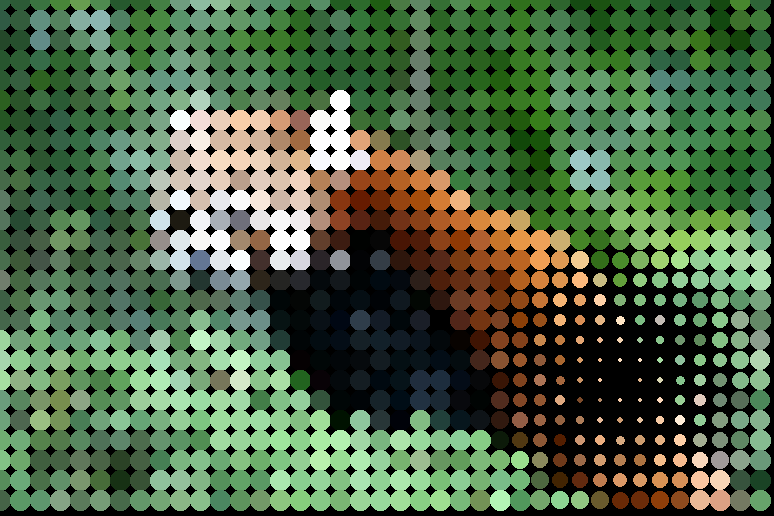
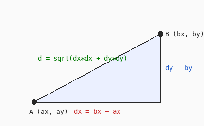

# Cours 12 — Pointillisme et distance

> **Avant** : cours 11 (double boucle sur une image), cours 10 (lire un pixel).
> **Comment travailler** : toujours dans `ofApp.h` et `ofApp.cpp`, par versions successives. `ofApp12.h` / `ofApp12.cpp` : la référence téléchargeable de l'état final. `pandaroux.jpg` va dans `bin/data`.

L'image n'est plus affichée : elle est **redessinée** avec des cercles, un tous les 20 pixels, chacun de la couleur du pixel qu'il remplace. Et près de la souris, les cercles rétrécissent — pour ça, il faut savoir mesurer une **distance**.



## 1. Étape 1 — la grille de points

Dans le `.h` : `ofImage img;` et trois réglages `int windowWidth { 774 };`, `int windowHeight { 516 };`, `int tailleCercle { 20 };`. Charge l'image dans `setup()` (avec la vérification du cours 10), puis dans `draw()` :

```cpp
void ofApp::draw() {
	ofBackground(0);
	ofFill();

	for (int li = 0; li < windowHeight; li += tailleCercle) {      // chaque ligne...
		for (int co = 0; co < windowWidth; co += tailleCercle) {   // ...chaque colonne
			ofColor c = img.getColor(co, li);
			ofSetColor(c);
			ofDrawCircle(co, li, tailleCercle / 2.0f);
		}
	}
}
```

Le panda roux apparaît **en gros points**. C'est la double boucle du cours 11, mais les compteurs avancent de 20 en 20 (`+= tailleCercle`, le pas du cours 03) : au lieu de visiter 400 000 pixels, on en visite un sur 400, et chaque visite dessine un cercle de la couleur lue. Les cercles se touchent, l'image se reconstitue.

Remarque : l'image n'est **jamais affichée** avec `img.draw`. On lit ses pixels comme une source de données, et on dessine autre chose à partir d'eux — la remarque de la fin du cours 10, en action.

> **Essaie** : `tailleCercle` à 5, 10, puis 40 — à partir de quand ne reconnaît-on plus l'image ? Puis remplace les cercles par des **rectangles dont la hauteur dépend de la luminosité** du pixel.

## 2. Étape 2 — la distance : Pythagore



Nouvelle fonction (annoncée dans le `.h` : `float distance(float ax, float ay, float bx, float by);`) :

```cpp
float ofApp::distance(float ax, float ay, float bx, float by) {
	float dx = bx - ax;
	float dy = by - ay;
	return sqrt(dx * dx + dy * dy);
}
```

Deux points, un écart horizontal `dx`, un écart vertical `dy` : la distance est l'hypoténuse — racine carrée (`sqrt`) de `dx² + dy²`. La fonction **renvoie un `float`** avec `return`, comme `filtre` renvoyait une `ofColor` au cours 11.

openFrameworks fournit `ofDist(ax, ay, bx, by)`, qui fait exactement ceci. On l'a écrite pour la voir une fois ; ensuite, `ofDist` fait l'affaire.

> **Essaie** : affiche dans la fenêtre la distance entre la souris et le centre de l'image — vérifie-la à l'œil sur deux ou trois positions.

## 3. Étape 3 — la proportion : l'effet local

Dans la boucle, avant de dessiner :

```cpp
			float d = distance(mouseX, mouseY, co, li);

			float rayon = tailleCercle / 2.0f;
			if (d <= 150) {
				float proportion = d / 150.0f;
				rayon = rayon * proportion;
			}
```

Près de la souris, les cercles fondent. Pour chaque cercle : s'il est à moins de 150 pixels, `d / 150` donne un nombre entre 0 (sur la souris) et 1 (à 150 pixels), et le rayon est multiplié par cette **proportion** — nul sous la souris, normal à la frontière, et tout le dégradé entre les deux.

Retiens ce motif : **ramener une grandeur entre 0 et 1, puis multiplier**. C'est le moyen le plus simple de faire dépendre une chose d'une autre *en douceur* — au lieu d'un `if` brutal « près / loin », un fondu.

L'ensemble est un effet **local** : le même dessin partout, sauf dans un disque autour de la souris, modifié progressivement. L'idée est indépendante de ce qu'on dessine — un effet local, c'est n'importe quel effet plus un **masque** défini par une distance.

> **Essaie** : inverse l'effet — les cercles **grossissent** près de la souris. Une seule expression à changer.

## 4. Étape 4 — le temps dans la formule

La variante d'un autre sketch, trois lignes :

```cpp
			float t = ofGetElapsedTimef() * 60;
			float prop = d / (200.0f + t);
			ofDrawRectangle(co, li, tailleCercle * prop, tailleCercle * prop);
```

Même mécanique, un `t` en plus dans la proportion : l'effet **grandit** — un anneau qui s'élargit depuis la souris. Combiner la distance et le temps (cours 08) donne des animations riches pour trois lignes.

> **Essaie** : ralentis (`* 10` au lieu de `* 60`), puis fais repartir l'anneau régulièrement avec `fmod` (cours 09).

## Exercices

1. **Lire avant de lancer** — fenêtre 774 × 516, pas de 20 : combien de cercles la grille dessine-t-elle, environ ? Calcule, puis fais afficher le vrai compte dans la console.

2. **Le filtre local** — reprends un filtre du cours 11 (négatif, gris, seuil) et applique-le **seulement** aux cercles à moins de 150 pixels de la souris. Un filtre + un masque.

3. **Le projecteur** — l'image en points **gris** (luminance) partout… sauf près de la souris, où les points retrouvent leur **couleur**. Le color splash du cours 11, devenu local.

4. **L'image en cinq couleurs** *(plus costaud)* — choisis cinq couleurs. Pour chaque cercle, calcule la distance dans le **cube RGB** (cours 09) entre le pixel et chacune des cinq — `sqrt(dr*dr + dg*dg + db*db)`, Pythagore en trois dimensions — et dessine avec la plus proche. Ton premier rendu en palette limitée.

## Ce qu'il faut retenir

- La double boucle **à pas** : une grille au lieu de tous les pixels — `li += tailleCercle`.
- La distance entre deux points : Pythagore, `sqrt(dx² + dy²)` — ou `ofDist(ax, ay, bx, by)`.
- La **proportion** : ramener entre 0 et 1 (`d / rayonMax`) puis multiplier — la dépendance en douceur.
- Effet **local** = n'importe quel effet + un masque défini par une distance.
- L'image comme source de données : on lit ses pixels, on dessine autre chose.
