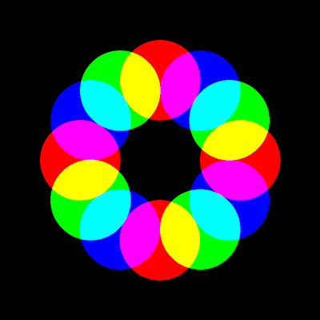
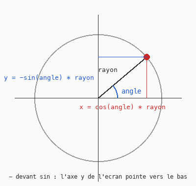

# Cours 13 — Trigonométrie : des cercles sur un cercle

> **Fichiers** : `ofApp13.h` + `ofApp13.cpp`
> **Avant** : cours 08 (cosinus pour osciller), cours 09 (la roue des teintes).

Douze cercles disposés régulièrement sur un cercle invisible, qui se rapprochent et s'éloignent du centre. Pour placer un point « à tel angle, à telle distance », il faut `cos` et `sin`. C'est le premier des quatre cours de trigonométrie.



## 1. Placer un point avec un angle



Un point sur un cercle de rayon `R` autour de l'origine, à l'angle `a`, a pour coordonnées :

```cpp
float x = cos(angle) * rayonOrbite;
float y = -sin(angle) * rayonOrbite;
```

`cos(a)` est la coordonnée horizontale d'un point sur le cercle de rayon 1, `sin(a)` sa coordonnée verticale. On multiplie par le rayon voulu. Le signe `-` devant `sin` vient du repère de l'écran (cours 00) : `y` pointe vers le bas, et sans le `-` les angles tourneraient dans le sens des aiguilles d'une montre. Avec ou sans, le dessin est symétrique ; le `-` sert juste à retrouver le sens habituel des mathématiques.

Au cours 08, `cos(t)` servait à faire osciller un nombre entre -1 et 1. C'est le même `cos` : quand l'angle avance, le point tourne, et sa coordonnée `x` oscille.

## 2. Les angles sont en radians

```cpp
float angle = i * TWO_PI / nbCercles;
```

`cos` et `sin` veulent un angle en **radians**, pas en degrés. Un tour complet vaut `2π` radians, soit environ 6.28. openFrameworks fournit `PI` et `TWO_PI`. Pour répartir `n` cercles sur un tour, on divise le tour en `n` parts : le cercle numéro `i` est à l'angle `i * TWO_PI / n`.

Si tu préfères penser en degrés : `ofDegToRad(90)` convertit.

## 3. Déplacer l'origine

```cpp
ofPushMatrix();
ofTranslate(400, 400);
// ... tout ce qui est dessiné ici a son (0, 0) au centre de la fenêtre
ofPopMatrix();
```

Les formules donnent des coordonnées autour de `(0, 0)`, le coin haut-gauche. Plutôt que d'ajouter `+ 400` partout, on **déplace l'origine** au centre avec `ofTranslate`. `ofPushMatrix` mémorise l'origine actuelle et `ofPopMatrix` la restaure : entre les deux, tout est décalé ; après, on redessine normalement. Toujours les utiliser par paire.

## 4. Le reste de la division : `%`

```cpp
if (i % 3 == 0)      ofSetColor(255, 0, 0);
else if (i % 3 == 1) ofSetColor(0, 255, 0);
else                 ofSetColor(0, 0, 255);
```

`i % 3` est le **reste** de la division entière de `i` par 3 : 0, 1, 2, 0, 1, 2, ... C'est l'outil pour faire alterner, cycler, répartir en groupes. `else if` enchaîne les conditions : la première vraie gagne ; `else` attrape tout le reste.

`%` ne marche que sur des entiers. Pour des `float`, c'est `fmod` (cours 09).

## 5. Les modes de fusion

```cpp
ofEnableBlendMode(OF_BLENDMODE_ADD);
// ... dessins
ofEnableBlendMode(OF_BLENDMODE_ALPHA);
```

Par défaut, une forme dessinée par-dessus une autre la recouvre, en tenant compte de la transparence. En mode **additif**, les lumières s'ajoutent : rouge sur vert donne jaune, les trois donnent blanc. C'est la logique du cube RGB du cours 09 rendue visible : là où les cercles se recouvrent, les composantes s'additionnent. Les autres modes : `SUBTRACT`, `MULTIPLY`, `SCREEN`. On revient toujours au mode `ALPHA` après.

## 6. L'animation

```cpp
t = cos(ofGetElapsedTimef() * 0.6f);
float x = cos(angle) * rayonOrbite * t;
```

`t` oscille entre -1 et 1 (cours 08). Multiplier le rayon par `t` fait se rapprocher tous les cercles du centre, les fait passer de l'autre côté quand `t` devient négatif, et repartir. Une seule variable de temps, douze cercles qui respirent ensemble.

## 7. Variante : la teinte est un angle

```cpp
ofSetColor(ofColor::fromHsb(i * 255.0f / nbCercles, 255, 255));
```

La roue des teintes du cours 09 **est** un cercle. Donner au cercle numéro `i` la teinte `i * 255 / n`, c'est lui donner la couleur du secteur de la roue où il se trouve. Désactive le mode additif pour bien le voir. C'est le genre de coïncidence heureuse qui rend le tech art satisfaisant : deux idées de deux cours différents qui étaient la même.

## Exercices

1. Change `nbCercles` : 3, 7, 36. Puis le rayon des cercles.
2. Fais tourner l'ensemble : ajoute `ofGetElapsedTimef()` à `angle`.
3. Deux anneaux : un second `for` avec un autre rayon d'orbite et un sens de rotation inverse.
4. Remplace les cercles par l'ours du cours 07.
5. La variante du sketch d'origine, en commentaire : 120 petits cercles, fond blanc, mode `SUBTRACT`, avec un décalage `cos(i * 2.0f) * 20` sur `x` pour casser le cercle parfait.

## Le code complet, pas à pas

Le programme entier, dans l'ordre des fichiers. Les blocs ci-dessous mis bout à bout donnent exactement `ofApp13.cpp`.

### Le fichier `ofApp13.h`

La table des matières du programme : les blocs qui existent et les variables partagées entre eux, avec leurs valeurs de départ.

```cpp
#pragma once
#include "ofMain.h"

// 13 - Trigonométrie : cercles sur un cercle et modes de fusion
// Sketch d'origine : Cours 2024-2025/sketch_04_circles
// Variantes écartées (même principe) : sketch_04a_circles (120 petits cercles, SUBTRACT sur fond blanc),
//                                      Cours 5/TrigoBlend (9 cercles, ADD)
// Notions : cos / sin pour placer un point sur un cercle, angle en radians (2 PI = tour complet),
//           modulo pour alterner les couleurs, ofTranslate + ofPushMatrix / ofPopMatrix,
//           ofEnableBlendMode. Variante : teinte selon l'angle (relit 09)

class ofApp : public ofBaseApp {
public:
	void setup();
	void update();
	void draw();

	int   nbCercles = 12;
	float rayonOrbite = 200;
	float t = 1;
};
```

### En tête du fichier `ofApp13.cpp`

L'inclusion du `.h`, qui rend visibles les variables partagées et les blocs déclarés.

```cpp
#include "ofApp13.h"
```

### Étape 1 — `setup()`

Exécuté une fois au lancement : la fenêtre, les chargements, les valeurs de départ.

```cpp
void ofApp::setup() {
	ofSetWindowShape(800, 800);
	ofSetCircleResolution(64);
}
```

### Étape 2 — `update()`

Exécuté à chaque frame, avant le dessin : tout ce qui change.

```cpp
void ofApp::update() {
	// t oscille entre -1 et 1 : les cercles se rapprochent puis s'éloignent du centre
	t = cos(ofGetElapsedTimef() * 0.6f);
}
```

### Étape 3 — `draw()`

Exécuté à chaque frame, après `update()` : uniquement du dessin.

```cpp
void ofApp::draw() {
	ofBackground(0);

	// translate(400, 400) : déplace l'origine au centre de la fenêtre.
	// ofPushMatrix / ofPopMatrix isolent la transformation : après le pop,
	// l'origine est de nouveau en haut à gauche.
	ofPushMatrix();
	ofTranslate(400, 400);

	// Processing : blendMode(DIFFERENCE). openFrameworks n'a pas DIFFERENCE :
	// modes disponibles : ALPHA, ADD, SUBTRACT, MULTIPLY, SCREEN, DISABLED.
	// ADD donne un mélange lumineux (rouge + vert = jaune, les trois = blanc).
	ofEnableBlendMode(OF_BLENDMODE_ADD);

	ofFill();
	for (int i = 0; i < nbCercles; i++) {
		// Couleur alternée selon le reste de la division par 3
		if (i % 3 == 0)      ofSetColor(255, 0, 0);
		else if (i % 3 == 1) ofSetColor(0, 255, 0);
		else                 ofSetColor(0, 0, 255);
		// Variante (cours 09) : la roue des couleurs EST un cercle. Teinte = position sur le tour,
		// le i-ème cercle prend le i-ème secteur de la roue (désactiver ADD pour bien voir) :
		//   ofSetColor(ofColor::fromHsb(i * 255.0f / nbCercles, 255, 255));

		// Angle du i-ème cercle : on divise le tour complet (2 PI) en nbCercles parts
		float angle = i * TWO_PI / nbCercles;
		float x = cos(angle) * rayonOrbite * t;
		float y = -sin(angle) * rayonOrbite * t;   // - car l'axe y de l'écran pointe vers le bas
		ofDrawCircle(x, y, 100);
	}

	ofEnableBlendMode(OF_BLENDMODE_ALPHA);         // retour au mode normal
	ofPopMatrix();

	// ---- Variante sketch_04a_circles ----
	// 120 cercles de rayon 10, fond blanc, OF_BLENDMODE_SUBTRACT,
	// avec un décalage sur x et y pour casser le cercle parfait :
	//   float x = cos(angle) * 400 * t + cos(i * 2.0f) * 20;
	//   float y = -sin(angle) * 400 * t + sin(i / 20.0f) * 100;
}
```

## Ce qu'il faut retenir

- Un point à l'angle `a` et à la distance `R` : `x = cos(a) * R`, `y = -sin(a) * R`.
- Les angles sont en radians, un tour vaut `TWO_PI`. Répartir `n` éléments : `i * TWO_PI / n`.
- `ofPushMatrix(); ofTranslate(x, y); ... ofPopMatrix();` déplace l'origine le temps d'un bloc.
- `i % n` est le reste de la division, pour alterner ou cycler. `else if` enchaîne des conditions.
- `ofEnableBlendMode(OF_BLENDMODE_ADD)` additionne les couleurs ; revenir à `OF_BLENDMODE_ALPHA`.
