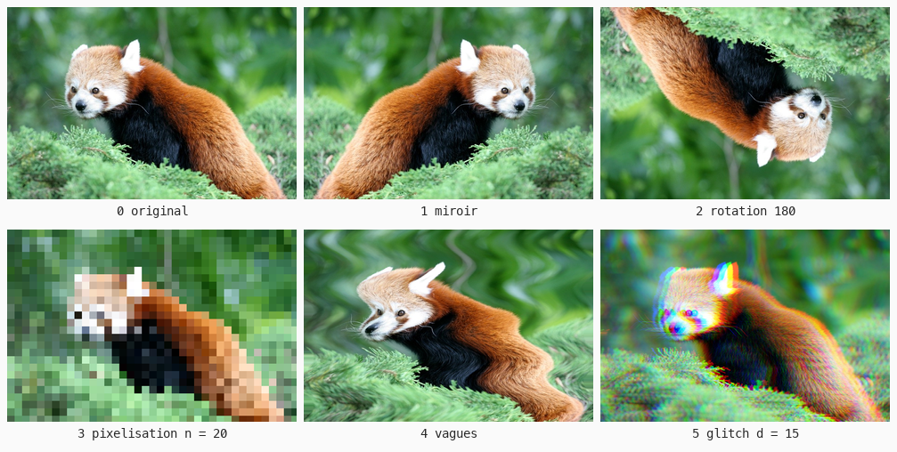
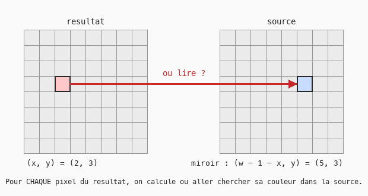

# Cours 14 — Filtres géométriques : déplacer les pixels

> **Fichiers** : `ofApp14.h` + `ofApp14.cpp`, image `data/pandaroux.jpg`
> **Avant** : cours 11 (double boucle source / résultat), cours 13 (`sin` et le temps).

Au cours 11, chaque pixel changeait de couleur mais restait à sa place. Ici c'est l'inverse : la couleur ne change pas, on va la **chercher ailleurs**. Miroir, pixelisation, vagues, glitch : la formule porte sur les coordonnées.



## 1. Lire à l'envers



L'intuition dit : « prends chaque pixel de la source et déplace-le ». Ça ne marche pas : certains pixels du résultat recevraient deux couleurs, d'autres aucune, et il y aurait des trous.

On raisonne toujours **depuis le résultat** : pour chaque pixel `(x, y)` du résultat, on calcule à quel endroit `(sx, sy)` de la source aller chercher sa couleur.

```cpp
resultat(x, y) = source(f(x, y))
```

Comme la boucle visite chaque pixel du résultat exactement une fois, l'image est toujours pleine. Cette façon de penser, du pixel de sortie vers l'entrée, est celle de tous les effets d'image, jusqu'aux shaders.

## 2. Une lecture qui ne sort jamais de l'image

```cpp
ofColor ofApp::lire(float x, float y) {
	int px = ofClamp((int)x, 0, source.getWidth() - 1);
	int py = ofClamp((int)y, 0, source.getHeight() - 1);
	return source.getColor(px, py);
}
```

Un miroir ou une vague peut demander le pixel -5 ou le pixel 800. On borne systématiquement (cours 10), une fois pour toutes, dans une fonction. Le `(int)x` **convertit** le `float` en entier en coupant la partie après la virgule : les coordonnées d'un pixel sont entières.

Effet secondaire visible sur les vagues : au bord, le dernier pixel est répété, l'image semble étirée. C'est le choix le plus simple ; répéter l'image avec un modulo est une autre option (exercice).

## 3. Les formules

Dans la double boucle, un `switch` (cours 11) choisit la formule :

| Effet | Où lire | Ce qui se passe |
|---|---|---|
| Miroir | `lire(w - 1 - x, y)` | la colonne `x` vient de la colonne opposée |
| Rotation 180° | `lire(w - 1 - x, h - 1 - y)` | les deux axes retournés |
| Pixelisation | `lire(x / n * n, y / n * n)` | tous les pixels d'une case `n × n` lisent le coin de la case |
| Vagues | `lire(x + A * sin(y / 20.0f + t * 3), y)` | chaque ligne est décalée d'un sinus qui dépend de `y` et du temps |

La pixelisation utilise la **division entière** du cours 01 comme outil : `x / n * n` n'est pas `x`. Avec `n = 20`, `137 / 20 * 20 = 120`. Tous les `x` de 120 à 139 donnent 120. C'est le même calcul que le centre de case du cours 15.

Les vagues reprennent `sin` du cours 13 : `sin(y / 20)` oscille le long de la hauteur, `+ t * 3` le fait glisser avec le temps, `A` est l'amplitude en pixels.

## 4. Le glitch : un canal, un endroit

```cpp
ofColor gauche = lire(x - d, y);
ofColor centre = lire(x, y);
ofColor droite = lire(x + d, y);
c = ofColor(gauche.r, centre.g, droite.b);
```

Rien n'oblige les trois canaux à venir du même pixel. Le rouge est lu un peu à gauche, le bleu un peu à droite : les contours se dédoublent en franges colorées, comme un objectif de mauvaise qualité ou un écran mal réglé. C'est l'aberration chromatique, très utilisée dans les jeux pour un effet « écran abîmé ». Trois lectures, une recomposition avec les composantes `.r`, `.g`, `.b` de la struct `ofColor`.

## Exercices

1. Miroir vertical. Puis « kaléidoscope » : la moitié droite est le reflet de la moitié gauche (`if (x > w / 2)`).
2. Vagues verticales : décaler `y` selon `x`. Puis les deux à la fois.
3. Répéter au lieu d'étirer : dans `lire`, remplacer `ofClamp` par un modulo. Attention, `%` d'un nombre négatif est négatif en C++ : ajouter la largeur avant.
4. Glitch aléatoire : décaler des lignes entières d'une valeur `ofRandom`, avec `ofSeedRandom` pour que ça ne scintille pas (cours 03), ou au contraire sans, pour que ça scintille.
5. Zoom : `lire(x * 0.5f + w / 4, y * 0.5f + h / 4)`. Pourquoi ce sont ces nombres ?

La loupe et le tourbillon demandent de passer en coordonnées polaires : on y revient à la fin du cours 16.

## Le code complet, pas à pas

Le programme entier, dans l'ordre des fichiers. Les blocs ci-dessous mis bout à bout donnent exactement `ofApp14.cpp`.

### Le fichier `ofApp14.h`

La table des matières du programme : les blocs qui existent et les variables partagées entre eux, avec leurs valeurs de départ.

```cpp
#pragma once
#include "ofMain.h"

// 14 - Filtres géométriques : la formule porte sur les coordonnées, pas sur la couleur
// Nouveau : pas de sketch Processing d'origine
// Notions : lecture "à l'envers" (pour chaque pixel du résultat, où aller le chercher dans la source),
//           resultat(x, y) = source(f(x, y)), bornage des coordonnées, miroir, pixelisation
//           (division entière), vagues avec sin et le temps (relit 13), décalage des canaux (glitch)
// Ressource : bin/data/pandaroux.jpg (774 x 516)

class ofApp : public ofBaseApp {
public:
	void setup();
	void update();
	void draw();
	void keyPressed(int key);

	// Lecture dans la source avec des coordonnées bornées
	ofColor lire(float x, float y);

	ofImage source;
	ofImage resultat;
	int   effet = 0;
	float parametre = 0.5f;
	float t = 0;
	std::vector<std::string> noms = {
		"original", "miroir", "rotation 180", "pixelisation", "vagues", "glitch (canaux decales)"
	};
};
```

### En tête du fichier `ofApp14.cpp`

L'inclusion du `.h`, qui rend visibles les variables partagées et les blocs déclarés.

```cpp
#include "ofApp14.h"
```

### Étape 1 — `setup()`

Exécuté une fois au lancement : la fenêtre, les chargements, les valeurs de départ.

```cpp
void ofApp::setup() {
	ofSetWindowShape(774, 516);
	if (!source.load("pandaroux.jpg")) {
		ofLogError() << "pandaroux.jpg introuvable dans bin/data";
	}
	resultat.allocate(source.getWidth(), source.getHeight(), OF_IMAGE_COLOR);
}
```

### Étape 2 — `lire()`

Demander le pixel -5 ou le pixel 800 lirait n'importe quoi en mémoire (ou planterait).

```cpp
// Demander le pixel -5 ou le pixel 800 lirait n'importe quoi en mémoire (ou planterait) :
// on ramène toujours les coordonnées dans l'image. Le bord est alors "étiré".
ofColor ofApp::lire(float x, float y) {
	int px = ofClamp((int)x, 0, source.getWidth() - 1);
	int py = ofClamp((int)y, 0, source.getHeight() - 1);
	return source.getColor(px, py);
}
```

### Étape 3 — `update()`

Exécuté à chaque frame, avant le dessin : tout ce qui change.

```cpp
void ofApp::update() {
	parametre = mouseX / (float)ofGetWidth();
	t = ofGetElapsedTimef();
	int w = source.getWidth();
	int h = source.getHeight();

	// En 11 la boucle transformait la COULEUR d'un pixel qui restait à sa place.
	// Ici la couleur ne change pas : pour chaque pixel (x, y) du résultat, on calcule
	// à quel endroit de la source aller la chercher. On raisonne toujours depuis la sortie,
	// jamais depuis l'entrée : ainsi chaque pixel du résultat est rempli exactement une fois.
	for (int y = 0; y < h; y++) {
		for (int x = 0; x < w; x++) {
			ofColor c;

			switch (effet) {

			case 1: // Miroir horizontal : la colonne x vient de la colonne opposée
				c = lire(w - 1 - x, y);
				break;

			case 2: // Rotation de 180 degrés : les deux axes retournés
				c = lire(w - 1 - x, h - 1 - y);
				break;

			case 3: { // Pixelisation : tous les pixels d'une case de n x n lisent le coin de la case.
				// x / n * n n'est pas x : division ENTIÈRE (cours 01). 137 / 20 * 20 = 120.
				int n = 2 + parametre * 40;
				c = lire(x / n * n, y / n * n);
				break;
			}

			case 4: { // Vagues : chaque ligne est décalée d'un sinus qui dépend de y et du temps
				float amplitude = parametre * 40;
				float dx = amplitude * sin(y / 20.0f + t * 3);
				c = lire(x + dx, y);
				break;
			}

			case 5: { // Glitch : les trois canaux ne sont pas lus au même endroit
				float d = parametre * 30;
				ofColor gauche = lire(x - d, y);
				ofColor centre = lire(x, y);
				ofColor droite = lire(x + d, y);
				c = ofColor(gauche.r, centre.g, droite.b);
				break;
			}

			default: // 0 : identité, on lit au même endroit
				c = lire(x, y);
			}

			resultat.setColor(x, y, c);
		}
	}
	resultat.update();
}
```

### Étape 4 — `draw()`

Exécuté à chaque frame, après `update()` : uniquement du dessin.

```cpp
void ofApp::draw() {
	ofSetColor(255);
	resultat.draw(0, 0);

	ofSetColor(255, 200, 0);
	ofDrawBitmapString("Effet " + ofToString(effet) + " : " + noms[effet]
	                   + "   parametre = " + ofToString(parametre, 2), 10, 20);
	ofDrawBitmapString("Touches 0 a 5 : changer d'effet.  Souris : parametre.", 10, 40);
}
```

### Étape 5 — `keyPressed()`

Appelé automatiquement à chaque touche pressée.

```cpp
void ofApp::keyPressed(int key) {
	if (key >= '0' && key <= '5') {
		effet = key - '0';
	}
}
```

### En fin de fichier

Les notes et pistes laissées en commentaire dans le code.

```cpp
// Exercices :
// - miroir vertical, puis miroir "kaléidoscope" : la moitié droite est le reflet de la moitié gauche
// - vagues verticales (décaler y selon x), puis les deux à la fois
// - répéter au lieu d'étirer : dans lire(), remplacer ofClamp par un modulo (attention aux négatifs)
// - glitch aléatoire : décaler des lignes entières d'une valeur ofRandom, avec ofSeedRandom (cours 03)
// - loupe et tourbillon : ils demandent les coordonnées polaires, on y revient à la fin de 16
```

## Ce qu'il faut retenir

- Un filtre géométrique se pense **depuis le résultat** : pour chaque pixel de sortie, où lire dans la source.
- Toujours passer par une fonction de lecture bornée. `(int)x` convertit un `float` en entier.
- Miroir : `w - 1 - x`. Pixelisation : `x / n * n` (division entière). Vagues : `x + A * sin(y / λ + t)`.
- Les trois canaux peuvent être lus à trois endroits différents.
