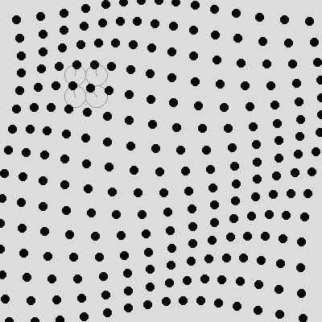

# Cours 15 — La grille en rotation : le déphasage

> **Avant** : cours 13 (`cos`, `sin`, angles), cours 12 (grille par double boucle).
> **Comment travailler** : toujours dans `ofApp.h` et `ofApp.cpp`, par versions successives. `ofApp15.h` / `ofApp15.cpp` : la référence téléchargeable de l'état final.

Une grille de 15 × 15 points, chacun tournant autour du centre de sa case — mais pas tout à fait ensemble : chaque case est légèrement décalée sur ses voisines, et une **vague** traverse la grille. Ce décalage a un nom, le **déphasage**, et c'est l'idée du cours.



## 1. Étape 1 — la grille de centres

Dans le `.h` : `int screenSize { 400 };`, `int rows { 15 };`, `int cols { 15 };`, `float tileSize { 0 };`, `float radius { 0 };`. Dans `setup()` :

```cpp
	ofSetWindowShape(screenSize, screenSize);
	tileSize = screenSize / (float)rows;
	radius = tileSize / 2;
```

Et pour voir la grille, dans `draw()` :

```cpp
	ofBackground(220);
	ofFill();
	ofSetColor(0);
	for (int i = 0; i < rows; i++) {
		for (int j = 0; j < cols; j++) {
			float x0 = i * tileSize + tileSize / 2;
			float y0 = j * tileSize + tileSize / 2;
			ofDrawCircle(x0, y0, 5);
		}
	}
```

225 points immobiles, un au **centre** de chaque case : la case `(i, j)` commence en `(i * tileSize, j * tileSize)`, son centre est un demi-côté plus loin — le calcul de grille du cours 12, plus `+ tileSize / 2`.

Le `(float)rows` mérite un mot : `screenSize` et `rows` sont deux `int`, et `400 / 15` donnerait 26 (division entière, cours 01) — la grille ne remplirait pas la fenêtre. `(float)rows` **convertit** `rows` en `float` juste pour ce calcul : 26.67. C'est la conversion explicite `(type)valeur`, déjà croisée dans l'autre sens au cours 14 avec `(int)x`.

> **Essaie** : `rows` et `cols` à 5, puis à 30 — la grille s'adapte toute seule. Pourquoi ?

## 2. Étape 2 — un point en orbite dans chaque case

Range le dessin d'une case dans une fonction (annonce dans le `.h`), et fais tourner un angle global (`float globalAngle { 0 };`, `float speed { 2.4f };`) :

```cpp
void ofApp::update() {
	globalAngle = globalAngle + speed * ofGetLastFrameTime();
}

void ofApp::drawPoint(int i, int j, float angle) {
	float x0 = i * tileSize + tileSize / 2;
	float y0 = j * tileSize + tileSize / 2;

	float x = radius * cos(angle) + x0;
	float y = radius * sin(angle) + y0;

	ofFill();
	ofSetColor(0);
	ofDrawCircle(x, y, 5);
}

void ofApp::draw() {
	ofBackground(220);
	for (int i = 0; i < rows; i++) {
		for (int j = 0; j < cols; j++) {
			drawPoint(i, j, globalAngle);
		}
	}
}
```

Les 225 points tournent — **à l'unisson**, en bloc. Deux choses à voir :

- La formule du cours 13, **plus le centre** : le point est à `radius` du centre `(x0, y0)`, dans la direction `angle`. Au 13 on déplaçait l'origine avec `ofTranslate` ; ici on ajoute le centre à la main — même résultat.
- `globalAngle` avance à `speed` **radians par seconde**, multipliés par `dt` : c'est le cours 06 avec un angle à la place d'une position. 2.4 rad/s ≈ un tour toutes les trois secondes.
- La structure : la double boucle **parcourt**, la fonction **dessine une case**. Séparer les deux rend chacun lisible — `drawPoint` ne sait rien de la grille, elle reçoit `i`, `j`, l'angle, et calcule.

> **Essaie** : décommente (ou ajoute) les lignes de construction — le cercle et le rayon de chaque case : `ofNoFill(); ofSetColor(180); ofDrawCircle(x0, y0, radius); ofDrawLine(x0, y0, x, y);`. La mécanique devient visible.

## 3. Étape 3 — le déphasage

Une seule ligne au début de `drawPoint` (avec `float angleOffset { 0.2f };` dans le `.h`) :

```cpp
	angle = angle + i * angleOffset + j * angleOffset;
```

Et la vague apparaît. Si toutes les cases ont le même angle, tout tourne en bloc ; en ajoutant un décalage **qui dépend de la position de la case**, les voisines sont légèrement en avance ou en retard — et l'œil voit une onde traverser la grille.

C'est l'idée de la traînée du cours 08, généralisée : **une grandeur commune à tous, plus un décalage propre à chacun**. La grandeur commune est `globalAngle` (le temps) ; le décalage propre est `i * angleOffset + j * angleOffset` (la position).

> **Essaie** : `angleOffset` à 0.1, 0.5, 1, puis 75. À 75 radians par case, le mouvement **semble** aléatoire alors qu'il est parfaitement régulier — le tour fait 6.28, et 75 retombe « n'importe où » sur le cercle à chaque case. Puis fais dépendre le déphasage de `i` **seulement** : les colonnes ondulent ensemble.

## Exercices

1. **Lire avant de lancer** — si `angleOffset` vaut exactement `PI`, que font deux cases voisines l'une par rapport à l'autre ? À quoi ressemble la grille ? Réponds, puis vérifie.

2. **Le champ d'aiguilles** — remplace le point par un **trait du centre au point** : `ofDrawLine(x0, y0, x, y);`. La grille devient un champ d'aiguilles magnétiques.

3. **La grille arc-en-ciel** — colore chaque point selon son angle : la teinte est un angle (cours 13, encore) — `ofColor::fromHsb(...)` en convertissant l'angle en 0-255. La vague devient une vague de couleur.

4. **Les ondes circulaires** *(plus costaud)* — remplace le déphasage `i + j` par un déphasage proportionnel à la **distance au centre de la fenêtre** (cours 12). Les vagues ne traversent plus la grille en diagonale : elles rayonnent depuis le centre, comme une pierre dans l'eau.

## Ce qu'il faut retenir

- Le centre de la case `(i, j)` : `i * tileSize + tileSize / 2` — et `(float)` pour sauver la division.
- Orbiter autour d'un centre : la formule du 13 **plus** `(x0, y0)` — équivalent d'un `ofTranslate` fait à la main.
- Une vitesse **angulaire** : radians par seconde × `dt`, comme au cours 06.
- Le **déphasage** : une grandeur commune (le temps) + un décalage propre (la position) = une onde. Le motif reviendra partout, jusqu'aux shaders.
- Parcourir (la double boucle) et dessiner un élément (la fonction) : deux rôles, deux blocs.
