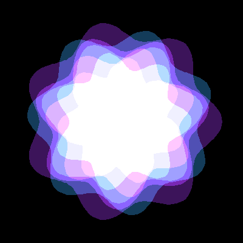
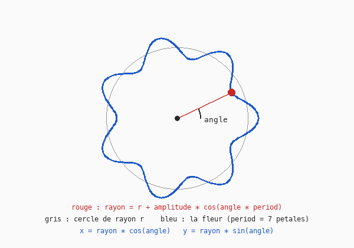

# Cours 16 — Fleurs polaires

> **Avant** : cours 13 (angle, rayon, `cos`, `sin`), cours 04 (`std::vector`).
> **Comment travailler** : toujours dans `ofApp.h` et `ofApp.cpp`, par versions successives. `ofApp16.h` / `ofApp16.cpp` : la référence téléchargeable de l'état final.

Quatorze fleurs concentriques qui tournent à des vitesses différentes. Derrière l'image : une nouvelle façon de décrire un point — les coordonnées **polaires** — et une nouvelle façon de dessiner — une forme libre, sommet par sommet. À la fin, l'exercice qui referme le cours 14 : la loupe et le tourbillon.



## 1. Coordonnées polaires

Jusqu'ici un point était `(x, y)`. On peut aussi le décrire par `(angle, rayon)` : dans quelle **direction**, à quelle **distance** du centre. Ce sont les coordonnées **polaires**, et le passage vers `(x, y)` est la formule du cours 13 :

```cpp
float x = rayon * cos(angle);
float y = rayon * sin(angle);
```

L'intérêt : certaines formes sont simples en polaire et compliquées en cartésien. Un cercle ? « rayon constant ». Une spirale ? « rayon qui grandit avec l'angle ». Une fleur ? c'est l'étape 2.

## 2. Étape 1 — une forme libre, point par point

Dans le `.h` : `int nbPoints { 200 };`, `int period { 12 };`, `float amplitude { 20 };`. Et une première fleur, seule au centre (fenêtre 400 × 400) :

```cpp
void ofApp::draw() {
	ofBackground(0);
	ofPushMatrix();
	ofTranslate(ofGetWidth() / 2, ofGetHeight() / 2);

	ofFill();
	ofSetColor(60, 20, 90);
	ofBeginShape();
	for (int i = 0; i < nbPoints; i++) {
		float angle = i * TWO_PI / nbPoints;
		float fRadius = amplitude * cos(angle * period);
		float x = (100 + fRadius) * cos(angle);
		float y = (100 + fRadius) * sin(angle);
		ofVertex(x, y);
	}
	ofEndShape(true);

	ofPopMatrix();
}
```

Une fleur à douze pétales. Deux nouveautés, une par moitié du code :

**La forme libre.** `ofDrawCircle` et compagnie dessinent des formes toutes faites. Pour une forme quelconque, on donne ses sommets un par un : `ofBeginShape()` ouvre, chaque `ofVertex(x, y)` ajoute un sommet, `ofEndShape(true)` ferme (le `true` relie le dernier au premier) et remplit. Avec 200 sommets, la courbe paraît lisse.

**Le rayon qui ondule.** Le rayon n'est pas constant : `100 + amplitude * cos(angle * period)`. Quand l'angle fait un tour, `angle * period` fait `period` tours — le cosinus oscille `period` fois : `period` bosses, `period` **pétales**. `amplitude` est leur hauteur.



> **Essaie** : `period` à 3, 5, 12 ; `amplitude` à 5, 40. Tu contrôles la fleur avec deux nombres.

## 3. Étape 2 — quatorze fleurs, quatorze vitesses

Dans le `.h` : `int nbFlowers { 14 };` et `std::vector<float> rotations;`. Dans `setup()` :

```cpp
	rotations = std::vector<float>(nbFlowers, 0.0f);
```

Cette écriture crée d'un coup une liste de `nbFlowers` éléments valant `0.0f` — au lieu de quatorze `push_back` (cours 04).

Dans `update()` :

```cpp
	float dt = ofGetLastFrameTime();
	for (int f = 0; f < nbFlowers; f++) {
		float sens = (f % 2 == 0) ? 1.0f : -1.0f;
		float speed = f * 0.12f * sens;
		rotations[f] = rotations[f] + speed * dt;
	}
```

Chaque fleur a sa vitesse angulaire (cours 15) : proportionnelle à `f`, alternée en sens par le `%` du cours 13. La ligne `sens` utilise un raccourci nouveau : `condition ? valeurSiVrai : valeurSiFaux` — un `if` qui tient sur une ligne et **renvoie une valeur**. Équivalent de :

```cpp
	float sens;
	if (f % 2 == 0) sens = 1.0f;
	else            sens = -1.0f;
```

Range ensuite la fleur dans une fonction `drawFlower(int fIndex, float r, float rotation)` (le `+ rotation` s'ajoute à l'angle de chaque sommet), et dessine-les toutes :

```cpp
	for (int f = 0; f < nbFlowers; f++) {
		if (f % 2 == 0) ofSetColor(60, 20, 90);
		else            ofSetColor(20, 60, 90);
		drawFlower(f, 150 - f * 10, rotations[f]);
	}
```

Quatorze rayons décroissants (`150 - f * 10`) : des fleurs emboîtées, les extérieures lentes, les intérieures rapides.

> **Essaie** : une seule fleur dont `period` dépend de la souris — `period` est un entier, donc `mouseX / 50` (division entière assumée !). Puis fais **pulser** `amplitude` avec le temps (cours 08).

## 4. Étape 3 — le mode additif au travail

Encadre le dessin de `OF_BLENDMODE_ADD` … `OF_BLENDMODE_ALPHA` (cours 13). Deux couleurs **sombres** alternées : là où les fleurs se recouvrent, les couleurs s'ajoutent et s'éclaircissent. Les recouvrements deviennent lisibles, alors que des formes opaques se cacheraient mutuellement.

> **Essaie** : remplace les deux couleurs fixes par une teinte selon `f` (`ofColor::fromHsb`) — quatorze fleurs, quatorze secteurs de la roue.

## Exercice final : loupe et tourbillon sur une image

Le cours 14 avait laissé de côté deux effets, parce qu'ils demandent exactement ce que tu viens d'apprendre. Avec la lecture « à l'envers » du cours 14, pour chaque pixel `(x, y)` du résultat :

1. **Cartésien vers polaire** autour de la souris : `dx = x - mouseX`, `dy = y - mouseY`, `r = sqrt(dx*dx + dy*dy)`, `angle = atan2(dy, dx)`. `atan2` fait l'inverse de `cos` / `sin` : il retrouve l'angle d'un vecteur.
2. **Modifier** : loupe, `r = r * 0.5f` si `r < R` ; tourbillon, `angle = angle + k * (1 - r / R)` si `r < R`.
3. **Polaire vers cartésien** : `sx = mouseX + r * cos(angle)`, `sy = mouseY + r * sin(angle)`.
4. **Lire** la source en `(sx, sy)` avec la fonction bornée, écrire dans le résultat en `(x, y)`.

Le `1 - r / R` du tourbillon est la proportion du cours 12 : rotation maximale au centre, nulle au bord du disque, pour raccorder sans cassure.

## Exercices

1. **Lire avant de lancer** — avec `period = 1` et `amplitude = 50`, à quoi ressemble la « fleur » ? Et avec `period = 0` ? Réponds en pensant au cosinus, puis vérifie.

2. **La spirale** — « un rayon qui grandit avec l'angle » : `rayon = angle * 10`, avec un angle qui va de 0 à `6 * TWO_PI` (six tours). `ofNoFill()` avant `ofBeginShape`, et ne ferme pas la forme (`ofEndShape(false)`).

3. **L'étoile de mer** — une fleur dont l'amplitude **elle-même** ondule lentement avec le temps, et dont la rotation suit la souris (`atan2(mouseY - 200, mouseX - 200)` donne l'angle sous lequel la souris voit le centre — l'inverse de `cos`/`sin`, qui sert aussi dans l'exercice final).

4. **La loupe, puis le tourbillon** *(plus costaud)* — réalise l'exercice final ci-dessus, dans cet ordre : la loupe d'abord, sans animation ; le tourbillon ensuite. C'est le sommet des cours 12 à 16 — prends le temps.

## Ce qu'il faut retenir

- Coordonnées **polaires** : un point décrit par (angle, rayon) ; vers le cartésien par `(r cos a, r sin a)` ; retour par `atan2`.
- Une fleur = un rayon modulé : `r + amplitude * cos(angle * period)` — `period` pétales, hauts de `amplitude`.
- Forme libre : `ofBeginShape()` / `ofVertex(x, y)` / `ofEndShape(true)`.
- `std::vector<float>(n, valeur)` : une liste de `n` éléments d'un coup.
- `condition ? a : b` : le `if` d'une ligne qui renvoie une valeur.
- Un paramètre par élément (ici la rotation de chaque fleur) rangé dans une liste : des mouvements individuels, un seul code.
