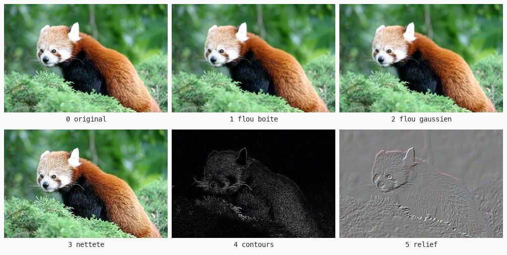
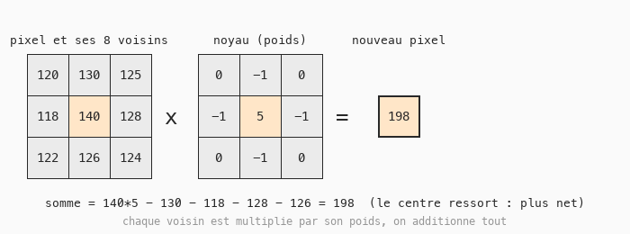

# Cours 17 — Convolution : la couleur dépend des voisins

> **Fichiers** : `ofApp17.h` + `ofApp17.cpp`, image `data/pandaroux.jpg`
> **Avant** : cours 11 (double boucle source / résultat), cours 14.

Au cours 11, un pixel ne dépendait que de lui-même. Au cours 14, d'un autre pixel. Ici, un pixel du résultat dépend de **neuf** pixels de la source : lui et ses huit voisins. Flou, netteté, contours, relief : un seul code, et une grille de neuf nombres qui change.



## 1. Le noyau



Un **noyau** est une grille 3 × 3 de poids. Pour calculer un pixel du résultat, on prend les 3 × 3 pixels de la source centrés au même endroit, on multiplie chaque pixel par le poids qui lui fait face, et on additionne tout. C'est une **moyenne pondérée** des voisins.

| Noyau | Somme des poids | Effet |
|---|---|---|
| tous à 1/9 | 1 | flou boîte : la moyenne des neuf |
| 1 2 1 / 2 4 2 / 1 2 1, divisé par 16 | 1 | flou gaussien : le centre pèse plus, flou plus doux |
| 0 -1 0 / -1 5 -1 / 0 -1 0 | 1 | netteté : le centre renforcé, les voisins retirés |
| -1 partout, 8 au centre | 0 | contours : une zone uniforme donne 0, seules les différences restent |
| -1 en haut à gauche, 1 en bas à droite | 0 | relief : différence entre deux coins opposés |

Quand la somme vaut 1, la luminosité globale est conservée. Quand elle vaut 0, une zone plate devient noire : c'est ce qu'on veut pour détecter des bords.

## 2. Quatre boucles imbriquées

```cpp
for (int y = 0; y < h; y++) {
	for (int x = 0; x < w; x++) {
		float r = biais, g = biais, b = biais;

		for (int dy = -1; dy <= 1; dy++) {
			for (int dx = -1; dx <= 1; dx++) {
				int px = ofClamp(x + dx, 0, w - 1);
				int py = ofClamp(y + dy, 0, h - 1);
				ofColor v = source.getColor(px, py);
				float poids = noyau[(dy + 1) * 3 + (dx + 1)];
				r += v.r * poids;
				g += v.g * poids;
				b += v.b * poids;
			}
		}
		resultat.setColor(x, y, ofColor(ofClamp(r, 0, 255), ofClamp(g, 0, 255), ofClamp(b, 0, 255)));
	}
}
```

Les deux boucles extérieures sont celles du cours 11 : tous les pixels. Les deux intérieures parcourent les voisins : `dx` et `dy` valent -1, 0 ou 1, ce qui donne les neuf positions autour de `(x, y)`. `(0, 0)` est le pixel lui-même. `r += ...` est le raccourci de `r = r + ...`.

Le noyau est une liste de 9 `float`, rangée **ligne par ligne**. Le poids du voisin `(dx, dy)` est à l'indice `(dy + 1) * 3 + (dx + 1)` : de 0 pour le coin haut-gauche à 8 pour le coin bas-droit.

### Deux coordonnées, un indice : le ruban

Ce calcul mérite qu'on s'y arrête, car il sert pour **n'importe quelle grille stockée dans une liste** — et une image en mémoire est exactement ça. La mémoire est une rangée de cases (cours 01) : une grille s'y range **ligne après ligne, bout à bout**, comme un ruban.

```
  la grille a l'ecran (w = 4)        la meme grille en memoire
                                     (les lignes bout a bout)
  +---+---+---+---+
  | 0 | 1 | 2 | 3 |
  +---+---+---+---+                  +---+---+---+---+---+---+---+---+---+---+---+---+
  | 4 | 5 | * | 7 |        ->        | 0 | 1 | 2 | 3 | 4 | 5 | * | 7 | 8 | 9 | 10| 11|
  +---+---+---+---+                  +---+---+---+---+---+---+---+---+---+---+---+---+
  | 8 | 9 | 10| 11|
  +---+---+---+---+
```

La case `(x, y)` est à l'indice **`y * w + x`** : sauter `y` lignes complètes (`y × w` cases), puis avancer de `x`. Le pixel `*` en `(x = 2, y = 1)` : 1 × 4 + 2 = **6**. Pour le noyau, la grille fait 3 de large et les coordonnées `dx, dy` partent de −1, d'où le `+ 1` : `(dy + 1) * 3 + (dx + 1)`. Le même calcul resservira aux cours 11d, 11f et 11g — et c'est ce que `getColor(x, y)` fait sous le capot (voir l'exercice 5).

Les sommes se font en `float`, avec un `ofClamp` final : les poids négatifs donnent facilement des valeurs sous 0 ou au-dessus de 255 (cours 11).

## 3. Le problème des bords

Le pixel `(0, 0)` n'a pas de voisin en `(-1, -1)`. Trois solutions classiques : ignorer les bords, considérer les voisins manquants comme noirs, ou **réutiliser le pixel du bord**. C'est la troisième qu'on prend, avec `ofClamp` sur les coordonnées : simple, et sans liseré noir autour de l'image.

## 4. Le biais

```cpp
appliquerNoyau({ -1, 0, 0,
                  0, 0, 0,
                  0, 0, 1 }, 128);
```

Le relief calcule une différence, qui est aussi souvent négative que positive. Sans rien, la moitié de l'image serait noire. Le **biais** est une valeur ajoutée au résultat avant de borner : avec 128, une différence nulle donne un gris moyen, les différences positives sont plus claires, les négatives plus sombres. On obtient un relief éclairé en biais.

Remarque la façon d'appeler la fonction : `{ -1, 0, 0, ... }` crée la liste de 9 nombres sur place, directement dans l'appel. Écrite sur trois lignes, elle ressemble à la grille qu'elle représente.

## 5. Le coût, et comment ne pas le payer

```cpp
void ofApp::update() {
	if (aRecalculer) {
		calculer();
		aRecalculer = false;
	}
}
```

400 000 pixels × 9 voisins = 3,6 millions de lectures. Trop pour le refaire 60 fois par seconde. Comme le résultat ne change pas tant qu'on ne change pas d'effet, on ne recalcule que quand c'est nécessaire : `keyPressed` met `aRecalculer` à `true`, `update` calcule une fois et le remet à `false`.

Un `bool` qui dit « il y a du travail à faire » et qu'on remet à zéro une fois le travail fait, c'est un **drapeau**. Motif très courant pour tout ce qui coûte cher.

## Exercices

1. Dessin au crayon : le négatif des contours (reprends le négatif du cours 11 sur le résultat).
2. Applique deux fois le flou. Il faut copier `resultat` dans `source` entre les deux passes, ou une troisième image.
3. Flou 5 × 5 : 25 poids, `dx` et `dy` de -2 à 2, indice `(dy + 2) * 5 + (dx + 2)`.
4. Noyau de Sobel horizontal : `-1 -2 -1 / 0 0 0 / 1 2 1`. Puis vertical (le même tourné). Puis la racine de la somme des carrés des deux : un bien meilleur détecteur de contours.
5. Vitesse : `getColor` recalcule l'adresse du pixel à chaque appel. `source.getPixels()` donne le tableau brut, où le rouge du pixel `(x, y)` est à l'indice `(y * w + x) * 3`, le vert à `+ 1`, le bleu à `+ 2`. Même calcul d'indice qu'au paragraphe 2.

## Le code complet, pas à pas

Le programme entier, dans l'ordre des fichiers. Les blocs ci-dessous mis bout à bout donnent exactement `ofApp17.cpp`.

### Le fichier `ofApp17.h`

La table des matières du programme : les blocs qui existent et les variables partagées entre eux, avec leurs valeurs de départ.

```cpp
#pragma once
#include "ofMain.h"

// 17 - Convolution : la couleur d'un pixel dépend de ses voisins
// Nouveau : pas de sketch Processing d'origine
// Notions : noyau 3 x 3, somme pondérée des 9 voisins, un seul code pour flou / netteté /
//           contours / relief (seul le noyau change), problème des bords, coût du calcul
//           (recalcul uniquement quand c'est nécessaire), std::vector<float> comme tableau de poids
// Ressource : bin/data/pandaroux.jpg (774 x 516)

class ofApp : public ofBaseApp {
public:
	void setup();
	void update();
	void draw();
	void keyPressed(int key);

	// Applique un noyau 3 x 3 (9 poids, ligne par ligne) à toute l'image.
	// biais est ajouté au résultat (utile quand le noyau donne des valeurs négatives).
	void appliquerNoyau(std::vector<float> noyau, float biais);
	void calculer();

	ofImage source;
	ofImage resultat;
	int  effet = 0;
	bool aRecalculer = true;
	std::vector<std::string> noms = {
		"original", "flou boite", "flou gaussien", "nettete", "contours", "relief"
	};
};
```

### En tête du fichier `ofApp17.cpp`

L'inclusion du `.h`, qui rend visibles les variables partagées et les blocs déclarés.

```cpp
#include "ofApp17.h"
```

### Étape 1 — `setup()`

Exécuté une fois au lancement : la fenêtre, les chargements, les valeurs de départ.

```cpp
void ofApp::setup() {
	ofSetWindowShape(774, 516);
	if (!source.load("pandaroux.jpg")) {
		ofLogError() << "pandaroux.jpg introuvable dans bin/data";
	}
	resultat.allocate(source.getWidth(), source.getHeight(), OF_IMAGE_COLOR);
}
```

### Étape 2 — `appliquerNoyau()`

Fonction `appliquerNoyau()`.

```cpp
void ofApp::appliquerNoyau(std::vector<float> noyau, float biais) {
	int w = source.getWidth();
	int h = source.getHeight();

	for (int y = 0; y < h; y++) {
		for (int x = 0; x < w; x++) {
			// On accumule en float : la somme peut dépasser 255 ou passer sous 0 en cours de route
			float r = biais;
			float g = biais;
			float b = biais;

			// Les 9 voisins : dx et dy valent -1, 0 ou 1 (0, 0 est le pixel lui-même)
			for (int dy = -1; dy <= 1; dy++) {
				for (int dx = -1; dx <= 1; dx++) {
					// Problème des bords : le pixel (0, 0) n'a pas de voisin en (-1, -1).
					// Solution la plus simple : on reste dans l'image, le bord remplace le voisin manquant.
					int px = ofClamp(x + dx, 0, w - 1);
					int py = ofClamp(y + dy, 0, h - 1);
					ofColor v = source.getColor(px, py);

					// Poids de ce voisin. Le noyau est rangé ligne par ligne comme la grille
					// qu'il représente : indice = (dy + 1) * 3 + (dx + 1), de 0 à 8.
					float poids = noyau[(dy + 1) * 3 + (dx + 1)];
					r += v.r * poids;
					g += v.g * poids;
					b += v.b * poids;
				}
			}

			resultat.setColor(x, y, ofColor(ofClamp(r, 0, 255), ofClamp(g, 0, 255), ofClamp(b, 0, 255)));
		}
	}
	resultat.update();
}
```

### Étape 3 — `calculer()`

Un noyau = 9 poids. Le code au-dessus ne change jamais : seule la "recette" change.

```cpp
// Un noyau = 9 poids. Le code au-dessus ne change jamais : seule la "recette" change.
void ofApp::calculer() {
	switch (effet) {

	case 1: // Flou boîte : moyenne des 9 voisins. Poids identiques, somme = 1.
		appliquerNoyau({ 1 / 9.0f, 1 / 9.0f, 1 / 9.0f,
		                 1 / 9.0f, 1 / 9.0f, 1 / 9.0f,
		                 1 / 9.0f, 1 / 9.0f, 1 / 9.0f }, 0);
		break;

	case 2: // Flou gaussien : le centre pèse plus que les coins. Somme = 16, d'où la division.
		appliquerNoyau({ 1 / 16.0f, 2 / 16.0f, 1 / 16.0f,
		                 2 / 16.0f, 4 / 16.0f, 2 / 16.0f,
		                 1 / 16.0f, 2 / 16.0f, 1 / 16.0f }, 0);
		break;

	case 3: // Netteté : le centre renforcé, les voisins retirés. Somme = 1 : la luminosité globale ne bouge pas.
		appliquerNoyau({  0, -1,  0,
		                 -1,  5, -1,
		                  0, -1,  0 }, 0);
		break;

	case 4: // Contours : somme = 0. Une zone uniforme donne 0 (noir), seules les différences restent.
		appliquerNoyau({ -1, -1, -1,
		                 -1,  8, -1,
		                 -1, -1, -1 }, 0);
		break;

	case 5: // Relief : différence entre un coin et son opposé. Biais 128 pour centrer sur le gris.
		appliquerNoyau({ -1, 0, 0,
		                  0, 0, 0,
		                  0, 0, 1 }, 128);
		break;

	default: // 0 : identité, seul le centre compte
		appliquerNoyau({ 0, 0, 0,
		                 0, 1, 0,
		                 0, 0, 0 }, 0);
	}
}
```

### Étape 4 — `update()`

Exécuté à chaque frame, avant le dessin : tout ce qui change.

```cpp
void ofApp::update() {
	// 400 000 pixels x 9 voisins = 3,6 millions de lectures : trop pour chaque frame.
	// On ne recalcule que quand l'effet a changé. Le résultat ne bouge pas entre deux touches.
	if (aRecalculer) {
		calculer();
		aRecalculer = false;
	}
}
```

### Étape 5 — `draw()`

Exécuté à chaque frame, après `update()` : uniquement du dessin.

```cpp
void ofApp::draw() {
	ofSetColor(255);
	resultat.draw(0, 0);

	ofSetColor(255, 200, 0);
	ofDrawBitmapString("Effet " + ofToString(effet) + " : " + noms[effet], 10, 20);
	ofDrawBitmapString("Touches 0 a 5 : changer d'effet.", 10, 40);
}
```

### Étape 6 — `keyPressed()`

Appelé automatiquement à chaque touche pressée.

```cpp
void ofApp::keyPressed(int key) {
	if (key >= '0' && key <= '5') {
		effet = key - '0';
		aRecalculer = true;
	}
}
```

### En fin de fichier

Les notes et pistes laissées en commentaire dans le code.

```cpp
// Exercices :
// - dessin au crayon : le négatif des contours (reprendre le négatif de 11 sur le résultat)
// - appliquer deux fois le flou : il faut copier resultat dans source entre les deux passes
//   (source = resultat; puis calculer()), ou une troisième image
// - flou 5 x 5 : 25 poids, dx et dy de -2 à 2
// - noyau de Sobel (contours horizontaux -1 -2 -1 / 0 0 0 / 1 2 1), puis verticaux, puis les deux combinés
// - vitesse : remplacer getColor par la lecture directe du tableau source.getPixels(),
//   indice (y * w + x) * 3 pour le rouge, + 1 le vert, + 2 le bleu
```

## Ce qu'il faut retenir

- Convolution : chaque pixel du résultat est la somme pondérée de ses 9 voisins dans la source, les poids formant le noyau.
- Quatre boucles : deux sur les pixels, deux sur les voisins (`dx`, `dy` de -1 à 1).
- Indice d'une case `(colonne, ligne)` dans une grille rangée ligne par ligne : `ligne * largeur + colonne`.
- Bords : borner les coordonnées des voisins. Valeurs : calculer en `float`, borner à la fin. Biais pour centrer un résultat signé.
- Un drapeau `bool` évite de recalculer ce qui n'a pas changé.
