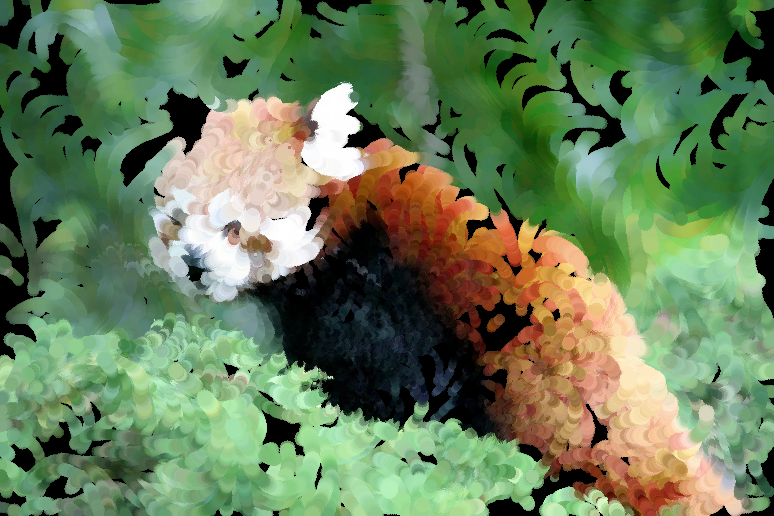
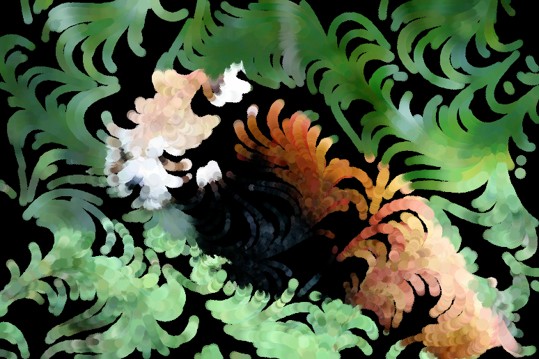
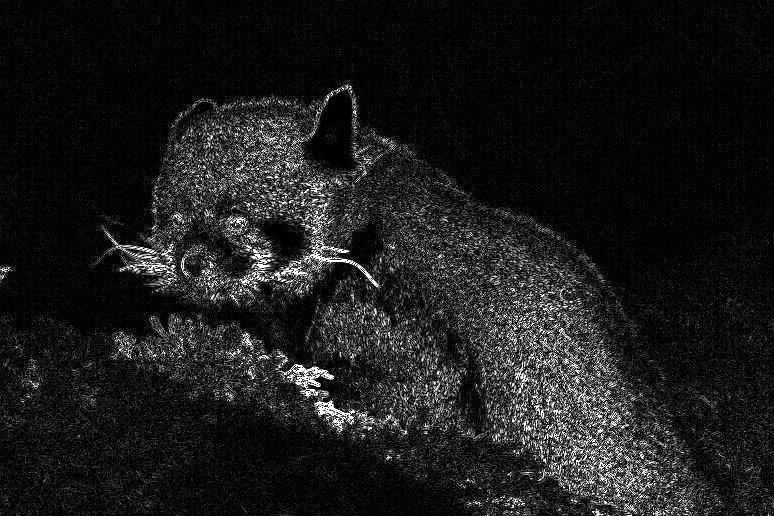
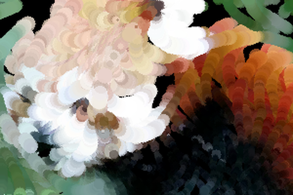

# Cours 18 — Projet final : peinture par particules

> **Fichiers** : `ofApp18.h` + `ofApp18.cpp`, images `data/pandaroux.jpg`, `redpanda.jpg`, `chibi-redpanda.jpg`
> **Avant** : tout ce qui précède. Chaque étape rappelle un cours.

Six cents particules se promènent sur la fenêtre. Chacune dépose, à chaque frame, un petit cercle de la couleur du pixel de la photo qui se trouve sous elle. On n'efface jamais : l'image apparaît toute seule, en une vingtaine de secondes, comme une peinture qui se fait.



Le projet est construit en six étapes. Les deux premières suffisent pour avoir un résultat ; les quatre suivantes s'activent et se désactivent avec les touches 3 à 6, pour voir ce que chacune apporte. Espace efface, `i` change d'image, `c` montre les contours.

## Étape 1 — Des particules qui marchent

```cpp
std::vector<float> posX;
std::vector<float> posY;
std::vector<float> angle;
```

Une particule, c'est une position et une direction. Trois listes parallèles (cours 07), remplies au hasard (cours 03, 04). Chaque frame, la particule avance dans sa direction à `vitesse` pixels par seconde (cours 06) :

```cpp
posX[i] += cos(angle[i]) * v * dt;
posY[i] += sin(angle[i]) * v * dt;
```

L'angle donne la direction, `cos` et `sin` la transforment en déplacement horizontal et vertical (cours 13). Une particule qui sort de l'image réapparaît n'importe où, pour que les traits restent répartis partout.

## Étape 2 — Une toile qui ne s'efface pas



Depuis le cours 05, chaque frame repart d'un fond propre. Ici on veut l'inverse. La seule nouveauté du projet : un `ofFbo`, une image **dans laquelle on peut dessiner**.

```cpp
toile.begin();
// ... tout ce qui est dessiné ici s'accumule dans la toile
toile.end();
toile.draw(0, 0);
```

Entre `begin()` et `end()`, les ordres de dessin vont dans la toile au lieu de la fenêtre. Ce qui y est dessiné y reste, frame après frame. Puis on affiche la toile comme une image. Pour effacer, on met un drapeau `effacer` (cours 17) et on appelle `ofClear(0)` dans la toile une seule fois.

À l'intérieur, pour chaque particule : lire la couleur de la source sous elle (cours 10), dessiner un petit cercle de cette couleur. C'est déjà le moment où l'image émerge du noir.

## Étape 3 — Un champ de direction

```cpp
angle[i] = (sin(x / 80.0f) + cos(y / 80.0f)) * PI + t * 0.1f;
```

Au lieu d'une direction au hasard, la direction **dépend de la position**. Deux particules voisines prennent presque le même angle, donc des traits voisins vont dans le même sens et s'enroulent ensemble. C'est le déphasage du cours 15, appliqué à une direction. Le `t * 0.1f` fait dériver lentement le champ pour que les mêmes zones ne soient pas repassées éternellement.

Désactive avec la touche 3 : les traits redeviennent des lignes droites au hasard. Réactive : ils tourbillonnent.

## Étape 4 — Des traits qui respectent les formes



Au démarrage, on calcule une fois l'image des contours avec le noyau du cours 17, sur la luminance. Elle donne, pour chaque pixel, un nombre entre 0 (zone plate) et 1 (bord net).

```cpp
float bord = contours.getColor(px, py).r / 255.0f;
v = vitesse * (1 - 0.7f * bord);
angle[i] += bord * ofRandom(-3, 3) * dt;
```

Sur un bord, la particule ralentit et dévie au hasard : ses traits se brisent en petites touches là où il y a du détail, et restent longs dans les aplats. Dans `draw()`, la taille du cercle suit la même logique : `6 - 5 * bord`, gros dans les aplats, fin sur les bords. Un peintre fait la même chose.



## Étape 5 — Une couleur vivante

```cpp
float decalage = (i % 21) - 10;
float teinte = fmod(c.getHue() + decalage + 255, 255);
c = ofColor::fromHsb(teinte, c.getSaturation(), c.getBrightness());
taille = taille * (0.5f + c.getBrightness() / 255.0f);
```

Chaque particule décale légèrement la teinte du pixel qu'elle lit (cours 09, 11), de -10 à +10 selon son numéro. Un aplat de vert uniforme devient un mélange de verts voisins, comme des touches de pinceau. Les zones claires reçoivent des touches plus larges. `ofSetColor(c, 180)` ajoute une légère transparence pour que les passages successifs se mélangent au lieu de se recouvrir.

## Étape 6 — La souris

```cpp
float d = ofDist(mouseX, mouseY, x, y);
if (d < 100 && d > 0) {
	angle[i] = atan2(y - mouseY, x - mouseX);
	v = vitesse * 3;
}
```

Distance du cours 12. Dans un rayon de 100 pixels, la particule fuit : `atan2(dy, dx)` donne l'angle du vecteur qui va de la souris à la particule, c'est l'inverse de `cos` / `sin` (cours 16). Elle prend cette direction et accélère. Passer la souris sur la toile repousse la peinture.

## Le clavier

```cpp
if (key == '3') champDirection = !champDirection;
```

Le `!` (cours 10) inverse un `bool` : `true` devient `false` et réciproquement. Une ligne pour basculer une option. Pour changer d'image :

```cpp
imageCourante = (imageCourante + 1) % images.size();
```

Le `%` (cours 13) ramène à 0 après la dernière : les images défilent en boucle. La fonction `chargerImage` recharge la source, adapte la fenêtre, recalcule les contours et relance les particules.

## Pour aller plus loin

- Un trait au lieu d'un cercle : garder la position précédente et tracer `ofDrawLine`.
- Ta propre image dans `bin/data` et dans la liste `images`.
- Des traits qui suivent vraiment les formes : les deux noyaux de Sobel (cours 17) donnent la direction du contour, `atan2(sobelY, sobelX)`, et la particule prend cet angle plus `PI / 2`.
- La webcam à la place de la photo (`ofVideoGrabber`) : la peinture suit ce qui bouge.
- Sauvegarder la toile : `toile.readToPixels(pixels); ofSaveImage(pixels, "peinture.png");`.

## Le code complet, pas à pas

Le programme entier, dans l'ordre des fichiers. Les blocs ci-dessous mis bout à bout donnent exactement `ofApp18.cpp`.

### Le fichier `ofApp18.h`

La table des matières du programme : les blocs qui existent et les variables partagées entre eux, avec leurs valeurs de départ.

```cpp
#pragma once
#include "ofMain.h"

// 18 - Projet final : peinture par particules
// Nouveau : pas de sketch Processing d'origine
// Notions : synthèse de la série. Particules dans des vector (03, 04), déplacement par angle et
//           delta time (06, 13), toile qui ne s'efface pas (ofFbo, seule nouveauté), couleur lue
//           sous la particule (10), champ de direction par sin / cos (15), contours calculés une
//           fois avec un noyau (17), teinte et luminosité (09, 11), souris qui repousse (12), clavier.
// Ressources : bin/data/pandaroux.jpg, redpanda.jpg, chibi-redpanda.jpg
//
// Les six étapes du projet sont repérées dans le code. Les étapes 3 à 6 se (dés)activent avec
// les touches 3 à 6, pour voir ce que chacune apporte. Espace : effacer. i : image suivante. c : contours.

class ofApp : public ofBaseApp {
public:
	void setup();
	void update();
	void draw();
	void keyPressed(int key);

	void chargerImage(std::string nom);
	void calculerContours();
	void recommencer();

	ofImage source;
	ofImage contours;         // niveaux de gris : 0 = zone uniforme, 255 = bord net (étape 4)
	ofFbo   toile;            // ce qui a déjà été peint (étape 2)

	std::vector<std::string> images = { "pandaroux.jpg", "redpanda.jpg", "chibi-redpanda.jpg" };
	int imageCourante = 0;

	// Étape 1 : une particule = une position et une direction (angle en radians)
	int nbParticules = 600;
	std::vector<float> posX;
	std::vector<float> posY;
	std::vector<float> angle;
	float vitesse = 80;       // pixels par seconde

	// Étapes activables
	bool champDirection = true;   // 3
	bool suivreFormes = true;     // 4
	bool couleurVivante = true;   // 5
	bool souris = true;           // 6

	bool effacer = false;
	bool montrerContours = false;
	float t = 0;
};
```

### En tête du fichier `ofApp18.cpp`

L'inclusion du `.h`, qui rend visibles les variables partagées et les blocs déclarés.

```cpp
#include "ofApp18.h"
```

### Étape 1 — `setup()`

Exécuté une fois au lancement : la fenêtre, les chargements, les valeurs de départ.

```cpp
void ofApp::setup() {
	ofSetCircleResolution(16);      // beaucoup de petits cercles : inutile d'être très rond
	chargerImage(images[imageCourante]);
}
```

### Étape 2 — `chargerImage()`

Fonction `chargerImage()`.

```cpp
void ofApp::chargerImage(std::string nom) {
	if (!source.load(nom)) {
		ofLogError() << nom << " introuvable dans bin/data";
	}
	int w = source.getWidth();
	int h = source.getHeight();
	ofSetWindowShape(w, h);

	// Étape 2 : la toile. Par défaut openFrameworks efface la fenêtre à chaque frame.
	// Un ofFbo est une image dans laquelle on peut dessiner : tout ce qui est dessiné entre
	// begin() et end() s'y accumule, et on l'affiche ensuite comme une ofImage.
	// (ofSetBackgroundAuto(false) donne le même résultat sans FBO, mais se comporte
	// différemment selon les plateformes ; le FBO est la méthode fiable.)
	toile.allocate(w, h, GL_RGB);

	calculerContours();     // étape 4 : une seule fois, c'est le calcul le plus lourd
	recommencer();
}
```

### Étape 3 — `calculerContours()`

Étape 4 : détection de contours, exactement le noyau de 17, mais sur la luminance seulement.

```cpp
// Étape 4 : détection de contours, exactement le noyau de 17, mais sur la luminance seulement.
// Le résultat est une image en gris : noir dans les aplats, blanc sur les bords.
void ofApp::calculerContours() {
	int w = source.getWidth();
	int h = source.getHeight();
	contours.allocate(w, h, OF_IMAGE_GRAYSCALE);

	std::vector<float> noyau = { -1, -1, -1,
	                             -1,  8, -1,
	                             -1, -1, -1 };

	for (int y = 0; y < h; y++) {
		for (int x = 0; x < w; x++) {
			float somme = 0;
			for (int dy = -1; dy <= 1; dy++) {
				for (int dx = -1; dx <= 1; dx++) {
					int px = ofClamp(x + dx, 0, w - 1);
					int py = ofClamp(y + dy, 0, h - 1);
					ofColor v = source.getColor(px, py);
					float luminance = 0.299f * v.r + 0.587f * v.g + 0.114f * v.b;
					somme += luminance * noyau[(dy + 1) * 3 + (dx + 1)];
				}
			}
			// fabs : un bord clair -> sombre ou sombre -> clair compte pareil
			contours.setColor(x, y, ofColor(ofClamp(fabs(somme), 0, 255)));
		}
	}
	contours.update();
}
```

### Étape 4 — `recommencer()`

Étape 1 : particules réparties au hasard, chacune avec sa direction.

```cpp
// Étape 1 : particules réparties au hasard, chacune avec sa direction
void ofApp::recommencer() {
	posX.clear();
	posY.clear();
	angle.clear();
	for (int i = 0; i < nbParticules; i++) {
		posX.push_back(ofRandom(0, source.getWidth()));
		posY.push_back(ofRandom(0, source.getHeight()));
		angle.push_back(ofRandom(0, TWO_PI));
	}
	effacer = true;
}
```

### Étape 5 — `update()`

Exécuté à chaque frame, avant le dessin : tout ce qui change.

```cpp
void ofApp::update() {
	float dt = ofGetLastFrameTime();
	t = ofGetElapsedTimef();
	int w = source.getWidth();
	int h = source.getHeight();

	for (int i = 0; i < nbParticules; i++) {
		float x = posX[i];
		float y = posY[i];

		// Étape 3 : champ de direction. L'angle ne dépend plus du hasard mais de la position :
		// deux particules voisines prennent presque la même direction, d'où des traits qui
		// s'enroulent (le déphasage de 15). Le temps fait dériver lentement le champ.
		if (champDirection) {
			angle[i] = (sin(x / 80.0f) + cos(y / 80.0f)) * PI + t * 0.1f;
		}

		// Étape 4 : sur un bord (contour fort), la particule ralentit et dévie au hasard.
		// Les traits se brisent en petites touches sur les détails, restent longs dans les aplats.
		float v = vitesse;
		if (suivreFormes) {
			int px = ofClamp(x, 0, w - 1);
			int py = ofClamp(y, 0, h - 1);
			float bord = contours.getColor(px, py).r / 255.0f;    // 0 : plat, 1 : bord net
			v = vitesse * (1 - 0.7f * bord);
			angle[i] += bord * ofRandom(-3, 3) * dt;
		}

		// Étape 6 : la souris repousse. atan2(dy, dx) donne l'angle du vecteur (dx, dy) :
		// c'est l'inverse de cos / sin. Ici le vecteur va de la souris vers la particule.
		if (souris) {
			float d = ofDist(mouseX, mouseY, x, y);
			if (d < 100 && d > 0) {
				angle[i] = atan2(y - mouseY, x - mouseX);
				v = vitesse * 3;
			}
		}

		// Déplacement (06) : la direction en cos / sin (13), la vitesse en pixels par seconde
		posX[i] += cos(angle[i]) * v * dt;
		posY[i] += sin(angle[i]) * v * dt;

		// Sortie de l'image : réapparition n'importe où, les traits restent répartis partout
		if (posX[i] < 0 || posX[i] >= w || posY[i] < 0 || posY[i] >= h) {
			posX[i] = ofRandom(0, w);
			posY[i] = ofRandom(0, h);
			angle[i] = ofRandom(0, TWO_PI);
		}
	}
}
```

### Étape 6 — `draw()`

Exécuté à chaque frame, après `update()` : uniquement du dessin.

```cpp
void ofApp::draw() {
	int w = source.getWidth();
	int h = source.getHeight();

	// Étape 2 : tout le dessin des particules va dans la toile, jamais dans la fenêtre
	toile.begin();
	if (effacer) {
		ofClear(0);           // le seul effacement : à la demande
		effacer = false;
	}

	for (int i = 0; i < nbParticules; i++) {
		int px = ofClamp(posX[i], 0, w - 1);
		int py = ofClamp(posY[i], 0, h - 1);

		// Étape 2 : la couleur du pixel de la source sous la particule (10)
		ofColor c = source.getColor(px, py);
		float taille = 3;

		// Étape 4 : touches fines sur les bords, larges dans les aplats
		if (suivreFormes) {
			float bord = contours.getColor(px, py).r / 255.0f;
			taille = 6 - 5 * bord;
		}

		// Étape 5 : chaque particule décale un peu la teinte (09), ce qui casse l'uniformité
		// des aplats, et les zones claires reçoivent des touches plus larges
		if (couleurVivante) {
			float decalage = (i % 21) - 10;                     // -10 à +10 selon la particule
			float teinte = fmod(c.getHue() + decalage + 255, 255);
			c = ofColor::fromHsb(teinte, c.getSaturation(), c.getBrightness());
			taille = taille * (0.5f + c.getBrightness() / 255.0f);
		}

		// Un peu de transparence : les passages successifs se mélangent au lieu de se recouvrir
		ofSetColor(c, 180);
		ofDrawCircle(posX[i], posY[i], taille);
	}
	toile.end();

	ofSetColor(255);
	if (montrerContours) contours.draw(0, 0);
	else                 toile.draw(0, 0);

	ofSetColor(255, 200, 0);
	std::string etat = std::string("3 champ:") + (champDirection ? "on" : "off")
	                 + "  4 formes:" + (suivreFormes ? "on" : "off")
	                 + "  5 couleur:" + (couleurVivante ? "on" : "off")
	                 + "  6 souris:" + (souris ? "on" : "off");
	ofDrawBitmapString(etat + "   espace: effacer   i: image   c: contours", 10, 20);
}
```

### Étape 7 — `keyPressed()`

Appelé automatiquement à chaque touche pressée.

```cpp
void ofApp::keyPressed(int key) {
	if (key == ' ') effacer = true;
	if (key == '3') champDirection = !champDirection;
	if (key == '4') suivreFormes = !suivreFormes;
	if (key == '5') couleurVivante = !couleurVivante;
	if (key == '6') souris = !souris;
	if (key == 'c') montrerContours = !montrerContours;
	if (key == 'i') {
		imageCourante = (imageCourante + 1) % images.size();    // modulo : retour à 0 après la dernière
		chargerImage(images[imageCourante]);
	}
}
```

### En fin de fichier

Les notes et pistes laissées en commentaire dans le code.

```cpp
// Pour aller plus loin :
// - remplacer le cercle par un trait : garder la position précédente et tracer ofDrawLine
// - ajouter sa propre image dans bin/data et dans la liste "images"
// - un champ de direction qui suit vraiment les formes : noyau de Sobel horizontal et vertical (17),
//   l'angle du contour est atan2(sobelY, sobelX), la particule prend cet angle + PI / 2
// - remplacer la source par une webcam (ofVideoGrabber) : la peinture suit ce qui bouge
// - sauvegarder la toile : toile.readToPixels(pixels); puis ofSaveImage(pixels, "peinture.png")
```

## Ce que ce projet récapitule

| Étape | Cours |
|---|---|
| listes de particules, hasard | 03, 04, 07 |
| déplacement par angle et `dt` | 06, 13 |
| lire la couleur sous la particule | 10 |
| champ de direction, déphasage | 15 |
| contours calculés une fois, drapeau | 17 |
| teinte et luminosité | 09, 11 |
| distance à la souris, `atan2` | 12, 16 |
| toile persistante | `ofFbo`, la seule nouveauté |
